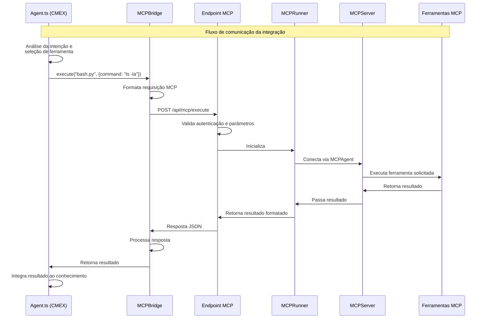

# Plano de Integração: CMEX → Navegador-main via MCP

## 1. Introdução

Este documento detalha o plano de integração entre a aplicação CMEX (composta por múltiplos componentes: frontend, deepsearch-ui-nexcode, admin-panel-next, fastapi, node-DeepResearch-nexcode, supabase) e o projeto Navegador-main. O objetivo principal é estabelecer um canal de comunicação direto entre o agente principal do CMEX (`agent.ts`) e as ferramentas disponíveis no Navegador-main através do protocolo MCP (Meta-Controller Protocol).

Esta integração permitirá que o agente de pesquisa do CMEX tenha acesso a funcionalidades avançadas como execução de comandos em terminal, operações com arquivos, navegação web interativa e outras capacidades oferecidas pelas ferramentas MCP.

## 2. Arquitetura Proposta


A arquitetura proposta consiste em:

1. **Agent Bridge (MCPBridge)**: Componente a ser implementado no `agent.ts` que servirá como ponte para comunicação com as ferramentas MCP. Este componente será responsável por formatar as requisições no padrão MCP e enviar para o endpoint no Navegador-main.

2. **Endpoint MCP**: API REST a ser implementada no Navegador-main que receberá as requisições do Agent Bridge, processará os comandos MCP e retornará os resultados.

3. **MCPServer/MCPRunner**: Componentes existentes no Navegador-main que serão utilizados pelo Endpoint MCP para executar as ferramentas solicitadas.

4. **Ferramentas MCP**: Conjunto de ferramentas disponíveis no Navegador-main (bash.py, terminal.py, python_execute.py, file_operators.py, etc.) que serão acessadas pelo agent.ts através do canal de comunicação estabelecido.

## 2.1. Diagrama de Integração Específico

O diagrama abaixo ilustra especificamente o fluxo de comunicação entre o agente CMEX e as ferramentas do Navegador-main:



## 2.2. Requisitos Funcionais

1. **RF01**: O sistema CMEX deve ser capaz de solicitar a execução de comandos bash/terminal através do Navegador-main.
2. **RF02**: O sistema CMEX deve ser capaz de executar scripts Python através do Navegador-main.
3. **RF03**: O sistema CMEX deve ser capaz de realizar operações com arquivos (leitura, escrita, modificação) através do Navegador-main.
4. **RF04**: O sistema CMEX deve ser capaz de realizar navegação web complexa através do Navegador-main.
5. **RF05**: O sistema CMEX deve ser capaz de utilizar ferramentas de IA (como chat completion) através do Navegador-main.
6. **RF06**: O sistema CMEX deve receber e interpretar corretamente os resultados das operações realizadas pelo Navegador-main.
7. **RF07**: A integração deve permitir o uso de qualquer ferramenta MCP disponível no Navegador-main.
8. **RF08**: A integração deve permitir a adição de novas ferramentas MCP sem necessidade de modificação do código do CMEX.

## 2.3. Requisitos Não Funcionais

1. **RNF01**: A comunicação entre o CMEX e o Navegador-main deve ter um tempo de resposta máximo de 30 segundos para operações padrão.
2. **RNF02**: A autenticação entre os sistemas deve ser segura, utilizando API Keys ou JWT.
3. **RNF03**: O sistema deve ser resiliente a falhas de conexão, implementando retentativas com backoff exponencial.
4. **RNF04**: A solução deve suportar pelo menos 10 requisições concorrentes ao Navegador-main.
5. **RNF05**: O endpoint MCP deve implementar rate limiting para evitar sobrecarga do sistema.
6. **RNF06**: A solução deve incluir logs detalhados para facilitar a depuração e auditoria.
7. **RNF07**: A integração deve ser segura, não permitindo execução de comandos arbitrários sem validação.
8. **RNF08**: O canal de comunicação deve ser protegido por HTTPS.
9. **RNF09**: O sistema deve ser escalável, podendo adicionar mais instâncias do Navegador-main conforme necessário.
10. **RNF10**: A implementação deve seguir os padrões de codificação e arquitetura existentes em ambos os projetos.

## 2.4. Regras de Negócio

1. **RN01**: Apenas usuários autenticados no CMEX podem utilizar ferramentas do Navegador-main.
2. **RN02**: Todas as chamadas ao Navegador-main devem ser rastreáveis para fins de auditoria.
3. **RN03**: O CMEX só pode acessar ferramentas MCP explicitamente permitidas na configuração.
4. **RN04**: Operações sensíveis (como execução de códigos arbitrários) devem passar por validação adicional.
5. **RN05**: O tempo de execução de uma ferramenta MCP deve ser limitado de acordo com o tipo de operação.
6. **RN06**: Falhas sucessivas na comunicação com o Navegador-main devem gerar alertas para operadores.
7. **RN07**: O agente CMEX deve priorizar ferramentas nativas quando disponíveis, utilizando o Navegador-main apenas para capacidades não existentes localmente.
8. **RN08**: Dados sensíveis não devem ser persistidos nas comunicações entre os sistemas.
9. **RN09**: O CMEX deve validar os resultados recebidos do Navegador-main antes de utilizá-los para decisões críticas.

## 3. Pontos de Integração e Modificações Necessárias

### 3.1. No Navegador-main

#### 3.1.1. Criação do Endpoint MCP

Desenvolver um endpoint REST no Navegador-main que:

- Receba requisições POST com payload JSON contendo comandos MCP
- Valide as requisições e autentique o solicitante
- Encaminhe os comandos para o MCPServer/MCPRunner
- Retorne os resultados da execução

```python
# Exemplo conceptual de um endpoint MCP em FastAPI
from fastapi import FastAPI, HTTPException, Depends, Security
from fastapi.security.api_key import APIKeyHeader, APIKey
from pydantic import BaseModel
from typing import Dict, Any, Optional
import asyncio

# Importar componentes do MCP
from mcp.runner import MCPRunner
from mcp.server import MCPServer

app = FastAPI()

# Configuração de segurança
API_KEY_NAME = "X-API-Key"
API_KEY = "seu-api-key-secreto"  # Em produção, usar variáveis de ambiente
api_key_header = APIKeyHeader(name=API_KEY_NAME, auto_error=True)

# Modelo da requisição
class MCPRequest(BaseModel):
    tool_name: str
    params: Dict[str, Any]
    timeout: Optional[int] = 30

# Validação da API Key
async def get_api_key(api_key_header: str = Security(api_key_header)):
    if api_key_header == API_KEY:
        return api_key_header
    raise HTTPException(status_code=403, detail="API Key inválida ou não fornecida")

# Endpoint MCP
@app.post("/api/mcp/execute")
async def execute_mcp_command(
    request: MCPRequest,
    api_key: APIKey = Depends(get_api_key)
):
    try:
        # Inicializar o MCPRunner
        runner = MCPRunner()

        # Registrar no MCPAgent
        agent = runner.register_agent()

        # Conectar ao MCPServer
        server = MCPServer()
        agent.connect(server)

        # Executar a ferramenta solicitada
        result = await asyncio.wait_for(
            server.execute_tool(request.tool_name, request.params),
            timeout=request.timeout
        )

        return {
            "success": True,
            "result": result
        }
    except asyncio.TimeoutError:
        raise HTTPException(status_code=408, detail="Tempo limite excedido")
    except Exception as e:
        raise HTTPException(status_code=500, detail=f"Erro ao executar ferramenta MCP: {str(e)}")
```

#### 3.1.2. Configuração de Segurança

- Implementar autenticação via API Key ou JWT
- Configurar CORS para permitir requisições apenas do domínio do CMEX
- Limitar o acesso a determinadas ferramentas MCP conforme necessário
- Implementar rate limiting para evitar abuso do endpoint

#### 3.1.3. Logging e Monitoramento

- Adicionar logging detalhado das requisições e respostas
- Configurar monitoramento para detectar problemas de performance ou segurança

### 3.2. No CMEX (node-DeepResearch-nexcode)

#### 3.2.1. Implementação do MCPBridge

Criar uma classe/módulo no `agent.ts` que servirá como ponte para comunicação com as ferramentas MCP:

```typescript
// Exemplo conceptual de MCPBridge em TypeScript
import axios from "axios";
import { config } from "./config";

interface MCPParams {
  [key: string]: any;
}

interface MCPResponse {
  success: boolean;
  result: any;
  error?: string;
}

export class MCPBridge {
  private apiKey: string;
  private baseUrl: string;
  private timeout: number;

  constructor() {
    this.apiKey = config.MCP_API_KEY;
    this.baseUrl = config.MCP_ENDPOINT_URL;
    this.timeout = config.MCP_TIMEOUT || 30000;
  }

  /**
   * Executa uma ferramenta MCP no Navegador-main
   * @param toolName Nome da ferramenta (ex: "bash.py", "terminal.py")
   * @param params Parâmetros para a ferramenta
   * @returns Resultado da execução
   */
  async execute(toolName: string, params: MCPParams): Promise<any> {
    try {
      const response = await axios.post<MCPResponse>(
        `${this.baseUrl}/api/mcp/execute`,
        {
          tool_name: toolName,
          params: params,
          timeout: this.timeout / 1000,
        },
        {
          headers: {
            "X-API-Key": this.apiKey,
            "Content-Type": "application/json",
          },
          timeout: this.timeout,
        }
      );

      if (response.data.success) {
        return response.data.result;
      } else {
        throw new Error(
          response.data.error ||
            "Erro desconhecido na execução da ferramenta MCP"
        );
      }
    } catch (error) {
      if (axios.isAxiosError(error)) {
        if (error.response) {
          throw new Error(
            `Erro na requisição MCP: ${
              error.response.status
            } - ${JSON.stringify(error.response.data)}`
          );
        } else if (error.request) {
          throw new Error(`Sem resposta do servidor MCP: ${error.message}`);
        }
      }
      throw new Error(
        `Erro ao executar ferramenta MCP: ${
          error instanceof Error ? error.message : String(error)
        }`
      );
    }
  }

  /**
   * Verifica se o servidor MCP está disponível
   */
  async checkConnection(): Promise<boolean> {
    try {
      const response = await axios.get(`${this.baseUrl}/api/mcp/health`, {
        headers: { "X-API-Key": this.apiKey },
        timeout: 5000,
      });
      return response.status === 200;
    } catch (error) {
      return false;
    }
  }
}
```

#### 3.2.2. Integração com Agent

Modificar o `agent.ts` para utilizar o MCPBridge quando necessário:

```typescript
// Exemplo conceptual de integração no agent.ts
import { MCPBridge } from "./mcp-bridge";

// Instanciar o MCPBridge
const mcpBridge = new MCPBridge();

// No método de seleção de ferramentas (por exemplo, na árvore de decisão)
async function selectAndExecuteTool(
  toolType: string,
  params: any
): Promise<any> {
  // Verificar se é uma ferramenta MCP
  const mcpTools = [
    "bash.py",
    "terminal.py",
    "python_execute.py",
    "file_operators.py",
    "file_saver.py",
    "str_replace_editor.py",
    "browser_use_tool.py",
    "web_search.py",
    "create_chat_completion.py",
    "planning.py",
    "mcp.py",
    "terminate.py",
    "tool_collection.py",
  ];

  if (mcpTools.includes(toolType)) {
    try {
      // Executar via MCPBridge
      console.log(`Executing MCP tool: ${toolType}`);
      return await mcpBridge.execute(toolType, params);
    } catch (error) {
      console.error(`Error executing MCP tool ${toolType}:`, error);
      throw error;
    }
  } else {
    // Executar ferramenta nativa
    console.log(`Executing native tool: ${toolType}`);
    return executeNativeTool(toolType, params);
  }
}

// Atualizar a árvore de decisão para usar selectAndExecuteTool
// Por exemplo, na função executeSearchQueries ou em outros pontos onde as ferramentas são selecionadas
```

#### 3.2.3. Configuração

Adicionar variáveis de configuração no arquivo de configuração:

```typescript
// Adicionar em config.ts
export const config = {
  // Outras configurações existentes...

  // Configurações MCP
  MCP_ENDPOINT_URL: process.env.MCP_ENDPOINT_URL || "http://localhost:8000",
  MCP_API_KEY: process.env.MCP_API_KEY || "seu-api-key-dev",
  MCP_TIMEOUT: parseInt(process.env.MCP_TIMEOUT || "30000"),

  // Habilitar/desabilitar ferramentas MCP específicas
  MCP_ENABLED_TOOLS: (
    process.env.MCP_ENABLED_TOOLS || "bash.py,terminal.py"
  ).split(","),
};
```

#### 3.2.4. Tratamento de Erros e Recuperação

Implementar estratégias de fallback e retry:

```typescript
// Exemplo de função com retry para chamadas MCP
async function executeMCPWithRetry(
  toolName: string,
  params: any,
  maxRetries = 3
): Promise<any> {
  let lastError: Error | null = null;

  for (let attempt = 1; attempt <= maxRetries; attempt++) {
    try {
      return await mcpBridge.execute(toolName, params);
    } catch (error) {
      lastError = error instanceof Error ? error : new Error(String(error));
      console.error(
        `Attempt ${attempt}/${maxRetries} failed:`,
        lastError.message
      );

      // Verificar se vale a pena tentar novamente
      if (
        error instanceof Error &&
        (error.message.includes("timeout") ||
          error.message.includes("connection"))
      ) {
        // Esperar antes de tentar novamente (exponential backoff)
        await sleep(Math.min(1000 * Math.pow(2, attempt - 1), 10000));
        continue;
      }

      // Erro que não deve ser tentado novamente
      throw lastError;
    }
  }

  throw lastError || new Error(`Failed after ${maxRetries} attempts`);
}
```

## 3.3. Estrutura de Diretórios e Arquivos

### 3.3.1. No Navegador-main

```
/Users/williamduarte/Documents/Empresa/Projeto/Navegador-main/
├── api/
│   ├── endpoints/
│   │   ├── mcp_api.py         # Endpoint MCP (novo)
│   │   └── ...
│   ├── models/
│   │   ├── mcp_models.py      # Modelos Pydantic para API MCP (novo)
│   │   └── ...
│   ├── utils/
│   │   ├── auth.py            # Funções de autenticação
│   │   ├── rate_limiter.py    # Implementação de rate limiting
│   │   └── ...
│   └── main.py                # Aplicação FastAPI principal (a ser modificada)
├── config/
│   ├── settings.py            # Configurações globais (a ser modificada)
│   └── ...
├── core/
│   ├── mcp/
│   │   ├── runner.py          # MCPRunner (existente)
│   │   ├── server.py          # MCPServer (existente)
│   │   ├── agent.py           # MCPAgent (existente)
│   │   └── tools/             # Ferramentas MCP (existentes)
│   │       ├── bash.py
│   │       ├── terminal.py
│   │       └── ...
│   └── ...
└── tests/
    ├── api/
    │   └── test_mcp_api.py    # Testes para o endpoint MCP (novo)
    └── ...
```

### 3.3.2. No CMEX (node-DeepResearch-nexcode)

```
/Users/williamduarte/Pesquisa_CMEX/cmex_poc/node-DeepResearch-nexcode/
├── src/
│   ├── agent.ts               # Agente principal (a ser modificado)
│   ├── utils/
│   │   ├── mcp-bridge.ts      # Implementação do MCPBridge (novo)
│   │   ├── token-tracker.ts   # (existente)
│   │   ├── action-tracker.ts  # (existente)
│   │   └── ...
│   ├── config.ts              # Configurações (a ser modificado)
│   ├── types.ts               # Tipos TypeScript (a ser modificado)
│   └── ...
├── tests/
│   ├── unit/
│   │   └── mcp-bridge.test.ts # Testes unitários para MCPBridge (novo)
│   └── integration/
│       └── mcp-integration.test.ts # Testes de integração MCP (novo)
└── ...
```

## 3.4. Lógica dos Componentes

### 3.4.1. Endpoint MCP (Navegador-main)

**Arquivo**: `/api/endpoints/mcp_api.py`

**Responsabilidades**:

- Receber e validar requisições HTTP
- Autenticar o cliente (CMEX)
- Verificar se a ferramenta solicitada está disponível
- Inicializar o ambiente MCP (Runner, Agent, Server)
- Executar a ferramenta solicitada com os parâmetros fornecidos
- Aplicar rate limiting e timeouts
- Capturar e formatar erros apropriadamente
- Retornar resultados em formato JSON padronizado
- Registrar logs detalhados de cada operação

**Fluxo de Execução**:

1. Recebe uma requisição POST no endpoint `/api/mcp/execute`
2. Valida o header `X-API-Key` contra valores configurados
3. Deserializa o corpo da requisição usando o modelo Pydantic
4. Verifica se a ferramenta solicitada está na lista de permitidas
5. Inicializa o MCPRunner e obtém uma instância do MCPAgent
6. Conecta o MCPAgent ao MCPServer
7. Executa a ferramenta solicitada com os parâmetros fornecidos
8. Aplica timeout conforme especificado na requisição
9. Captura o resultado ou erro da execução
10. Formata o resultado em JSON e retorna ao cliente

### 3.4.2. MCPBridge (CMEX)

**Arquivo**: `/src/utils/mcp-bridge.ts`

**Responsabilidades**:

- Encapsular a comunicação HTTP com o endpoint MCP
- Formatar requisições conforme o protocolo esperado
- Autenticar-se com o endpoint usando API Key
- Processar respostas e erros do endpoint
- Aplicar retentativas com backoff exponencial para erros recuperáveis
- Fornecer métodos auxiliares para verificar disponibilidade e listar ferramentas
- Carregar configurações de conexão do arquivo de configuração central

**Fluxo de Execução**:

1. É instanciado uma vez durante a inicialização do agente
2. Carrega configurações (URL, API Key, timeout) do arquivo de configuração
3. Quando `execute()` é chamado:
   - Formata os parâmetros para o formato esperado pelo endpoint
   - Configura headers de autenticação e timeout
   - Envia requisição HTTP para o endpoint
   - Aguarda resposta ou timeout
   - Processa a resposta (sucesso ou erro)
   - Retorna o resultado ou lança exceção apropriada

### 3.4.3. Integração no Agent (CMEX)

**Arquivo**: `/src/agent.ts`

**Responsabilidades**:

- Analisar a intenção do usuário e determinar a ferramenta necessária
- Decidir entre usar ferramentas nativas ou MCP
- Chamar o MCPBridge quando necessário
- Integrar os resultados das operações MCP ao conhecimento acumulado
- Lidar com erros na comunicação com as ferramentas MCP
- Implementar fallbacks quando ferramentas MCP não estiverem disponíveis

**Pontos de Integração**:

1. **Árvore de Decisão**: No código que implementa a árvore de decisão (baseado nos diagramas fornecidos), adicionar lógica para identificar quando uma ferramenta MCP é necessária.

2. **Função `selectAndExecuteTool`**: Nova função que será o ponto central para seleção entre ferramentas nativas e MCP. Esta função será chamada a partir de vários pontos no código do agente.

3. **Função `executeMCPWithRetry`**: Implementação de retentativas para chamadas MCP, utilizada por `selectAndExecuteTool` para ferramentas MCP.

4. **Modificação dos Schemas**: Atualizar os schemas Zod para incluir ferramentas MCP como opções válidas nas funções que definem o comportamento do agente.

5. **Extensão do TokenTracker e ActionTracker**: Adicionar capacidade de rastrear uso de ferramentas MCP para fins de logging e depuração.

## 4. Fluxo de Comunicação Detalhado

A seguir está detalhado o fluxo completo de comunicação entre o CMEX e o Navegador-main para a execução de uma ferramenta MCP:

1. **Análise e Decisão**:

   - O `agent.ts` analisa a intenção do usuário e decide qual ferramenta utilizar
   - A árvore de decisão identifica que uma ferramenta MCP é necessária (ex: bash.py)

2. **Preparação da Requisição**:

   - O `agent.ts` chama o `MCPBridge.execute("bash.py", { command: "ls -la" })`
   - O `MCPBridge` formata a requisição MCP conforme o protocolo esperado

3. **Envio da Requisição**:

   - O `MCPBridge` envia uma requisição POST para o endpoint MCP no Navegador-main
   - A requisição inclui a API Key para autenticação

4. **Recebimento e Validação**:

   - O endpoint MCP no Navegador-main recebe a requisição
   - Valida a API Key e o formato dos parâmetros

5. **Execução da Ferramenta**:

   - O endpoint inicializa o MCPRunner
   - O MCPRunner registra um MCPAgent
   - O MCPAgent conecta-se ao MCPServer
   - O MCPServer acessa o MCPTools e executa a ferramenta solicitada (bash.py)
   - A ferramenta bash.py executa o comando especificado

6. **Processamento do Resultado**:

   - A ferramenta retorna o resultado (saída do comando)
   - O MCPServer encapsula o resultado e o retorna para o MCPAgent
   - O MCPAgent passa o resultado para o MCPRunner
   - O MCPRunner formata o resultado conforme o protocolo MCP

7. **Retorno da Resposta**:

   - O endpoint formata a resposta com o resultado e status
   - Envia a resposta de volta para o `MCPBridge`

8. **Processamento da Resposta**:

   - O `MCPBridge` recebe a resposta
   - Verifica se houve sucesso ou erro
   - Processa o resultado conforme necessário
   - Retorna o resultado processado para o `agent.ts`

9. **Utilização do Resultado**:
   - O `agent.ts` recebe o resultado
   - Integra o resultado ao conhecimento existente
   - Continua o processamento baseado no resultado obtido

## 5. Prompts Detalhados para Implementação

### 5.1. Prompt (EXPANDIDO): Criar Endpoint MCP e Componentes Relacionados no Navegador-main

## 5.2. Prompt (NOVO): Configuração Detalhada no Navegador-main (`config/config.toml`)

## 5.3. Prompt (NOVO): Testes Detalhados para o Endpoint MCP no Navegador-main

## 6. Próximos Passos

## 7. Considerações Finais

## 8. Monitoramento e Observabilidade

### 8.1. Métricas e Logging

1. **Métricas Essenciais**:

   - Performance: tempo de resposta, latência, taxa de sucesso
   - Uso: requisições por ferramenta/cliente, utilização de recursos
   - Erros: taxa por tipo, tempo de recuperação

2. **Estrutura de Logs**:
   ```json
   {
     "timestamp": "2024-03-21T10:15:30Z",
     "level": "INFO",
     "service": "mcp-api",
     "client_id": "cmex-prod-1",
     "tool": "browser.py",
     "status": "success"
   }
   ```

### 8.2. Alertas e Dashboards

1. **Alertas Críticos**:

   - Tempo de resposta > 5s
   - Taxa de erro > 5%
   - Falhas de autenticação múltiplas

2. **Dashboards**:
   - Performance em tempo real
   - Uso por cliente/ferramenta
   - Tendências e anomalias

### 8.3. Ferramentas Recomendadas

- Métricas: Prometheus, StatsD
- Visualização: Grafana, Kibana
- APM: New Relic, Dynatrace

## 9. Segurança e Compliance

### 9.1. Controles de Segurança

1. **Autenticação e Autorização**:

   - API Keys com rotação regular
   - RBAC para ferramentas
   - Auditoria de acessos

2. **Proteção de Dados**:
   - Criptografia em trânsito
   - Sanitização de logs
   - Validação de entrada

### 9.2. Compliance e Auditoria

1. **Requisitos**:

   - GDPR/LGPD
   - SOC 2
   - ISO 27001

2. **Logs de Auditoria**:
   - Acessos administrativos
   - Mudanças de configuração
   - Uso de ferramentas sensíveis

## 10. Disaster Recovery

### 10.1. Alta Disponibilidade

1. **Objetivos**:

   - RPO: máximo 5 minutos
   - RTO: máximo 15 minutos
   - Failover automático

2. **Estratégias**:
   - Multi-AZ deployment
   - Auto-scaling
   - Circuit breakers

### 10.2. Procedimentos

1. **Incident Response**:

   - Equipe dedicada
   - Playbooks detalhados
   - Comunicação clara

2. **Recuperação**:
   - Procedimentos testados
   - Pontos de verificação
   - Restauração de dados

## 11. Roadmap de Evolução

### 11.1. Curto Prazo (3 meses)

1. **Melhorias Técnicas**:

   - Otimização de performance
   - Expansão de testes
   - Melhorias de logging

2. **Novas Funcionalidades**:
   - Suporte a WebSocket
   - Mais ferramentas MCP
   - Analytics avançado

### 11.2. Médio Prazo (6 meses)

1. **Escalabilidade**:

   - Sharding de dados
   - Cache distribuído
   - Load balancing global

2. **Integrações**:
   - Mais sistemas cliente
   - APIs de terceiros
   - Serviços cloud

### 11.3. Longo Prazo (12 meses)

1. **Inovação**:

   - ML para otimização
   - Predição de falhas
   - Auto-healing

2. **Expansão**:
   - Novas regiões
   - Novos produtos
   - Marketplace de ferramentas

```

```
