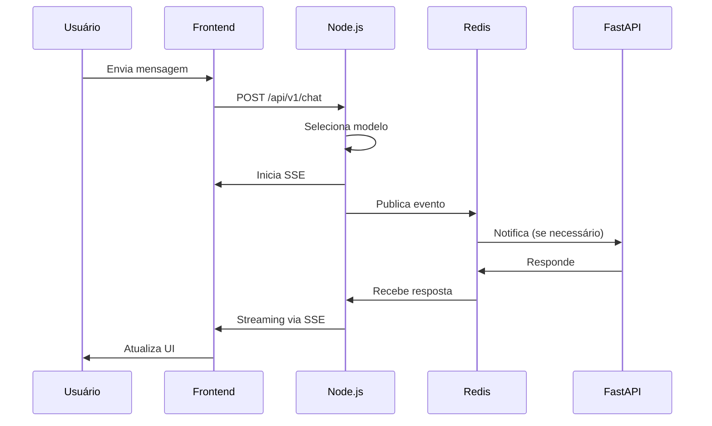
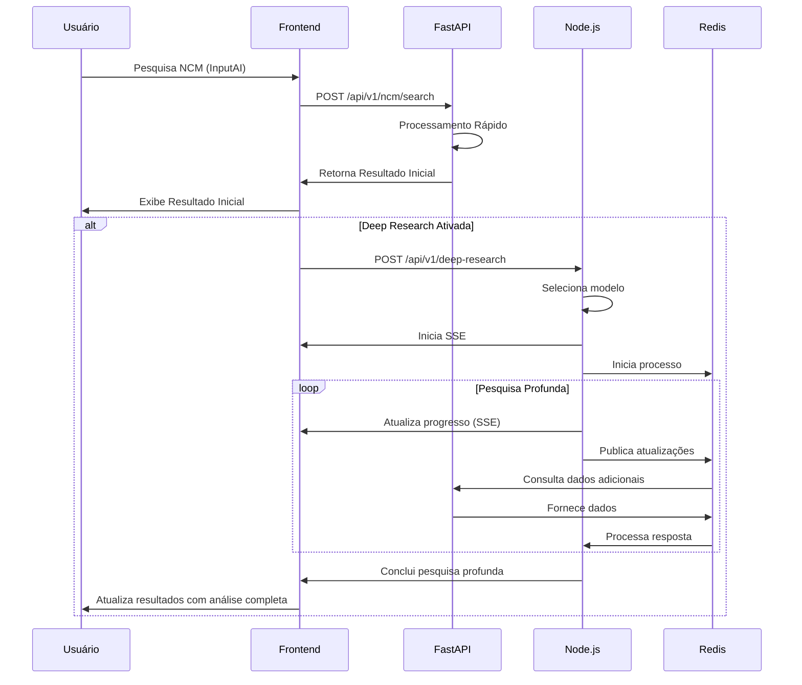

# Plano de Implementação: Sistema de Múltiplos Modelos com Integração Frontend

## Índice

1. [Visão Geral](#visão-geral)
2. [Arquitetura Atual](#arquitetura-atual)
3. [Arquitetura Proposta](#arquitetura-proposta)
4. [Fluxo de Dados](#fluxo-de-dados)
5. [Plano de Implementação](#plano-de-implementação)
6. [Análise Comparativa com UI Jina](#análise-comparativa-com-ui-jina)
7. [TODOs](#todos)

## Visão Geral

Este documento detalha o plano de implementação para integrar múltiplos modelos de IA no sistema atual, mantendo e melhorando a experiência do usuário no frontend.

### Objetivos Principais

- Implementar suporte a múltiplos modelos de IA
- Manter a experiência fluida do usuário no frontend
- Otimizar a comunicação entre serviços
- Garantir qualidade visual e responsividade
- Manter compatibilidade com funcionalidades existentes

## Arquitetura Atual

### Frontend (React + TypeScript)

- **Chat Component**

  - Gerencia estado local das mensagens
  - Implementa polling para atualizações
  - Renderiza mensagens com formatação Markdown
  - Suporta código com highlight de sintaxe

- **Home Component**
  - Exibe histórico de pesquisas
  - Mostra estatísticas de uso
  - Permite iniciar novas pesquisas

### Backend Node.js

- Gerencia sessões de chat
- Processa requisições de pesquisa
- Comunica com modelo local

### Backend FastAPI

- Processa tarefas específicas
- Gerencia classificação NCM
- Realiza análises técnicas

### Comunicação

- Redis para mensagens entre serviços
- Polling para atualizações do frontend
- WebSocket para algumas atualizações em tempo real

## Arquitetura Proposta

### Frontend (Melhorias)

#### Chat Component

```typescript
interface ChatState {
  messages: Message[];
  isLoading: boolean;
  selectedModel: string;
  streamingStatus: StreamingStatus;
  error: Error | null;
}

interface StreamingStatus {
  isStreaming: boolean;
  progress: number;
  currentStep: string;
  modelInfo: ModelInfo;
}
```

#### Home Component

```typescript
interface HomeState {
  recentSearches: Search[];
  modelStats: ModelStatistics;
  activeResearches: ActiveResearch[];
  systemStatus: SystemStatus;
}
```

### Backend Node.js (Novo Sistema)

#### Model Service

- Gerenciamento de múltiplos modelos
- Seleção inteligente de modelo
- Fallback automático
- Cache de respostas

#### Deep Research Service

- Orquestração de pesquisas
- Integração com múltiplos modelos
- Sistema de eventos para atualizações
- Gerenciamento de estado

#### SSE Service

- Streaming em tempo real
- Atualizações de progresso
- Notificações de sistema

## Fluxo de Dados

### 1. Fluxo de Chat



### 2. Fluxo de Pesquisa NCM



### Fluxo de Dados Otimizado para NCM

1. **Pesquisa Inicial Rápida**

   - Usuário insere consulta no InputAI da homepage
   - Frontend envia requisição para FastAPI
   - FastAPI processa e retorna resultado inicial rapidamente
   - Frontend exibe resultado imediatamente

2. **Deep Research (Opcional)**
   - Se Deep Research estiver ativada:
     - Frontend inicia processo de pesquisa profunda via Node.js
     - Node.js realiza validação completa das informações
     - Resultados são atualizados incrementalmente via SSE
     - Frontend atualiza interface com dados completos

### Considerações do Novo Fluxo

#### FastAPI

- Priorizar velocidade no processamento inicial
- Implementar cache para consultas frequentes
- Manter alta precisão no primeiro resultado
- Fornecer endpoints para dados complementares

#### Node.js (Deep Research)

- Focar na validação profunda dos dados
- Complementar informações do resultado inicial
- Realizar análise cruzada com múltiplas fontes
- Fornecer insights adicionais

#### Frontend

- Exibir resultado inicial rapidamente
- Indicar quando Deep Research está em progresso
- Atualizar interface de forma não intrusiva
- Manter histórico de pesquisas e resultados

## Plano de Implementação

### Fase 1: Preparação da Infraestrutura

1. **Frontend**

   - Atualizar interfaces TypeScript
   - Implementar novo sistema de estado
   - Criar componentes de feedback visual
   - Implementar suporte a SSE

2. **Backend Node.js**

   - Implementar ModelService
   - Criar sistema de eventos
   - Configurar SSE
   - Implementar cache Redis

3. **Comunicação**
   - Configurar novos canais Redis
   - Implementar protocolo de mensagens
   - Estabelecer padrões de erro

### Fase 2: Implementação Core

1. **Frontend**

   - Implementar novo ChatComponent
   - Atualizar HomeComponent
   - Criar visualizações de progresso
   - Implementar tratamento de erros

2. **Backend Node.js**

   - Implementar DeepResearchService
   - Configurar múltiplos modelos
   - Implementar seleção inteligente
   - Criar sistema de fallback

3. **Backend FastAPI**
   - Atualizar endpoints
   - Implementar novo protocolo
   - Melhorar tratamento de erros

### Fase 3: Otimização e Polimento

1. **Frontend**

   - Otimizar renderização
   - Implementar cache local
   - Melhorar UX/UI
   - Adicionar animações

2. **Backend**
   - Otimizar queries
   - Implementar rate limiting
   - Melhorar logging
   - Adicionar métricas

## Análise Comparativa com UI Jina

### Estrutura e Organização da UI Jina

A UI do Jina é construída com uma abordagem monolítica, onde um único arquivo JavaScript (`app.js`) contém toda a lógica da aplicação, enquanto nosso frontend é modular e baseado em componentes React.

**Pontos fortes da UI Jina:**

- Interface simples, direta e focada em uma única tarefa (chat)
- Sistema eficiente de streaming de respostas
- Feedback visual claro durante operações
- Suporte a diferentes idiomas (i18n)
- Tema claro/escuro integrado
- Interface intuitiva para upload de arquivos

**Elementos da UI a considerar:**

- Tratamento elegante de erros (mostra mensagem de erro inline no chat)
- Seção de "pensamentos" que pode ser expandida/contraída
- Seção de referências clara com fontes organizadas
- Animação de "thinking" minimalista e não intrusiva
- Botões de ação contextual (copiar, regenerar) dentro das mensagens

### Comparação com Nossa Implementação Atual

#### ChatPage

Nossa implementação atual já possui:

- Sistema robusto de SSE com reconexão automática
- Exibição de etapas do processamento
- Feedback visual durante carregamento
- Marcação em tempo real das etapas concluídas

#### HomePage

Nossa homepage atual tem:

- Seleção de modelos no header
- Toggle para DeepResearch
- Visualização de resultados estruturados
- Integração com backend para validação de NCM

### Recomendações para Melhorias na Etapa 4

#### 1. ChatPage

1. **Reorganização Visual:**

   - Implementar layout similar ao Jina com foco na área de mensagens
   - Simplificar a exibição de etapas de processamento
   - Implementar toggle para expandir/colapsar seções de "pensamento"

2. **Feedback Visual:**

   - Adicionar animação de "thinking" mais sutil, similar à do Jina
   - Melhorar a visualização de referências, agrupando por origem
   - Implementar indicador de status da conexão mais discreto

3. **Interação com as Mensagens:**

   - Adicionar botões de ação contextual dentro das mensagens (copiar, reutilizar)
   - Implementar visualização de código mais elegante com highlight de sintaxe
   - Adicionar opção para download de mensagens ou sessão completa

4. **Integração com Seleção de Modelos:**
   - Manter a seleção de modelos no Header, mas adicionar indicação visual do modelo em uso na área de chat
   - Implementar tratamento específico para particularidades de cada modelo

#### 2. HomePage

1. **Integração de DeepResearch:**

   - Manter o toggle de DeepResearch, mas melhorar o feedback visual durante processamento
   - Implementar uma visualização em tempo real do progresso de DeepResearch (similar ao Jina)
   - Adicionar comparação lado a lado entre resultado inicial e resultado aprofundado

2. **Seleção de Modelos:**

   - Manter a seleção no header, garantindo que funcione com qualquer modelo
   - Adicionar tooltips informativos sobre as capacidades específicas de cada modelo
   - Implementar feedback visual de qual modelo foi usado para cada resultado

3. **Melhorias Visuais:**
   - Adicionar transições suaves entre estados (carregando, resultados, erro)
   - Implementar indicadores de confiança mais claros para resultados de classificação
   - Melhorar a visualização de fontes e referências

### Componentes a Serem Implementados

1. **ThinkingSection:**

   - Componente para expandir/contrair a seção de "pensamento" do modelo
   - Inclui título, conteúdo e ícone de toggle

2. **ModelIndicator:**

   - Componente para indicar qual modelo foi usado para gerar a resposta
   - Integração visual com mensagens do chat

3. **ReferencesSection:**

   - Componente para exibir referências agrupadas por domínio
   - Inclui toggle para expandir/contrair e contagem de fontes

4. **DeepResearchProgress:**
   - Componente para mostrar o progresso da análise DeepResearch
   - Inclui barra de progresso, porcentagem e etapas

### Considerações Importantes

1. **Manter Consistência Visual:**

   - Não fazer alterações bruscas no CSS
   - Reutilizar estilos existentes sempre que possível
   - Garantir que novos componentes sigam o design system atual

2. **Compatibilidade com Múltiplos Modelos:**

   - Garantir que a UI funcione bem com qualquer modelo selecionado
   - Adaptar a visualização conforme capacidades específicas de cada modelo
   - Manter o modelo local como padrão

3. **Implementação Progressiva:**

   - Implementar melhorias incrementalmente
   - Testar cada nova funcionalidade antes de prosseguir
   - Priorizar melhorias que agregam mais valor à experiência do usuário

4. **Acessibilidade:**
   - Manter boa navegação por teclado
   - Garantir contraste adequado
   - Incluir texto alternativo para elementos visuais

## TODOs

### Frontend

#### Chat Component

- [ ] Atualizar interface para suportar múltiplos modelos
- [ ] Implementar novo sistema de streaming via SSE
- [ ] Criar componentes de feedback visual
- [ ] Implementar cache local de mensagens
- [ ] Adicionar indicadores de progresso
- [ ] Melhorar tratamento de erros
- [ ] Implementar retry automático
- [ ] Criar componente de seleção de modelo
- [ ] Adicionar tooltips informativos
- [ ] Implementar preview de markdown

#### Home Component

- [ ] Atualizar dashboard para múltiplos modelos
- [ ] Criar visualização de estatísticas por modelo
- [ ] Implementar filtros de pesquisa
- [ ] Adicionar gráficos de uso
- [ ] Criar sistema de favoritos
- [ ] Implementar exportação de resultados
- [ ] Adicionar ordenação personalizada
- [ ] Criar visualização de histórico detalhado
- [ ] Implementar exibição imediata de resultados do FastAPI
- [ ] Adicionar toggle para ativar/desativar Deep Research
- [ ] Criar indicador de progresso para Deep Research
- [ ] Implementar atualização não intrusiva dos resultados
- [ ] Adicionar comparação entre resultado inicial e final

### Backend Node.js

#### Model Service

- [ ] Implementar abstração de modelos
- [ ] Criar sistema de seleção inteligente
- [ ] Configurar fallback automático
- [ ] Implementar cache Redis
- [ ] Adicionar rate limiting
- [ ] Criar sistema de métricas
- [ ] Implementar logging estruturado
- [ ] Configurar retry com backoff

#### Deep Research Service

- [ ] Criar sistema de eventos
- [ ] Implementar fases de pesquisa
- [ ] Adicionar suporte a múltiplos modelos
- [ ] Criar sistema de priorização
- [ ] Implementar cache de resultados
- [ ] Adicionar validação de respostas
- [ ] Criar sistema de timeout
- [ ] Implementar recuperação de erros

#### SSE Service

- [ ] Implementar servidor SSE
- [ ] Criar sistema de heartbeat
- [ ] Adicionar compressão de eventos
- [ ] Implementar reconexão automática
- [ ] Criar sistema de buffer
- [ ] Adicionar rate limiting
- [ ] Implementar timeout handling
- [ ] Criar sistema de debug

### Backend FastAPI

#### API Updates

- [ ] Atualizar endpoints existentes
- [ ] Implementar novo protocolo
- [ ] Melhorar validação de dados
- [ ] Adicionar rate limiting
- [ ] Criar novos endpoints
- [ ] Implementar cache
- [ ] Atualizar documentação
- [ ] Adicionar testes

#### Integration

- [ ] Atualizar comunicação Redis
- [ ] Implementar novo protocolo de mensagens
- [ ] Melhorar tratamento de erros
- [ ] Criar sistema de retry
- [ ] Implementar logging estruturado
- [ ] Adicionar métricas
- [ ] Criar healthchecks
- [ ] Implementar circuit breaker

### DevOps

#### Monitoramento

- [ ] Configurar métricas Prometheus
- [ ] Criar dashboards Grafana
- [ ] Implementar alertas
- [ ] Configurar logging centralizado
- [ ] Adicionar tracing distribuído
- [ ] Criar healthchecks
- [ ] Implementar monitoramento de custos
- [ ] Configurar backups

#### Performance

- [ ] Otimizar queries Redis
- [ ] Implementar cache em múltiplas camadas
- [ ] Configurar compressão
- [ ] Otimizar assets frontend
- [ ] Implementar lazy loading
- [ ] Criar índices
- [ ] Otimizar bundle size
- [ ] Implementar PWA

### Documentação

#### Técnica

- [ ] Atualizar README
- [ ] Criar documentação de API
- [ ] Documentar protocolos
- [ ] Criar guias de desenvolvimento
- [ ] Documentar configurações
- [ ] Criar diagramas
- [ ] Documentar métricas
- [ ] Criar troubleshooting guide

#### Usuário

- [ ] Criar guia de usuário
- [ ] Documentar features
- [ ] Criar FAQ
- [ ] Adicionar exemplos
- [ ] Criar tutoriais
- [ ] Documentar atalhos
- [ ] Criar guia de troubleshooting
- [ ] Adicionar best practices

## Considerações de Implementação

### Performance

- Implementar cache em múltiplas camadas
- Otimizar queries e chamadas de API
- Usar lazy loading para componentes pesados
- Implementar compressão de dados
- Utilizar web workers quando apropriado

### UX/UI

- Manter feedback visual constante
- Implementar animações suaves
- Garantir responsividade
- Manter consistência visual
- Implementar dark mode
- Garantir acessibilidade

### Segurança

- Implementar rate limiting
- Validar todas as entradas
- Usar HTTPS
- Implementar autenticação robusta
- Proteger chaves de API
- Implementar audit log

### Manutenibilidade

- Seguir padrões de código
- Manter documentação atualizada
- Implementar testes automatizados
- Usar TypeScript strict mode
- Manter dependências atualizadas
- Implementar CI/CD

## Próximos Passos

1. Revisar plano com equipe
2. Definir prioridades
3. Criar sprints
4. Começar implementação
5. Revisar progresso semanalmente
6. Ajustar plano conforme necessário
7. Documentar mudanças
8. Treinar equipe
