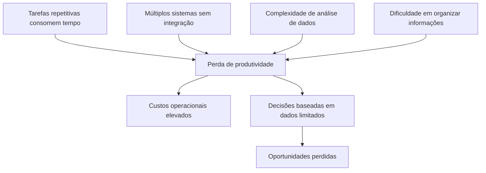
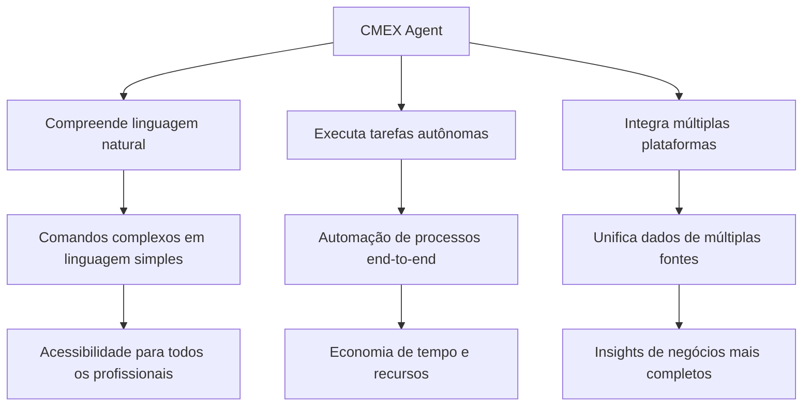
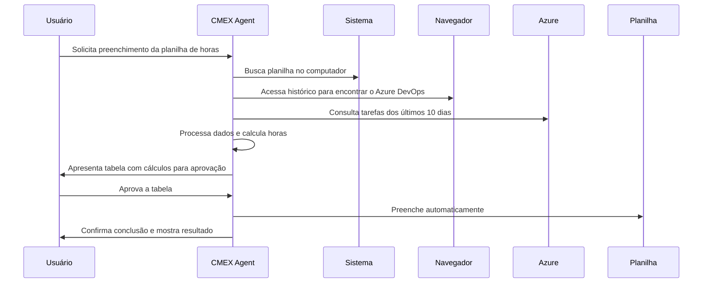
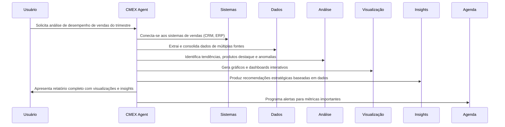
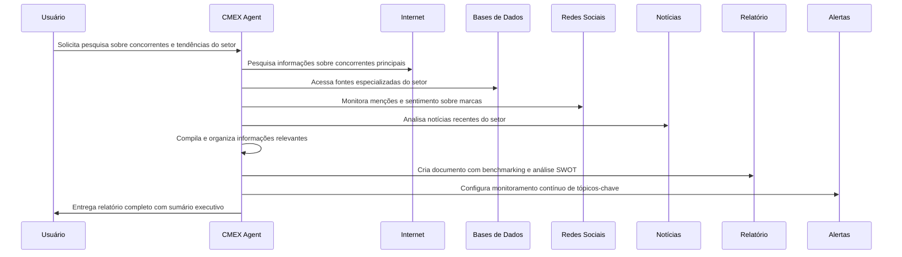
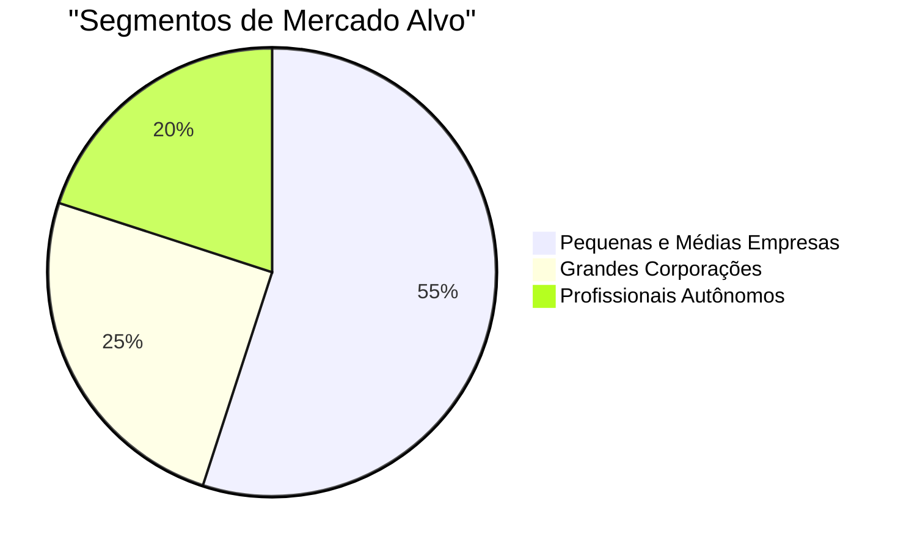
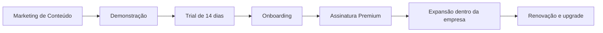

# IA Generativa como Agente (CMEX Agent)

## Índice

1. [Visão Geral](#visão-geral)
2. [Problema e Solução](#problema-e-solução)
3. [Casos de Uso](#casos-de-uso)
4. [Mercado e Oportunidade](#mercado-e-oportunidade)
5. [Diferencial Competitivo](#diferencial-competitivo)
6. [Modelo de Negócio](#modelo-de-negócio)
7. [Estratégia de Lançamento](#estratégia-de-lançamento)
8. [Projeção Financeira](#projeção-financeira)
9. [Infraestrutura e Custos](#infraestrutura-e-custos)
10. [Roadmap](#roadmap)
11. [Equipe e Contato](#equipe-e-contato)

## Visão Geral

**CMEX Agent** é uma plataforma de inteligência artificial generativa capaz de executar tarefas cotidianas para usuários em seus computadores ou na internet. O agente atua como um assistente virtual avançado que compreende comandos em linguagem natural e executa ações complexas de forma autônoma, trazendo ganhos significativos de produtividade e automação para profissionais e empresas.

## Problema e Solução

### O Problema



- Profissionais gastam horas em tarefas administrativas repetitivas
- Análise de dados exige conhecimento técnico especializado
- Integração entre sistemas requer desenvolvimento custoso
- Informações essenciais ficam dispersas em múltiplas plataformas

### A Solução



- Agente de IA que compreende o contexto e intenção do usuário
- Capacidade de executar tarefas complexas através de múltiplos sistemas
- Aprendizado contínuo para aprimoramento das capacidades
- Interface conversacional simples e intuitiva

## Casos de Uso

### Caso 1: Automatização de Relatórios de Horas

**Desafio:** Profissionais perdem horas preenchendo relatórios de horas trabalhadas.

**Solução CMEX Agent:**



### Caso 2: Análise de Vendas e Geração de Insights

**Desafio:** Análise de dados de vendas demanda conhecimento técnico e tempo.

**Solução CMEX Agent:**



### Caso 3: Pesquisa e Síntese de Informações de Mercado

**Desafio:** Acompanhar concorrentes e mercado exige pesquisa constante e síntese de informações.

**Solução CMEX Agent:**



## Mercado e Oportunidade

### Dados do Mercado

- Mercado global de assistentes virtuais avançados em crescimento acelerado
- Adoção crescente de automação de processos em empresas de todos os portes
- Empresas buscando soluções para maximizar produtividade e reduzir custos operacionais
- Análise de dados se tornando essencial para competitividade

### Oportunidade



## Diferencial Competitivo

### Vantagens Únicas

- **Execução Multi-plataforma**: Atua tanto em ambiente local quanto na internet
- **Contextualização Avançada**: Entende o contexto do usuário e personaliza respostas
- **Autonomia Real**: Capacidade de realizar tarefas completas sem intervenções constantes
- **Segurança e Privacidade**: Modelo próprio que garante controle sobre os dados

### Comparativo com Concorrentes

| Funcionalidade              | CMEX Agent | Manus AI | Open AI |
| --------------------------- | ---------- | -------- | ------- |
| Execução Autônoma           | ✓          | ✓        | ✓       |
| Acesso a Múltiplos Sistemas | ✓          | ⨯        | ⨯       |
| Adaptação ao Contexto       | ✓          | ✓        | ✓       |
| Personalização Avançada     | ✓          | ⨯        |         |
| Modelo Próprio              | ✓          | ⨯        | ✓       |
| Integração Sistemas Locais  | ✓          | ⨯        | ⨯       |

## Modelo de Negócio

### Monetização

- **Plano Premium**: R$ 281,26/mês por usuário (US$ 49,00 convertido à taxa atual)
- Pacotes empresariais com preços diferenciados por volume
- API para desenvolvedores com modelo de preço por chamada

### Ciclo de Vendas



## Estratégia de Lançamento

### Fase 1: MVP e Testes Fechados (3 meses)

- Desenvolvimento do MVP focado em casos de uso específicos
- Testes com grupo seleto de beta testers
- Coleta intensiva de feedback para refinamento

### Fase 2: Lançamento Limitado (6 meses)

- Foco inicial em análise de dados para empresários
- Marketing direcionado para early adopters
- Desenvolvimento de casos de uso específicos por segmento

### Fase 3: Expansão de Mercado (12 meses)

- Ampliação das funcionalidades para novos casos de uso
- Desenvolvimento de integrações com sistemas populares
- Programa de parcerias com desenvolvedores e consultores

## Projeção Financeira

Receita Anual Projetada

- AnoUsuários AtivosReceita Mensal (US$) | Receita Mensal (R$)Receita Anual (R$) 11.000$49.000              | R$ 281.260R$ 3.375.120 25.000$245.000             | R$ 1.406.300R$ 16.875.600 315.000$735.000             | R$ 4.218.900R$ 50.626.800

_Taxa de câmbio considerada: US$ 1,00 = R$ 5,74_

### Previsão de Crescimento

| Período | Usuários Ativos Projetados |
| ------- | -------------------------- |
| Mês 6   | 500                        |
| Mês 12  | 1.000                      |
| Mês 18  | 3.000                      |
| Mês 24  | 5.000                      |
| Mês 30  | 10.000                     |
| Mês 36  | 15.000                     |

```mermaid

```

## Infraestrutura e Custos

### Infraestrutura

- **Modelo Próprio**: Hospedado em AWS/Azure com containers Docker
- **Alta Disponibilidade**: Distribuição em múltiplas regiões
- **Segurança**: Isolamento de dados e criptografia avançada

### Custos Mensais Estimados (Para 5.000 usuários)

| Item                   | Descrição                  | Custo Mensal (US$) | Custo Mensal (R$) |     |     |     |
| ---------------------- | -------------------------- | ------------------ | ----------------- | --- | --- | --- |
| Infraestrutura Cloud   | AWS/Azure (EC2, S3, etc.)  | $12.000,00         | R$ 68.880,00      |     |     |     |
| Modelo de IA           | Treinamento e inferência   | $15.000,00         | R$ 86.100,00      |     |     |     |
| Largura de Banda       | Transferência de dados     | $3.000,00          | R$ 17.220,00      |     |     |     |
| Integração             | APIs de terceiros          | $2.000,00          | R$ 11.480,00      |     |     |     |
| Equipe Desenvolvimento | _Detalhado abaixo_         | $10.453,00         | R$ 60.000,00      |     |     |     |
| Equipe de IA           | Especialistas em ML/NLP    | $13.937,00         | R$ 80.000,00      |     |     |     |
| Suporte Técnico        | Atendimento e treinamento  | $8.362,00          | R$ 48.000,00      |     |     |     |
| Marketing              | Aquisição de clientes      | $10.000,00         | R$ 57.400,00      |     |     |     |
| Tokens LLMs            | Inferência e processamento | $17.500,00         | R$ 100.450,00     |     |     |     |
| **Total**              |                            | **$92.252,00**     | **R$ 529.530,00** |     |     |     |

### Detalhamento da Equipe de Desenvolvimento

| Função                    | Regime         | Valor                 | Horas Mensais | Total Mensal     |     |     |     |     |     |     |
| ------------------------- | -------------- | --------------------- | ------------- | ---------------- | --- | --- | --- | --- | --- | --- | --- | --- | --- |
| CTO                       | Fixo           | R$ 15.000,00/mês      | -             | R$ 15.000,00     |     |     |     |     |     |     |     |     |
| Frontend Sênior           | R$ 80,00/hora  | 6h/dia, 5 dias/semana | 120h          | R$ 9.600,00      |     |     |     |     |     |     |     |     |     |
| Backend Sênior            | R$ 100,00/hora | 6h/dia, 5 dias/semana | 120h          | R$ 12.000,00     |     |     |     |     |     |     |     |     |     |
| DevOps                    | R$ 90,00/hora  | 6h/dia, 5 dias/semana | 120h          | R$ 10.800,00     |     |     |     |     |     |     |     |     |     |
| Fullstack Pleno           | R$ 70,00/hora  | 6h/dia, 5 dias/semana | 120h          | R$ 8.400,00      |     |     |     |     |     |     |     |     |     |
| QA Especializado          | R$ 35,00/hora  | 6h/dia, 5 dias/semana | 120h          | R$ 4.200,00      |     |     |     |     |     |     |     |     |     |
| **Total Desenvolvimento** |                |                       |               | **R$ 60.000,00** |     |     |     |     |     |     |

### Detalhamento das Equipes de Suporte

| Função                    | Quantidade | Custo Mensal Individual | Total Mensal     |     |     |
| ------------------------- | ---------- | ----------------------- | ---------------- | --- | --- | --- |
| **Equipe de IA**          |            |                         |                  |     |     |
| Cientista de Dados Sênior | 2          | R$ 20.000,00            | R$ 40.000,00     |     |     |     |
| Engenheiro de ML          | 2          | R$ 15.000,00            | R$ 30.000,00     |     |     |     |
| Especialista em NLP       | 1          | R$ 10.000,00            | R$ 10.000,00     |     |     |     |
| **Total Equipe de IA**    |            |                         | **R$ 80.000,00** |     |     |
| **Suporte Técnico**       |            |                         |                  |     |     |
| Coordenador de Suporte    | 1          | R$ 12.000,00            | R$ 12.000,00     |     |     |     |
| Especialista L2           | 2          | R$ 8.000,00             | R$ 16.000,00     |     |     |     |
| Analista de Suporte L1    | 5          | R$ 4.000,00             | R$ 20.000,00     |     |     |     |
| **Total Suporte Técnico** |            |                         | **R$ 48.000,00** |     |     |

### Detalhamento de Custos com LLMs

| Serviço        | Finalidade                                  | Consumo Estimado | Custo Mensal (R$) |
| -------------- | ------------------------------------------- | ---------------- | ----------------- |
| GPT-4o         | Processamento de linguagem natural avançado | 700M tokens/mês  | R$ 40.180,00      |
| Claude 3 Opus  | Análise contextual e semântica              | 500M tokens/mês  | R$ 34.440,00      |
| Mistral Large  | Processamento de dados estruturados         | 400M tokens/mês  | R$ 25.830,00      |
| **Total LLMs** |                                             |                  | **R$ 100.450,00** |

### Implementações Planejadas

A equipe de desenvolvimento será responsável por implementar:

1. **Infraestrutura e DevOps**

   - Arquitetura serverless multi-região
   - Sistema de cacheamento para respostas frequentes
   - Pipeline de CI/CD para implantação contínua

2. **Módulos Especializados**

   - Conector universal para sistemas empresariais
   - Sistema de análise de dados com visualização automatizada
   - Agente de automação para tarefas em desktop e navegadores

3. **Integrações**

   - Conectores para Microsoft 365, Google Workspace
   - Integração com ERPs populares (SAP, Oracle, Totvs)
   - APIs para extensibilidade por desenvolvedores

- Margem Operacional (5.000 usuários)

```mermaid
pie
    title "Distribuição da Receita Mensal (5.000 usuários)"
    "Custos Operacionais" : 529530.00
    "P&D e Expansão" : 421890.00
    "Margem Líquida" : 454880.00
```

### Comparativo de Cenários

| Cenário     | Receita Mensal  | Custos Operacionais | Reinvestimento P&D | Margem Líquida | % Margem |     |     |     |     |
| ----------- | --------------- | ------------------- | ------------------ | -------------- | -------- | --- | --- | --- | --- | --- | --- |
| Otimista    | R$ 1.406.300,00 | R$ 413.280,00       | R$ 421.890,00      | R$ 571.130,00  | 40,6%    |     |     |     |     |     |     |
| Realista    | R$ 1.406.300,00 | R$ 529.530,00       | R$ 421.890,00      | R$ 454.880,00  | 32,3%    |     |     |     |     |     |     |
| Conservador | R$ 1.406.300,00 | R$ 529.530,00       | R$ 561.890,00      | R$ 314.880,00  | 22,4%    |     |     |     |     |     |     |

> **Nota:** O cenário conservador considera um maior investimento em P&D para aprimorar os algoritmos de automação e expandir as capacidades do agente, essencial em um mercado altamente competitivo de IA.

## Roadmap

### Curto Prazo (6 meses)

- API para desenvolvedores
- Integração com sistemas ERP/CRM populares
- Ampliação dos recursos de análise de dados

### Médio Prazo (12 meses)

- Integração com mais sistemas corporativos
- Capacidades avançadas de planejamento e estratégia
- Plataforma para criação de agentes customizados

### Longo Prazo (24 meses)

- Ecossistema completo de automação empresarial
- Marketplace de agentes especializados por setor
- Capacidades avançadas de machine learning

## Equipe e Contato

### Nossa Equipe

- Especialistas em IA e machine learning
- Desenvolvedores experientes em integração de sistemas
- Consultores de negócios com experiência em transformação digital

### Próximos Passos

- Solicite uma demonstração personalizada
- Conheça nossos casos de sucesso
- Agende uma reunião com nossos especialistas
