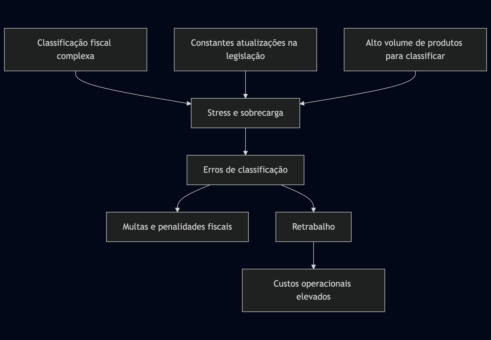

# Consulta Inteligente de NCM (CMEX)

## Índice

1. [Visão Geral](#visão-geral)
2. [Problema e Solução](#problema-e-solução)
3. [Casos de Uso](#casos-de-uso)
4. [Mercado e Oportunidade](#mercado-e-oportunidade)
5. [Funcionalidades do Produto](#funcionalidades-do-produto)
6. [Modelo de Negócio](#modelo-de-negócio)
7. [Estratégia de Lançamento](#estratégia-de-lançamento)
8. [Projeção Financeira](#projeção-financeira)
9. [Infraestrutura e Custos](#infraestrutura-e-custos)
10. [Roadmap](#roadmap)
11. [Equipe e Contato](#equipe-e-contato)

## Visão Geral

#### **CMEX é uma plataforma de consulta inteligente para códigos NCM (Nomenclatura Comum do Mercosul) que utiliza inteligência artificial avançada para auxiliar contadores e escritórios de contabilidade a classificar produtos de forma precisa e ágil, fornecendo informações detalhadas sobre tributação, alíquotas e requisitos fiscais.**


## Problema e Solução

### O Problema



- Contadores gastam horas buscando classificações NCM corretas
- Interpretação complexa das regras de classificação fiscal
- Atualizações frequentes nas alíquotas e tributos
- Alto risco de erros que podem resultar em multas significativas

### A Solução


- IA treinada com base nas regras oficiais de classificação fiscal
- Sistema que aprende continuamente com novas consultas
- Validação em tempo real com bases de dados governamentais
- Interface intuitiva que transforma complexidade em simplicidade


---

## Casos de Uso

### Caso 1: Classificação de Produto Novo

**Necessidade:**
Ana é contadora em um escritório que atende uma empresa de importação de equipamentos eletrônicos. A empresa acabou de receber um lote de "smartwatches com monitor cardíaco e GPS integrado" e precisa da classificação fiscal correta para emissão de notas fiscais.

**Interação com o Sistema:**


**Retorno do Sistema:**

```
✅ Classificação NCM: 8517.62.49 - Aparelhos para transmissão ou recepção de voz, imagem ou outros dados em rede com fio ou sem fio

🔹 Informações Tributárias:
   - ICMS: 18% (alíquota padrão interna SP)
   - IPI: 15%
   - PIS: 1,65% (regime não-cumulativo)
   - COFINS: 7,6% (regime não-cumulativo)
   - Imposto de Importação: 16%

🔹 Regime Especial:
   - Não se aplica alíquota zero
   - Não é monofásico para PIS/COFINS

🔹 CST/CFOP recomendados:
   - CST: 100 (tributado integralmente)
   - CFOP: 3102 (compra para comercialização)

🔹 Validação Deep Search:
   - Confirmado em 12 registros de importação similares nos últimos 3 meses
   - Sem atualizações recentes na legislação para esta categoria
   - Jurisprudência favorável: Decisão CARF nº 3402-007.092
```

**Possibilidades Adicionais:**

- "Deseja salvar esta classificação no cadastro de produtos?"
- "Exportar relatório com fundamentação legal para documentação?"
- "Visualizar histórico de alterações desta NCM nos últimos 24 meses?"
- "Alertar quando houver alterações tributárias para este NCM?"

### Caso 2: Importação em Massa de Produtos

**Necessidade:**
Carlos é responsável fiscal de uma rede de supermercados que está ampliando seu mix de produtos. Ele recebeu uma planilha com 230 novos itens que precisam ser classificados para o próximo mês.

**Interação com o Sistema:**


**Retorno do Sistema:**

```
✅ Processamento Concluído: 230 produtos classificados

🔹 Resultados:
   - 202 produtos classificados com alta confiança (>95%)
   - 23 produtos classificados com confiança média (80-95%)
   - 5 produtos requerem atenção especial (marcados em vermelho)

🔹 Destaque para atenção:
   - Item #45: "Bebida à base de soja" - Recente alteração de tributação (Decreto 10.254/2022)
   - Item #78: "Mistura para bolo sem glúten" - Potencial enquadramento como "alimento para fins especiais"
   - Item #112: "Creme de avelã com cacau" - Divergência entre precedentes (verificar composição)

🔹 Relatório consolidado:
   - Economia estimada de R$ 8.500,00 com otimizações tributárias identificadas
   - 12 produtos com possível aproveitamento de créditos não utilizados anteriormente

🔹 Exportar resultados:
   - Planilha completa com NCMs, alíquotas e fundamentações
   - Relatório de análise tributária por categoria
   - Documentação de suporte para auditoria
```

**Possibilidades Adicionais:**

- "Gerar etiquetas com códigos NCM para o sistema de estoque?"
- "Criar regras automáticas para classificação de produtos similares no futuro?"
- "Agendar análise trimestral para verificar alterações tributárias destes produtos?"
- "Integrar com seu sistema ERP para atualização automática?"

### Caso 3: Validação e Otimização Tributária

**Necessidade:**
Renata é consultora tributária e foi contratada para auditar as classificações fiscais de uma indústria de cosméticos que suspeita estar pagando tributos a mais em alguns produtos.

**Interação com o Sistema:**


**Retorno do Sistema:**

```
✅ Análise de Otimização Fiscal Concluída

🔹 Inconsistências Identificadas:
   - 8 produtos com NCM incorreto:
     * "Creme anti-idade com retinol": De 3304.99.90 para 3304.99.10 (diferente concentração)
     * "Protetor solar infantil": De 3304.99.90 para 3304.99.30 (finalidade específica)
     [...]

🔹 Oportunidades de Economia:
   - 12 produtos elegíveis para regimes especiais:
     * 4 produtos se enquadram no regime monofásico de PIS/COFINS
     * 3 produtos classificáveis como "preparações de higiene pessoal" com alíquota reduzida
     * 5 produtos com precedentes favoráveis para crédito presumido

🔹 Impacto Financeiro Estimado:
   - Economia mensal estimada: R$ 28.750,00
   - Recuperação potencial (últimos 5 anos): R$ 1.725.000,00
   - Risco de contingências futuras reduzido em 65%

🔹 Fundamentação:
   - 14 decisões judiciais favoráveis (anexadas no relatório)
   - 8 soluções de consulta da Receita Federal
   - 6 precedentes administrativos do CARF
```

**Possibilidades Adicionais:**

- "Elaborar documentação para pedido de restituição/compensação?"
- "Criar modelo de defesa para fiscalizações com base nos precedentes?"
- "Agendar alerta para monitoramento de novas decisões relacionadas?"
- "Exportar relatório executivo para apresentação ao cliente?"

## Mercado e Oportunidade

### Dados do Mercado

- **520.000+ contadores** registrados no Brasil segundo o CFC
- Mercado altamente segmentado com foco em nichos específicos
- Crescente demanda por soluções de automação e conformidade fiscal
- Poucos concorrentes com soluções realmente inteligentes no mercado

### Oportunidade


## Funcionalidades do Produto

### Versão Básica (por convite)

- Consulta de NCM por descrição do produto
- Visualização de alíquotas básicas
- Histórico de consultas limitado
- Interface web responsiva


### Versão Premium (R$ 99,00/mês)

- Tudo da versão básica
- **Deep Search**: busca validada em bases oficiais do governo
- Informações detalhadas sobre:
  - Alíquotas de todos os impostos
  - Regimes tributários aplicáveis
  - Classificação CST/CFOP
  - PIS/COFINS (monofásico, alíquota zero, etc.)
  - Atributos específicos do produto
- Importação em massa de produtos
- Relatórios personalizados
- Acesso a API para integração com sistemas

## Modelo de Negócio

### Monetização

- **Plano Premium**: R$ 99,00/mês por usuário (aproximadamente US$ 17,25 à taxa atual)
- Pacotes corporativos com desconto por volume
- Implementações personalizadas para grandes escritórios

### Ciclo de Vendas


## Estratégia de Lançamento

### Estratégia de Lançamento


## Projeção Financeira

### Projeção Financeira


## Infraestrutura e Custos

### Infraestrutura AWS

- Containerização com Docker na AWS
- Escalabilidade automática baseada em demanda
- Disponibilidade multi-região para alta performance

### Custos Mensais Estimados

| Item                   | Descrição                   | Custo Mensal (US$) | Custo Mensal (R$) |
| ---------------------- | --------------------------- | ------------------ | ----------------- |
| Serviços AWS           | EC2, ECS, RDS, ElastiCache  | $3.500,00          | R$ 20.090,00      |
| CDN e Transferência    | CloudFront, S3              | $1.200,00          | R$ 6.888,00       |
| Monitoramento          | CloudWatch, AWS X-Ray       | $800,00            | R$ 4.592,00       |
| Base de Conhecimento   | Atualização e manutenção    | $1.500,00          | R$ 8.610,00       |
| Equipe Desenvolvimento | _Detalhado abaixo_          | $6.271,00          | R$ 36.000,00      |
| Marketing              | Aquisição de clientes       | $8.000,00          | R$ 45.920,00      |
| Tokens LLMs            | DeepSeek, Bedrock, etc.     | $12.500,00         | R$ 71.750,00      |
| Equipe Fiscal          | Especialistas em tributação | $10.453,00         | R$ 60.000,00      |
| Suporte Técnico        | Atendimento e treinamento   | $8.362,00          | R$ 48.000,00      |
| **Total**              |                             | **$52.586,00**     | **R$ 301.850,00** |

### Detalhamento da Equipe de Desenvolvimento

| Função                    | Regime        | Valor                 | Horas Mensais | Total Mensal     |
| ------------------------- | ------------- | --------------------- | ------------- | ---------------- |
| CTO                       | Fixo          | R$ 12.000,00/mês      | -             | R$ 12.000,00     |
| Frontend                  | R$ 60,00/hora | 6h/dia, 5 dias/semana | 120h          | R$ 7.200,00      |
| Backend                   | R$ 80,00/hora | 6h/dia, 5 dias/semana | 120h          | R$ 9.600,00      |
| QA                        | R$ 30,00/hora | 6h/dia, 5 dias/semana | 120h          | R$ 3.600,00      |
| Junior Fullstack          | R$ 30,00/hora | 6h/dia, 5 dias/semana | 120h          | R$ 3.600,00      |
| **Total Desenvolvimento** |               |                       |               | **R$ 36.000,00** |

### Detalhamento das Equipes de Suporte

| Função                    | Quantidade | Custo Mensal Individual | Total Mensal     |
| ------------------------- | ---------- | ----------------------- | ---------------- |
| **Equipe Fiscal**         |            |                         |                  |
| Coordenador Tributário    | 1          | R$ 6.000,00             |                  |
| Especialista em NCM       | 1          | R$ 10.000,00            |                  |
| Analista Tributário       | 3          | R$ 2.000,00             |                  |
| Closer                    | 1          | 2200 + 22% HO           |                  |
| **Total Equipe Fiscal**   |            |                         | **R$ 18.000,00** |
| **Suporte Técnico**       |            |                         |                  |
| Coordenador de Suporte    | 1          | R$ 6.000,00             | R$ 6.000,00      |
| Especialista L2           | 2          | R$ 5.000,00             | R$ 10.000,00     |
| Analista de Suporte L1    | 5          | R$ 3.000,00             | R$ 15.000,00     |
| **Total Suporte Técnico** |            |                         | **R$ 31.000,00** |

### Detalhamento de Custos com LLMs

| Serviço        | Finalidade                         | Consumo Estimado | Custo Mensal (R$) |
| -------------- | ---------------------------------- | ---------------- | ----------------- |
| DeepSeek       | Classificação profunda de produtos | 500M tokens/mês  | R$ 28.700,00      |
| AWS Bedrock    | Análise de documentação fiscal     | 300M tokens/mês  | R$ 22.960,00      |
| Claude         | Validação e contexto normativo     | 250M tokens/mês  | R$ 20.090,00      |
| **Total LLMs** |                                    |                  | **R$ 71.750,00**  |

### Implementações Planejadas

A equipe de desenvolvimento será responsável por implementar:

1. **Infraestrutura e DevOps**

   - Configuração AWS DevOps ou Azure DevOps
   - Ambientes de desenvolvimento, homologação e produção
   - Banco de dados otimizado para consultas rápidas e cacheamento

2. **Módulos Especializados**

   - Agente de importação e verificação em massa de produtos
   - Agente de importação e correção em massa de produtos
   - Catálogo de produtos gerenciável

3. **Integrações**

   - Conectores para agentes de cargas e fornecedores
   - API para consulta de produtos importados
   - Integração com sistemas ERP populares no mercado

### Margens Operacionais Projetadas (Cenário Realista)


### Comparativo de Cenários

| Cenário     | Receita Mensal  | Custos Operacionais | Reinvestimento P&D | Margem Líquida  | % Margem |
| ----------- | --------------- | ------------------- | ------------------ | --------------- | -------- |
| Otimista    | R$ 5.148.000,00 | R$ 122.100,00       | R$ 1.005.180,00    | R$ 4.020.720,00 | 78,1%    |
| Realista    | R$ 5.148.000,00 | R$ 301.850,00       | R$ 825.450,00      | R$ 4.020.700,00 | 78,1%    |
| Conservador | R$ 5.148.000,00 | R$ 301.850,00       | R$ 2.550.000,00    | R$ 2.296.150,00 | 44,6%    |

> **Nota:** O cenário conservador considera um reinvestimento substancialmente maior em P&D para manter vantagem competitiva e expandir funcionalidades, resultando em uma margem líquida menor, porém mais sustentável a longo prazo.

## Roadmap

### Curto Prazo (6 meses)

- Aprimoramento do algoritmo de Deep Search
- Integração com sistemas ERP populares
- Aplicativo móvel para consultas em trânsito

### Médio Prazo (12 meses)

- Módulo de alertas para mudanças na legislação
- Consultoria automatizada para otimização tributária
- Expansão para outros países do Mercosul

### Longo Prazo (24 meses)

- Plataforma completa de gestão tributária
- Marketplace de serviços contábeis
- Integração com sistemas governamentais

## Equipe e Contato

### Nossa Equipe

- Especialistas em tributação com mais de 15 anos de experiência
- Desenvolvedores com expertise em IA e processamento de linguagem natural
- Consultores contábeis e fiscais de renome no mercado

### Próximos Passos

- Agende uma demonstração exclusiva
- Solicite seu convite para a versão beta
- Torne-se um parceiro estratégico no lançamento
