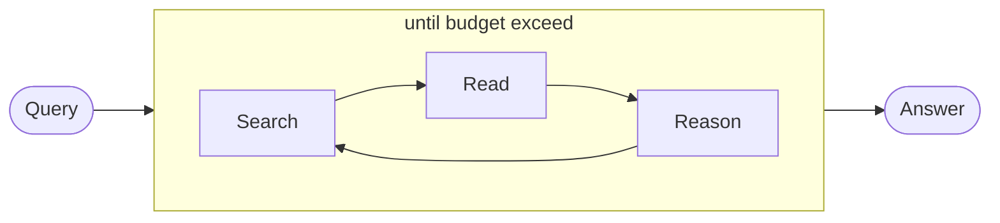
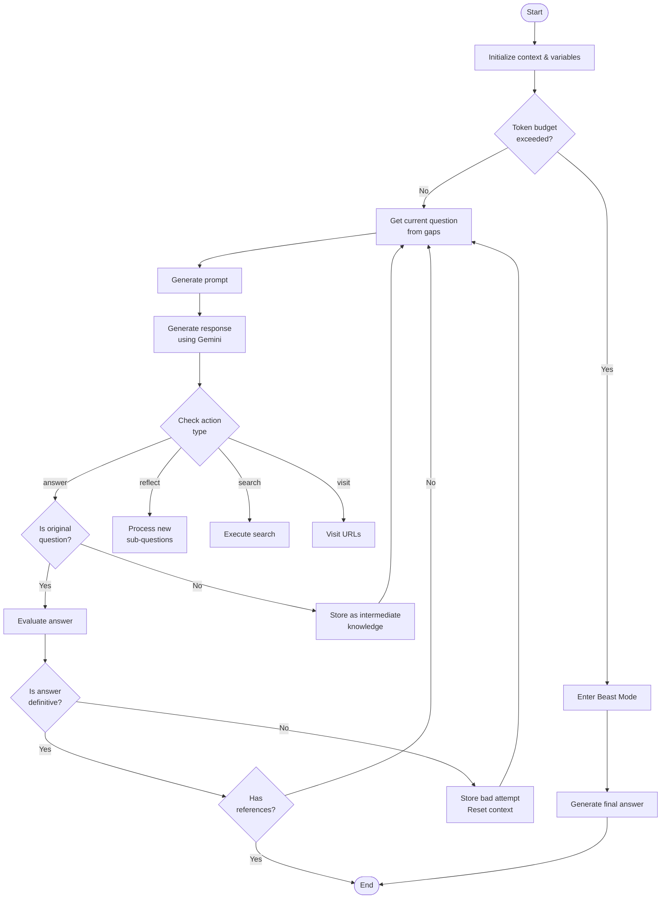
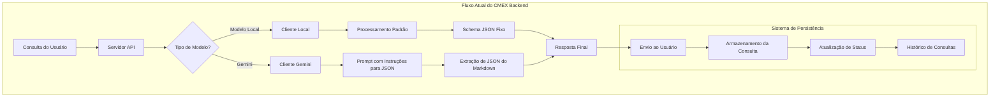

# Evolução do Projeto CMEX

Este documento traça a evolução do projeto CMEX, desde sua concepção inicial como "DeepResearch" até a atual implementação como "CMEX Backend".

## Índice

- [Conceito Original](#conceito-original)
- [Arquitetura Inicial](#arquitetura-inicial)
- [Evolução da Arquitetura](#evolução-da-arquitetura)
- [Comparação de Modelos de Dados](#comparação-de-modelos-de-dados)
- [Mudanças na Interface de Usuário](#mudanças-na-interface-de-usuário)
- [Linha do Tempo das Principais Atualizações](#linha-do-tempo-das-principais-atualizações)

## Conceito Original

O projeto começou como "DeepResearch", uma ferramenta de pesquisa automatizada que continuamente buscava, lia páginas da web e raciocinava até encontrar a resposta desejada (ou exceder o orçamento de tokens).

### Diagrama de Fluxo Original



O conceito original era baseado em um loop contínuo de busca, leitura e raciocínio, utilizando exclusivamente o modelo Gemini e a ferramenta Jina Reader para busca e leitura de páginas web.

### Tecnologias Iniciais

- **LLM**: Gemini exclusivamente
- **Ferramentas de Busca**: [Jina Reader](https://jina.ai/reader)
- **Configuração**: Chaves de API simples em variáveis de ambiente
- **Implementação**: API básica com endpoints limitados

## Evolução para CMEX Backend

Com o tempo, o projeto evoluiu de uma simples ferramenta de pesquisa para uma plataforma completa de busca inteligente, com suporte a múltiplos modelos e uma arquitetura mais robusta.

### Comparação de Arquiteturas

| Aspecto | DeepResearch (Original) | CMEX Backend (Atual) |
|---------|-------------------------|----------------------|
| **Modelos** | Apenas Gemini | Múltiplos modelos (Local + Gemini) |
| **Arquitetura** | Monolítica simples | Modular com separação de responsabilidades |
| **API** | Endpoints básicos | API completa com documentação Swagger |
| **Persistência** | Sem persistência | Armazenamento de consultas e histórico |
| **Tratamento de Erros** | Básico | Sistema robusto com fallbacks |
| **Deploy** | Docker simples | Pipeline CI/CD completo |

## Fluxos de Processamento

### Fluxo Original (DeepResearch)



### Fluxo Atual (CMEX Backend)



## Comparação de Modelos de Dados

### Modelo Original (DeepResearch)

O modelo de dados original era simples e focado apenas no processamento imediato:

```javascript style="background-color: #161921"
// Exemplo de estrutura de dados do DeepResearch
{
  "requestId": "1234567890",
  "tokenUsage": 74950,
  "tokenBreakdown": {
    "agent": 64631,
    "read": 10319
  },
  "actionState": {
    "action": "search",
    "think": "Pensamento sobre a busca...",
    "URLTargets": [],
    "answer": "",
    "questionsToAnswer": [],
    "references": [],
    "searchQuery": "Query de busca"
  },
  "step": 7,
  "badAttempts": 0,
  "gaps": []
}
```

### Modelo Atual (CMEX Backend)

O modelo de dados atual é muito mais robusto, com estruturas para:

```javascript style="background-color: #161921"
// Modelo de Consulta no CMEX Backend
{
  "id": "1234567890",
  "title": "Consulta sobre TypeScript",
  "question": "O que é TypeScript?",
  "timestamp": "2023-02-25T12:00:00Z",
  "status": "completed",
  "answer": {
    "content": "TypeScript é uma linguagem de programação...",
    "references": ["https://www.typescriptlang.org/docs/"],
    "thinking": "Vou pesquisar sobre o TypeScript para fornecer uma definição precisa."
  },
  "summary": "Definição e características do TypeScript",
  "model": "gemini-2.0-flash"
}

// Resposta de Logs
{
  "logs": [
    {
      "timestamp": "2023-02-25T12:00:00Z",
      "message": "Servidor iniciado",
      "level": "info"
    }
  ],
  "serverLogs": [...],
  "count": 1,
  "total": 100
}
```

## Principais Melhorias na Implementação

### 1. Suporte a Múltiplos Modelos

A evolução mais significativa foi a transição de um sistema dependente exclusivamente do Gemini para uma plataforma que suporta múltiplos modelos:

- **Original**: Apenas Gemini
- **Atual**: 
  - Modelos locais como Qwen2.5
  - Família Gemini (1.5-flash, 1.5-pro, 2.0-flash)
  - Arquitetura preparada para adicionar novos modelos

### 2. Processamento de Respostas

- **Original**: Processamento direto de respostas JSON do Gemini
- **Atual**:
  - Sistema adaptativo que detecta o tipo de modelo
  - Extração inteligente de JSON de respostas em markdown
  - Validação robusta com schemas Zod

### 3. Persistência e Histórico

- **Original**: Sem persistência, resultados temporários
- **Atual**:
  - Armazenamento completo de consultas
  - Histórico de pesquisas
  - Sistema de rastreamento de status

### 4. API e Documentação

- **Original**: API básica com poucos endpoints
- **Atual**:
  - API RESTful completa
  - Documentação Swagger
  - Tipos compartilhados entre frontend e backend

## Linha do Tempo das Principais Atualizações

### Versão Inicial (DeepResearch)
- Implementação baseada apenas no Gemini
- Loop básico de busca-leitura-raciocínio
- Docker simples para implantação

### Versão 1.0 (CMEX)
- Renomeação para CMEX Backend
- Estrutura de projeto modularizada
- Suporte inicial a modelos locais

### Versão Atual (25/02/2025)
- Integração completa com Gemini API
- Sistema adaptativo para múltiplos modelos
- Tratamento robusto de erros e fallbacks
- Transformadores para compatibilidade entre backend e frontend
- Documentação completa com diagramas de fluxo

## Próximos Passos

- Suporte a mais modelos de IA
- Configuração avançada de parâmetros por modelo
- Interface de administração para configuração de modelos
- Melhorias na experiência do usuário
- Otimizações de desempenho e consumo de tokens

## Referências

- [Documentação do Gemini API](https://ai.google.dev/docs)
- [Documentação do Qwen](https://github.com/QwenLM/Qwen)
- [Documentação do Jina Reader](https://jina.ai/reader)
- [README Original](../README%202.md) 