# Documentação de Modelos de IA

## Visão Geral

O CMEX Backend suporta diferentes modelos de IA para processamento de consultas. Esta documentação detalha os modelos disponíveis, como configurá-los e como alternar entre eles.

## Modelos Suportados

Atualmente, o sistema suporta os seguintes modelos:

| Modelo | Tipo | Descrição | Token Máximo |
|--------|------|-----------|--------------|
| `qwen2.5-7b-instruct-1m` | Local | Modelo local padrão para processamento de consultas | Configurável |
| `gemini-1.5-flash` | API | Modelo mais rápido da família Gemini | 1 milhão |
| `gemini-1.5-pro` | API | Modelo mais avançado da família Gemini 1.5 | 1 milhão |
| `gemini-2.0-flash` | API | Versão mais recente do Gemini, otimizada para velocidade | 1 milhão |

## Configuração

### Configuração de Ambiente

Para utilizar os modelos Gemini, é necessário configurar a chave de API no arquivo `.env`:

```env
GEMINI_API_KEY=sua_chave_de_api_aqui
```

### Configuração no código

As configurações dos modelos estão definidas no arquivo `config.ts`. Exemplo:

```typescript style="background-color: #161921"
export const modelConfigs = {
  agent: {
    model: process.env.AGENT_MODEL || 'qwen2.5-7b-instruct-1m',
    temperature: 0.1,
    maxTokens: 1024,
  },
  // Outras configurações...
};
```

## Seleção de Modelo

### Na interface do usuário (Frontend)

Os usuários podem selecionar o modelo desejado na interface do CMEX Frontend por meio do componente de seleção disponível na página de chat.

### Via API

Para selecionar um modelo específico ao fazer uma consulta via API:

```bash style="background-color: #161921"
curl -X POST "http://localhost:3000/api/v1/query" \
  -H "Content-Type: application/json" \
  -d '{
    "question": "O que é TypeScript?",
    "model": "gemini-2.0-flash"
  }'
```

## Processamento de Respostas

### Diferenças entre modelos locais e Gemini

Os modelos locais e Gemini possuem algumas diferenças significativas no formato de resposta:

1. **Formato JSON**: 
   - Modelos locais: Aceitam `responseSchema` para definir o formato da resposta
   - Gemini: Necessita de instruções textuais para formatar a resposta como JSON

2. **Extração de conteúdo**:
   - O sistema implementa uma lógica específica para extrair respostas JSON do Gemini, que pode retornar o JSON dentro de blocos de código markdown.

### Exemplo de resposta processada

```json style="background-color: #161921"
{
  "answer": "TypeScript é uma linguagem de programação de código aberto desenvolvida pela Microsoft. Ela é um superconjunto sintático de JavaScript que adiciona tipagem estática opcional à linguagem.",
  "thinking": "Vou pesquisar sobre o TypeScript para fornecer uma definição precisa.",
  "references": [
    "https://www.typescriptlang.org/docs/"
  ]
}
```

## Arquitetura e Fluxo de Processamento

### Comparação entre Fluxos: Antes e Depois da Integração com Gemini

```mermaid style="background-color: #161921"
flowchart TD
    subgraph "Fluxo Anterior (Apenas Modelos Locais)"
        A1[Consulta do Usuário] --> B1[Servidor API]
        B1 --> C1[Modelo Local Cliente]
        C1 --> D1[Processamento de Prompt]
        D1 --> E1[Schema JSON Fixo]
        E1 --> F1[Resposta Estruturada]
        F1 --> G1[Envio ao Usuário]
    end

    subgraph "Fluxo Atual (Modelos Locais + Gemini)"
        A2[Consulta do Usuário] --> B2[Servidor API]
        B2 --> C2{Tipo de Modelo?}
        C2 -->|Modelo Local| D2[Cliente Local]
        C2 -->|Gemini| E2[Cliente Gemini]
        
        D2 --> F2[Processamento Padrão]
        F2 --> G2[Schema JSON Fixo]
        
        E2 --> H2[Prompt com Instruções para JSON]
        H2 --> I2[Extração de JSON do Markdown]
        
        G2 --> J2[Resposta Final]
        I2 --> J2
        
        J2 --> K2[Envio ao Usuário]
    end
```



### Descrição do Fluxo de Processamento Atual

1. **Seleção de Modelo**: O sistema verifica o modelo solicitado e inicializa o cliente apropriado (local ou Gemini).

2. **Para Modelos Locais**:
   - Utiliza o cliente local existente
   - Configura o modelo com o esquema de resposta definido (responseSchema)
   - Processa a resposta diretamente para o formato esperado

3. **Para Modelos Gemini**:
   - Inicializa o cliente Gemini com a API key configurada
   - Adapta o prompt com instruções específicas para formatação JSON
   - Após receber a resposta, aplica um regex para extrair o JSON da resposta (que pode vir em formato markdown)
   - Valida e processa o JSON extraído

4. **Tratamento de Erros**:
   - Implementado sistema robusto de tratamento de erros específicos para cada tipo de modelo
   - Reinicialização automática de clientes quando necessário

O fluxo atual permite uma transição suave entre diferentes tipos de modelos, mantendo a consistência no formato das respostas recebidas pelo usuário final.

## Tratamento de Erros

O sistema implementa tratamento de erros específico para chamadas à API Gemini:

1. Reinicialização automática do cliente quando há mudança entre modelos locais e Gemini
2. Captura e registro de erros específicos da API
3. Fallback para outros modelos em caso de falha

## Histórico de Alterações

### 25/02/2025
- Adicionado suporte inicial para modelos Gemini do Google
- Implementada lógica de extração de JSON de respostas em formato markdown
- Melhorado o tratamento de erros para chamadas de API
- Adicionado diagrama de fluxo comparativo entre a implementação anterior e a atual

## Próximos Passos

- Suporte para mais modelos de IA
- Configuração avançada de parâmetros por modelo
- Interface de administração para configuração de modelos

## Referências

- [Documentação oficial da API Gemini](https://ai.google.dev/docs)
- [Documentação do Qwen](https://github.com/QwenLM/Qwen) 