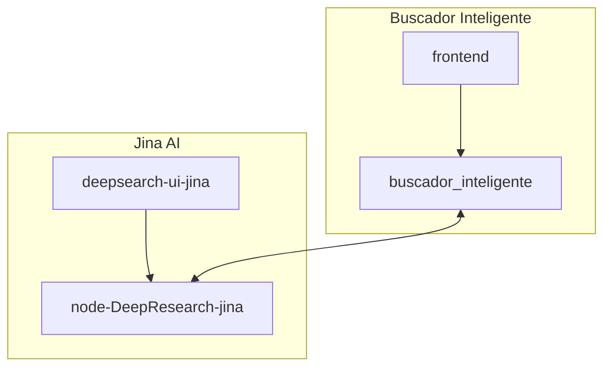
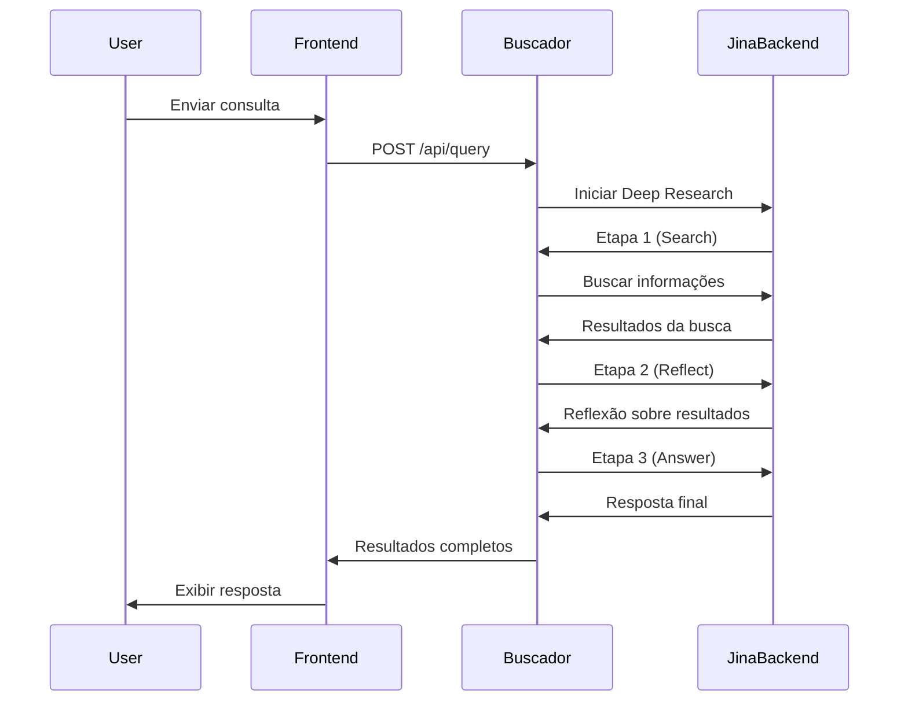

# Comunicação entre os Componentes: Jina AI e Buscador Inteligente

Este documento descreve a arquitetura de comunicação entre os diferentes componentes do sistema, incluindo o backend da Jina AI (node-DeepResearch-jina), o backend do Buscador Inteligente, o frontend da Jina AI (deepsearch-ui-jina) e o frontend principal.

## Diagrama de Arquitetura



## Componentes e Responsabilidades

### 1. Backend Jina AI (node-DeepResearch-jina)

**Função Principal**: Fornecer capacidade de busca e pesquisa avançada usando modelos de linguagem.

**Arquivos-chave**:

- `src/app.ts`: Servidor Express que expõe APIs para interação com o agente de IA
- `src/agent.ts`: Implementação da lógica do agente de IA
- `src/types.ts`: Definições de tipos para as APIs e estruturas de dados

**Esquema da API**:

```typescript
// Principais tipos de ações do sistema
type BaseAction = {
  action: "search" | "answer" | "reflect" | "visit" | "coding";
  think: string;
};

export type StepAction =
  | SearchAction
  | AnswerAction
  | ReflectAction
  | VisitAction
  | CodingAction;

export interface ChatCompletionRequest {
  model: string;
  messages: Array<CoreMessage>;
  stream?: boolean;
  reasoning_effort?: "low" | "medium" | "high";
  max_completion_tokens?: number;
  // Outros parâmetros de configuração
}

export interface ChatCompletionResponse {
  id: string;
  object: "chat.completion";
  created: number;
  model: string;
  // Conteúdo da resposta e metadados
}
```

### 2. Backend Buscador Inteligente

**Função Principal**: Servir como middleware entre a interface do usuário e o serviço de busca avançada, adicionando funcionalidades específicas ao contexto do negócio.

**Arquivos-chave**:

- `src/server.ts`: Implementação do servidor Express
- `src/agent.ts`: Adaptador para o agente de IA
- `src/controllers/deepResearchNCM.ts`: Controlador especializado para buscas de NCM

**Esquema da API**:

```typescript
// Namespace para sessão de consulta
export namespace SessionModule {
  export interface QuerySession {
    id: string;
    question: string;
    timestamp: string;
    status: "in_progress" | "completed" | "error";
    summary?: string;
    steps: QueryStep[];
    metadata: {
      model: string;
      totalTokens?: number;
      elapsedTime?: string;
      urlCount?: number;
    };
  }
}
```

### 3. Frontend Jina AI (deepsearch-ui-jina)

**Função Principal**: Fornecer uma interface de usuário direta para o serviço de pesquisa da Jina AI.

**Arquivos-chave**:

- `app.js`: Implementação da lógica do cliente
- `index.html`: Interface de usuário
- `styles.css`: Estilos da interface

**Funcionalidades principais**:

- Envio de consultas para o backend
- Renderização de respostas com markdown
- Exibição de referências e citações
- Tradução de interface (i18n)

### 4. Frontend Principal

**Função Principal**: Fornecer a interface de usuário customizada para o sistema de busca inteligente.

**Arquivos-chave**:

- `src/axiosConfig.ts`: Configuração da comunicação com o backend
- `src/components/`: Componentes de UI

**Configuração da API**:

```typescript
// Configuração do cliente Axios
const baseURL =
  ENV === "dev"
    ? "http://localhost:10000/api"
    : ENV === "prod"
    ? "https://cmex-poc.onrender.com/api"
    : ENV === "staging"
    ? "https://cmex-poc-amrt.onrender.com/api"
    : ENV === "homolog"
    ? "https://cmex-back-homolog.onrender.com/api"
    : "";
```

## Fluxo de Comunicação

### Fluxo de Pesquisa Padrão

1. O usuário insere uma consulta no **Frontend Principal**
2. A consulta é enviada para o **Backend Buscador Inteligente** via API REST
3. O **Backend Buscador Inteligente** processa a consulta e a encaminha para o **Backend Jina AI**
4. O **Backend Jina AI** executa a busca usando modelos de linguagem e retorna os resultados
5. O **Backend Buscador Inteligente** processa os resultados e os envia para o **Frontend Principal**
6. O **Frontend Principal** exibe os resultados ao usuário

### Fluxo de Deep Research

No caso específico de consultas de pesquisa profunda (deep research), como aquelas relacionadas a NCM:

1. O usuário envia uma consulta de deep research através do **Frontend Principal**
2. O **Backend Buscador Inteligente** envia a consulta para o controlador especializado (`deepResearchNCM.ts`)
3. O controlador especializado aciona a classe correspondente ao modelo escolhido (GPT-4, Claude, Deepseek, etc.)
4. A classe de deep research processa a consulta em etapas iterativas
5. Cada etapa pode envolver comunicação com o **Backend Jina AI** para busca avançada
6. Os resultados são agregados e retornados ao **Frontend Principal**

## Schema de Dados

### Tipos de Ações

Os sistemas compartilham uma estrutura comum de ações que representam os passos de raciocínio do agente:

| Ação      | Descrição                                               |
| --------- | ------------------------------------------------------- |
| `search`  | Busca de informações em fontes externas                 |
| `answer`  | Fornecimento de resposta final ao usuário               |
| `reflect` | Reflexão sobre informações obtidas para refinar a busca |
| `visit`   | Visita a URLs específicas para coletar informações      |
| `coding`  | Resolução de problemas de código (quando aplicável)     |

### Fluxo de Sessão

A sessão de consulta no Buscador Inteligente segue este fluxo:



## Diferenças entre as Interfaces

| Característica    | Frontend Jina        | Frontend Principal       |
| ----------------- | -------------------- | ------------------------ |
| **Foco**          | Pesquisa geral       | Consultas especializadas |
| **Autenticação**  | Chave API simples    | Autenticação Supabase    |
| **I18n**          | Embutido (i18n.json) | React-i18next            |
| **Processamento** | JavaScript puro      | React + TypeScript       |
| **Estilização**   | CSS puro             | Tailwind CSS             |
| **Renderização**  | Markdown-it          | React-markdown           |

## Integração com Modelos de IA

O sistema suporta múltiplos modelos de IA, gerenciados pelo `modelFactory` no Buscador Inteligente:

```typescript
export const modelFactory = (
  modelName: string,
  tokenTracker: TokenTracker,
  fastApiData: FastApiNCMResult | null,
  consulta: ConsultaProduto
): DeepResearch => {
  // Seleciona o modelo apropriado com base no nome
  switch (modelName.toLowerCase()) {
    case "gpt-4":
      return new DeepResearchGPT4(tokenTracker, fastApiData, consulta);
    case "claude":
      return new DeepResearchClaude(tokenTracker, fastApiData, consulta);
    case "deepseek":
      return new DeepResearchDeepseek(tokenTracker, fastApiData, consulta);
    case "qwen":
      return new DeepResearchQwen(tokenTracker, fastApiData, consulta);
    case "gemini":
      return new DeepResearchGemini(tokenTracker, fastApiData, consulta);
    default:
      return new DeepResearchGPT4(tokenTracker, fastApiData, consulta);
  }
};
```
