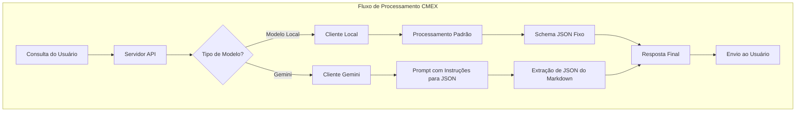
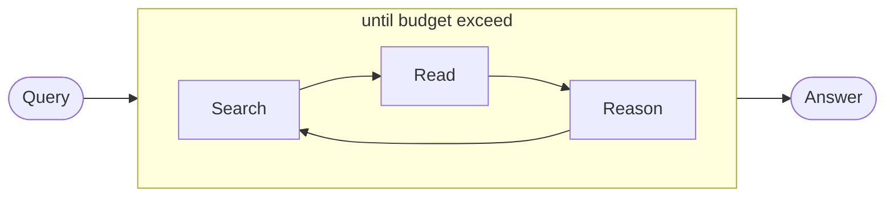

# CMEX Backend (Buscador Inteligente)

Serviço de backend para a plataforma CMEX que implementa o buscador inteligente.

## Instalação

```bash style="background-color: #161921"
npm install
```

## Execução

```bash style="background-color: #161921"
npm run dev
```

## Build

```bash style="background-color: #161921"
npm run build
```

## Docker

### Build Docker Image

```bash style="background-color: #161921"
docker build -t cmex-backend:latest .
```

### Run Docker Container

```bash style="background-color: #161921"
docker run -p 3001:3001 --env-file .env cmex-backend:latest
```

### Docker Compose

```bash style="background-color: #161921"
docker-compose up
```

## APIs Disponíveis

### API de Consultas

#### Criação de consulta

```style="background-color: #161921"
POST /api/v1/query
{
    "question": "O que é TypeScript?",
    "title": "Consulta sobre TypeScript"
}
```

Resposta:

```json style="background-color: #161921"
{
  "requestId": "1234567890"
}
```

#### Obtenção de consultas

```style="background-color: #161921"
GET /api/v1/queries
```

Resposta:

```json style="background-color: #161921"
[
  {
    "id": "1234567890",
    "title": "Consulta sobre TypeScript",
    "question": "O que é TypeScript?",
    "timestamp": "2023-02-25T12:00:00Z",
    "status": "completed"
  }
]
```

#### Streaming de resultados

```style="background-color: #161921"
GET /api/v1/stream/:requestId
```

**Exemplo de resposta:**

```json style="background-color: #161921"
{
  "logs": [
    {
      "timestamp": "2023-02-25T12:00:00Z",
      "message": "Servidor iniciado",
      "level": "info"
    }
  ],
  "serverLogs": [
    {
      "timestamp": "2023-02-25T12:00:00Z",
      "message": "Servidor iniciado",
      "level": "info"
    }
  ],
  "count": 1,
  "total": 100
}
```

### API de Logs

#### GET /api/v1/logs

Retorna os logs do servidor com opções de filtragem.

**Parâmetros de consulta:**

- `level`: Filtrar por nível de log (opcional)
- `since`: Filtrar logs a partir de uma data (opcional)
- `limit`: Limitar número de logs retornados (padrão: 100)

**Exemplo de resposta:**

```json style="background-color: #161921"
{
  "logs": [
    {
      "timestamp": "2023-02-25T12:00:00Z",
      "message": "Servidor iniciado",
      "level": "info"
    }
  ],
  "serverLogs": [
    {
      "timestamp": "2023-02-25T12:00:00Z",
      "message": "Servidor iniciado",
      "level": "info"
    }
  ],
  "count": 1,
  "total": 100
}
```

**Observação:** A partir da versão 1.0.1 do pacote `@cmex/shared-types`, o campo `logs` é obrigatório e contém o mesmo conteúdo que `serverLogs` para manter compatibilidade com diferentes implementações.

## Pacote @cmex/shared-types

O projeto está em processo de migração para utilizar o pacote `@cmex/shared-types` para compartilhar tipos e validações entre frontend e backend. Este pacote oferece:

1. Centralização das definições de tipos
2. Validação de dados com Zod
3. Transformadores padronizados

### Histórico de Alterações

**v1.0.1 (25/02/2025)**

- Alteração na interface `LogsResponse`: o campo `logs` agora é obrigatório em vez de opcional
- Modificada a função `transformLogsResponse` para garantir que o campo `logs` sempre seja definido
- A API `/api/v1/logs` foi atualizada para retornar sempre os campos `logs` e `serverLogs`

### Compatibilidade

Estamos mantendo compatibilidade com implementações anteriores durante a transição:

- O campo `logs` na resposta da API `/api/v1/logs` agora é obrigatório
- O conteúdo dos campos `logs` e `serverLogs` é idêntico para garantir compatibilidade

## Estrutura do Projeto

```style="background-color: #161921"
buscador_inteligente/
├── src/
│   ├── server.ts               # Servidor Express
│   ├── agent.ts                # Agente de busca inteligente
│   ├── types.ts                # Tipos e interfaces
│   ├── utils/                  # Utilitários
│   ├── tools/                  # Ferramentas do agente
│   └── types/                  # Tipos específicos
├── queries/                    # Armazenamento de consultas
├── public/                     # Arquivos estáticos
└── docs/                       # Documentação
```

## Documentação Adicional

Para mais informações sobre o funcionamento do buscador inteligente, consulte a documentação completa na pasta `docs/`:

- [Modelos de IA](./docs/MODELOS_IA.md) - Detalhes sobre os modelos suportados e como utilizá-los
- [Evolução do Projeto](./docs/EVOLUCAO_PROJETO.md) - História da evolução do projeto desde sua concepção inicial
- [API de Logs](./docs/API_LOGS.md) - Documentação da API de logs

## Modelos de IA Suportados

O CMEX Backend suporta diferentes modelos de IA para processamento de consultas:

### Modelos Locais

Por padrão, o sistema utiliza modelos locais (como o Qwen2.5) para processamento de consultas. Estes modelos são executados localmente e oferecem:

- Menor latência para respostas
- Controle total sobre o processamento
- Independência de conexão externa

### Gemini API

A partir da versão 1.2.0, adicionamos suporte à API Gemini do Google, trazendo modelos mais avançados. Para utilizar:

1. Configure as variáveis de ambiente:

```style="background-color: #161921"
GEMINI_API_KEY=sua_chave_de_api
```

2. Selecione o modelo Gemini na interface do usuário no frontend ou especifique o modelo ao fazer uma consulta via API:

```json style="background-color: #161921"
{
  "question": "Sua pergunta aqui",
  "model": "gemini-1.5-flash"
}
```

### Modelos Suportados

O sistema atualmente suporta os seguintes modelos:

- `qwen2.5-7b-instruct-1m` (padrão, local)
- `gemini-1.5-flash` (API Google)
- `gemini-1.5-pro` (API Google)
- `gemini-2.0-flash` (API Google)

### Processamento Adaptativo de Respostas

O sistema detecta automaticamente o tipo de modelo sendo utilizado e adapta:

- O formato de prompt enviado
- O processamento de respostas (extração de JSON para Gemini)
- Tratamento de erros específicos para cada tipo de modelo

### Configuração Avançada

As configurações dos modelos podem ser ajustadas no arquivo `config.ts`. Os principais parâmetros incluem:

- Temperatura (0.0 a 1.0)
- Quantidade máxima de tokens
- Formato de resposta (JSON estruturado)
- Opções de fallback entre modelos

### Diagrama de Fluxo



Um diagrama comparativo detalhado entre o fluxo de processamento anterior e o atual está disponível na [documentação de Modelos de IA](./docs/MODELOS_IA.md).

## Histórico de Alterações Recentes

### 25/02/2025

- Adicionada documentação sobre a evolução do projeto desde sua concepção inicial
- Adicionado suporte para modelos Gemini do Google (versões 1.5-flash, 1.5-pro e 2.0-flash)
- Melhorias no processamento de respostas em JSON, com extração inteligente de JSON de respostas em markdown
- Tratamento de erros aprimorado para chamadas de API, incluindo fallbacks automáticos
- Adicionada documentação com diagramas de fluxo comparativo entre implementações
- Atualização da interface LogsResponse no pacote @cmex/shared-types (v1.0.1)

## Evolução do Projeto

O CMEX Backend passou por uma significativa evolução desde sua concepção inicial:

### Origens: DeepResearch

O projeto começou como "DeepResearch", uma ferramenta simples de pesquisa automatizada que continuamente buscava, lia páginas da web e raciocinava até encontrar respostas.



### Transição para CMEX Backend

Com o tempo, o sistema evoluiu de uma ferramenta simples para uma plataforma completa:

| Característica          | DeepResearch (Original) | CMEX Backend (Atual)                       |
| ----------------------- | ----------------------- | ------------------------------------------ |
| **Modelos**             | Apenas Gemini           | Múltiplos modelos (Local + Gemini)         |
| **Arquitetura**         | Monolítica simples      | Modular com separação de responsabilidades |
| **API**                 | Endpoints básicos       | API RESTful completa com documentação      |
| **Persistência**        | Sem persistência        | Armazenamento de consultas e histórico     |
| **Tratamento de Erros** | Básico                  | Sistema robusto com fallbacks              |

Para uma visão completa da evolução do projeto, consulte a [documentação detalhada](./docs/EVOLUCAO_PROJETO.md).

## Histórico de Alterações Recentes

### 25/02/2025

- Adicionada documentação sobre a evolução do projeto desde sua concepção inicial
- Adicionado suporte para modelos Gemini do Google (versões 1.5-flash, 1.5-pro e 2.0-flash)
- Melhorias no processamento de respostas em JSON, com extração inteligente de JSON de respostas em markdown
- Tratamento de erros aprimorado para chamadas de API, incluindo fallbacks automáticos
- Adicionada documentação com diagramas de fluxo comparativo entre implementações
- Atualização da interface LogsResponse no pacote @cmex/shared-types (v1.0.1)
