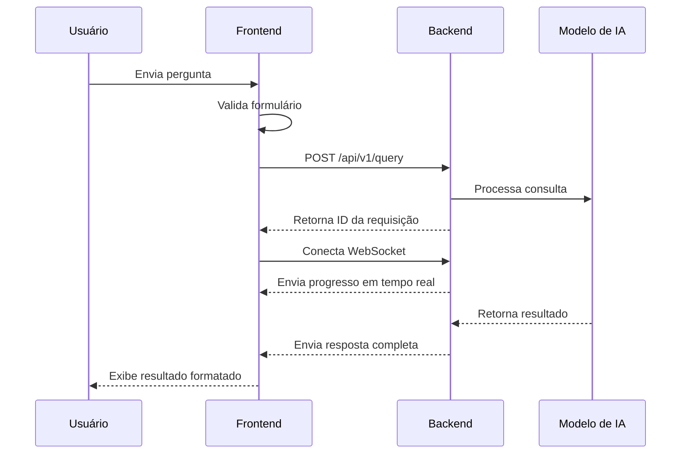

# Documentação CMEX Frontend

## Índice

- [Visão Geral](#visão-geral)
- [Estrutura do Projeto](#estrutura-do-projeto)
- [Integração com Backend](#integração-com-backend)
- [Sistema de Tipos](#sistema-de-tipos)
- [Transformações de Dados](#transformações-de-dados)
- [APIs e Comunicação](#apis-e-comunicação)
- [UI/UX](#uiux)
- [Histórico de Alterações](#histórico-de-alterações)

## Visão Geral

O CMEX Frontend é a interface de usuário da plataforma CMEX, projetada para interagir com o CMEX Backend (Buscador Inteligente). A aplicação é construída em React com TypeScript, seguindo práticas modernas de desenvolvimento frontend.

### Principais Recursos

- **Interface de Consultas**: Formulário interativo para envio de perguntas ao buscador inteligente
- **Visualização de Resultados**: Exibição estruturada das respostas fornecidas pelos modelos de IA
- **Histórico de Consultas**: Acesso às consultas anteriores e seus resultados
- **Seleção de Modelos**: Interface para escolha entre diferentes modelos de IA disponíveis
- **Streaming de Progresso**: Visualização em tempo real do progresso de processamento das consultas

## Estrutura do Projeto

```style="background-color: #161921"
frontend/
├── src/
│   ├── components/           # Componentes reutilizáveis
│   │   ├── Chat/             # Componentes relacionados à interface de chat
│   │   ├── QueryHistory/     # Componentes para histórico de consultas
│   │   ├── ModelSelector/    # Seletor de modelos de IA
│   │   └── common/           # Componentes de UI comuns (botões, inputs, etc.)
│   ├── pages/                # Componentes de página
│   │   ├── ChatPage/         # Página principal de chat
│   │   ├── HistoryPage/      # Página de histórico
│   │   └── SettingsPage/     # Página de configurações
│   ├── utils/                # Utilitários e funções auxiliares
│   │   ├── api/              # Funções para interação com a API
│   │   ├── transformers/     # Transformadores de dados
│   │   ├── hooks/            # Custom hooks React
│   │   └── helpers/          # Funções auxiliares gerais
│   ├── types/                # Definições de tipos TypeScript
│   │   ├── api.ts            # Tipos relacionados às APIs
│   │   ├── models.ts         # Tipos para modelos de dados
│   │   └── ui.ts             # Tipos para componentes de UI
│   ├── contexts/             # Contextos React para estado global
│   │   ├── ChatContext.tsx   # Contexto para o estado do chat
│   │   └── AuthContext.tsx   # Contexto para autenticação
│   ├── styles/               # Estilos globais e temas
│   ├── App.tsx               # Componente principal
│   └── main.tsx              # Ponto de entrada
├── public/                   # Arquivos estáticos
├── tests/                    # Testes automatizados
└── package.json              # Dependências e scripts
```

## Integração com Backend

O frontend se integra com o CMEX Backend através de APIs RESTful e WebSockets para comunicação em tempo real.

### Modelos de IA Suportados

A interface de usuário permite selecionar entre os diferentes modelos suportados pelo backend:

- **Modelos Locais**:

  - `qwen2.5-7b-instruct-1m` (padrão)

- **Modelos Gemini**:
  - `gemini-1.5-flash`
  - `gemini-1.5-pro`
  - `gemini-2.0-flash`

### Seletor de Modelos

O componente `ModelSelector` permite ao usuário escolher qual modelo de IA será utilizado para processar sua consulta:

```typescript style="background-color: #161921"
// ModelSelector.tsx
import React from "react";
import { Select, FormControl, FormLabel } from "../common";
import { ModelOption } from "../../types/models";

interface ModelSelectorProps {
  selectedModel: string;
  onModelChange: (model: string) => void;
  models: ModelOption[];
}

export const ModelSelector: React.FC<ModelSelectorProps> = ({
  selectedModel,
  onModelChange,
  models,
}) => {
  return (
    <FormControl>
      <FormLabel>Modelo de IA</FormLabel>
      <Select
        value={selectedModel}
        onChange={(e) => onModelChange(e.target.value)}
      >
        {models.map((model) => (
          <option key={model.id} value={model.id}>
            {model.name} {model.isLocal ? "(Local)" : "(API)"}
          </option>
        ))}
      </Select>
    </FormControl>
  );
};
```

### Fluxo de Comunicação



## Sistema de Tipos

O frontend implementa um sistema de tipos robusto usando TypeScript para garantir consistência e segurança de tipos.

### Principais Interfaces

#### Consulta (Query)

```typescript style="background-color: #161921"
// Frontend: types/models.ts
export interface Query {
  id: string;
  title: string;
  question: string;
  status: "in_progress" | "completed" | "error";
  timestamp: string;
  summary?: string;
  isDeleting?: boolean; // Flag UI para animação
}
```

#### Mensagem de Streaming

```typescript style="background-color: #161921"
// Frontend: types/api.ts
export interface StreamMessage {
  type: "progress" | "answer" | "error" | "connected";
  data?: {
    action?: "search" | "answer" | "reflect";
    think?: string;
    answer?: string;
    searchQuery?: string;
    references?: Reference[];
    error?: string;
  };
  trackers?: {
    tokenTracker: {
      usage: Array<{ tool: string; tokens: number }>;
      totalTokens: number;
    };
    actionTracker: {
      think: string;
      action: string;
      totalStep: number;
      badAttempts: number;
    };
  };
}
```

#### Resposta de Logs

```typescript style="background-color: #161921"
// Frontend: types/api.ts
export interface LogsResponse {
  logs: Array<{
    timestamp: string;
    message: string;
    level: "log" | "error" | "warn" | "info";
  }>;
  serverLogs: Array<{
    timestamp: string;
    message: string;
    level: "log" | "error" | "warn" | "info";
  }>;
  count: number;
  total: number;
}
```

## Transformações de Dados

Os transformadores são funções que convertem dados entre o formato do backend e o formato esperado pelo frontend.

### Transformação de Status

```typescript style="background-color: #161921"
// utils/transformers/queryTransformers.ts
export const transformQueryStatus = (
  backendStatus: string
): FrontendQueryStatus => {
  // O backend possui 'processing' como estado adicional
  if (backendStatus === "processing") {
    return "in_progress";
  }

  return backendStatus as FrontendQueryStatus;
};
```

### Transformação de Resposta de Logs

```typescript style="background-color: #161921"
// utils/transformers/logsTransformers.ts
export const transformLogsResponse = (response: any): LogsResponse => {
  // A partir da versão 1.0.1 do pacote shared-types, garantimos que
  // tanto logs quanto serverLogs existam na resposta
  const logs = response.logs || response.serverLogs || [];
  const serverLogs = response.serverLogs || response.logs || [];

  return {
    logs,
    serverLogs,
    count: response.count || logs.length,
    total: response.total || logs.length,
  };
};
```

### Transformação de Mensagem de Streaming

```typescript style="background-color: #161921"
// utils/transformers/streamTransformers.ts
export const transformStreamMessage = (backendMessage: any): StreamMessage => {
  // Simplifica os tipos de mensagens do backend para os tipos que o frontend suporta
  const type = transformStreamMessageType(backendMessage.type);

  // Estrutura os dados de forma consistente para o frontend
  const data = transformStreamData(backendMessage.data, type);

  // Converte o formato do rastreador de tokens para o formato do frontend
  const trackers = backendMessage.trackers
    ? transformStreamTrackers(backendMessage.trackers)
    : undefined;

  return { type, data, trackers };
};
```

### Integração com @cmex/shared-types

O frontend utiliza o pacote compartilhado `@cmex/shared-types` para manter consistência de tipos com o backend:

```typescript style="background-color: #161921"
// Importação direta do pacote compartilhado
import {
  QuerySchema,
  LogsResponseSchema,
  transformQueryResponse,
  transformLogsResponse,
} from "@cmex/shared-types";

// Validação de dados recebidos da API
const validateQueryResponse = (data: unknown) => {
  try {
    return QuerySchema.parse(data);
  } catch (error) {
    console.error("Erro na validação de resposta de consulta:", error);
    throw new Error("Formato de resposta inválido");
  }
};

// Transformação padronizada
const processQueryResponse = (data: unknown) => {
  const validated = validateQueryResponse(data);
  return transformQueryResponse(validated);
};
```

Esta integração oferece várias vantagens:

1. **Validação em tempo de execução**: Utiliza Zod para validar dados recebidos do backend
2. **Transformação padronizada**: Usa transformadores compartilhados entre frontend e backend
3. **Consistência de tipos**: Garante que as interfaces sejam compatíveis em toda a aplicação
4. **Melhor manutenção**: Alterações nos tipos só precisam ser feitas em um lugar

#### Tipos Compartilhados

O pacote `@cmex/shared-types` define os seguintes tipos principais:

| Tipo            | Descrição                          | Uso no Frontend                     |
| --------------- | ---------------------------------- | ----------------------------------- |
| `Query`         | Interface base para consultas      | Listagem e detalhes de consultas    |
| `LogsResponse`  | Formato de resposta da API de logs | Visualização de logs do sistema     |
| `ModelConfig`   | Configurações de modelos de IA     | Seleção e configuração de modelos   |
| `StreamMessage` | Formato de mensagens de streaming  | Exibição de progresso em tempo real |

### Compatibilidade com Modelos Gemini

O frontend foi adaptado para trabalhar com as respostas específicas dos modelos Gemini:

#### Detecção de Modelo

```typescript style="background-color: #161921"
// hooks/useModelDetection.ts
import { useEffect, useState } from "react";

export const useModelDetection = (modelId: string) => {
  const [isGeminiModel, setIsGeminiModel] = useState<boolean>(false);

  useEffect(() => {
    // Verifica se o modelo selecionado é da família Gemini
    setIsGeminiModel(modelId.startsWith("gemini-"));
  }, [modelId]);

  return { isGeminiModel };
};
```

#### Exibição Adaptativa de Respostas

Os componentes de exibição de resposta se adaptam ao tipo de modelo utilizado:

```typescript style="background-color: #161921"
// components/Chat/ResponseDisplay.tsx
import React from "react";
import { useModelDetection } from "../../hooks/useModelDetection";
import { MarkdownRenderer } from "../common/MarkdownRenderer";
import { JSONViewer } from "../common/JSONViewer";

interface ResponseDisplayProps {
  response: any;
  modelId: string;
}

export const ResponseDisplay: React.FC<ResponseDisplayProps> = ({
  response,
  modelId,
}) => {
  const { isGeminiModel } = useModelDetection(modelId);

  // Se a resposta vier como markdown (comum em Gemini)
  if (isGeminiModel && typeof response === "string") {
    return <MarkdownRenderer content={response} />;
  }

  // Para respostas estruturadas (comum em modelos locais)
  return (
    <div className="structured-response">
      {response.answer && (
        <div className="answer-section">
          <h3>Resposta:</h3>
          <div className="answer-content">{response.answer}</div>
        </div>
      )}

      {response.thinking && (
        <div className="thinking-section">
          <h4>Raciocínio:</h4>
          <div className="thinking-content">{response.thinking}</div>
        </div>
      )}

      {response.references && response.references.length > 0 && (
        <div className="references-section">
          <h4>Referências:</h4>
          <ul>
            {response.references.map((ref: string, index: number) => (
              <li key={index}>
                <a href={ref} target="_blank" rel="noopener noreferrer">
                  {ref}
                </a>
              </li>
            ))}
          </ul>
        </div>
      )}
    </div>
  );
};
```

## APIs e Comunicação

### API de Consultas

#### Criação de consulta

```style="background-color: #161921"
POST /api/v1/query
{
    "question": "O que é TypeScript?",
    "title": "Consulta sobre TypeScript",
    "model": "gemini-1.5-flash" // Opcional, padrão é o modelo local
}
```

Implementação no frontend:

```typescript style="background-color: #161921"
// utils/api/queries.ts
export const createQuery = async (
  question: string,
  title: string,
  model?: string
): Promise<string> => {
  const response = await fetch("/api/v1/query", {
    method: "POST",
    headers: {
      "Content-Type": "application/json",
    },
    body: JSON.stringify({
      question,
      title,
      ...(model && { model }),
    }),
  });

  if (!response.ok) {
    throw new Error("Falha ao criar consulta");
  }

  const data = await response.json();
  return data.requestId;
};
```

#### Obtenção de consultas

```style="background-color: #161921"
GET /api/v1/queries
```

Implementação no frontend:

```typescript style="background-color: #161921"
// utils/api/queries.ts
import { transformQueryList } from "../transformers/queryTransformers";

export const getQueries = async (): Promise<Query[]> => {
  const response = await fetch("/api/v1/queries");

  if (!response.ok) {
    throw new Error("Falha ao obter consultas");
  }

  const data = await response.json();
  return transformQueryList(data);
};
```

### Streaming via WebSocket

O frontend se conecta ao backend via WebSocket para receber atualizações em tempo real:

```typescript style="background-color: #161921"
// utils/api/streaming.ts
import { transformStreamMessage } from "../transformers/streamTransformers";

export class StreamingService {
  private socket: WebSocket | null = null;
  private messageHandler: (message: StreamMessage) => void;

  constructor(messageHandler: (message: StreamMessage) => void) {
    this.messageHandler = messageHandler;
  }

  connect(requestId: string): void {
    this.socket = new WebSocket(
      `ws://localhost:3001/api/v1/stream/${requestId}`
    );

    this.socket.onmessage = (event) => {
      const data = JSON.parse(event.data);
      const transformedMessage = transformStreamMessage(data);
      this.messageHandler(transformedMessage);
    };

    this.socket.onerror = (error) => {
      console.error("WebSocket error:", error);
    };
  }

  disconnect(): void {
    if (this.socket) {
      this.socket.close();
      this.socket = null;
    }
  }
}
```

## UI/UX

### Componentes Principais

#### Chat

O componente de chat exibe a interação entre o usuário e o modelo de IA, incluindo o progresso em tempo real:

```typescript style="background-color: #161921"
// components/Chat/ChatWindow.tsx
import React, { useEffect, useState } from "react";
import { StreamMessage } from "../../types/api";
import { ChatMessage } from "./ChatMessage";
import { ProgressIndicator } from "./ProgressIndicator";
import { useStreamingService } from "../../hooks/useStreamingService";

interface ChatWindowProps {
  requestId: string;
}

export const ChatWindow: React.FC<ChatWindowProps> = ({ requestId }) => {
  const [messages, setMessages] = useState<StreamMessage[]>([]);
  const [isComplete, setIsComplete] = useState<boolean>(false);

  // Hook personalizado para gerenciar a conexão WebSocket
  const { connect, disconnect } = useStreamingService((message) => {
    setMessages((prev) => [...prev, message]);

    if (message.type === "answer") {
      setIsComplete(true);
    }
  });

  useEffect(() => {
    connect(requestId);

    return () => {
      disconnect();
    };
  }, [requestId]);

  return (
    <div className="chat-window">
      {messages.map((message, index) => (
        <ChatMessage key={index} message={message} />
      ))}

      {!isComplete && <ProgressIndicator />}
    </div>
  );
};
```

#### Seletor de Modelo

Componente para escolher o modelo de IA a ser utilizado:

```typescript style="background-color: #161921"
// components/ModelSelector/ModelSelector.tsx
import React, { useEffect, useState } from "react";
import { Select } from "../common";
import { getAvailableModels } from "../../utils/api/models";
import { ModelOption } from "../../types/models";

interface ModelSelectorProps {
  onModelSelect: (modelId: string) => void;
  defaultModel?: string;
}

export const ModelSelector: React.FC<ModelSelectorProps> = ({
  onModelSelect,
  defaultModel = "qwen2.5-7b-instruct-1m",
}) => {
  const [models, setModels] = useState<ModelOption[]>([]);
  const [selectedModel, setSelectedModel] = useState<string>(defaultModel);

  useEffect(() => {
    const fetchModels = async () => {
      try {
        const availableModels = await getAvailableModels();
        setModels(availableModels);
      } catch (error) {
        console.error("Falha ao obter modelos disponíveis:", error);
        // Fallback para modelos padrão
        setModels([
          { id: "qwen2.5-7b-instruct-1m", name: "Qwen 2.5", isLocal: true },
          { id: "gemini-1.5-flash", name: "Gemini 1.5 Flash", isLocal: false },
          { id: "gemini-1.5-pro", name: "Gemini 1.5 Pro", isLocal: false },
          { id: "gemini-2.0-flash", name: "Gemini 2.0 Flash", isLocal: false },
        ]);
      }
    };

    fetchModels();
  }, []);

  const handleModelChange = (event: React.ChangeEvent<HTMLSelectElement>) => {
    const newModel = event.target.value;
    setSelectedModel(newModel);
    onModelSelect(newModel);
  };

  return (
    <div className="model-selector">
      <label htmlFor="model-select">Modelo de IA:</label>
      <Select
        id="model-select"
        value={selectedModel}
        onChange={handleModelChange}
      >
        {models.map((model) => (
          <option key={model.id} value={model.id}>
            {model.name} {model.isLocal ? "(Local)" : "(API)"}
          </option>
        ))}
      </Select>
    </div>
  );
};
```

## Histórico de Alterações

### 25/02/2025

- Atualizada a interface para suporte a modelos Gemini
- Adicionado componente de seleção de modelos de IA
- Melhorias na visualização de progresso em tempo real
- Implementado transformador para respostas em formato JSON do Gemini
- Atualização da interface `LogsResponse` para compatibilidade com a versão 1.0.1 do pacote `@cmex/shared-types`
- Ajustes na exibição de referências e fontes das respostas
- Padronização visual dos blocos de código em toda a documentação

Para:

## Testes

O frontend implementa vários níveis de testes para garantir a qualidade e confiabilidade da aplicação.

### Testes Unitários

Testes unitários são implementados usando Jest e React Testing Library:

```typescript style="background-color: #161921"
// __tests__/components/ModelSelector.test.tsx
import React from "react";
import { render, screen, fireEvent } from "@testing-library/react";
import { ModelSelector } from "../../components/ModelSelector/ModelSelector";

describe("ModelSelector", () => {
  const mockOnModelSelect = jest.fn();
  const defaultModels = [
    { id: "qwen2.5-7b-instruct-1m", name: "Qwen 2.5", isLocal: true },
    { id: "gemini-1.5-flash", name: "Gemini 1.5 Flash", isLocal: false },
  ];

  beforeEach(() => {
    jest.clearAllMocks();
  });

  test("renderiza com o modelo padrão selecionado", () => {
    render(
      <ModelSelector
        onModelSelect={mockOnModelSelect}
        defaultModel="qwen2.5-7b-instruct-1m"
      />
    );

    // Verifica se o componente foi renderizado com o valor padrão
    expect(screen.getByLabelText(/modelo de ia/i)).toHaveValue(
      "qwen2.5-7b-instruct-1m"
    );
  });

  test("chama a função de callback quando um novo modelo é selecionado", () => {
    render(
      <ModelSelector
        onModelSelect={mockOnModelSelect}
        defaultModel="qwen2.5-7b-instruct-1m"
      />
    );

    // Seleciona um novo modelo
    fireEvent.change(screen.getByLabelText(/modelo de ia/i), {
      target: { value: "gemini-1.5-flash" },
    });

    // Verifica se a função de callback foi chamada com o novo valor
    expect(mockOnModelSelect).toHaveBeenCalledWith("gemini-1.5-flash");
  });
});
```

### Testes de Integração

Testes de integração verificam a interação entre componentes:

```typescript style="background-color: #161921"
// __tests__/integration/Chat.test.tsx
import React from "react";
import { render, screen, waitFor } from "@testing-library/react";
import userEvent from "@testing-library/user-event";
import { ChatPage } from "../../pages/ChatPage/ChatPage";
import { createQuery } from "../../utils/api/queries";
import { StreamingService } from "../../utils/api/streaming";

// Mock das dependências externas
jest.mock("../../utils/api/queries");
jest.mock("../../utils/api/streaming");

describe("Integração do Chat", () => {
  beforeEach(() => {
    // Configuração dos mocks
    (createQuery as jest.Mock).mockResolvedValue("mock-request-id");

    const mockStreamingService = {
      connect: jest.fn(),
      disconnect: jest.fn(),
    };

    (StreamingService as jest.Mock).mockImplementation(
      () => mockStreamingService
    );
  });

  test("fluxo completo de envio de consulta e recebimento de resposta", async () => {
    render(<ChatPage />);

    // Digita uma pergunta
    await userEvent.type(
      screen.getByPlaceholderText(/digite sua pergunta/i),
      "O que é TypeScript?"
    );

    // Clica no botão de enviar
    await userEvent.click(screen.getByRole("button", { name: /enviar/i }));

    // Verifica se a API foi chamada corretamente
    await waitFor(() => {
      expect(createQuery).toHaveBeenCalledWith(
        "O que é TypeScript?",
        expect.any(String),
        expect.any(String)
      );
    });

    // Verifica se o serviço de streaming foi conectado
    await waitFor(() => {
      const mockStreamingService = (StreamingService as jest.Mock).mock
        .results[0].value;
      expect(mockStreamingService.connect).toHaveBeenCalledWith(
        "mock-request-id"
      );
    });

    // Mais verificações conforme necessário...
  });
});
```

### Testes End-to-End

Testes E2E são implementados usando Cypress:

```typescript style="background-color: #161921"
// cypress/integration/chat.spec.ts
describe("Chat Page", () => {
  beforeEach(() => {
    cy.visit("/chat");

    // Interception para simular a resposta da API
    cy.intercept("POST", "/api/v1/query", {
      statusCode: 200,
      body: { requestId: "e2e-test-id" },
    }).as("createQuery");

    // Interception para simular eventos de WebSocket
    cy.window().then((win) => {
      // Mock do WebSocket
      class MockWebSocket {
        onmessage: Function = () => {};

        constructor(url: string) {
          setTimeout(() => {
            // Simula mensagens recebidas do servidor
            this.onmessage({
              data: JSON.stringify({
                type: "progress",
                data: { think: "Pesquisando sobre TypeScript..." },
              }),
            });

            setTimeout(() => {
              this.onmessage({
                data: JSON.stringify({
                  type: "answer",
                  data: {
                    answer: "TypeScript é uma linguagem de programação...",
                  },
                }),
              });
            }, 1000);
          }, 500);
        }

        close() {}
      }

      // Substitui o WebSocket global
      win.WebSocket = MockWebSocket as any;
    });
  });

  it("permite ao usuário enviar uma pergunta e ver a resposta", () => {
    // Digite a pergunta
    cy.get('input[placeholder*="pergunta"]').type("O que é TypeScript?");

    // Envie a pergunta
    cy.contains("button", "Enviar").click();

    // Verifique se a API foi chamada
    cy.wait("@createQuery");

    // Verifique se o indicador de progresso aparece
    cy.contains("Pesquisando sobre TypeScript...").should("be.visible");

    // Verifique se a resposta aparece
    cy.contains("TypeScript é uma linguagem de programação...").should(
      "be.visible"
    );
  });
});
```

## Otimização de Desempenho

O frontend implementa várias estratégias para otimizar o desempenho e a experiência do usuário.

### Code Splitting

O aplicativo usa React.lazy e Suspense para realizar code splitting:

```typescript style="background-color: #161921"
// App.tsx
import React, { Suspense, lazy } from "react";
import { BrowserRouter, Routes, Route } from "react-router-dom";
import { LoadingSpinner } from "./components/common/LoadingSpinner";

// Lazy loading de componentes de página
const ChatPage = lazy(() => import("./pages/ChatPage/ChatPage"));
const HistoryPage = lazy(() => import("./pages/HistoryPage/HistoryPage"));
const SettingsPage = lazy(() => import("./pages/SettingsPage/SettingsPage"));

const App: React.FC = () => {
  return (
    <BrowserRouter>
      <Suspense fallback={<LoadingSpinner />}>
        <Routes>
          <Route path="/" element={<ChatPage />} />
          <Route path="/history" element={<HistoryPage />} />
          <Route path="/settings" element={<SettingsPage />} />
        </Routes>
      </Suspense>
    </BrowserRouter>
  );
};

export default App;
```

### Memorização

Componentes e cálculos custosos são memorizados usando React.memo, useMemo e useCallback:

```typescript style="background-color: #161921"
// components/QueryHistory/QueryList.tsx
import React, { useMemo } from "react";
import { QueryItem } from "./QueryItem";
import { Query } from "../../types/models";

interface QueryListProps {
  queries: Query[];
  onSelectQuery: (id: string) => void;
}

// Componente otimizado com React.memo
export const QueryList: React.FC<QueryListProps> = React.memo(
  ({ queries, onSelectQuery }) => {
    // Memorização da ordenação de consultas
    const sortedQueries = useMemo(() => {
      return [...queries].sort(
        (a, b) =>
          new Date(b.timestamp).getTime() - new Date(a.timestamp).getTime()
      );
    }, [queries]);

    return (
      <div className="query-list">
        {sortedQueries.map((query) => (
          <QueryItem key={query.id} query={query} onSelect={onSelectQuery} />
        ))}
      </div>
    );
  }
);
```

### Virtualização

Para listas longas, o frontend utiliza virtualização para renderizar apenas os itens visíveis:

```typescript style="background-color: #161921"
// components/Chat/MessageList.tsx
import React from "react";
import { FixedSizeList as List } from "react-window";
import AutoSizer from "react-virtualized-auto-sizer";
import { ChatMessage } from "./ChatMessage";
import { StreamMessage } from "../../types/api";

interface MessageListProps {
  messages: StreamMessage[];
}

export const MessageList: React.FC<MessageListProps> = ({ messages }) => {
  const renderRow = ({
    index,
    style,
  }: {
    index: number;
    style: React.CSSProperties;
  }) => (
    <div style={style}>
      <ChatMessage message={messages[index]} />
    </div>
  );

  return (
    <div className="message-list-container" style={{ height: "500px" }}>
      <AutoSizer>
        {({ height, width }) => (
          <List
            height={height}
            width={width}
            itemCount={messages.length}
            itemSize={150} // Altura média estimada de cada mensagem
          >
            {renderRow}
          </List>
        )}
      </AutoSizer>
    </div>
  );
};
```

### Otimização de Carregamento

O frontend implementa técnicas para otimizar o carregamento inicial:

1. **Priorização de recursos críticos**: Carregamento prioritário de CSS e JavaScript essenciais
2. **Pré-carregamento de dados**: Busca antecipada de dados frequentemente acessados
3. **Cacheamento**: Armazenamento local de dados não-sensíveis para reduzir requisições

```typescript style="background-color: #161921"
// hooks/useOfflineCache.ts
import { useState, useEffect } from "react";

export const useOfflineCache = <T>(
  key: string,
  fetchFn: () => Promise<T>,
  ttl = 3600000 // 1 hora em milissegundos
): {
  data: T | null;
  isLoading: boolean;
  error: Error | null;
  refresh: () => void;
} => {
  const [data, setData] = useState<T | null>(null);
  const [isLoading, setIsLoading] = useState<boolean>(true);
  const [error, setError] = useState<Error | null>(null);

  const fetchAndCache = async () => {
    setIsLoading(true);
    setError(null);

    try {
      // Busca dados da API
      const freshData = await fetchFn();

      // Armazena no localStorage com timestamp
      localStorage.setItem(
        key,
        JSON.stringify({
          data: freshData,
          timestamp: Date.now(),
        })
      );

      setData(freshData);
    } catch (err) {
      setError(err instanceof Error ? err : new Error("Erro desconhecido"));
    } finally {
      setIsLoading(false);
    }
  };

  useEffect(() => {
    const cachedItem = localStorage.getItem(key);

    if (cachedItem) {
      try {
        const { data: cachedData, timestamp } = JSON.parse(cachedItem);

        // Verifica se o cache ainda é válido
        if (Date.now() - timestamp < ttl) {
          setData(cachedData);
          setIsLoading(false);
          return;
        }
      } catch (err) {
        // Se houver erro ao ler o cache, ignora e busca novos dados
        console.warn("Erro ao ler dados do cache:", err);
      }
    }

    // Se não houver cache válido, busca novos dados
    fetchAndCache();
  }, [key]);

  // Função para forçar atualização
  const refresh = () => {
    fetchAndCache();
  };

  return { data, isLoading, error, refresh };
};
```

## Histórico de Alterações

### 25/02/2025

- Atualizada a interface para suporte a modelos Gemini
- Adicionado componente de seleção de modelos de IA
- Melhorias na visualização de progresso em tempo real
- Implementado transformador para respostas em formato JSON do Gemini
- Adicionado suporte para exibição de respostas em markdown dos modelos Gemini
- Atualização da interface `LogsResponse` para compatibilidade com a versão 1.0.1 do pacote `@cmex/shared-types`
- Ajustes na exibição de referências e fontes das respostas
- Otimizações de desempenho para carregamento de histórico de consultas
- Padronização visual dos blocos de código em toda a documentação
- Implementados testes unitários e de integração para os novos componentes
