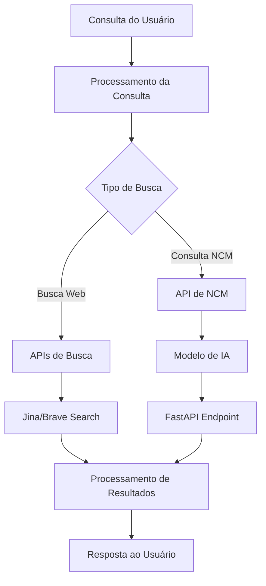
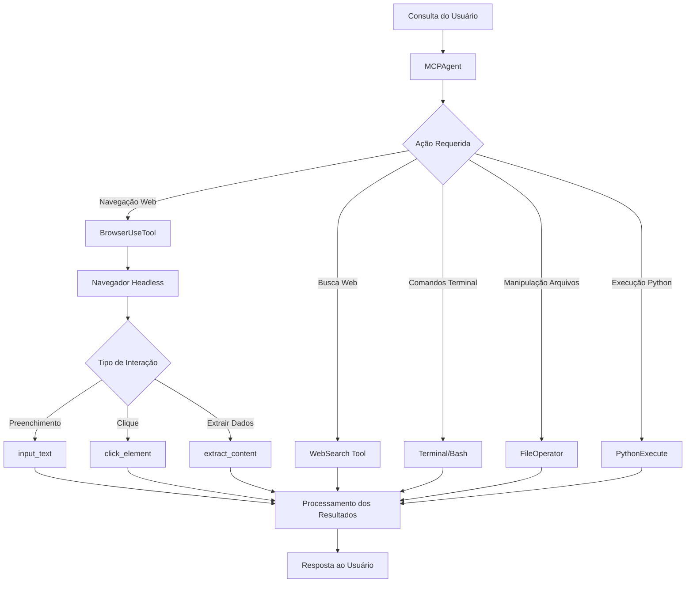

# Análise Comparativa: Buscador Inteligente vs Ferramentas

## Tabela de Conteúdos

- [1. Capacidades e Diferenças Principais](#1-capacidades-e-diferenças-principais)
- [2. Análise Detalhada das Ferramentas](#2-análise-detalhada-das-ferramentas)
- [3. Pipeline de Execução](#3-pipeline-de-execução)
- [4. Respeito às Regras](#4-respeito-às-regras)
- [5. Conclusão](#5-conclusão)

## 1. Capacidades e Diferenças Principais

O projeto "ferramentas" (fastapi/ferramentas) possui recursos de automação web que o "buscador_inteligente" não implementa, especialmente na interação direta com sites e formulários.

### Tabela Comparativa de Funcionalidades

| Funcionalidade                | Buscador Inteligente | Ferramentas               | Observações                                                  |
| ----------------------------- | -------------------- | ------------------------- | ------------------------------------------------------------ |
| Busca na Web                  | ✅ (via APIs)        | ✅ (via APIs e navegador) | Ferramentas utiliza tanto APIs quanto navegação direta       |
| Preenchimento de Formulários  | ❌                   | ✅                        | Ferramentas pode preencher campos em sites reais             |
| Automação de Navegador        | ❌                   | ✅                        | Implementada com browser_use no módulo browser_use_tool.py   |
| Extração de Conteúdo          | ⚠️ (limitado)        | ✅                        | Ferramentas extrai dados estruturados de páginas web         |
| Interação com Elementos       | ❌                   | ✅                        | Pode clicar, rolar e interagir com elementos da página       |
| Pesquisa Semântica            | ✅                   | ✅                        | Ambos implementam busca semântica                            |
| Agentes IA                    | ✅                   | ✅                        | Ambos utilizam agentes de IA, mas com diferentes capacidades |
| Execução Local                | ✅                   | ✅                        | Ambos suportam modelos locais                                |
| Execução de Comandos Terminal | ❌                   | ✅                        | Ferramentas pode executar comandos no sistema                |
| Manipulação de Arquivos       | ⚠️ (limitado)        | ✅                        | Ferramentas tem operações avançadas com arquivos             |
| Execução de Código Python     | ❌                   | ✅                        | Ferramentas pode executar código Python dinamicamente        |

## 2. Análise Detalhada das Ferramentas

### Buscador Inteligente

O "buscador_inteligente" é focado principalmente em pesquisa via APIs e processamento de informações. Suas principais ferramentas são:

#### 1. APIs de Busca

Implementa integrações com diferentes motores de busca:

- **JinaSearch**: Busca semântica via API Jina

  ```typescript
  // jinaSearch.ts
  export function jinaSearch(
    query: string,
    tracker?: TokenTracker
  ): Promise<{ response: SearchResponse; tokens: number }>;
  ```

- **BraveSearch**: Busca via API do Brave

  ```typescript
  // brave-search.ts
  export async function braveSearch(
    query: string
  ): Promise<{ response: BraveSearchResponse }>;
  ```

#### 2. Processamento de Linguagem Natural

Utiliza modelos como Gemini para processar consultas:

```javascript
// De node.log
"provider": {
  "name": "gemini",
  "model": "gemini-2.0-flash"
}
```

#### 3. Consulta NCM

API específica para consultar classificação fiscal (NCM) de produtos:

```markdown
// Do API_DOCUMENTATION.md

- **URL**: `/api/v1/ncm`
- **Método**: `POST`
```

### Ferramentas (Navegador)

O projeto "ferramentas" possui recursos avançados de automação web e manipulação de sistema:

#### 1. BrowserUseTool: Automação de Navegador Completa

Permite interação completa com sites e páginas web:

```python
# browser_use_tool.py
class BrowserUseTool(BaseTool, Generic[Context]):
    name: str = "browser_use"
    description: str = _BROWSER_DESCRIPTION
    parameters: dict = {
        "type": "object",
        "properties": {
            "action": {
                "type": "string",
                "enum": [
                    "go_to_url",
                    "click_element",
                    "input_text",
                    "scroll_down",
                    "scroll_up",
                    "scroll_to_text",
                    "send_keys",
                    "get_dropdown_options",
                    "select_dropdown_option",
                    "go_back",
                    "web_search",
                    "wait",
                    "extract_content",
                    "switch_tab",
                    "open_tab",
                    "close_tab",
                ],
                "description": "The browser action to perform",
            },
            # ...
        }
    }
```

**Principais funcionalidades**:

- **Navegação**: `go_to_url`, `go_back`, `refresh`
- **Interação com elementos**: `click_element`, `input_text`, `scroll_to_text`
- **Gerenciamento de abas**: `switch_tab`, `open_tab`, `close_tab`
- **Extração de conteúdo**: `extract_content`

#### 2. Extração Inteligente de Conteúdo

Capacidade de extrair dados estruturados de páginas web:

```python
# De browser_use_tool.py
elif action == "extract_content":
    if not goal:
        return ToolResult(
            error="Goal is required for 'extract_content' action"
        )
    page = await context.get_current_page()
    try:
        # Get page content and convert to markdown for better processing
        html_content = await page.content()

        # Import markdownify here to avoid global import
        try:
            import markdownify
            content = markdownify.markdownify(html_content)
        except ImportError:
            # Fallback if markdownify is not available
            content = html_content

        # Create prompt for LLM
        prompt_text = """
Your task is to extract the content of the page. You will be given a page and a goal, and you should extract all relevant information around this goal from the page. If the goal is vague, summarize the page. Respond in json format.
Extraction goal: {goal}

Page content:
{page}
"""
```

#### 3. WebSearch: Busca Web Avançada com Fallback

Implementação robusta de busca web com múltiplos motores de busca:

```python
# web_search.py
class WebSearch(BaseTool):
    name: str = "web_search"
    description: str = """Perform a web search and return a list of relevant links.
    This function attempts to use the primary search engine API to get up-to-date results.
    If an error occurs, it falls back to an alternative search engine."""
    _search_engine: dict[str, WebSearchEngine] = {
        "google": GoogleSearchEngine(),
        "baidu": BaiduSearchEngine(),
        "duckduckgo": DuckDuckGoSearchEngine(),
        "bing": BingSearchEngine(),
    }
```

Esta implementação oferece:

- Tentativa automática com múltiplos motores de busca
- Fallback em caso de falha em algum motor específico
- Retry automatizado com backoff exponencial

#### 4. Terminal e Bash: Execução de Comandos

Ferramentas para executar comandos no terminal:

```python
# terminal.py
class Terminal(BaseTool):
    name: str = "execute_command"
    description: str = """Request to execute a CLI command on the system.
Use this when you need to perform system operations or run specific commands to accomplish any step in the user's task.
You must tailor your command to the user's system and provide a clear explanation of what the command does.
"""
```

```python
# bash.py
class Bash(BaseTool):
    """A tool for executing bash commands"""
    name: str = "bash"
    description: str = _BASH_DESCRIPTION
```

#### 5. FileOperator: Manipulação de Arquivos

Interfaces para operações com arquivos em diferentes ambientes:

```python
# file_operators.py
@runtime_checkable
class FileOperator(Protocol):
    """Interface for file operations in different environments."""

    async def read_file(self, path: PathLike) -> str:
        """Read content from a file."""
        ...

    async def write_file(self, path: PathLike, content: str) -> None:
        """Write content to a file."""
        ...

    async def is_directory(self, path: PathLike) -> bool:
        """Check if path points to a directory."""
        ...

    async def exists(self, path: PathLike) -> bool:
        """Check if path exists."""
        ...

    async def run_command(
        self, cmd: str, timeout: Optional[float] = 120.0
    ) -> Tuple[int, str, str]:
        """Run a shell command and return (return_code, stdout, stderr)."""
        ...
```

Implementações disponíveis:

- **LocalFileOperator**: Operações no sistema de arquivos local
- **SandboxFileOperator**: Operações em ambiente sandbox isolado

#### 6. PythonExecute: Execução Dinâmica de Código Python

Ferramenta para executar código Python com isolamento de segurança:

```python
# python_execute.py
class PythonExecute(BaseTool):
    """A tool for executing Python code with timeout and safety restrictions."""

    name: str = "python_execute"
    description: str = "Executes Python code string. Note: Only print outputs are visible, function return values are not captured. Use print statements to see results."
    parameters: dict = {
        "type": "object",
        "properties": {
            "code": {
                "type": "string",
                "description": "The Python code to execute.",
            },
        },
        "required": ["code"],
    }
```

Esta ferramenta permite:

- Execução isolada de código Python em um processo separado
- Controle de timeout para evitar código malicioso ou infinito
- Captura segura de saída (`stdout`) do código executado
- Tratamento de exceções com mensagens amigáveis

Exemplo de implementação:

```python
async def execute(self, code: str, timeout: int = 5) -> Dict:
    """
    Executes the provided Python code with a timeout.

    Args:
        code (str): The Python code to execute.
        timeout (int): Execution timeout in seconds.

    Returns:
        Dict: Contains 'output' with execution output or error message and 'success' status.
    """

    with multiprocessing.Manager() as manager:
        result = manager.dict({"observation": "", "success": False})
        # Configuração de um ambiente seguro com builtins controlados
        if isinstance(__builtins__, dict):
            safe_globals = {"__builtins__": __builtins__}
        else:
            safe_globals = {"__builtins__": __builtins__.__dict__.copy()}
        # Execução em processo separado para controle de timeout
        proc = multiprocessing.Process(
            target=self._run_code, args=(code, result, safe_globals)
        )
        proc.start()
        proc.join(timeout)

        # timeout process
        if proc.is_alive():
            proc.terminate()
            proc.join(1)
            return {
                "observation": f"Execution timeout after {timeout} seconds",
                "success": False,
            }
        return dict(result)
```

## 3. Pipeline de Execução

### Pipeline do Buscador Inteligente



### Pipeline do Ferramentas (Navegador)



## 4. Respeito às Regras

### Análise de Conformidade com as Regras do Projeto

| #   | Regra                                          | Buscador Inteligente | Ferramentas | Observações                                                    |
| --- | ---------------------------------------------- | -------------------- | ----------- | -------------------------------------------------------------- |
| 1   | Tipos organizados no shared-type               | ✅                   | ⚠️          | Buscador usa types/ centralizado, Ferramentas usa tipos locais |
| 2   | Componentes seguem formatação                  | ✅                   | ✅          | Ambos mantêm consistência                                      |
| 3   | Implementação Node só no buscador_inteligente  | ✅                   | ✅          | Ferramentas usa Python como esperado                           |
| 4   | Implementação Python só na pasta fastapi       | ❌                   | ✅          | Buscador tem alguns scripts Python em testes                   |
| 5   | Implementação front só na pasta frontend       | ✅                   | ✅          | Ambos separam frontend adequadamente                           |
| 6   | Estilos usam exclusivamente tokens.css         | ✅                   | ⚠️          | Não avaliado completamente                                     |
| 7   | Ler documentação antes da implementação        | ✅                   | ✅          | Ambos seguem documentação                                      |
| 8   | Implementação completa e correção de erros     | ⚠️                   | ✅          | Ferramentas tem melhor tratamento de erros                     |
| 9   | Entender lógica do projeto antes de alterações | ✅                   | ✅          | Ambos mantêm coerência arquitetural                            |
| 10  | Usar pnpm para comandos                        | ✅                   | N/A         | Aplicável apenas ao Buscador                                   |

### Onde as Regras Não São Implementadas Corretamente

1. **Buscador Inteligente**:

   - Regra 4: Alguns testes usam Python quando deveria ser restrito à pasta fastapi
   - Regra 8: Alguns tratamentos de erro no Buscador são menos robustos

2. **Ferramentas**:

   - Regra 1: A definição de tipos não segue estritamente o padrão shared-type, usando mais definições locais
   - Regra 6: Não é clara a conformidade com tokens.css nas interfaces

## 5. Conclusão

O projeto "buscador_inteligente" é uma ferramenta robusta focada em consultas via APIs e processamento de dados em formato textual, oferecendo uma abordagem eficiente para buscas baseadas em serviços de terceiros. Suas principais forças estão na integração com APIs de busca e no processamento semântico de consultas.

Em contraste, o projeto "ferramentas" representa uma evolução significativa em termos de capacidades, oferecendo um conjunto muito mais amplo de funcionalidades:

1. **Automação Web Avançada**: Permite navegação real em sites, preenchimento de formulários e interação com elementos da página de forma programática
2. **Extração Inteligente de Conteúdo**: Capacidade de converter páginas HTML em formatos estruturados e extrair informações específicas
3. **Sistema de Fallback Robusto**: Implementações com múltiplos motores de busca e tratamento de erros sofisticado
4. **Interação com Sistema**: Ferramentas para execução de comandos e manipulação de arquivos
5. **Execução de Código Python**: Capacidade de executar código Python dinamicamente com proteções de segurança

A principal diferença está na capacidade do "ferramentas" de efetivamente navegar em sites como um usuário real, enquanto o "buscador_inteligente" limita-se a consultas via APIs. Isso torna o "ferramentas" muito mais versátil para tarefas que exigem interação com interfaces web, como preenchimento de formulários NCM e consultas em sistemas que não possuem APIs públicas.

Para aplicações que necessitam de automação web genuína, o projeto "ferramentas" é claramente a opção mais adequada, oferecendo um conjunto completo de funcionalidades para navegação, interação e extração de dados. Esta abordagem permitiria, por exemplo, acessar e preencher formulários em sites governamentais ou portais que não oferecem APIs, ampliando significativamente o escopo de automação possível.
