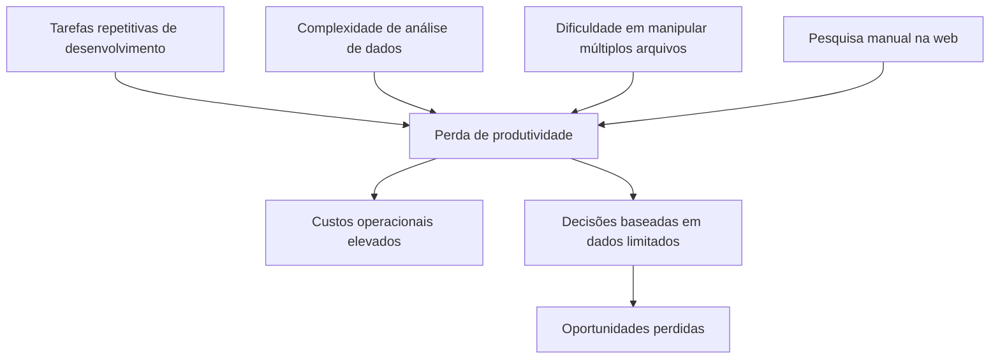
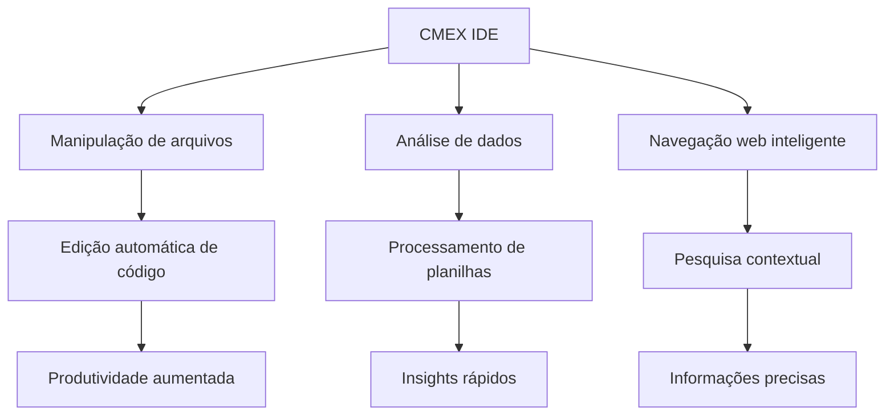
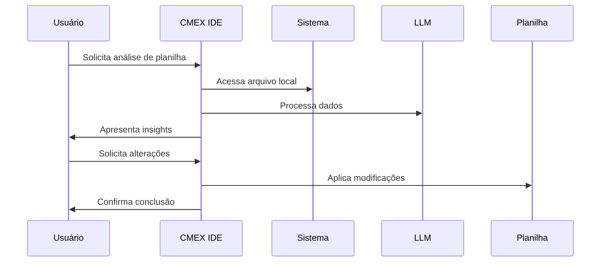
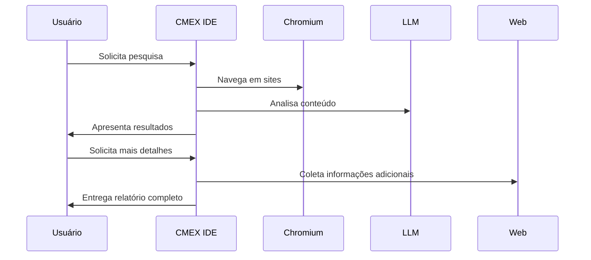
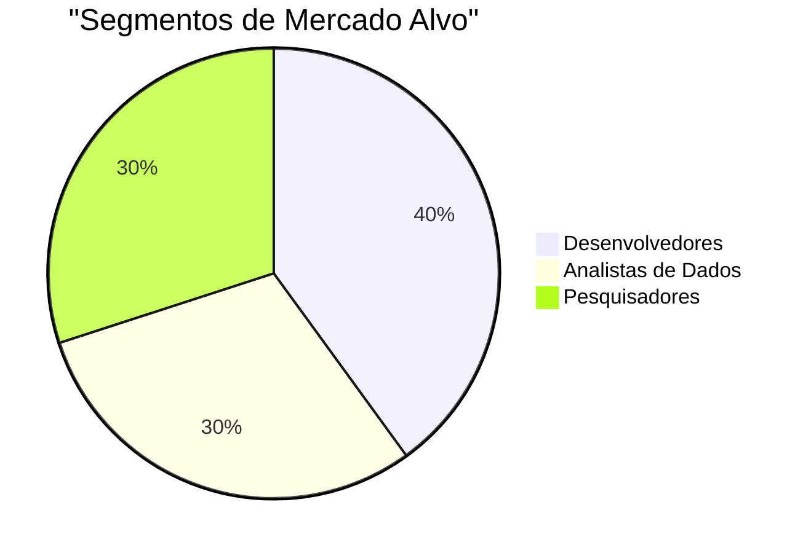
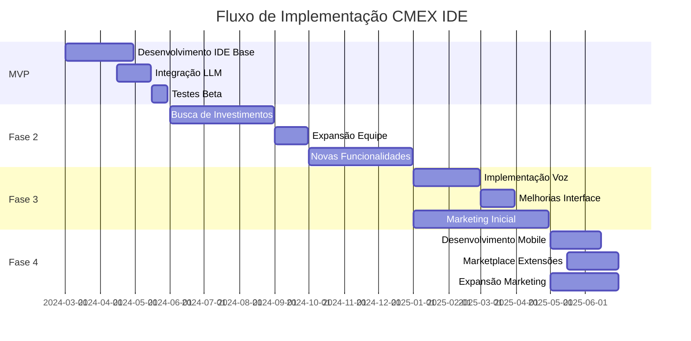

# IDE Inteligente CMEX (CMEX IDE)

## Índice

1. [Visão Geral](#visão-geral)
2. [Problema e Solução](#problema-e-solução)
3. [Casos de Uso](#casos-de-uso)
4. [Mercado e Oportunidade](#mercado-e-oportunidade)
5. [Diferencial Competitivo](#diferencial-competitivo)
6. [Modelo de Negócio](#modelo-de-negócio)
7. [Estratégia de Lançamento](#estratégia-de-lançamento)
8. [Projeção Financeira](#projeção-financeira)
9. [Infraestrutura e Custos](#infraestrutura-e-custos)
10. [Roadmap](#roadmap)
11. [Equipe e Contato](#equipe-e-contato)

## Visão Geral

**CMEX IDE** é uma IDE inteligente baseada no VSCode e Cursor, que utiliza IA generativa para automatizar tarefas de desenvolvimento, manipulação de arquivos, análise de dados e navegação web. O agente atua como um assistente virtual avançado que compreende comandos em linguagem natural e executa ações complexas diretamente no ambiente de desenvolvimento do usuário.

## Problema e Solução

### O Problema

- Desenvolvedores gastam horas em tarefas repetitivas de código
- Análise de dados exige múltiplas ferramentas e conhecimentos
- Integração entre diferentes tipos de arquivos é complexa
- Pesquisa e coleta de informações é manual e demorada

### A Solução

- IDE baseada em VSCode/Cursor com capacidades de IA
- Motor Chromium integrado para navegação web
- Processamento de planilhas e arquivos locais
- Interface amigável para automação de tarefas

## Casos de Uso

### Caso 1: Análise e Manipulação de Planilhas

**Desafio:** Análise manual de grandes volumes de dados em planilhas.

**Solução CMEX IDE:**

### Caso 2: Pesquisa Profunda na Web

**Desafio:** Coleta e análise manual de informações da web.

**Solução CMEX IDE:**

## Mercado e Oportunidade

### Dados do Mercado

- Mercado global de IDEs em crescimento acelerado
- Demanda por automação em desenvolvimento
- Necessidade de análise de dados integrada
- Busca por produtividade em desenvolvimento

### Oportunidade

## Diferencial Competitivo

### Vantagens Únicas

- **Integração com VSCode/Cursor**: Familiaridade e compatibilidade
- **Automação Local**: Processamento direto nos arquivos do usuário
- **Navegação Web Inteligente**: Motor Chromium integrado
- **Preço Competitivo**: R$ 99/mês por usuário

### Comparativo com Concorrentes

| Funcionalidade          | CMEX IDE | Manus AI | GitHub Copilot |
| ----------------------- | -------- | -------- | -------------- |
| Edição de Código        | ✓        | ✓        | ✓              |
| Manipulação de Arquivos | ✓        | ⨯        | ⨯              |
| Navegação Web           | ✓        | ⨯        | ⨯              |
| Análise de Dados        | ✓        | ⨯        | ⨯              |
| Preço Mensal (R$)       | 99       | 299      | 99             |

## Modelo de Negócio

### Monetização

- **Plano Mensal**: R$ 99/mês por usuário
- **Plano Anual**: R$ 990/ano (2 meses grátis)
- **Plano Empresarial**: Preços personalizados

### Ciclo de Vendas

## Estratégia de Lançamento

### Fase 1: MVP (30 de Maio)

- Desenvolvimento da IDE base
- Integração com LLM Qwen2.5-7B
- Funcionalidades de manipulação de arquivos
- Análise de planilhas
- Navegação web básica

### Fase 2: Investimento (Junho - Dezembro)

- Busca de investimentos
- Expansão da equipe
- Desenvolvimento de novas funcionalidades
- Marketing e aquisição de usuários

## Projeção Financeira

### Custos de Desenvolvimento

#### Fase 1 (MVP - 30 de Maio)

- Desenvolvedor Principal (50h/semana): R$ 12.000/mês
- Desenvolvedor Frontend (20h/semana): R$ 4.000/mês
- Total Fase 1: R$ 16.000/mês

#### Fase 2 (Junho - Dezembro)

- Desenvolvedor Principal (Full-time): R$ 12.000/mês
- Desenvolvedor Frontend (20h/semana): R$ 4.000/mês
- Total Fase 2: R$ 16.000/mês

#### Fase 3 (Janeiro - Abril 2025)

- Desenvolvedor Principal (Full-time): R$ 12.000/mês
- Desenvolvedor Frontend (Full-time): R$ 4.000/mês
- Closer: R$ 2.000/mês + comissão
- Total Fase 3: R$ 18.000/mês

#### Fase 4 (Maio - Junho 2025)

- Desenvolvedor Principal (Full-time): R$ 12.000/mês
- Desenvolvedor Frontend (Full-time): R$ 4.000/mês
- Closer: R$ 2.000/mês + comissão
- Total Fase 4: R$ 18.000/mês

### Fluxo de Implementação

### Estratégia de Vendas e Marketing

#### Canais de Vendas

1. **Vendas Diretas**

   - SDR (Sales Development Representative)
     - Prospecção ativa via LinkedIn
     - Cold calling para empresas de tecnologia
     - Email marketing segmentado
   - Closer
     - Demonstrações personalizadas
     - Negociação de contratos
     - Onboarding de clientes

2. **Marketing Digital**

   - SEO e Conteúdo
     - Blog técnico
     - Tutoriais em vídeo
     - Documentação detalhada
   - Redes Sociais
     - LinkedIn (foco em desenvolvedores)
     - Twitter (comunidade tech)
     - GitHub (código aberto)

3. **Parcerias**

   - Influenciadores Tech
     - YouTubers de programação
     - Streamers de desenvolvimento
     - Bloggers técnicos
   - Comunidades
     - Discord de desenvolvedores
     - Grupos de WhatsApp
     - Fóruns especializados

4. **Eventos**

   - Meetups locais
   - Conferências de tecnologia
   - Webinars técnicos

#### Influenciadores Alvo

1. **Desenvolvimento**

   - Filipe Deschamps
   - Rocketseat
   - Alura
   - Cod3r
   - Dev Soutinho

2. **Produtividade**

   - Tiago Brunet
   - Christian Barbosa
   - Gustavo Cerbasi

3. **Tecnologia**

   - TecMundo
   - Olhar Digital
   - Canaltech

### Custos Mensais Estimados

| Item                | Custo Mensal (R$) |
| ------------------- | ----------------- |
| LLM (1M tokens/dia) | 1.125             |
| Vercel              | 500               |
| Desenvolvimento     | 16.000            |
| Marketing           | 5.000             |
| Closer              | 2.000             |
| **Total**           | **24.625**        |

## Infraestrutura e Custos

### Infraestrutura

- **LLM**: Qwen2.5-7B no OpenRouter
- **Frontend**: Vercel
- **Downloads**: Vercel
- **IDE**: Electron + VSCode/Cursor

### Custos Mensais Estimados

| Item                | Custo Mensal (R$) |
| ------------------- | ----------------- |
| LLM (1M tokens/dia) | 1.125             |
| Vercel              | 500               |
| Desenvolvimento     | 16.000            |
| Marketing           | 5.000             |
| Closer              | 2.000             |
| **Total**           | **24.625**        |

## Roadmap

### Curto Prazo (MVP - 30 de Maio)

- IDE base com VSCode/Cursor
- Integração com LLM
- Manipulação de arquivos
- Análise de planilhas
- Navegação web básica

### Médio Prazo (30 de Abril 2025)

- Implementação de voz
- Melhorias na interface
- Novas funcionalidades de automação

### Longo Prazo (30 de Junho 2025)

- Versão mobile
- Marketplace de extensões
- Integrações avançadas

## Equipe e Contato

### Nossa Equipe

- Desenvolvedor Principal (50h/semana)
- Desenvolvedor Frontend (20h/semana)

### Próximos Passos

- Desenvolvimento do MVP
- Testes com usuários beta
- Busca de investimentos

### Custos Totais Projetados (12 de Abril - Dezembro 2024)

| Mês       | Desenvolvimento | Marketing     | Closer        | LLM          | Vercel       | Ferramentas  | Novas Implementações      | Total          |
| :-------- | :-------------- | :------------ | :------------ | :----------- | :----------- | :----------- | :------------------------ | :------------- | --- | --- | --- | --- |
| Abr       | R$ 3.600\*      | R$ 2.500      | -             | R$ 562       | R$ 250       | R$ 1.000     | -                         | R$ 7.912       |     |     |     |     |
| Mai       | R$ 7.200\*      | R$ 5.000      | -             | R$ 1.125     | R$ 500       | R$ 2.000     | -                         | R$ 15.825      |     |     |     |     |
| Jun       | R$ 16.000       | R$ 5.000      | R$ 2.000      | R$ 1.125     | R$ 500       | -            | R$ 3.000 (Integração MCP) | R$ 27.625      |     |     |     |     |
| Jul       | R$ 16.000       | R$ 5.000      | R$ 2.000      | R$ 1.125     | R$ 500       | -            | R$ 3.000 (Integração MCP) | R$ 27.625      |     |     |     |     |
| Ago       | R$ 16.000       | R$ 5.000      | R$ 2.000      | R$ 1.125     | R$ 500       | -            | R$ 3.000 (Integração MCP) | R$ 27.625      |     |     |     |     |
| Set       | R$ 16.000       | R$ 5.000      | R$ 2.000      | R$ 1.125     | R$ 500       | -            | R$ 5.000 (Chat por Voz)   | R$ 29.625      |     |     |     |     |
| Out       | R$ 16.000       | R$ 5.000      | R$ 2.000      | R$ 1.125     | R$ 500       | -            | R$ 5.000 (Chat por Voz)   | R$ 29.625      |     |     |     |     |
| Nov       | R$ 16.000       | R$ 5.000      | R$ 2.000      | R$ 1.125     | R$ 500       | -            | R$ 5.000 (Chat por Voz)   | R$ 29.625      |     |     |     |     |
| Dez       | R$ 16.000       | R$ 5.000      | R$ 2.000      | R$ 1.125     | R$ 500       | -            | R$ 5.000 (Chat por Voz)   | R$ 29.625      |     |     |     |     |
| **Total** | **R$ 123.800**  | **R$ 42.500** | **R$ 14.000** | **R$ 9.562** | **R$ 3.750** | **R$ 3.000** | **R$ 24.000**             | **R$ 220.612** |     |     |     |     |

\*Desenvolvedor Principal (30h/semana): R$ 7.200/mês
Desenvolvedor Frontend (20h/semana): R$ 4.000/mês

#### Detalhamento das Ferramentas (Abril-Maio)

- Cursor Pro: R$ 500/mês
- Ambiente de Testes: R$ 1.000/mês
- Outras Ferramentas: R$ 500/mês
- Total: R$ 2.000/mês

#### Detalhamento das Novas Implementações

1. **Integração MCP (Junho-Agosto)**

   - Desenvolvimento de visão computacional
   - Integração com dispositivos
   - Automação de sistemas
   - Custo total: R$ 9.000

2. **Chat por Voz (Setembro-Dezembro)**

   - Desenvolvimento de reconhecimento de voz
   - Síntese de voz
   - Integração com LLM
   - Custo total: R$ 20.000

#### Projeção de Receita (Abril-Dezembro)

| Mês       | Usuários | Receita Mensal (R$) |
| :-------- | :------- | :------------------ |
| Abr       | 0        | 0                   |
| Mai       | 50       | 4.950               |
| Jun       | 100      | 9.900               |
| Jul       | 200      | 19.800              |
| Ago       | 400      | 39.600              |
| Set       | 600      | 59.400              |
| Out       | 800      | 79.200              |
| Nov       | 1.000    | 99.000              |
| Dez       | 1.200    | 118.800             |
| **Total** |          | **R$ 430.650**      |

**Saldo Projetado: R$ 209.938**
