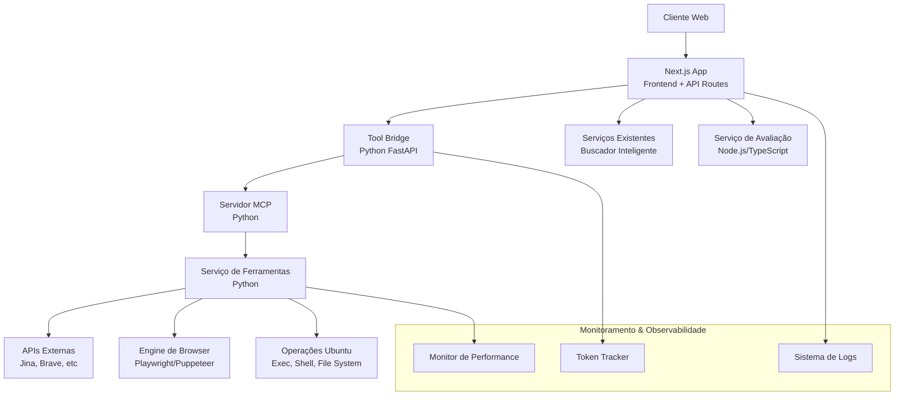
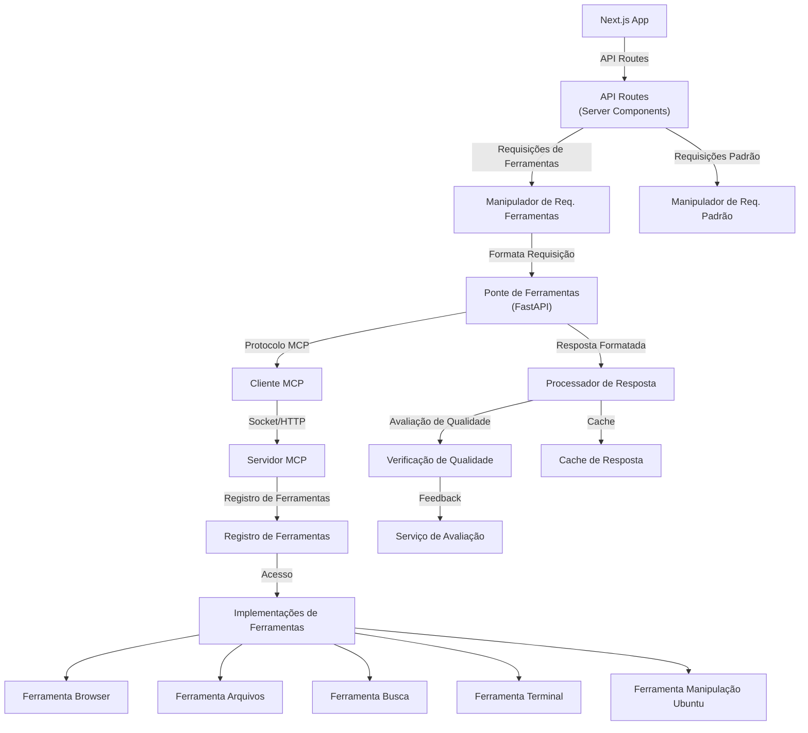
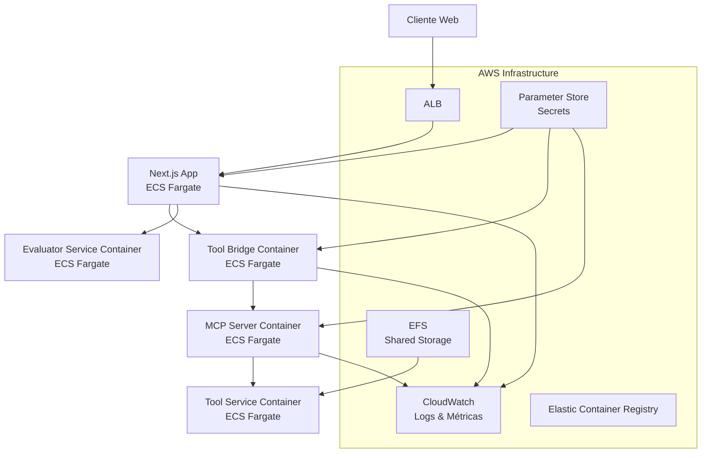

# Estrutura do Projeto de Integração de Ferramentas

Este documento define a estrutura do projeto de integração de ferramentas, com base nos conceitos e recursos identificados nos projetos existentes. O objetivo é criar uma solução MVP que possa funcionar tanto localmente quanto na AWS, priorizando o funcionamento real sobre a arquitetura perfeita.

## Arquivos de Referência

Abaixo estão os arquivos dos projetos existentes que servirão como referência para nossa implementação:

### Tipos e Interfaces

| Arquivo                          | Caminho Original                                | Descrição                                        |
| -------------------------------- | ----------------------------------------------- | ------------------------------------------------ |
| Types para mensagens             | `fastapi/ferramentas/app/schema.py`             | Definições de tipos para mensagens e comunicação |
| Types para ações                 | `node-DeepResearch-jina/src/types.ts`           | Sistema de tipagem baseado em ações              |
| Interfaces de ferramenta         | `fastapi/ferramentas/app/tool/base.py`          | Interface base para ferramentas                  |
| Interface de requisição/resposta | `buscador_inteligente/src/types/globalTypes.ts` | Interfaces para requisições e respostas da API   |

### Componentes e Serviços

| Arquivo                | Caminho Original                                    | Descrição                                   |
| ---------------------- | --------------------------------------------------- | ------------------------------------------- |
| Token Tracker          | `node-DeepResearch-jina/src/utils/token-tracker.ts` | Sistema de rastreamento de tokens           |
| MCP Agent              | `fastapi/ferramentas/app/agent/mcp.py`              | Agente MCP para comunicação com ferramentas |
| Ferramentas de browser | `fastapi/ferramentas/app/tool/browser_use_tool.py`  | Implementação de automação web              |
| Sistema de avaliação   | `node-DeepResearch-jina/src/tools/evaluator.ts`     | Avaliação de qualidade das respostas        |

### Configurações

| Arquivo                | Caminho Original                        | Descrição                                         |
| ---------------------- | --------------------------------------- | ------------------------------------------------- |
| Configuração de modelo | `node-DeepResearch-jina/config.json`    | Configuração flexível de modelos e provedores     |
| Configuração MCP       | `fastapi/ferramentas/app/mcp/server.py` | Servidor MCP para disponibilização de ferramentas |
| API endpoints          | `buscador_inteligente/src/server.ts`    | Definição de endpoints da API                     |

## Estrutura do Monorepo

```
integration-monorepo/
├── README.md
├── package.json
├── docker-compose.yml
├── .github/
│   └── workflows/
│       ├── ci.yml
│       └── deploy.yml
├── packages/
│   ├── shared-types/
│   │   ├── src/
│   │   │   ├── action-types.ts
│   │   │   ├── api-types.ts
│   │   │   ├── tool-types.ts
│   │   │   ├── model-types.ts
│   │   │   └── index.ts
│   │   ├── package.json
│   │   └── tsconfig.json
│   ├── next-app/
│   │   ├── src/
│   │   │   ├── app/
│   │   │   │   ├── api/
│   │   │   │   │   ├── tools/
│   │   │   │   │   │   └── route.ts
│   │   │   │   │   ├── chat/
│   │   │   │   │   │   └── route.ts
│   │   │   │   │   └── status/
│   │   │   │   │       └── route.ts
│   │   │   │   ├── (chat)/
│   │   │   │   │   ├── page.tsx
│   │   │   │   │   ├── layout.tsx
│   │   │   │   │   └── components/
│   │   │   │   ├── page.tsx
│   │   │   │   └── layout.tsx
│   │   │   ├── components/
│   │   │   │   ├── ui/
│   │   │   │   └── chat/
│   │   │   ├── lib/
│   │   │   │   ├── tool-client.ts
│   │   │   │   ├── mcp-client.ts
│   │   │   │   └── utils.ts
│   │   │   └── types/
│   │   ├── public/
│   │   ├── Dockerfile
│   │   ├── next.config.js
│   │   ├── package.json
│   │   └── tsconfig.json
│   ├── tool-service/
│   │   ├── app/
│   │   │   ├── agent/
│   │   │   ├── tools/
│   │   │   │   ├── browser.py
│   │   │   │   ├── search.py
│   │   │   │   ├── terminal.py
│   │   │   │   ├── ubuntu.py
│   │   │   │   └── base.py
│   │   │   ├── schemas/
│   │   │   ├── utils/
│   │   │   └── main.py
│   │   ├── Dockerfile
│   │   ├── requirements.txt
│   │   └── pyproject.toml
│   └── tool-bridge/
│       ├── src/
│       │   ├── bridge/
│       │   ├── adapters/
│       │   ├── monitoring/
│       │   └── main.py
│       ├── Dockerfile
│       ├── requirements.txt
│       └── pyproject.toml
├── services/
│   ├── mcp-server/
│   │   ├── src/
│   │   ├── Dockerfile
│   │   └── requirements.txt
│   └── evaluator-service/
│       ├── src/
│       ├── Dockerfile
│       └── package.json
└── tools/
    ├── dev-scripts/
    ├── schema-validator/
    └── test-utils/
```

## Diagramas de Arquitetura

### Arquitetura Geral



### Arquitetura Detalhada do Backend



## JSONs Unificados

### Requisição Unificada (UnifiedRequest)

```json
{
  "query": "Como funciona a declaração de importação?",
  "modelConfig": {
    "modelName": "gemini-2.0-flash",
    "provider": "google",
    "temperature": 0.2,
    "maxTokens": 1000,
    "toolChoice": "auto"
  },
  "context": {
    "sessionId": "sess_12345",
    "previousMessages": [
      { "role": "user", "content": "Preciso fazer uma importação" },
      {
        "role": "assistant",
        "content": "Posso ajudar com isso. Qual tipo de importação?"
      }
    ]
  },
  "tools": {
    "required": false,
    "allowedTools": ["browser", "search", "read", "ubuntu"],
    "forceToolUse": false
  },
  "domainSpecific": {
    "estadoOrigem": "SP",
    "operacao": "importacao",
    "regimeTributario": "simples"
  }
}
```

### Resposta Unificada (UnifiedResponse)

```json
{
  "responseId": "resp_67890",
  "query": "Como funciona a declaração de importação?",
  "content": "Para fazer uma declaração de importação (DI), você precisa seguir estes passos...",
  "contentType": "markdown",
  "tools": [
    {
      "used": true,
      "toolName": "search",
      "toolInput": {
        "query": "processo declaração importação receita federal"
      },
      "toolOutput": { "results": [{ "title": "...", "url": "..." }] }
    },
    {
      "used": true,
      "toolName": "browser",
      "toolInput": { "action": "visit", "url": "https://www.gov.br/..." },
      "toolOutput": { "success": true, "extracted": "..." }
    }
  ],
  "metadata": {
    "model": "gemini-2.0-flash",
    "executionTime": 2345,
    "tokens": {
      "input": 256,
      "output": 512,
      "total": 768
    }
  },
  "references": [
    {
      "url": "https://www.gov.br/receitafederal/...",
      "title": "Declaração de Importação - Receita Federal",
      "quote": "A Declaração de Importação (DI) é o documento base do despacho de importação..."
    }
  ]
}
```

### Configuração Unificada (UnifiedConfig)

```json
{
  "serviceDefaults": {
    "timeout": 30000,
    "retries": 3,
    "cacheTime": 3600
  },
  "providers": {
    "google": {
      "apiKey": "${GOOGLE_API_KEY}",
      "endpoints": {
        "default": "https://generativelanguage.googleapis.com/v1"
      },
      "models": {
        "default": "gemini-2.0-flash",
        "alternatives": ["gemini-2.0-pro"]
      }
    },
    "openai": {
      "apiKey": "${OPENAI_API_KEY}",
      "models": {
        "default": "gpt-4o-mini",
        "alternatives": ["gpt-4o", "gpt-3.5-turbo"]
      }
    },
    "local": {
      "endpoint": "http://localhost:8000/v1",
      "models": {
        "default": "llama-3-8b",
        "alternatives": ["qwen2-7b"]
      }
    }
  },
  "tools": {
    "browser": {
      "enabled": true,
      "headless": true,
      "timeout": 60000,
      "userAgent": "Mozilla/5.0...",
      "defaultViewport": { "width": 1280, "height": 720 }
    },
    "search": {
      "primaryProvider": "jina",
      "fallbackProvider": "brave",
      "maxResults": 10
    },
    "terminal": {
      "enabled": true,
      "allowedCommands": ["ls", "cat", "find", "grep"],
      "workingDirectory": "${APP_WORKING_DIR}"
    },
    "ubuntu": {
      "enabled": true,
      "safeMode": true,
      "allowRoot": false,
      "allowedOperations": [
        "fileRead",
        "fileWrite",
        "processExec",
        "systemInfo"
      ],
      "blockedPaths": ["/etc/passwd", "/etc/shadow", "/root"]
    }
  }
}
```

## Tecnologias e Linguagens

| Componente        | Tecnologia Principal       | Justificativa                                                                                                 |
| ----------------- | -------------------------- | ------------------------------------------------------------------------------------------------------------- |
| Frontend + API    | Next.js (React/TypeScript) | Unifica frontend e API routes, oferece SSR/SSG, App Router e permite isolamento do backend para acesso Ubuntu |
| Tool Bridge       | Python/FastAPI             | Ótimo para APIs de alto desempenho, integração fácil com o servidor MCP existente                             |
| MCP Server        | Python                     | Reutilização do código existente do projeto ferramentas                                                       |
| Tool Service      | Python                     | Melhor compatibilidade com o Ubuntu para automação do sistema e tarefas de baixo nível                        |
| Shared Types      | TypeScript                 | Definições de tipo fortes e geração automatizada de esquemas JSON                                             |
| Evaluator Service | Node.js/TypeScript         | Boa integração com modelos LLM e processamento de texto                                                       |

## Implementação Next.js

### Estrutura da Aplicação Next.js

A aplicação Next.js seguirá o App Router e terá a seguinte estrutura:

```
next-app/
├── src/
│   ├── app/
│   │   ├── api/                  # API Routes para backend
│   │   │   ├── tools/            # Endpoint de ferramentas
│   │   │   │   └── route.ts
│   │   │   ├── chat/             # Endpoint de chat
│   │   │   │   └── route.ts
│   │   │   └── status/           # Endpoints de status e health check
│   │   │       └── route.ts
│   │   ├── (chat)/               # Rota agrupada para a interface de chat
│   │   │   ├── page.tsx
│   │   │   └── components/
│   │   └── page.tsx              # Página principal
│   ├── components/               # Componentes React compartilhados
│   │   ├── ui/
│   │   └── chat/
│   └── lib/                      # Funções de utilidade e clientes
│       ├── tool-client.ts        # Cliente para comunicação com Tool Bridge
│       └── mcp-client.ts         # Cliente para comunicação direta com MCP
```

### API Routes Next.js

```typescript
// src/app/api/tools/route.ts
import { NextRequest, NextResponse } from "next/server";
import { ToolClient } from "@/lib/tool-client";

export async function POST(request: NextRequest) {
  try {
    const body = await request.json();
    const { query, modelConfig, tools } = body;

    // Inicializa cliente de ferramentas
    const toolClient = new ToolClient({
      bridgeUrl: process.env.TOOL_BRIDGE_URL || "http://localhost:8000",
    });

    // Executa a requisição de ferramenta
    const result = await toolClient.executeTools(body);

    // Retorna resposta formatada
    return NextResponse.json(result);
  } catch (error) {
    console.error("Error in tools API:", error);
    return NextResponse.json(
      { error: "Failed to process tool request" },
      { status: 500 }
    );
  }
}
```

### Cliente de Ferramentas

```typescript
// src/lib/tool-client.ts
import { UnifiedRequest, UnifiedResponse } from "@/types";

export class ToolClient {
  private bridgeUrl: string;

  constructor(config: { bridgeUrl: string }) {
    this.bridgeUrl = config.bridgeUrl;
  }

  async executeTools(request: UnifiedRequest): Promise<UnifiedResponse> {
    const response = await fetch(`${this.bridgeUrl}/execute`, {
      method: "POST",
      headers: {
        "Content-Type": "application/json",
        Authorization: `Bearer ${process.env.TOOL_BRIDGE_TOKEN}`,
      },
      body: JSON.stringify(request),
    });

    if (!response.ok) {
      const error = await response.text();
      throw new Error(`Failed to execute tools: ${error}`);
    }

    return await response.json();
  }
}
```

## Ambiente Local vs. AWS

### Ambiente Local

Para execução local, usaremos:

- Docker Compose para orquestração dos serviços
- Volumes para compartilhamento de arquivos
- Redes Docker para comunicação entre serviços
- Variáveis de ambiente para configuração

```yaml
# docker-compose.yml (simplificado)
version: "3.8"

services:
  next-app:
    build: ./packages/next-app
    ports:
      - "3001:3001"
    environment:
      - TOOL_BRIDGE_URL=http://tool-bridge:8000
      - EVALUATOR_URL=http://evaluator-service:5000
      - NEXT_PUBLIC_API_BASE_URL=http://localhost:3001/api
    volumes:
      - ./shared:/app/shared

  tool-bridge:
    build: ./packages/tool-bridge
    ports:
      - "8000:8000"
    environment:
      - MCP_SERVER_URL=http://mcp-server:9000
    volumes:
      - ./shared:/app/shared

  mcp-server:
    build: ./services/mcp-server
    ports:
      - "9000:9000"
    volumes:
      - ./shared:/app/shared

  tool-service:
    build: ./packages/tool-service
    volumes:
      - ./shared:/app/shared
      # Volume para acesso a recursos do Ubuntu (quando necessário)
      - /var/run/docker.sock:/var/run/docker.sock
      - /tmp:/tmp/host

  evaluator-service:
    build: ./services/evaluator-service
    ports:
      - "5000:5000"
```

### Ambiente AWS

Para deployment na AWS, utilizaremos:

- **ECS Fargate** para os contêineres
- **ALB** para gerenciamento do tráfego HTTP
- **ECR** para registro dos contêineres
- **Parameter Store** para gerenciamento de secrets
- **CloudWatch** para logs e monitoramento



## Manipulação do Ubuntu

Para manipular o Ubuntu de forma segura e eficiente, utilizaremos:

1. **Python Tool Service**:

   - Serviço Python dedicado que utilizará `subprocess`, `os` e `pathlib` para interagir com o sistema Ubuntu
   - Implementado como ferramenta no MCP Server

2. **Ferramenta Ubuntu**:

   ```python
   # packages/tool-service/app/tools/ubuntu.py
   import os
   import subprocess
   from pathlib import Path
   from typing import List, Dict, Any, Optional

   from app.tools.base import BaseTool, ToolResult

   class UbuntuTool(BaseTool):
       name: str = "ubuntu"
       description: str = "Execute operations on Ubuntu system, including file and process operations"

       # Lista de comandos permitidos para execução
       ALLOWED_COMMANDS = ["ls", "cat", "find", "grep", "ps", "df", "du"]
       # Diretórios bloqueados para segurança
       BLOCKED_PATHS = ["/etc/passwd", "/etc/shadow", "/root"]

       def is_safe_path(self, path: str) -> bool:
           """Verifica se um caminho é seguro para acesso"""
           path = os.path.abspath(path)
           return not any(path.startswith(blocked) for blocked in self.BLOCKED_PATHS)

       async def execute_command(self, command: str, args: List[str]) -> ToolResult:
           """Executa um comando do sistema de forma segura"""
           if command not in self.ALLOWED_COMMANDS:
               return ToolResult(error=f"Command not allowed: {command}")

           try:
               # Executa o comando com timeout para segurança
               process = await asyncio.create_subprocess_exec(
                   command, *args,
                   stdout=asyncio.subprocess.PIPE,
                   stderr=asyncio.subprocess.PIPE
               )
               stdout, stderr = await asyncio.wait_for(process.communicate(), timeout=30.0)

               if process.returncode != 0:
                   return ToolResult(
                       error=f"Command failed with code {process.returncode}: {stderr.decode()}"
                   )

               return ToolResult(output=stdout.decode())

           except asyncio.TimeoutError:
               return ToolResult(error="Command execution timed out")
           except Exception as e:
               return ToolResult(error=f"Error executing command: {str(e)}")

       async def read_file(self, path: str) -> ToolResult:
           """Lê o conteúdo de um arquivo de forma segura"""
           if not self.is_safe_path(path):
               return ToolResult(error=f"Access to path is not allowed: {path}")

           try:
               with open(path, 'r') as f:
                   content = f.read()
               return ToolResult(output=content)
           except Exception as e:
               return ToolResult(error=f"Error reading file: {str(e)}")

       async def execute(self, **kwargs) -> ToolResult:
           """Executa a ferramenta baseada na operação solicitada"""
           operation = kwargs.get("operation")

           if operation == "exec_command":
               command = kwargs.get("command")
               args = kwargs.get("args", [])
               return await self.execute_command(command, args)

           elif operation == "read_file":
               path = kwargs.get("path")
               return await self.read_file(path)

           # Adicionar outras operações conforme necessário

           return ToolResult(error=f"Unsupported operation: {operation}")
   ```

3. **Chamada da ferramenta via Next.js**:

   ```typescript
   // Exemplo de chamada via Next.js API Route
   const ubuntuToolRequest = {
     query: "Liste os arquivos na pasta /home/user",
     tools: {
       required: true,
       allowedTools: ["ubuntu"],
       forceToolUse: true,
     },
     toolParams: {
       ubuntu: {
         operation: "exec_command",
         command: "ls",
         args: ["-la", "/home/user"],
       },
     },
   };

   const result = await toolClient.executeTools(ubuntuToolRequest);
   ```

## Mapa de Testes

### Estratégia de Testes

Adotaremos uma abordagem multi-camada para testes:

1. **Testes Unitários**: Para componentes individuais
2. **Testes de Integração**: Para interação entre componentes
3. **Testes de Sistema**: Para fluxos completos end-to-end
4. **Testes de Desempenho**: Para garantir resposta em tempo adequado

### Ferramentas de Teste

| Tipo de Teste | Serviço              | Ferramentas                 |
| ------------- | -------------------- | --------------------------- |
| Unitários     | Next.js App          | Jest, React Testing Library |
| Unitários     | Tool Bridge          | Pytest, FastAPI TestClient  |
| Unitários     | Tool Service         | Pytest, unittest.mock       |
| Integração    | Multi-serviço        | Postman Collections, Newman |
| Sistema       | End-to-end           | Playwright, Cypress         |
| Desempenho    | Next.js, Tool Bridge | k6, Artillery               |

### Estrutura dos Testes

```
integration-monorepo/
├── packages/
│   ├── next-app/
│   │   ├── __tests__/
│   │   │   ├── unit/
│   │   │   ├── integration/
│   │   │   └── e2e/
│   ├── tool-bridge/
│   │   ├── tests/
│   │   │   ├── unit/
│   │   │   └── integration/
├── tests/
│   ├── e2e/
│   │   ├── scenarios/
│   │   └── fixtures/
│   ├── performance/
│   └── security/
```

## Medidas de Fallback

Implementaremos medidas robustas de fallback para garantir a resiliência do sistema:

1. **Fallback de Modelo**:

   - Se o modelo principal falhar, tentar modelos alternativos automaticamente
   - Exemplo: de gemini-2.0-pro → gemini-2.0-flash → gpt-4o → gpt-3.5-turbo

2. **Fallback de Ferramenta**:

   - Se uma ferramenta falhar, tentar alternativas
   - Exemplo: browser falha → usar search, search falha → usar leitura de cache

3. **Fallback de Provedor de Busca**:

   - Suporte a múltiplos provedores de busca com failover automático
   - Jina → Brave → DuckDuckGo

4. **Fallback de Timeout**:

   - Respostas parciais em caso de timeout de ferramentas
   - Retorno proativo de resultados parciais para manter responsividade

5. **Circuit Breaker**:

   - Implementação de circuit breakers para evitar sobrecarga de serviços com falha
   - Auto-recuperação após períodos de cooldown

## Próximos Passos

1. **MVP Fase 1**: Configuração do monorepo e estrutura base com Next.js
2. **MVP Fase 2**: Implementação do Next.js (frontend + API routes) e comunicação com Tool Bridge
3. **MVP Fase 3**: Integração com MCP Server e implementação das primeiras ferramentas, incluindo a ferramenta Ubuntu
4. **MVP Fase 4**: Implementação do sistema de avaliação e medidas de fallback
5. **MVP Fase 5**: Testes end-to-end e preparação para deploy na AWS
