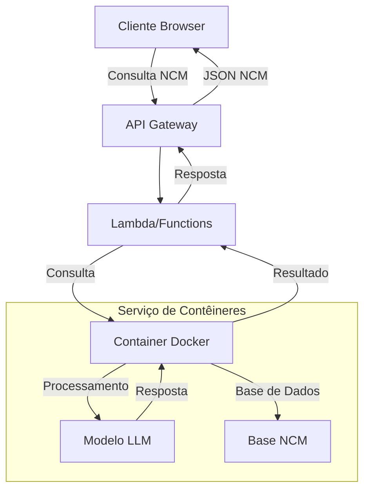
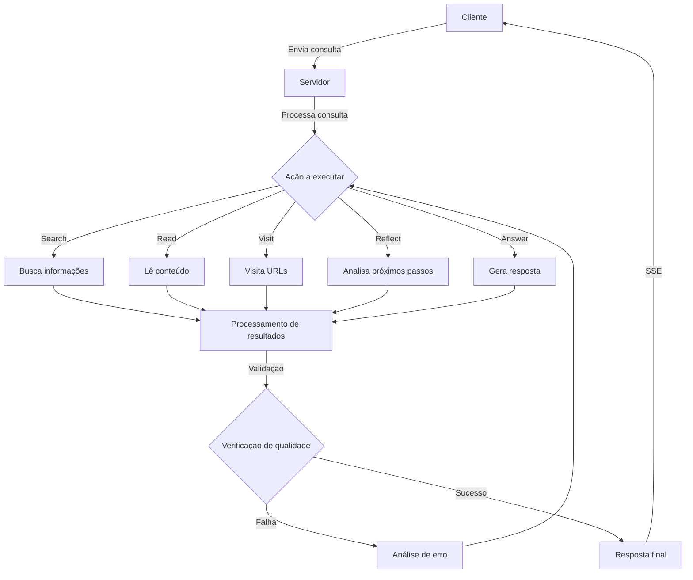

# Implementação de Busca Inteligente de NCM na Nuvem: Conceito e Arquitetura

## Índice

1. [Introdução](#introdução)
2. [Requisitos do Sistema](#requisitos-do-sistema)
3. [Arquitetura da Solução](#arquitetura-da-solução)
   - [Fluxo de Dados](#fluxo-de-dados)
   - [Schemas e Estruturas de Comunicação](#schemas-e-estruturas-de-comunicação)
     - [Schema de Busca](#schema-de-busca)
     - [Schema de Resposta](#schema-de-resposta)
     - [Schema de Visita](#schema-de-visita)
     - [Schema de Reflexão](#schema-de-reflexão)
     - [Schema de Análise de Atribuição](#schema-de-análise-de-atribuição)
     - [Schema de Resposta Final do Modelo](#schema-de-resposta-final-do-modelo)
     - [Schema de Leitura](#schema-de-leitura)
     - [Schema de Resposta Alternativa](#schema-de-resposta-alternativa)
     - [Schema de Desduplicação](#schema-de-desduplicação)
     - [Schema de Avaliação de Qualidade](#schema-de-avaliação-de-qualidade)
     - [Schema de Análise de Erro](#schema-de-análise-de-erro)
     - [Schema de Resposta Definitiva](#schema-de-resposta-definitiva)
   - [Formato de Resposta do Sistema](#formato-de-resposta-do-sistema)
   - [Análise de Erros](#análise-de-erros)
4. [Comparativo de Plataformas em Nuvem](#comparativo-de-plataformas-em-nuvem)
   - [Amazon Web Services (AWS)](#amazon-web-services-aws)
   - [Microsoft Azure](#microsoft-azure)
   - [Google Cloud Platform (GCP)](#google-cloud-platform-gcp)
5. [Opções de Hospedagem por Plataforma](#opções-de-hospedagem-por-plataforma)
6. [Comparativo de Custos](#comparativo-de-custos)
7. [Recomendações](#recomendações)
8. [Configuração do Sistema](#configuração-do-sistema)
9. [Plano de Implementação Detalhado](#plano-de-implementação-detalhado)
10. [Modelos Suportados](#modelos-suportados)
11. [Próximas Fases](#próximas-fases)
12. [Conclusão](#conclusão)

## Introdução

Este documento apresenta um plano de implementação para um sistema de busca inteligente de NCM (Nomenclatura Comum do Mercosul) na nuvem. O objetivo é criar uma API dedicada que utilize modelos de linguagem (LLMs) para processar consultas em linguagem natural e retornar códigos NCM relevantes com explicações detalhadas. O sistema será baseado em uma arquitetura de comunicação em tempo real entre o backend e o frontend usando Server-Sent Events (SSE).

## Requisitos do Sistema

Para a implementação eficiente da API de busca de NCM, são necessários os seguintes recursos:

1. **Capacidade Computacional**:

   - Para execução do modelo LLM: Mínimo de 4 vCPUs e 16GB RAM
   - Para GPU (em caso de modelo próprio): Pelo menos 16GB VRAM (T4/L4)
   - Armazenamento: 20-100GB

2. **Requisitos de Software**:

   - Suporte a Docker
   - Ferramentas de orquestração de contêineres
   - Serviços gerenciados para API Gateway
   - Capacidade de escalabilidade automática

3. **Requisitos de Rede**:
   - Baixa latência
   - Escalabilidade de banda
   - Suporte à região América do Sul

## Arquitetura da Solução

### Fluxo de Dados



O fluxo de processamento pode ser detalhado da seguinte forma:



### Schemas e Estruturas de Comunicação

O sistema utiliza uma série de schemas para estruturar a comunicação entre os diferentes componentes. Abaixo estão os principais schemas utilizados:

#### Schema de Busca

```json
{
  "action": "search",
  "think": "String - Raciocínio por trás da busca",
  "searchQuery": "String - Termos de busca"
}
```

**Parâmetros:**

- **action**: Define a ação como "search". Usado para orientar o fluxo de processamento do sistema.
- **think**: Contém o raciocínio por trás da busca. Usado para documentar a lógica e para posterior análise.
- **searchQuery**: A string de busca a ser executada. Composta por termos relevantes para a consulta do usuário.

**Propósito:** Este schema é utilizado para iniciar uma busca de informações relevantes para a consulta do usuário. É o ponto de entrada para coletar dados que serão usados para gerar a resposta.

#### Schema de Resposta

```json
{
  "action": "answer",
  "think": "String - Processo de pensamento",
  "answer": "String - Conteúdo da resposta",
  "references": [
    {
      "exactQuote": "String - Citação exata",
      "url": "String - URL da fonte"
    }
  ]
}
```

**Parâmetros:**

- **action**: Define a ação como "answer". Indica que esta é uma resposta final.
- **think**: Documenta o processo de pensamento por trás da resposta. Usado para transparência e análise.
- **answer**: O conteúdo da resposta a ser entregue ao usuário.
- **references**: Array contendo referências que embasam a resposta, com citações exatas e URLs das fontes.

**Propósito:** Este schema estrutura a resposta final ao usuário, garantindo que seja bem fundamentada com referências adequadas. As referências são cruciais para validar a precisão e credibilidade da resposta.

#### Schema de Visita

```json
{
  "action": "visit",
  "think": "String - Justificativa para visitar URLs",
  "url-list": ["String - URLs a serem visitados"]
}
```

**Parâmetros:**

- **action**: Define a ação como "visit". Indica que o sistema deve visitar URLs específicos.
- **think**: Explica por que estas URLs são relevantes para a consulta.
- **url-list**: Array de URLs a serem visitados para coletar informações.

**Propósito:** Este schema é usado para direcionar o sistema a visitar URLs específicos para coletar informações relevantes. É uma etapa intermediária no processo de coleta de dados.

#### Schema de Reflexão

```json
{
  "action": "reflect",
  "think": "String - Análise da situação atual",
  "questionsToAnswer": ["String - Perguntas a serem respondidas"]
}
```

**Parâmetros:**

- **action**: Define a ação como "reflect". Indica uma pausa para análise.
- **think**: Contém a análise da situação atual e o raciocínio do sistema.
- **questionsToAnswer**: Lista de perguntas que precisam ser respondidas para avançar.

**Propósito:** Este schema permite que o sistema pause e reflita sobre o progresso, identificando lacunas de informação ou direções a seguir. É um mecanismo de auto-correção e orientação para o fluxo de processamento.

#### Schema de Análise de Atribuição

```json
{
  "attribution_analysis": {
    "sources_provided": Boolean,
    "sources_verified": Boolean,
    "quotes_accurate": Boolean
  }
}
```

**Parâmetros:**

- **sources_provided**: Indica se as fontes foram fornecidas na resposta.
- **sources_verified**: Indica se as fontes foram verificadas quanto à sua validade.
- **quotes_accurate**: Indica se as citações são precisas em relação às fontes.

**Propósito:** Este schema é usado para validar a qualidade das referências e citações na resposta. Garante que a resposta seja bem fundamentada e precisa.

#### Schema de Resposta Final do Modelo

```json
{
  "text": "String - Conteúdo da resposta formatada",
  "usageMetadata": "Object - Metadados de uso e estatísticas"
}
```

**Parâmetros:**

- **text**: Contém o texto completo da resposta que será retornada ao usuário, já formatada.
- **usageMetadata**: Objeto contendo metadados sobre o processamento, como tokens utilizados, tempo de resposta, etc.

**Propósito:** Este schema é utilizado para formatar a resposta final que será enviada ao cliente. É o último estágio do processamento antes do envio via SSE.

**Contexto de Uso:** Este schema aparece no contexto de "Resposta encontrada! Verificando qualidade..." e é utilizado para acessar e validar a resposta final do modelo antes de enviá-la ao usuário.

#### Schema de Leitura

```json
{
  "title": "String - Título do conteúdo lido",
  "url": "String - URL da fonte consultada",
  "tokens": Number - Quantidade de tokens processados
}
```

**Parâmetros:**

- **title**: Título do documento ou página web que foi lido.
- **url**: URL completa da fonte onde o conteúdo foi obtido.
- **tokens**: Número de tokens que o conteúdo consumiu no processamento.

**Propósito:** Este schema é usado para registrar informações sobre conteúdos que foram lidos de URLs específicas, incluindo metadados úteis para controle de tokens e referência.

**Contexto de Uso:** Aparece em registros como "Read: {...}" durante o processo de coleta de informações, geralmente após uma ação de visita a URLs.

#### Schema de Resposta Alternativa

```json
{
  "action": "answer",
  "think": "String - Processo de pensamento",
  "answer": "String - Conteúdo da resposta",
  "nota_detalhada": "String - Informações adicionais e contexto",
  "references": [
    {
      "exactQuote": "String - Citação exata",
      "url": "String - URL da fonte"
    }
  ]
}
```

**Parâmetros:**

- **action**: Define a ação como "answer", indicando uma resposta final.
- **think**: Documenta o processo de pensamento por trás da resposta.
- **answer**: O conteúdo principal da resposta a ser entregue ao usuário.
- **nota_detalhada**: Campo adicional que fornece contexto e informações extras sobre o tema da resposta.
- **references**: Array contendo referências que embasam a resposta.

**Propósito:** Este schema é uma variação do schema de resposta padrão, incluindo uma "nota_detalhada" que fornece informações adicionais e contexto mais amplo sobre o tema da resposta.

**Contexto de Uso:** Este formato é utilizado para responder com uma estrutura mais detalhada, frequentemente usado para separar a resposta direta de informações contextuais adicionais.

#### Schema de Desduplicação

```json
{
  "unique_queries": ["String - Consultas únicas após processamento"]
}
```

**Parâmetros:**

- **unique_queries**: Array contendo consultas únicas após o processo de desduplicação.

**Propósito:** Este schema é utilizado no processo de desduplicação de consultas, garantindo que consultas semelhantes ou idênticas não sejam processadas múltiplas vezes, economizando recursos.

**Contexto de Uso:** Utilizado durante o pré-processamento de consultas para otimizar o uso de recursos e evitar resultados redundantes.

#### Schema de Avaliação de Qualidade

```json
{
  "type": "definitive",
  "pass": true
}
```

ou

```json
{
  "type": "not_definitive",
  "pass": false,
  "think": "String - Análise da qualidade da resposta"
}
```

**Parâmetros:**

- **type**: Tipo de avaliação, podendo ser "definitive" (definitiva) ou "not_definitive" (não definitiva).
- **pass**: Booleano indicando se a resposta passou no critério de qualidade.
- **think**: Quando disponível, contém a análise do processo de avaliação e por que a resposta não é considerada adequada.

**Propósito:** Este schema é utilizado para avaliar a qualidade da resposta gerada, determinando se ela é definitiva e satisfatória ou se precisa de mais processamento. Uma resposta marcada como "definitive" e "pass: true" é considerada pronta para ser entregue ao usuário.

**Contexto de Uso:** Este schema aparece nos logs durante o processo de avaliação, após uma resposta ser gerada. Quando uma resposta não passa nos critérios de qualidade, o sistema pode tentar gerar uma nova resposta ou realizar análises adicionais.

#### Schema de Análise de Erro

```json
{
  "data": {
    "think": "String - Análise do processo de erro",
    "answer": {
      "steps": ["String - Passos que causaram o erro"],
      "recommendations": ["String - Recomendações para resolver o erro"]
    }
  }
}
```

**Parâmetros:**

- **data**: Contém os dados da análise de erro.
  - **think**: Análise do processo que levou ao erro.
  - **answer**: Informações detalhadas sobre o erro e como resolvê-lo.
    - **steps**: Lista de passos que levaram ao erro, identificando onde o processo falhou.
    - **recommendations**: Lista de recomendações para resolver o erro e melhorar o processo.

**Propósito:** Este schema é utilizado quando o sistema encontra um erro e precisa analisá-lo para identificar a causa e propor soluções. Ele fornece uma estrutura para documentar o processo que levou ao erro e sugerir formas de corrigi-lo.

**Contexto de Uso:** Este schema é observado nos logs após uma falha no processamento ou quando uma resposta não passa pela validação de qualidade. Ele faz parte do mecanismo de auto-correção do sistema.

#### Schema de Resposta Definitiva

```json
{
  "action": "answer",
  "think": "String - Processo de pensamento",
  "answer": "String - Conteúdo da resposta",
  "references": [
    {
      "exactQuote": "String - Citação exata",
      "url": "String - URL da fonte"
    }
  ],
  "type": "definitive",
  "pass": true
}
```

**Parâmetros:**

- **action**: Define a ação como "answer", indicando uma resposta final.
- **think**: Documenta o processo de pensamento por trás da resposta.
- **answer**: O conteúdo principal da resposta a ser entregue ao usuário.
- **references**: Array contendo referências que embasam a resposta.
- **type**: Indica que a resposta é "definitive" (definitiva).
- **pass**: Booleano indicando que a resposta passou nos critérios de qualidade.

**Propósito:** Este schema combina o schema de resposta padrão com o schema de avaliação de qualidade, indicando que a resposta é definitiva e pronta para ser entregue ao usuário. Ele é usado como o formato final antes da resposta ser enviada.

**Contexto de Uso:** Este schema é observado nos logs quando uma resposta passou por todos os processos de validação e está pronta para ser entregue ao usuário final.

### Formato de Resposta do Sistema

O sistema utiliza diferentes formatos de resposta durante o processamento. Abaixo estão os principais formatos identificados:

#### Formato de Resposta JSON Bruto

```json
{
  "action": "answer",
  "think": "String - Processo de pensamento",
  "answer": "String - Conteúdo da resposta",
  "references": [
    {
      "exactQuote": "String - Citação exata",
      "url": "String - URL da fonte"
    }
  ],
  "Nota Detalhada": "String - Informações adicionais e contexto"
}
```

**Contexto:** Este formato representa a resposta bruta do modelo, antes de qualquer processamento adicional. É capturado em "Raw response text" e posteriormente processado para exibição.

#### Formato de Resposta Processada

```javascript
{
  action: 'answer',
  think: 'String - Processo de pensamento',
  answer: 'String - Conteúdo da resposta',
  references: [
    {
      exactQuote: 'String - Citação exata',
      url: 'String - URL da fonte'
    }
  ],
  'Nota Detalhada': 'String - Informações adicionais e contexto'
}
```

**Contexto:** Este formato representa a resposta após processamento inicial, convertida de JSON para um objeto JavaScript. É acompanhado pela indicação "answer <- [search, read, answer, reflect]", mostrando a sequência de ações que levaram a esta resposta.

### Análise de Erros

O sistema também inclui um mecanismo de análise de erros que é acionado quando as respostas não atendem aos critérios de qualidade. Os erros comuns incluem:

#### 1. Erros de Schema

Quando a resposta não segue o schema esperado.

```json
{
  "is_valid": Boolean,
  "context": Object
}
```

#### 2. Erros de Token

Quando o contexto excede o limite de tokens permitido.

```
Trying to keep the first 9066 tokens when context the overflows. However, the model is loaded with context length of only 4096 tokens, which is not enough.
```

#### 3. Erros de Validação Zod

Quando ocorrem falhas na validação de tipos usando a biblioteca Zod.

```
Erro na validação do schema: ZodError: [
  {
    "code": "invalid_type",
    "expected": "array",
    "received": "undefined",
    "path": [
      "unique_queries"
    ],
    "message": "Required"
  }
]
```

**Contexto:** Este erro ocorre durante o processo de desduplicação de consultas quando o campo "unique_queries" está indefinido mas é esperado como um array. É um erro de validação de tipo usando a biblioteca Zod, que pode ocorrer em vários pontos do processamento onde schemas são validados.

**Impacto:** Quando este erro ocorre, o processamento normal é interrompido e o sistema precisa realizar uma recuperação, geralmente tentando reprocessar a consulta ou prosseguir sem a desduplicação.

## Comparativo de Plataformas em Nuvem

### Amazon Web Services (AWS)

#### Pontos Fortes

- Maior variedade de instâncias GPU
- Maturidade do ECS/Fargate para contêineres
- Integração robusta entre serviços
- Disponibilidade em região Brasil (São Paulo)
- AWS Lambda com alta escalabilidade

#### Pontos Fracos

- Preços de GPU mais elevados em comparação com provedores alternativos
- Complexidade inicial de configuração
- Potencial vendor lock-in

#### Serviços Relevantes

- **Amazon ECS/Fargate**: Serviço gerenciado de contêineres
- **Amazon EC2 G5/G6**: Instâncias com GPU NVIDIA T4/L4
- **Amazon Lambda**: Computação serverless
- **Amazon API Gateway**: Gerenciamento de APIs
- **Amazon Bedrock**: Serviço gerenciado de LLM

### Microsoft Azure

#### Pontos Fortes

- Conta já existente (elimina etapa de setup inicial)
- Boas opções para contêineres (AKS, Container Apps)
- Preços competitivos para algumas instâncias GPU
- Forte integração com ambiente Microsoft
- Bons serviços de ML (Azure ML)

#### Pontos Fracos

- Menor variedade de opções de instâncias em comparação com AWS
- Disponibilidade limitada de algumas instâncias GPU
- Documentação menos abrangente para casos específicos

#### Serviços Relevantes

- **Azure Container Apps**: Serviço de contêineres serverless
- **Azure Kubernetes Service (AKS)**: Orquestração de contêineres
- **Azure NCas T4 v3**: Instâncias com GPU NVIDIA T4
- **Azure Functions**: Computação serverless
- **Azure API Management**: Gerenciamento de APIs
- **Azure OpenAI Service**: Serviço gerenciado de LLM

### Google Cloud Platform (GCP)

#### Pontos Fortes

- Preços mais competitivos para instâncias GPU (especialmente T4/L4)
- Excelente desempenho de rede
- GKE (Google Kubernetes Engine) muito robusto
- Vertex AI para MLOps simplificado
- Menor overhead operacional

#### Pontos Fracos

- Presença mais limitada na América do Sul
- Menor integração com ferramentas existentes
- Menor variedade de serviços complementares
- Potencial menor suporte regional

#### Serviços Relevantes

- **Google Kubernetes Engine (GKE)**: Orquestração de contêineres
- **Cloud Run**: Plataforma serverless para contêineres
- **Compute Engine G2**: Instâncias com GPU NVIDIA L4
- **Cloud Functions**: Computação serverless
- **API Gateway**: Gerenciamento de APIs
- **Vertex AI**: Plataforma de ML com modelos pré-treinados

## Opções de Hospedagem por Plataforma

### Opções na AWS

1. **Opção Serverless:**

   - AWS Lambda + API Gateway + Bedrock
   - Ideal para cargas de trabalho variáveis
   - Sem gerenciamento de infraestrutura
   - Limitações de tempo de execução (15 min)

2. **Opção Contêiner:**

   - ECS Fargate (sem servidor)
   - Escalabilidade automática
   - Preço baseado em consumo
   - Bom para workloads médios

3. **Opção GPU Dedicada:**
   - EC2 g5.xlarge (1x GPU T4, 4 vCPU, 16GB RAM)
   - Controle total da infraestrutura
   - Melhor custo-benefício para uso constante
   - Requer gerenciamento de infraestrutura

### Opções na Azure

1. **Opção Serverless:**

   - Azure Functions + API Management + Azure OpenAI
   - Escala automática a zero
   - Fácil integração com conta existente
   - Limites de tempo de execução semelhantes

2. **Opção Contêiner:**

   - Azure Container Apps
   - Serverless com suporte integrado para GPU
   - Preços por consumo competitivos
   - Bom para cargas de trabalho variáveis

3. **Opção GPU Dedicada:**
   - NC4as T4 v3 (1x GPU T4, 4 vCPU, 28GB RAM)
   - Boa relação custo-benefício
   - Compatível com o modelo de contêiner
   - Disponibilidade pode ser limitada em algumas regiões

### Opções no Google Cloud

1. **Opção Serverless:**

   - Cloud Functions + API Gateway + Vertex AI
   - Excelente escalabilidade
   - Integração nativa com GKE
   - Limites generosos

2. **Opção Contêiner:**

   - Cloud Run
   - Serverless para contêineres
   - Escala a zero automaticamente
   - Fácil deployment

3. **Opção GPU Dedicada:**
   - Compute Engine g2-standard-4 (1x GPU L4, 4 vCPU, 16GB RAM)
   - Melhor preço para GPU entre os grandes provedores
   - Excelente performance para LLMs
   - Disponibilidade na América do Sul pode ser limitada

## Comparativo de Custos

### Opção 1: Containers sem GPU (Uso de API de LLM de terceiros)

| Plataforma | Serviço         | Especificação   | Custo Mensal (USD) |
| ---------- | --------------- | --------------- | ------------------ |
| AWS        | ECS Fargate     | 4 vCPU, 8GB RAM | ~$150              |
|            | API Gateway     | 1M requisições  | ~$4                |
|            | Lambda          | 1M invocações   | ~$2                |
|            | Bedrock (LLM)   | 10M tokens      | ~$150              |
|            | **Total**       |                 | **$306**           |
| Azure      | Container Apps  | 4 vCPU, 8GB RAM | ~$140              |
|            | API Management  | Básico          | ~$5                |
|            | Functions       | 1M invocações   | ~$2                |
|            | Azure OpenAI    | 10M tokens      | ~$150              |
|            | **Total**       |                 | **$297**           |
| GCP        | Cloud Run       | 4 vCPU, 8GB RAM | ~$130              |
|            | API Gateway     | 1M requisições  | ~$3                |
|            | Cloud Functions | 1M invocações   | ~$2                |
|            | Vertex AI (LLM) | 10M tokens      | ~$140              |
|            | **Total**       |                 | **$275**           |

### Opção 2: Instância com GPU (Modelo próprio)

| Plataforma | Serviço         | Especificação           | Custo Mensal (USD) |
| ---------- | --------------- | ----------------------- | ------------------ |
| AWS        | EC2 g5.xlarge   | 1x T4, 4 vCPU, 16GB RAM | ~$724              |
|            | API Gateway     | 1M requisições          | ~$4                |
|            | Lambda          | 1M invocações           | ~$2                |
|            | Storage (EBS)   | 100GB                   | ~$10               |
|            | **Total**       |                         | **$740**           |
| Azure      | NC4as T4 v3     | 1x T4, 4 vCPU, 28GB RAM | ~$382              |
|            | API Management  | Básico                  | ~$5                |
|            | Functions       | 1M invocações           | ~$2                |
|            | Storage         | 100GB                   | ~$10               |
|            | **Total**       |                         | **$399**           |
| GCP        | g2-standard-4   | 1x L4, 4 vCPU, 16GB RAM | ~$511              |
|            | API Gateway     | 1M requisições          | ~$3                |
|            | Cloud Functions | 1M invocações           | ~$2                |
|            | Storage         | 100GB                   | ~$10               |
|            | **Total**       |                         | **$526**           |

### Opção 3: Serverless com GPU sob demanda

| Plataforma | Serviço              | Especificação      | Custo Mensal (USD) |
| ---------- | -------------------- | ------------------ | ------------------ |
| AWS        | Lambda               | 1M invocações      | ~$40               |
|            | Spot Instances (GPU) | Uso sob demanda    | ~$180              |
|            | API Gateway          | 1M requisições     | ~$4                |
|            | **Total**            |                    | **$224**           |
| Azure      | Container Apps       | GPU T4 sob demanda | ~$160              |
|            | Functions            | 1M invocações      | ~$2                |
|            | API Management       | Básico             | ~$5                |
|            | **Total**            |                    | **$167**           |
| GCP        | Cloud Run            | GPU T4 sob demanda | ~$150              |
|            | Cloud Functions      | 1M invocações      | ~$2                |
|            | API Gateway          | 1M requisições     | ~$3                |
|            | **Total**            |                    | **$155**           |

## Recomendações

Com base na análise comparativa realizada, e considerando que já existe uma conta Azure disponível, as recomendações são:

### Recomendação Principal: Azure Container Apps com GPU sob demanda

**Justificativa:**

1. **Custo Otimizado:** A opção mais econômica entre as plataformas (~$167/mês)
2. **Setup Simplificado:** Conta já existente, eliminando etapas iniciais
3. **Flexibilidade:** Escala automaticamente, incluindo escala a zero
4. **Compatibilidade:** Suporte direto para containers Docker
5. **Integração:** Fácil conexão com outros serviços Azure

### Recomendação Alternativa: GCP Cloud Run com GPU sob demanda

**Justificativa:**

1. **Melhor Custo:** A opção mais econômica em termos absolutos (~$155/mês)
2. **Excelente Performance:** Rede e processamento de alta qualidade
3. **Simplicidade:** Interface mais intuitiva e menor overhead operacional
4. **Suporte a GPU:** Boa disponibilidade de GPUs L4 (mais recentes que T4)

### Recomendação para Fase Inicial (MVP): Azure Container Apps sem GPU

**Justificativa:**

1. **Baixo Custo Inicial:** Começa com custos reduzidos
2. **Rápida Implementação:** Deployment simplificado
3. **Escalabilidade:** Permite crescer conforme a demanda
4. **Migração Facilitada:** Fácil transição para versão com GPU quando necessário

## Configuração do Sistema

O sistema utiliza uma configuração modular que define os modelos e parâmetros utilizados para cada componente. Abaixo está um exemplo de configuração:

```json
{
  "provider": {
    "name": "gemini",
    "model": "gemini-2.0-flash"
  },
  "search": {
    "provider": "jina"
  },
  "tools": {
    "coder": {
      "model": "gemini-2.0-flash",
      "temperature": 0.7,
      "maxTokens": 8000
    },
    "searchGrounding": {
      "model": "gemini-2.0-flash",
      "temperature": 0,
      "maxTokens": 8000
    },
    "dedup": {
      "model": "gemini-2.0-flash",
      "temperature": 0.1,
      "maxTokens": 8000
    },
    "evaluator": {
      "model": "gemini-2.0-flash",
      "temperature": 0,
      "maxTokens": 8000
    },
    "errorAnalyzer": {
      "model": "gemini-2.0-flash",
      "temperature": 0,
      "maxTokens": 8000
    },
    "queryRewriter": {
      "model": "gemini-2.0-flash",
      "temperature": 0.1,
      "maxTokens": 8000
    },
    "agent": {
      "model": "gemini-2.0-flash",
      "temperature": 0.7,
      "maxTokens": 8000
    }
  },
  "defaults": {
    "stepSleep": 0
  }
}
```

Esta configuração permite personalizar o comportamento do sistema, especificando quais modelos são utilizados para cada tipo de tarefa e seus parâmetros.

## Plano de Implementação Detalhado

### Fase 1: Preparação (2 semanas)

1. **Configuração da Conta Azure**

   - Verificar acesso e permissões da conta existente
   - Configurar grupos de recursos dedicados
   - Definir limites de custos e alertas

2. **Adaptação do Código**

   - Extrair componentes relevantes do projeto original
   - Adaptar agentes e ferramentas para foco em NCM
   - Preparar estrutura para containerização

3. **Preparação do Modelo LLM**
   - Selecionar modelo base adequado (Llama 3, Mistral, etc.)
   - Avaliar quantização para otimização
   - Preparar pipeline de fine-tuning (opcional)

### Fase 2: Implementação MVP (1 semana)

1. **Containerização Inicial**

   - Criar Dockerfile otimizado
   - Implementar estrutura de APIs
   - Preparar para Azure Container Apps

2. **Deployment na Azure**

   - Configurar Container Registry
   - Implantar no Azure Container Apps
   - Configurar CI/CD para atualizações automáticas

3. **Configuração da API**
   - Implementar autenticação
   - Configurar limites de requisições
   - Documentar endpoints

### Fase 3: Otimização e Testes (1 semana)

1. **Testes de Carga**

   - Avaliar performance sob diferentes cargas
   - Identificar gargalos
   - Otimizar configurações

2. **Integração de GPU (se necessário)**

   - Habilitar GPU sob demanda
   - Reconfigurar container para uso de GPU
   - Testar performance com GPU

3. **Monitoramento**
   - Configurar Azure Monitor
   - Implementar logs detalhados
   - Criar dashboards operacionais

### Fase 4: Lançamento e Documentação (1 semana)

1. **Finalização da Documentação**

   - Documentação técnica completa
   - Guias de integração
   - Exemplos de uso

2. **Segurança e Compliance**

   - Revisão de segurança
   - Verificação de conformidade com normas
   - Implementação de correções necessárias

3. **Treinamento**
   - Preparar material para usuários
   - Documentar processos operacionais
   - Estabelecer protocolos de suporte

## Modelos Suportados

O sistema pode ser configurado para utilizar diferentes modelos de linguagem, dependendo das necessidades e restrições:

1. **local-model**: Modelo executado localmente.

   - Privacidade garantida
   - Sem custos por token
   - Necessita de recursos computacionais locais

2. **gpt-4/gpt-3.5-turbo**: Modelos da OpenAI.

   - Alta qualidade de respostas
   - Bom suporte para streaming
   - Custo por token

3. **claude-3-opus**: Modelo da Anthropic.

   - Excelente para tarefas de raciocínio
   - Bom tratamento de contexto longo
   - Suporte a streaming

4. **gemini-1.5-pro/flash**: Modelos do Google.

   - Boa relação custo-benefício
   - Excelentes capacidades multimodais
   - Integração com ecossistema Google

5. **Modelos Quantizados**: Versões otimizadas de modelos como Llama 3, Mistral, etc.
   - Menores requisitos de hardware
   - Possibilidade de execução local
   - Boa performance com hardware limitado

Todos os modelos listados suportam streaming, o que permite a transmissão de respostas em tempo real para o cliente usando Server-Sent Events (SSE).

## Próximas Fases

### Fase 5: Monitoramento e Otimização Contínua

- Acompanhamento de métricas de uso
- Otimização de custos baseada em padrões reais
- Ajustes de performance conforme necessário

### Fase 6: Adição de Funcionalidades

- Implementação de cache para consultas frequentes
- Adição de recursos para exportação de resultados
- Integração com sistemas existentes via webhooks

### Fase 7: Desenvolvimento do Componente de Chat

- Implementação do chat como aplicação separada
- Integração com a API de NCM
- Desenvolvimento de interface conversacional

## Conclusão

O sistema de busca inteligente de NCM proposto neste documento apresenta uma solução abrangente para o desafio de classificação fiscal de mercadorias, utilizando tecnologias modernas de inteligência artificial e computação em nuvem. A arquitetura baseada em Server-Sent Events (SSE) para comunicação em tempo real entre o backend e o frontend garante uma experiência fluida e responsiva para os usuários.

A implementação na nuvem, com destaque para a recomendação principal de utilizar Azure Container Apps com GPU sob demanda, oferece um equilíbrio ideal entre custo, performance e escalabilidade. O design modular do sistema, com schemas bem definidos para cada etapa do processamento, proporciona flexibilidade e capacidade de evolução contínua.

Os principais benefícios desta abordagem incluem:

1. **Precisão aprimorada na classificação fiscal**: O uso de LLMs permite uma compreensão mais profunda das descrições de produtos e uma correspondência mais precisa com os códigos NCM.

2. **Escalabilidade e adaptabilidade**: A arquitetura em contêineres permite escalar conforme a demanda e adaptar-se a mudanças nas regras de classificação.

3. **Custo otimizado**: A abordagem serverless com GPU sob demanda garante que os recursos computacionais sejam utilizados apenas quando necessário.

4. **Robustez**: Os mecanismos de validação de qualidade e análise de erros proporcionam um sistema resiliente e auto-corretivo.

5. **Evolução contínua**: O sistema foi projetado para aprender e melhorar com o tempo, através da coleta de feedback e análise de padrões de uso.

O plano de implementação em fases garante uma abordagem estruturada, começando com um MVP básico e evoluindo para uma solução completa ao longo do tempo. A possibilidade de expansão para incluir um componente de chat e outras funcionalidades demonstra a flexibilidade da arquitetura proposta.

A solução não apenas atende às necessidades atuais de classificação NCM, mas também estabelece uma base sólida para futuros desenvolvimentos em automação fiscal e apoio à decisão em comércio exterior.
