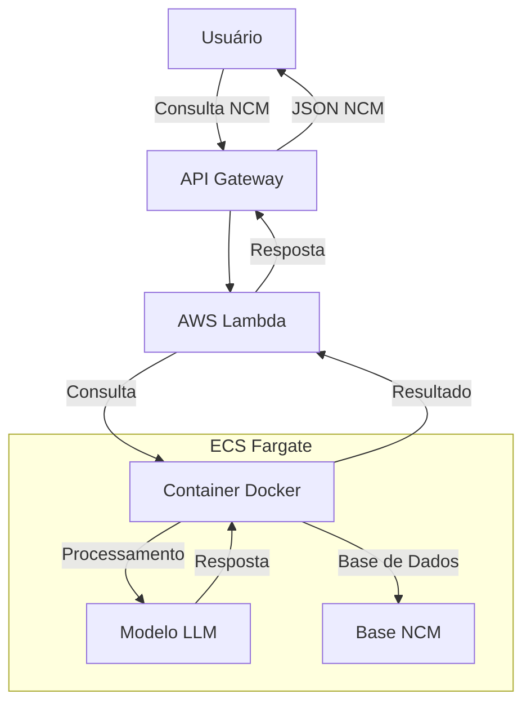
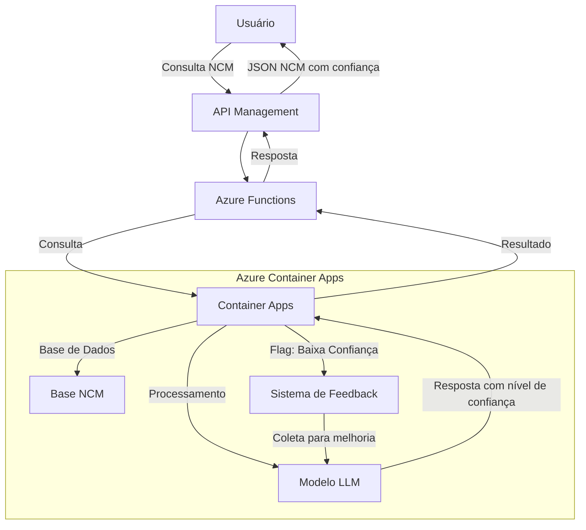

# Próximos Passos: Implementação de Busca Inteligente de NCM na AWS

## Índice

1. [Introdução](#introdução)
2. [Visão Geral da Implementação](#visão-geral-da-implementação)
3. [Infraestrutura na AWS](#infraestrutura-na-aws)
4. [Containerização com Docker](#containerização-com-docker)
5. [Integração do Modelo LLM](#integração-do-modelo-llm)
6. [API de Busca Inteligente de NCM](#api-de-busca-inteligente-de-ncm)
7. [Estimativa de Custos](#estimativa-de-custos)
8. [Plano de Implementação Passo a Passo](#plano-de-implementação-passo-a-passo)
9. [Próximas Fases](#próximas-fases)

## Introdução

Este documento descreve o plano de implementação para migrar o sistema atual de busca inteligente de NCM (Nomenclatura Comum do Mercosul) para a AWS. O objetivo é criar uma API dedicada para busca de códigos NCM com pesquisa profunda, utilizando o projeto "Ferramentas" como base, com uma arquitetura containerizada em Docker. Esta implementação será focada apenas na funcionalidade de busca NCM, deixando o componente de chat para uma fase posterior.

## Visão Geral da Implementação

A implementação consistirá em adaptar o projeto "Ferramentas" para focar exclusivamente na busca inteligente de códigos NCM. O sistema utilizará um LLM (Large Language Model) para processar consultas em linguagem natural e retornar códigos NCM relevantes com explicações detalhadas.

### Arquitetura Proposta



## Infraestrutura na AWS

### Opções de Hospedagem

Para a implementação inicial, recomendamos a seguinte configuração na AWS:

1. **Amazon ECS (Elastic Container Service) com Fargate**:

   - Serviço de orquestração de contêineres sem servidor
   - Elimina a necessidade de gerenciar servidores
   - Escala automaticamente conforme a demanda
   - Mais econômico para cargas de trabalho variáveis

2. **Alternativa: Amazon EC2 com instâncias GPU de baixo custo**:

   - Instâncias G5 ou G6 para execução de modelos próprios
   - Controle total sobre a infraestrutura
   - Mais adequado se o volume de requisições for constante
   - Melhor custo-benefício a longo prazo para cargas de trabalho estáveis

### API Gateway

- Configuração de API RESTful para receber consultas
- Autenticação e autorização via chaves de API
- Limitação de taxa para controle de custos
- Integração com AWS Lambda para processamento de requisições

### Lambda Function

- Interface entre API Gateway e contêineres
- Gerenciamento de requisições e respostas
- Tratamento de erros e retries
- Monitoramento e geração de logs

## Containerização com Docker

### Estrutura do Container

```
ferramentas-ncm/
├── app/
│   ├── agent/           # Agente adaptado para busca de NCM
│   ├── tool/            # Ferramentas para pesquisa de NCM
│   ├── schema.py        # Schemas adaptados para NCM
│   ├── llm.py           # Integração com modelos de linguagem
│   └── config.py        # Configuração do sistema
├── data/
│   └── ncm/             # Base de dados NCM
├── Dockerfile           # Configuração do container
└── requirements.txt     # Dependências Python
```

### Dockerfile

```dockerfile
FROM python:3.10-slim

WORKDIR /app

COPY requirements.txt .
RUN pip install -r requirements.txt

COPY . .

EXPOSE 8080

CMD ["python", "server.py"]
```

## Integração do Modelo LLM

### Opções de Modelo

1. **Modelo Próprio (Hospedado no ECS/EC2)**

   - Vantagens:
     - Controle total sobre o modelo
     - Sem custos por token
     - Privacidade garantida
   - Desvantagens:
     - Maior complexidade de implementação
     - Necessidade de recursos computacionais significativos

2. **Amazon Bedrock**

   - Vantagens:
     - Fácil integração
     - Modelos pré-treinados de alta qualidade
     - Escalabilidade automática
   - Desvantagens:
     - Custos por token
     - Menos flexibilidade para personalização

3. **Modelos Quantizados**

   - Vantagens:
     - Menor necessidade de recursos
     - Processamento mais rápido
     - Possibilidade de rodar em instâncias menores
   - Desvantagens:
     - Possível redução na qualidade de respostas
     - Necessidade de ajustes finos

### Fine-tuning para NCM

- Adaptação do modelo para domínio específico de classificação de mercadorias
- Treinamento com exemplos reais de produtos e seus códigos NCM
- Incorporação de regras específicas de classificação
- Atualização periódica conforme mudanças na tabela NCM

## API de Busca Inteligente de NCM

### Endpoints

1. **POST /api/ncm/search**

   - Descrição: Busca código NCM com base em descrição de produto
   - Parâmetros:
     - `query`: Descrição do produto em linguagem natural
     - `detailed`: Boolean para resposta detalhada (opcional)
   - Resposta:
     ```json
     {
       "code": "8517.13.00",
       "description": "Telefones inteligentes (smartphones)",
       "confidence": 0.95,
       "explanation": "Dispositivos portáteis para comunicação...",
       "related_codes": [
         { "code": "8517.14.00", "description": "Outros telefones..." }
       ]
     }
     ```

2. **GET /api/ncm/{code}**

   - Descrição: Obtém detalhes de um código NCM específico
   - Parâmetros:
     - `code`: Código NCM (ex: 8517.13.00)
   - Resposta: Detalhes completos do código NCM

### Integração com Sistema Atual

- Adaptação das ferramentas atuais para foco em NCM
- Implementação de cache para consultas frequentes
- Sistema de feedback para melhoria contínua
- Logs detalhados para análise de performance

## Estimativa de Custos

### Opção 1: ECS Fargate + Modelo Próprio

| Recurso       | Especificação           | Custo Mensal (USD) |
| ------------- | ----------------------- | ------------------ |
| ECS Fargate   | 4 vCPU, 8GB RAM         | ~$150              |
| API Gateway   | 1 milhão de requisições | ~$4                |
| Lambda        | 1 milhão de invocações  | ~$2                |
| Storage (EBS) | 20GB                    | ~$2                |
| **Total**     |                         | **$158**           |

### Opção 2: EC2 com GPU Econômica

| Recurso       | Especificação           | Custo Mensal (USD) |
| ------------- | ----------------------- | ------------------ |
| EC2 g5.xlarge | 1 GPU, 4 vCPU, 16GB RAM | ~$724              |
| API Gateway   | 1 milhão de requisições | ~$4                |
| Lambda        | 1 milhão de invocações  | ~$2                |
| Storage (EBS) | 100GB                   | ~$10               |
| **Total**     |                         | **$740**           |

### Opção 3: Lambda + Bedrock (Sem Container)

| Recurso     | Especificação            | Custo Mensal (USD) |
| ----------- | ------------------------ | ------------------ |
| Lambda      | 1 milhão de invocações   | ~$40               |
| Bedrock     | 10M tokens entrada/saída | ~$150              |
| API Gateway | 1 milhão de requisições  | ~$4                |
| **Total**   |                          | **$194**           |

## Plano de Implementação Passo a Passo

### Fase 1: Preparação (2 semanas)

1. **Adaptação do Código**

   - Extrair componentes relevantes do projeto "Ferramentas"
   - Adaptar agentes e ferramentas para foco em NCM
   - Desenvolver nova API RESTful

2. **Preparação do Modelo**

   - Selecionar modelo base adequado (Llama 3, Mistral, etc.)
   - Quantizar modelo para otimizar performance
   - Testar modelo com consultas exemplo de NCM

3. **Dockerização**

   - Criar Dockerfile
   - Testar container localmente
   - Otimizar tamanho e performance

### Fase 2: Implantação na AWS (1 semana)

1. **Configuração da Infraestrutura**

   - Criar cluster ECS Fargate
   - Configurar API Gateway e Lambda
   - Estabelecer políticas de segurança

2. **Implantação do Container**

   - Enviar imagem para ECR (Elastic Container Registry)
   - Configurar task definitions no ECS
   - Implementar load balancer

3. **Configuração de Rede e Segurança**

   - Configurar VPC e sub-redes
   - Implementar grupos de segurança
   - Configurar IAM roles e políticas

### Fase 3: Testes e Otimização (1 semana)

1. **Testes de Performance**

   - Medir tempos de resposta
   - Testar carga máxima
   - Identificar gargalos

2. **Otimização**

   - Ajustar parâmetros de escala automática
   - Otimizar memória e CPU alocados
   - Implementar caching para consultas frequentes

3. **Monitoramento**

   - Configurar CloudWatch para métricas detalhadas
   - Implementar alertas para anomalias
   - Configurar dashboards operacionais

### Fase 4: Lançamento (1 semana)

1. **Documentação da API**

   - Criar documentação detalhada com Swagger
   - Exemplos de uso
   - Guias de integração

2. **Integração**

   - Configurar autenticação e autorização
   - Fornecer chaves de API para usuários
   - Implementar limitação de taxa

3. **Treinamento**

   - Instruir equipe sobre uso da API
   - Documentar processos de manutenção
   - Preparar plano de suporte

## Próximas Fases

### Fase 5: Feedback e Melhorias (Contínuo)

- Coletar feedback dos usuários
- Implementar melhorias baseadas em uso real
- Ajustar modelo com base em casos de uso específicos

### Fase 6: Integração com Chat (Futura)

- Desenvolver componente de chat como aplicação separada
- Integrar API de NCM com sistema de chat
- Implementar interface conversacional para consultas de NCM

### Fase 7: Expansão de Funcionalidades (Futura)

- Adicionar suporte para consultas em múltiplos idiomas
- Implementar comparação de códigos NCM
- Adicionar recursos de exportação e relatórios
- Desenvolver alertas sobre mudanças na tabela NCM

---

Este plano de implementação fornece um roteiro detalhado para migrar o sistema de busca inteligente de NCM para a AWS utilizando contêineres Docker. A abordagem recomendada é começar com a opção mais econômica (ECS Fargate) para validar o conceito e posteriormente escalar conforme necessário. A implementação total deve levar aproximadamente 5 semanas, com custos mensais estimados entre $158 e $740, dependendo da opção escolhida.

---

# Próximos Passos: Implementação de Busca Inteligente de NCM - Comparativo de Nuvens

# Implementação de Busca Inteligente de NCM na Azure

## Índice

1. [Introdução](#introdução)
2. [Requisitos do Sistema](#requisitos-do-sistema)
3. [Comparativo de Custos entre Plataformas](#comparativo-de-custos-entre-plataformas)
4. [Arquitetura no Azure](#arquitetura-no-azure)
5. [Containerização com Docker](#containerização-com-docker)
6. [Integração do Modelo LLM](#integração-do-modelo-llm)
7. [API de Busca Inteligente de NCM](#api-de-busca-inteligente-de-ncm)
8. [Estratégia para Imprecisão na Classificação](#estratégia-para-imprecisão-na-classificação)
9. [Dimensionamento da Equipe](#dimensionamento-da-equipe)
10. [Plano de Implementação Passo a Passo](#plano-de-implementação-passo-a-passo)
11. [Próximas Fases](#próximas-fases)

## Introdução

Este documento descreve o plano de implementação do sistema de busca inteligente de NCM (Nomenclatura Comum do Mercosul) no Microsoft Azure. Após análise comparativa entre AWS, Azure e Google Cloud, optamos pelo Azure devido à existência de uma conta prévia e aos custos competitivos, especialmente utilizando Container Apps com GPU sob demanda.

O objetivo é criar uma API dedicada para busca de códigos NCM com pesquisa profunda, utilizando o projeto "Ferramentas" como base, com uma arquitetura containerizada em Docker. Esta implementação será focada apenas na funcionalidade de busca NCM, deixando o componente de chat para uma fase posterior.

## Requisitos do Sistema

Para a implementação eficiente da API de busca de NCM, são necessários os seguintes recursos:

1. **Capacidade Computacional**:

   - Para execução do modelo LLM: Mínimo de 4 vCPUs e 16GB RAM
   - Para GPU (em caso de modelo próprio): GPU NVIDIA T4 (16GB VRAM)
   - Armazenamento: 20-100GB

2. **Requisitos de Software**:

   - Suporte a Docker
   - Ferramentas de orquestração de contêineres
   - API Gateway/Management
   - Capacidade de escalabilidade automática

3. **Requisitos de Rede**:

   - Baixa latência
   - Escalabilidade de banda
   - Suporte à região América do Sul

## Comparativo de Custos entre Plataformas

Uma análise comparativa entre as três principais plataformas de nuvem mostrou que o Azure oferece um bom equilíbrio entre custo e benefício, especialmente considerando a conta já existente.

### Opção 1: Containers sem GPU (Uso de API de LLM de terceiros)

| Plataforma | Serviço                 | Especificação   | Custo Mensal (USD) |
| ---------- | ----------------------- | --------------- | ------------------ |
| AWS        | ECS Fargate + Bedrock   | 4 vCPU, 8GB RAM | **$306**           |
| Azure      | Container Apps + OpenAI | 4 vCPU, 8GB RAM | **$297**           |
| GCP        | Cloud Run + Vertex AI   | 4 vCPU, 8GB RAM | **$275**           |

### Opção 2: Instância com GPU (Modelo próprio)

| Plataforma | Serviço       | Especificação           | Custo Mensal (USD) |
| ---------- | ------------- | ----------------------- | ------------------ |
| AWS        | EC2 g5.xlarge | 1x T4, 4 vCPU, 16GB RAM | **$740**           |
| Azure      | NC4as T4 v3   | 1x T4, 4 vCPU, 28GB RAM | **$399**           |
| GCP        | g2-standard-4 | 1x L4, 4 vCPU, 16GB RAM | **$526**           |

### Opção 3: Serverless com GPU sob demanda

| Plataforma | Serviço              | Especificação      | Custo Mensal (USD) |
| ---------- | -------------------- | ------------------ | ------------------ |
| AWS        | Lambda + Spot GPU    | Uso sob demanda    | **$224**           |
| Azure      | Container Apps + GPU | GPU T4 sob demanda | **$167**           |
| GCP        | Cloud Run + GPU      | GPU T4 sob demanda | **$155**           |

## Arquitetura no Azure

### Arquitetura Proposta



### Opções de Hospedagem no Azure

1. **Opção Recomendada: Azure Container Apps com GPU sob demanda**

   - Serviço serverless para contêineres
   - Escala automaticamente (incluindo escala a zero)
   - GPU disponível sob demanda
   - Custo mensal estimado: ~$167
   - Ideal para tráfego variável

2. **Opção Alternativa: Azure VM NC4as T4 v3**

   - Instância dedicada com 1x GPU T4
   - 4 vCPUs, 28GB RAM
   - Controle total sobre o ambiente
   - Custo mensal estimado: ~$399
   - Melhor para tráfego constante e previsível

3. **Opção MVP Inicial: Azure Container Apps sem GPU**

   - Implementação inicial sem GPU
   - Menor custo para validação do conceito
   - Uso de modelos quantizados ou Azure OpenAI
   - Fácil migração para versão com GPU posteriormente
   - Custo mensal estimado: ~$140 (sem contar Azure OpenAI)

### Serviços Relevantes

- **Azure Container Apps**: Serviço serverless para contêineres
- **Azure Functions**: Processamento de requisições
- **Azure API Management**: Gateway de API e gerenciamento de endpoints
- **Azure Container Registry**: Armazenamento de imagens Docker
- **Azure Monitor**: Monitoramento e logs
- **Azure Storage**: Armazenamento para dados e modelos
- **Azure Cognitive Search**: Indexação e busca (opcional para melhorar resultados)

## Containerização com Docker

### Estrutura do Container

```
ferramentas-ncm/
├── app/
│   ├── agent/           # Agente adaptado para busca de NCM
│   ├── tool/            # Ferramentas para pesquisa de NCM
│   ├── schema.py        # Schemas adaptados para NCM
│   ├── llm.py           # Integração com modelos de linguagem
│   ├── feedback.py      # Sistema de feedback e melhoria
│   └── config.py        # Configuração do sistema
├── data/
│   ├── ncm/             # Base de dados NCM
│   └── feedback/        # Dados de feedback para melhoria
├── Dockerfile           # Configuração do container
└── requirements.txt     # Dependências Python
```

### Dockerfile

```dockerfile
FROM python:3.10-slim

WORKDIR /app

COPY requirements.txt .
RUN pip install -r requirements.txt

COPY . .

EXPOSE 8080

CMD ["python", "server.py"]
```

### Configuração do Container Apps

```yaml
# azure-container-apps.yaml
name: ncm-search-api
resourceGroup: ncm-search-resource-group
location: "Brazil South"
containers:
  - name: ncm-search-container
    image: myregistry.azurecr.io/ncm-search:latest
    resources:
      cpu: 2
      memory: 4Gi
    envs:
      - name: AZURE_OPENAI_KEY
        secretRef: azure-openai-key
      - name: CONFIDENCE_THRESHOLD
        value: "0.75"
scale:
  minReplicas: 0
  maxReplicas: 10
```

## Integração do Modelo LLM

### Opções de Modelo

1. **Modelo Próprio (Quantizado)**

   - Modelos como Llama 3 ou Mistral quantizados
   - Execução em CPU ou GPU sob demanda
   - Controle total sobre o modelo
   - Sem custos por token
   - Necessidade de quantização para otimização
   - Pode ser treinado com dados específicos de NCM

2. **Azure OpenAI Service**

   - Fácil integração
   - Modelos pré-treinados de alta qualidade (GPT-4o, GPT-4 Turbo)
   - Escalabilidade automática
   - Custo por token (~$150/mês para 10M tokens)
   - Requer aprovação para uso na plataforma
   - Melhor acurácia inicial sem treinamento específico

3. **Modelo Híbrido (Recomendado)**

   - Uso de modelo próprio para consultas frequentes/simples
   - Fallback para Azure OpenAI para consultas complexas
   - Otimização de custos
   - Maior complexidade de implementação
   - Melhor equilíbrio entre custo e precisão

### Fine-tuning para NCM

- Adaptação do modelo para domínio específico de classificação de mercadorias
- Treinamento com exemplos reais de produtos e seus códigos NCM
- Incorporação de regras específicas de classificação
- Atualização periódica conforme mudanças na tabela NCM
- Melhoria continua com feedback dos usuários

## API de Busca Inteligente de NCM

### Endpoints

1. **POST /api/ncm/search**

   - Descrição: Busca código NCM com base em descrição de produto
   - Parâmetros:
     - `query`: Descrição do produto em linguagem natural
     - `detailed`: Boolean para resposta detalhada (opcional)
     - `min_confidence`: Nível mínimo de confiança (opcional, padrão 0.0)
   - Resposta:
     ```json
     {
       "code": "8517.13.00",
       "description": "Telefones inteligentes (smartphones)",
       "confidence": 0.95,
       "explanation": "Dispositivos portáteis para comunicação...",
       "alternatives": [
         {
           "code": "8517.14.00",
           "description": "Outros telefones...",
           "confidence": 0.35
         }
       ],
       "warning": "Esta classificação é uma sugestão automatizada. Consulte um especialista para validação final."
     }
     ```

2. **GET /api/ncm/{code}**

   - Descrição: Obtém detalhes de um código NCM específico
   - Parâmetros:
     - `code`: Código NCM (ex: 8517.13.00)
   - Resposta: Detalhes completos do código NCM

3. **POST /api/ncm/feedback**

   - Descrição: Envia feedback sobre uma classificação
   - Parâmetros:
     - `query`: Consulta original
     - `suggested_code`: Código NCM sugerido pelo sistema
     - `correct_code`: Código NCM correto (opcional)
     - `comment`: Comentário sobre a classificação (opcional)
   - Resposta: Confirmação de recebimento do feedback

### Segurança e Autenticação

- Autenticação via chaves de API
- Rate limiting configurável
- CORS configurado para domínios específicos
- Logs detalhados de acesso
- Monitoramento de tentativas de abuso
- Avisos claros sobre limitações de responsabilidade

### Integração com Sistema Atual

- Adaptação das ferramentas atuais para foco em NCM
- Implementação de cache para consultas frequentes
- Sistema de feedback para melhoria contínua
- Logs detalhados para análise de performance
- Mecanismos para relatórios de uso e precisão

## Estratégia para Imprecisão na Classificação

Como a empresa não é especialista em classificação fiscal, e nenhuma IA pode garantir 100% de precisão, implementaremos uma estratégia responsável:

### 1. Transparência e Comunicação

- **Disclaimers claros** em todas as respostas da API
- Campo de **confiança** (`confidence`) em cada resultado (0.0-1.0)
- Sugestão de **alternativas** quando a confiança for baixa
- **Avisos explícitos** sobre a natureza consultiva do serviço
- **Documentação detalhada** sobre limitações conhecidas

### 2. Sistema de Feedback Integrado

- Endpoint dedicado para reportar classificações incorretas
- Coleta estruturada de feedbacks para melhoria do modelo
- Interface para ajustes de especialistas (em fase posterior)
- Rastreamento de métricas de precisão por categoria

### 3. Melhorias Contínuas

- Pipeline de atualização do modelo com novos feedbacks
- Detecção automática de padrões de erro frequentes
- Alertas sobre mudanças recentes na tabela NCM
- Atualizações periódicas da base de conhecimento

### 4. Funcionalidades de Mitigação

- Explicações detalhadas para cada classificação
- Marcação automática de casos de baixa confiança
- Fluxos de revisão para classificações críticas
- Logs abrangentes para auditoria e rastreabilidade

### 5. Aspectos Legais

- Termos de uso claros delimitando responsabilidades
- Recomendações explícitas para validação por especialistas
- Documentação de compliance e trilhas de auditoria
- Indicações sobre quando buscar consultoria especializada

### Exemplo de Resposta da API com Mitigação:

```json
{
  "code": "8517.13.00",
  "description": "Telefones inteligentes (smartphones)",
  "confidence": 0.68,
  "explanation": "Dispositivo portátil com capacidade de processamento, comunicação celular e funções de computador portátil",
  "alternatives": [
    {
      "code": "8471.30.00",
      "description": "Máquinas automáticas para processamento de dados, portáteis",
      "confidence": 0.45,
      "explanation": "Poderia ser classificado como computador portátil dependendo da funcionalidade principal"
    }
  ],
  "warning": "ATENÇÃO: Esta classificação apresenta confiança moderada. Recomendamos validação por especialista fiscal.",
  "disclaimer": "Esta classificação é uma sugestão automatizada e não substitui a análise profissional. A responsabilidade pela classificação final é do usuário.",
  "feedback_url": "/api/ncm/feedback?id=12345"
}
```

## Dimensionamento da Equipe

Para implementar este projeto com sucesso, considerando o escopo e complexidade, recomendamos a seguinte estrutura de equipe:

### Equipe Mínima (3 pessoas)

1. **Engenheiro Backend/Cloud (Senior)** - 100% dedicação

   - Responsabilidades:
     - Arquitetura geral do sistema
     - Configuração da infraestrutura no Azure
     - Implementação do Container Apps
     - Orquestração de containers
     - CI/CD e automação de deploy

2. **Engenheiro de ML/LLM (Pleno/Senior)** - 100% dedicação

   - Responsabilidades:
     - Integração do modelo LLM
     - Quantização e otimização do modelo
     - Implementação da lógica de inferência
     - Desenvolvimento do sistema de feedback
     - Estruturação da base de dados NCM

3. **Desenvolvedor Backend (Pleno)** - 100% dedicação

   - Responsabilidades:
     - Desenvolvimento da API RESTful
     - Adaptação dos componentes do projeto "Ferramentas"
     - Implementação de endpoints
     - Testes automatizados
     - Documentação técnica

### Equipe Ideal (5 pessoas)

Adicionando aos anteriores:

4. **DevOps/SRE (Pleno)** - 50-70% dedicação

   - Responsabilidades:
     - Otimização da infraestrutura
     - Monitoramento e observabilidade
     - Segurança e compliance
     - Automação de deploy
     - Gestão de custos na nuvem

5. **Analista de Dados/Especialista em NCM** - 50% dedicação

   - Responsabilidades:
     - Estruturação da base de conhecimento NCM
     - Validação de resultados da busca
     - Criação de datasets para fine-tuning
     - Definição de regras específicas de classificação
     - Testes de aceitação do usuário

### Considerações sobre a Equipe

- O cronograma de 5 semanas é viável com a equipe mínima
- Com a equipe ideal, poderia ser reduzido para 4 semanas
- Habilidades essenciais: Python, Docker, Azure, LLMs
- Recomenda-se acesso a um consultor fiscal para validações periódicas

## Plano de Implementação Passo a Passo

### Fase 1: Preparação (2 semanas)

1. **Configuração da Conta Azure**

   - Verificar acesso e permissões da conta existente
   - Configurar grupos de recursos dedicados ao projeto
   - Definir limites de custos e alertas
   - Solicitar acesso ao Azure OpenAI Service (se necessário)

2. **Adaptação do Código**

   - Extrair componentes relevantes do projeto "Ferramentas"
   - Adaptar agentes e ferramentas para foco em NCM
   - Desenvolver nova API RESTful
   - Implementar endpoints específicos para NCM
   - Adicionar sistema de confiança e feedback

3. **Preparação do Modelo LLM**

   - Selecionar modelo base adequado (Llama 3, Mistral, etc.)
   - Quantizar modelo para otimização (GGUF/GGML)
   - Testar modelo com consultas exemplo de NCM
   - Implementar mecanismos de cálculo de confiança
   - Avaliar integração com Azure OpenAI como alternativa

### Fase 2: Implementação MVP (1 semana)

1. **Containerização**

   - Criar Dockerfile otimizado
   - Implementar servidor web (FastAPI/Flask)
   - Testar container localmente
   - Otimizar tamanho e performance
   - Adicionar componentes para tratamento de imprecisões

2. **Deployment no Azure**

   - Configurar Azure Container Registry
   - Fazer upload da imagem Docker
   - Configurar Azure Container Apps
   - Implementar integração contínua (CI/CD)
   - Configurar sistema de logs detalhados

3. **Configuração da API**

   - Implementar Azure API Management
   - Configurar Azure Functions para orquestração
   - Implementar autenticação e autorização
   - Configurar limites de taxa e segurança
   - Adicionar headers e disclaimers necessários

### Fase 3: Testes e Otimização (1 semana)

1. **Testes de Performance**

   - Medir tempos de resposta
   - Testar escalabilidade
   - Analisar consumo de recursos
   - Identificar gargalos
   - Validar precisão em diferentes categorias de produtos

2. **Otimização**

   - Ajustar configurações de escala automática
   - Implementar cache para consultas frequentes
   - Otimizar consumo de memória e CPU
   - Adicionar GPU sob demanda (se necessário)
   - Refinar mecanismos de confiança e feedback

3. **Monitoramento**

   - Configurar Azure Monitor
   - Implementar alertas para problemas
   - Criar dashboards operacionais
   - Configurar logs detalhados
   - Implementar métricas de precisão

### Fase 4: Lançamento (1 semana)

1. **Documentação da API**

   - Criar documentação detalhada com Swagger/OpenAPI
   - Desenvolver guias de integração
   - Preparar exemplos de uso
   - Documentar limitações e requisitos
   - Criar material educativo sobre classificação NCM

2. **Treinamento e Entrega**

   - Instruir equipe sobre uso da API
   - Documentar processos operacionais
   - Estabelecer protocolos de suporte
   - Preparar documentação de manutenção
   - Treinar em processos de feedback e melhoria

## Próximas Fases

### Fase 5: Monitoramento e Melhorias (Contínuo)

- Acompanhamento de métricas de uso real
- Otimização baseada em padrões de tráfego
- Refinamento do modelo com base em feedback
- Ajustes de performance conforme necessário
- Melhoria contínua da precisão da classificação

### Fase 6: Expansão de Funcionalidades

- Implementação de busca avançada
- Adição de recursos de exportação
- Implementação de alertas sobre mudanças na tabela NCM
- Suporte a consultas em múltiplos idiomas
- Interface para especialistas revisarem classificações duvidosas

### Fase 7: Desenvolvimento do Componente de Chat (Futura)

- Desenvolvimento do chat como aplicação separada
- Integração com a API de busca NCM
- Implementação de interface conversacional
- Design de UX/UI para chat
- Sistema de explicação interativa das classificações

---

Este plano de implementação fornece um roteiro detalhado para migrar o sistema de busca inteligente de NCM para o Azure utilizando Container Apps, com considerações específicas sobre imprecisões de classificação e dimensionamento de equipe. A abordagem recomendada é começar com a versão sem GPU para validar o conceito, implementar desde o início os mecanismos de transparência e feedback, e trabalhar com uma equipe bem dimensionada para garantir a qualidade e responsabilidade do sistema.

- # Implementação de Busca Inteligente de NCM na Azure
- ## Índice
- 1. [Introdução](#introdução)
- 2. [Requisitos do Sistema](#requisitos-do-sistema)
- 3. [Comparativo de Custos entre Plataformas](#comparativo-de-custos-entre-plataformas)
- 4. [Arquitetura no Azure](#arquitetura-no-azure)
- 5. [Containerização com Docker](#containerização-com-docker)
- 6. [Integração do Modelo LLM](#integração-do-modelo-llm)
- 7. [API de Busca Inteligente de NCM](#api-de-busca-inteligente-de-ncm)
- 8. [Plano de Implementação Passo a Passo](#plano-de-implementação-passo-a-passo)
- 9. [Próximas Fases](#próximas-fases)
-
- ## Introdução
-
- Este documento descreve o plano de implementação do sistema de busca inteligente de NCM (Nomenclatura Comum do Mercosul) no Microsoft Azure. Após análise comparativa entre AWS, Azure e Google Cloud, optamos pelo Azure devido à existência de uma conta prévia e aos custos competitivos, especialmente utilizando Container Apps com GPU sob demanda.
-
- O objetivo é criar uma API dedicada para busca de códigos NCM com pesquisa profunda, utilizando o projeto "Ferramentas" como base, com uma arquitetura containerizada em Docker. Esta implementação será focada apenas na funcionalidade de busca NCM, deixando o componente de chat para uma fase posterior.
-
- ## Requisitos do Sistema
-
- Para a implementação eficiente da API de busca de NCM, são necessários os seguintes recursos:
-
- 1. **Capacidade Computacional**:
- - Para execução do modelo LLM: Mínimo de 4 vCPUs e 16GB RAM
- - Para GPU (em caso de modelo próprio): GPU NVIDIA T4 (16GB VRAM)
- - Armazenamento: 20-100GB
-
- 2. **Requisitos de Software**:
- - Suporte a Docker
- - Ferramentas de orquestração de contêineres
- - API Gateway/Management
- - Capacidade de escalabilidade automática
-
- 3. **Requisitos de Rede**:
- - Baixa latência
- - Escalabilidade de banda
- - Suporte à região América do Sul
-
- ## Comparativo de Custos entre Plataformas
-
- Uma análise comparativa entre as três principais plataformas de nuvem mostrou que o Azure oferece um bom equilíbrio entre custo e benefício, especialmente considerando a conta já existente.
-
- ### Opção 1: Containers sem GPU (Uso de API de LLM de terceiros)
-
- | Plataforma | Serviço | Especificação | Custo Mensal (USD) |
- |------------|------------------------|-------------------------|-------------------|
- | AWS | ECS Fargate + Bedrock | 4 vCPU, 8GB RAM | **$306** |
- | Azure | Container Apps + OpenAI| 4 vCPU, 8GB RAM | **$297** |
- | GCP | Cloud Run + Vertex AI | 4 vCPU, 8GB RAM | **$275** |
-
- ### Opção 2: Instância com GPU (Modelo próprio)
-
- | Plataforma | Serviço | Especificação | Custo Mensal (USD) |
- |------------|------------------------|-------------------------|-------------------|
- | AWS | EC2 g5.xlarge | 1x T4, 4 vCPU, 16GB RAM | **$740** |
- | Azure | NC4as T4 v3 | 1x T4, 4 vCPU, 28GB RAM | **$399** |
- | GCP | g2-standard-4 | 1x L4, 4 vCPU, 16GB RAM | **$526** |
-
- ### Opção 3: Serverless com GPU sob demanda
-
- | Plataforma | Serviço | Especificação | Custo Mensal (USD) |
- |------------|------------------------|-------------------------|-------------------|
- | AWS | Lambda + Spot GPU | Uso sob demanda | **$224** |
- | Azure | Container Apps + GPU | GPU T4 sob demanda | **$167** |
- | GCP | Cloud Run + GPU | GPU T4 sob demanda | **$155** |
-
- ## Arquitetura no Azure
-
- ### Arquitetura Proposta
-
- ```mermaid

  ```

- flowchart TD
- User[Usuário] -->|Consulta NCM| APIM[API Management]
- APIM --> Func[Azure Functions]
- Func --> |Consulta| CApp[Container Apps]
- CApp --> |Processamento| LLM[Modelo LLM]
- CApp --> |Base de Dados| NCM[Base NCM]
- LLM --> |Resposta| CApp
- CApp --> |Resultado| Func
- Func --> |Resposta| APIM
- APIM --> |JSON NCM| User
-
- subgraph "Azure Container Apps"
- CApp
- LLM
- NCM
- end
- ```

  ```

-
- ### Opções de Hospedagem no Azure
-
- 1. **Opção Recomendada: Azure Container Apps com GPU sob demanda**
- - Serviço serverless para contêineres
- - Escala automaticamente (incluindo escala a zero)
- - GPU disponível sob demanda
- - Custo mensal estimado: ~$167
- - Ideal para tráfego variável
-
- 2. **Opção Alternativa: Azure VM NC4as T4 v3**
- - Instância dedicada com 1x GPU T4
- - 4 vCPUs, 28GB RAM
- - Controle total sobre o ambiente
- - Custo mensal estimado: ~$399
- - Melhor para tráfego constante e previsível
-
- 3. **Opção MVP Inicial: Azure Container Apps sem GPU**
- - Implementação inicial sem GPU
- - Menor custo para validação do conceito
- - Uso de modelos quantizados ou Azure OpenAI
- - Fácil migração para versão com GPU posteriormente
- - Custo mensal estimado: ~$140 (sem contar Azure OpenAI)
-
- ### Serviços Relevantes
-
- - **Azure Container Apps**: Serviço serverless para contêineres
- - **Azure Functions**: Processamento de requisições
- - **Azure API Management**: Gateway de API e gerenciamento de endpoints
- - **Azure Container Registry**: Armazenamento de imagens Docker
- - **Azure Monitor**: Monitoramento e logs
- - **Azure Storage**: Armazenamento para dados e modelos
-
- ## Containerização com Docker
-
- ### Estrutura do Container
-
- ```

  ```

- ferramentas-ncm/
- ├── app/
- │ ├── agent/ # Agente adaptado para busca de NCM
- │ ├── tool/ # Ferramentas para pesquisa de NCM
- │ ├── schema.py # Schemas adaptados para NCM
- │ ├── llm.py # Integração com modelos de linguagem
- │ └── config.py # Configuração do sistema
- ├── data/
- │ └── ncm/ # Base de dados NCM
- ├── Dockerfile # Configuração do container
- └── requirements.txt # Dependências Python
- ```

  ```

-
- ### Dockerfile
-
- ```dockerfile

  ```

- FROM python:3.10-slim
-
- WORKDIR /app
-
- COPY requirements.txt .
- RUN pip install -r requirements.txt
-
- COPY . .
-
- EXPOSE 8080
-
- CMD ["python", "server.py"]
- ```

  ```

-
- ### Configuração do Container Apps
-
- ```yaml

  ```

- # azure-container-apps.yaml
- name: ncm-search-api
- resourceGroup: ncm-search-resource-group
- location: "Brazil South"
- containers:
- - name: ncm-search-container
- image: myregistry.azurecr.io/ncm-search:latest
- resources:
- cpu: 2
- memory: 4Gi
- envs:
- - name: AZURE_OPENAI_KEY
- secretRef: azure-openai-key
- scale:
- minReplicas: 0
- maxReplicas: 10
- ```

  ```

-
- ## Integração do Modelo LLM
-
- ### Opções de Modelo
-
- 1. **Modelo Próprio (Quantizado)**
- - Modelos como Llama 3 ou Mistral quantizados
- - Execução em CPU ou GPU sob demanda
- - Controle total sobre o modelo
- - Sem custos por token
- - Necessidade de quantização para otimização
-
- 2. **Azure OpenAI Service**
- - Fácil integração
- - Modelos pré-treinados de alta qualidade (GPT-4o, GPT-4 Turbo)
- - Escalabilidade automática
- - Custo por token (~$150/mês para 10M tokens)
- - Requer aprovação para uso na plataforma
-
- 3. **Modelo Híbrido**
- - Uso de modelo próprio para consultas frequentes/simples
- - Fallback para Azure OpenAI para consultas complexas
- - Otimização de custos
- - Maior complexidade de implementação
-
- ### Fine-tuning para NCM
-
- - Adaptação do modelo para domínio específico de classificação de mercadorias
- - Treinamento com exemplos reais de produtos e seus códigos NCM
- - Incorporação de regras específicas de classificação
- - Atualização periódica conforme mudanças na tabela NCM
-
- ## API de Busca Inteligente de NCM
-
- ### Endpoints
-
- 1. **POST /api/ncm/search**
- - Descrição: Busca código NCM com base em descrição de produto
- - Parâmetros:
- - `query`: Descrição do produto em linguagem natural
- - `detailed`: Boolean para resposta detalhada (opcional)
- - Resposta:
- ```json

  ```

- {
- "code": "8517.13.00",
- "description": "Telefones inteligentes (smartphones)",
- "confidence": 0.95,
- "explanation": "Dispositivos portáteis para comunicação...",
- "related_codes": [
- {"code": "8517.14.00", "description": "Outros telefones..."}
- ]
- }
- ```

  ```

-
- 2. **GET /api/ncm/{code}**
- - Descrição: Obtém detalhes de um código NCM específico
- - Parâmetros:
- - `code`: Código NCM (ex: 8517.13.00)
- - Resposta: Detalhes completos do código NCM
-
- ### Segurança e Autenticação
-
- - Autenticação via chaves de API
- - Rate limiting configurável
- - CORS configurado para domínios específicos
- - Logs detalhados de acesso
- - Monitoramento de tentativas de abuso
-
- ### Integração com Sistema Atual
-
- - Adaptação das ferramentas atuais para foco em NCM
- - Implementação de cache para consultas frequentes
- - Sistema de feedback para melhoria contínua
- - Logs detalhados para análise de performance
-
- ## Plano de Implementação Passo a Passo
-
- ### Fase 1: Preparação (2 semanas)
-
- 1. **Configuração da Conta Azure**
- - Verificar acesso e permissões da conta existente
- - Configurar grupos de recursos dedicados ao projeto
- - Definir limites de custos e alertas
- - Solicitar acesso ao Azure OpenAI Service (se necessário)
-
- 2. **Adaptação do Código**
- - Extrair componentes relevantes do projeto "Ferramentas"
- - Adaptar agentes e ferramentas para foco em NCM
- - Desenvolver nova API RESTful
- - Implementar endpoints específicos para NCM
-
- 3. **Preparação do Modelo LLM**
- - Selecionar modelo base adequado (Llama 3, Mistral, etc.)
- - Quantizar modelo para otimização (GGUF/GGML)
- - Testar modelo com consultas exemplo de NCM
- - Avaliar integração com Azure OpenAI como alternativa
-
- ### Fase 2: Implementação MVP (1 semana)
-
- 1. **Containerização**
- - Criar Dockerfile otimizado
- - Implementar servidor web (FastAPI/Flask)
- - Testar container localmente
- - Otimizar tamanho e performance
-
- 2. **Deployment no Azure**
- - Configurar Azure Container Registry
- - Fazer upload da imagem Docker
- - Configurar Azure Container Apps
- - Implementar integração contínua (CI/CD)
-
- 3. **Configuração da API**
- - Implementar Azure API Management
- - Configurar Azure Functions para orquestração
- - Implementar autenticação e autorização
- - Configurar limites de taxa e segurança
-
- ### Fase 3: Testes e Otimização (1 semana)
-
- 1. **Testes de Performance**
- - Medir tempos de resposta
- - Testar escalabilidade
- - Analisar consumo de recursos
- - Identificar gargalos
-
- 2. **Otimização**
- - Ajustar configurações de escala automática
- - Implementar cache para consultas frequentes
- - Otimizar consumo de memória e CPU
- - Adicionar GPU sob demanda (se necessário)
-
- 3. **Monitoramento**
- - Configurar Azure Monitor
- - Implementar alertas para problemas
- - Criar dashboards operacionais
- - Configurar logs detalhados
-
- ### Fase 4: Lançamento (1 semana)
-
- 1. **Documentação da API**
- - Criar documentação detalhada com Swagger/OpenAPI
- - Desenvolver guias de integração
- - Preparar exemplos de uso
- - Documentar limitações e requisitos
-
- 2. **Treinamento e Entrega**
- - Instruir equipe sobre uso da API
- - Documentar processos operacionais
- - Estabelecer protocolos de suporte
- - Preparar documentação de manutenção
-
- ## Próximas Fases
-
- ### Fase 5: Monitoramento e Melhorias (Contínuo)
-
- - Acompanhamento de métricas de uso real
- - Otimização baseada em padrões de tráfego
- - Refinamento do modelo com base em feedback
- - Ajustes de performance conforme necessário
-
- ### Fase 6: Expansão de Funcionalidades
-
- - Implementação de busca avançada
- - Adição de recursos de exportação
- - Implementação de alertas sobre mudanças na tabela NCM
- - Suporte a consultas em múltiplos idiomas
-
- ### Fase 7: Desenvolvimento do Componente de Chat (Futura)
-
- - Desenvolvimento do chat como aplicação separada
- - Integração com a API de busca NCM
- - Implementação de interface conversacional
- - Design de UX/UI para chat
-

---

-
- Este plano de implementação fornece um roteiro detalhado para migrar o sistema de busca inteligente de NCM para o Azure utilizando Container Apps. A abordagem recomendada é começar com a versão sem GPU para validar o conceito, com custo mensal estimado de ~$140-$167, e posteriormente adicionar GPU sob demanda conforme necessário. O tempo total de implementação é de aproximadamente 5 semanas.

* # Implementação de Busca Inteligente de NCM na Azure
*
* ## Índice
* 1. [Introdução](#introdução)
* 2. [Requisitos do Sistema](#requisitos-do-sistema)
* 3. [Comparativo de Custos entre Plataformas](#comparativo-de-custos-entre-plataformas)
* 4. [Arquitetura no Azure](#arquitetura-no-azure)
* 5. [Containerização com Docker](#containerização-com-docker)
* 6. [Integração do Modelo LLM](#integração-do-modelo-llm)
* 7. [API de Busca Inteligente de NCM](#api-de-busca-inteligente-de-ncm)
* 8. [Estratégia para Imprecisão na Classificação](#estratégia-para-imprecisão-na-classificação)
* 9. [Dimensionamento da Equipe](#dimensionamento-da-equipe)
* 10. [Plano de Implementação Passo a Passo](#plano-de-implementação-passo-a-passo)
* 11. [Próximas Fases](#próximas-fases)
*
* ## Introdução
*
* Este documento descreve o plano de implementação do sistema de busca inteligente de NCM (Nomenclatura Comum do Mercosul) no Microsoft Azure. Após análise comparativa entre AWS, Azure e Google Cloud, optamos pelo Azure devido à existência de uma conta prévia e aos custos competitivos, especialmente utilizando Container Apps com GPU sob demanda.
*
* O objetivo é criar uma API dedicada para busca de códigos NCM com pesquisa profunda, utilizando o projeto "Ferramentas" como base, com uma arquitetura containerizada em Docker. Esta implementação será focada apenas na funcionalidade de busca NCM, deixando o componente de chat para uma fase posterior.
*
* ## Requisitos do Sistema
*
* Para a implementação eficiente da API de busca de NCM, são necessários os seguintes recursos:
*
* 1. **Capacidade Computacional**:
* - Para execução do modelo LLM: Mínimo de 4 vCPUs e 16GB RAM
* - Para GPU (em caso de modelo próprio): GPU NVIDIA T4 (16GB VRAM)
* - Armazenamento: 20-100GB
*
* 2. **Requisitos de Software**:
* - Suporte a Docker
* - Ferramentas de orquestração de contêineres
* - API Gateway/Management
* - Capacidade de escalabilidade automática
*
* 3. **Requisitos de Rede**:
* - Baixa latência
* - Escalabilidade de banda
* - Suporte à região América do Sul
*
* ## Comparativo de Custos entre Plataformas
*
* Uma análise comparativa entre as três principais plataformas de nuvem mostrou que o Azure oferece um bom equilíbrio entre custo e benefício, especialmente considerando a conta já existente.
*
* ### Opção 1: Containers sem GPU (Uso de API de LLM de terceiros)
*
* | Plataforma | Serviço | Especificação | Custo Mensal (USD) |
* |------------|------------------------|-------------------------|-------------------|
* | AWS | ECS Fargate + Bedrock | 4 vCPU, 8GB RAM | **$306** |
* | Azure | Container Apps + OpenAI| 4 vCPU, 8GB RAM | **$297** |
* | GCP | Cloud Run + Vertex AI | 4 vCPU, 8GB RAM | **$275** |
*
* ### Opção 2: Instância com GPU (Modelo próprio)
*
* | Plataforma | Serviço | Especificação | Custo Mensal (USD) |
* |------------|------------------------|-------------------------|-------------------|
* | AWS | EC2 g5.xlarge | 1x T4, 4 vCPU, 16GB RAM | **$740** |
* | Azure | NC4as T4 v3 | 1x T4, 4 vCPU, 28GB RAM | **$399** |
* | GCP | g2-standard-4 | 1x L4, 4 vCPU, 16GB RAM | **$526** |
*
* ### Opção 3: Serverless com GPU sob demanda
*
* | Plataforma | Serviço | Especificação | Custo Mensal (USD) |
* |------------|------------------------|-------------------------|-------------------|
* | AWS | Lambda + Spot GPU | Uso sob demanda | **$224** |
* | Azure | Container Apps + GPU | GPU T4 sob demanda | **$167** |
* | GCP | Cloud Run + GPU | GPU T4 sob demanda | **$155** |
*
* ## Arquitetura no Azure
*
* ### Arquitetura Proposta
*
* ```mermaid

  ```

* flowchart TD
* User[Usuário] -->|Consulta NCM| APIM[API Management]
* APIM --> Func[Azure Functions]
* Func --> |Consulta| CApp[Container Apps]
* CApp --> |Processamento| LLM[Modelo LLM]
* CApp --> |Base de Dados| NCM[Base NCM]
* CApp --> |Flag: Baixa Confiança| FB[Sistema de Feedback]
* LLM --> |Resposta com nível de confiança| CApp
* CApp --> |Resultado| Func
* Func --> |Resposta| APIM
* APIM --> |JSON NCM com confiança| User
* FB --> |Coleta para melhoria| LLM
*
* subgraph "Azure Container Apps"
* CApp
* LLM
* NCM
* FB
* end
* ```

  ```

*
* ### Opções de Hospedagem no Azure
*
* 1. **Opção Recomendada: Azure Container Apps com GPU sob demanda**
* - Serviço serverless para contêineres
* - Escala automaticamente (incluindo escala a zero)
* - GPU disponível sob demanda
* - Custo mensal estimado: ~$167
* - Ideal para tráfego variável
*
* 2. **Opção Alternativa: Azure VM NC4as T4 v3**
* - Instância dedicada com 1x GPU T4
* - 4 vCPUs, 28GB RAM
* - Controle total sobre o ambiente
* - Custo mensal estimado: ~$399
* - Melhor para tráfego constante e previsível
*
* 3. **Opção MVP Inicial: Azure Container Apps sem GPU**
* - Implementação inicial sem GPU
* - Menor custo para validação do conceito
* - Uso de modelos quantizados ou Azure OpenAI
* - Fácil migração para versão com GPU posteriormente
* - Custo mensal estimado: ~$140 (sem contar Azure OpenAI)
*
* ### Serviços Relevantes
*
* - **Azure Container Apps**: Serviço serverless para contêineres
* - **Azure Functions**: Processamento de requisições
* - **Azure API Management**: Gateway de API e gerenciamento de endpoints
* - **Azure Container Registry**: Armazenamento de imagens Docker
* - **Azure Monitor**: Monitoramento e logs
* - **Azure Storage**: Armazenamento para dados e modelos
* - **Azure Cognitive Search**: Indexação e busca (opcional para melhorar resultados)
*
* ## Containerização com Docker
*
* ### Estrutura do Container
*
* ```

  ```

* ferramentas-ncm/
* ├── app/
* │ ├── agent/ # Agente adaptado para busca de NCM
* │ ├── tool/ # Ferramentas para pesquisa de NCM
* │ ├── schema.py # Schemas adaptados para NCM
* │ ├── llm.py # Integração com modelos de linguagem
* │ ├── feedback.py # Sistema de feedback e melhoria
* │ └── config.py # Configuração do sistema
* ├── data/
* │ ├── ncm/ # Base de dados NCM
* │ └── feedback/ # Dados de feedback para melhoria
* ├── Dockerfile # Configuração do container
* └── requirements.txt # Dependências Python
* ```

  ```

*
* ### Dockerfile
*
* ```dockerfile

  ```

* FROM python:3.10-slim
*
* WORKDIR /app
*
* COPY requirements.txt .
* RUN pip install -r requirements.txt
*
* COPY . .
*
* EXPOSE 8080
*
* CMD ["python", "server.py"]
* ```

  ```

*
* ### Configuração do Container Apps
*
* ```yaml

  ```

* # azure-container-apps.yaml
* name: ncm-search-api
* resourceGroup: ncm-search-resource-group
* location: "Brazil South"
* containers:
* - name: ncm-search-container
* image: myregistry.azurecr.io/ncm-search:latest
* resources:
* cpu: 2
* memory: 4Gi
* envs:
* - name: AZURE_OPENAI_KEY
* secretRef: azure-openai-key
* - name: CONFIDENCE_THRESHOLD
* value: "0.75"
* scale:
* minReplicas: 0
* maxReplicas: 10
* ```

  ```

*
* ## Integração do Modelo LLM
*
* ### Opções de Modelo
*
* 1. **Modelo Próprio (Quantizado)**
* - Modelos como Llama 3 ou Mistral quantizados
* - Execução em CPU ou GPU sob demanda
* - Controle total sobre o modelo
* - Sem custos por token
* - Necessidade de quantização para otimização
* - Pode ser treinado com dados específicos de NCM
*
* 2. **Azure OpenAI Service**
* - Fácil integração
* - Modelos pré-treinados de alta qualidade (GPT-4o, GPT-4 Turbo)
* - Escalabilidade automática
* - Custo por token (~$150/mês para 10M tokens)
* - Requer aprovação para uso na plataforma
* - Melhor acurácia inicial sem treinamento específico
*
* 3. **Modelo Híbrido (Recomendado)**
* - Uso de modelo próprio para consultas frequentes/simples
* - Fallback para Azure OpenAI para consultas complexas
* - Otimização de custos
* - Maior complexidade de implementação
* - Melhor equilíbrio entre custo e precisão
*
* ### Fine-tuning para NCM
*
* - Adaptação do modelo para domínio específico de classificação de mercadorias
* - Treinamento com exemplos reais de produtos e seus códigos NCM
* - Incorporação de regras específicas de classificação
* - Atualização periódica conforme mudanças na tabela NCM
* - Melhoria continua com feedback dos usuários
*
* ## API de Busca Inteligente de NCM
*
* ### Endpoints
*
* 1. **POST /api/ncm/search**
* - Descrição: Busca código NCM com base em descrição de produto
* - Parâmetros:
* - `query`: Descrição do produto em linguagem natural
* - `detailed`: Boolean para resposta detalhada (opcional)
* - `min_confidence`: Nível mínimo de confiança (opcional, padrão 0.0)
* - Resposta:
* ```json

  ```

* {
* "code": "8517.13.00",
* "description": "Telefones inteligentes (smartphones)",
* "confidence": 0.95,
* "explanation": "Dispositivos portáteis para comunicação...",
* "alternatives": [
* {
* "code": "8517.14.00",
* "description": "Outros telefones...",
* "confidence": 0.35
* }
* ],
* "warning": "Esta classificação é uma sugestão automatizada. Consulte um especialista para validação final."
* }
* ```

  ```

*
* 2. **GET /api/ncm/{code}**
* - Descrição: Obtém detalhes de um código NCM específico
* - Parâmetros:
* - `code`: Código NCM (ex: 8517.13.00)
* - Resposta: Detalhes completos do código NCM
*
* 3. **POST /api/ncm/feedback**
* - Descrição: Envia feedback sobre uma classificação
* - Parâmetros:
*

## Índice

1. [Introdução](#introdução)
2. [Requisitos do Sistema](#requisitos-do-sistema)
3. [Comparativo de Plataformas em Nuvem](#comparativo-de-plataformas-em-nuvem)
   - [Amazon Web Services (AWS)](#amazon-web-services-aws)
   - [Microsoft Azure](#microsoft-azure)
   - [Google Cloud Platform (GCP)](#google-cloud-platform-gcp)
4. [Opções de Hospedagem por Plataforma](#opções-de-hospedagem-por-plataforma)
5. [Comparativo de Custos](#comparativo-de-custos)
6. [Recomendações](#recomendações)
7. [Plano de Implementação Detalhado](#plano-de-implementação-detalhado)
8. [Próximas Fases](#próximas-fases)

## Introdução

Este documento apresenta uma análise comparativa entre Amazon Web Services (AWS), Microsoft Azure e Google Cloud Platform (GCP) para implementação do sistema de busca inteligente de NCM (Nomenclatura Comum do Mercosul). O objetivo é fornecer subsídios para a escolha da plataforma mais adequada em termos de funcionalidades, performance e custos, levando em consideração o fato de que já existe uma conta Azure disponível.

## Requisitos do Sistema

Para a implementação eficiente da API de busca de NCM, são necessários os seguintes recursos:

1. **Capacidade Computacional**:

   - Para execução do modelo LLM: Mínimo de 4 vCPUs e 16GB RAM
   - Para GPU (em caso de modelo próprio): Pelo menos 16GB VRAM (T4/L4)
   - Armazenamento: 20-100GB

2. **Requisitos de Software**:

   - Suporte a Docker
   - Ferramentas de orquestração de contêineres
   - Serviços gerenciados para API Gateway
   - Capacidade de escalabilidade automática

3. **Requisitos de Rede**:

   - Baixa latência
   - Escalabilidade de banda
   - Suporte à região América do Sul

## Comparativo de Plataformas em Nuvem

### Amazon Web Services (AWS)

#### Pontos Fortes

- Maior variedade de instâncias GPU
- Maturidade do ECS/Fargate para contêineres
- Integração robusta entre serviços
- Disponibilidade em região Brasil (São Paulo)
- AWS Lambda com alta escalabilidade

#### Pontos Fracos

- Preços de GPU mais elevados em comparação com provedores alternativos
- Complexidade inicial de configuração
- Potencial vendor lock-in

#### Serviços Relevantes

- **Amazon ECS/Fargate**: Serviço gerenciado de contêineres
- **Amazon EC2 G5/G6**: Instâncias com GPU NVIDIA T4/L4
- **Amazon Lambda**: Computação serverless
- **Amazon API Gateway**: Gerenciamento de APIs
- **Amazon Bedrock**: Serviço gerenciado de LLM

### Microsoft Azure

#### Pontos Fortes

- Conta já existente (elimina etapa de setup inicial)
- Boas opções para contêineres (AKS, Container Apps)
- Preços competitivos para algumas instâncias GPU
- Forte integração com ambiente Microsoft
- Bons serviços de ML (Azure ML)

#### Pontos Fracos

- Menor variedade de opções de instâncias em comparação com AWS
- Disponibilidade limitada de algumas instâncias GPU
- Documentação menos abrangente para casos específicos

#### Serviços Relevantes

- **Azure Container Apps**: Serviço de contêineres serverless
- **Azure Kubernetes Service (AKS)**: Orquestração de contêineres
- **Azure NCas T4 v3**: Instâncias com GPU NVIDIA T4
- **Azure Functions**: Computação serverless
- **Azure API Management**: Gerenciamento de APIs
- **Azure OpenAI Service**: Serviço gerenciado de LLM

### Google Cloud Platform (GCP)

#### Pontos Fortes

- Preços mais competitivos para instâncias GPU (especialmente T4/L4)
- Excelente desempenho de rede
- GKE (Google Kubernetes Engine) muito robusto
- Vertex AI para MLOps simplificado
- Menor overhead operacional

#### Pontos Fracos

- Presença mais limitada na América do Sul
- Menor integração com ferramentas existentes
- Menor variedade de serviços complementares
- Potencial menor suporte regional

#### Serviços Relevantes

- **Google Kubernetes Engine (GKE)**: Orquestração de contêineres
- **Cloud Run**: Plataforma serverless para contêineres
- **Compute Engine G2**: Instâncias com GPU NVIDIA L4
- **Cloud Functions**: Computação serverless
- **API Gateway**: Gerenciamento de APIs
- **Vertex AI**: Plataforma de ML com modelos pré-treinados

## Opções de Hospedagem por Plataforma

### Opções na AWS

1. **Opção Serverless:**

   - AWS Lambda + API Gateway + Bedrock
   - Ideal para cargas de trabalho variáveis
   - Sem gerenciamento de infraestrutura
   - Limitações de tempo de execução (15 min)

2. **Opção Contêiner:**

   - ECS Fargate (sem servidor)
   - Escalabilidade automática
   - Preço baseado em consumo
   - Bom para workloads médios

3. **Opção GPU Dedicada:**

   - EC2 g5.xlarge (1x GPU T4, 4 vCPU, 16GB RAM)
   - Controle total da infraestrutura
   - Melhor custo-benefício para uso constante
   - Requer gerenciamento de infraestrutura

### Opções na Azure

1. **Opção Serverless:**

   - Azure Functions + API Management + Azure OpenAI
   - Escala automática a zero
   - Fácil integração com conta existente
   - Limites de tempo de execução semelhantes

2. **Opção Contêiner:**

   - Azure Container Apps
   - Serverless com suporte integrado para GPU
   - Preços por consumo competitivos
   - Bom para cargas de trabalho variáveis

3. **Opção GPU Dedicada:**

   - NC4as T4 v3 (1x GPU T4, 4 vCPU, 28GB RAM)
   - Boa relação custo-benefício
   - Compatível com o modelo de contêiner
   - Disponibilidade pode ser limitada em algumas regiões

### Opções no Google Cloud

1. **Opção Serverless:**

   - Cloud Functions + API Gateway + Vertex AI
   - Excelente escalabilidade
   - Integração nativa com GKE
   - Limites generosos

2. **Opção Contêiner:**

   - Cloud Run
   - Serverless para contêineres
   - Escala a zero automaticamente
   - Fácil deployment

3. **Opção GPU Dedicada:**

   - Compute Engine g2-standard-4 (1x GPU L4, 4 vCPU, 16GB RAM)
   - Melhor preço para GPU entre os grandes provedores
   - Excelente performance para LLMs
   - Disponibilidade na América do Sul pode ser limitada

## Comparativo de Custos

### Opção 1: Containers sem GPU (Uso de API de LLM de terceiros)

| Plataforma   | Serviço                  | Especificação             | Custo Mensal (USD)  |
| ------------ | ------------------------ | ------------------------- | ------------------- |
| AWS          | ECS Fargate              | 4 vCPU, 8GB RAM           | ~$150               |
|              | API Gateway              | 1M requisições            | ~$4                 |
|              | Lambda                   | 1M invocações             | ~$2                 |
|              | Bedrock (LLM)            | 10M tokens                | ~$150               |
|              | **Total**                |                           | **$306**            |
| ------------ | ------------------------ | ------------------------- | ------------------- |
| Azure        | Container Apps           | 4 vCPU, 8GB RAM           | ~$140               |
|              | API Management           | Básico                    | ~$5                 |
|              | Functions                | 1M invocações             | ~$2                 |
|              | Azure OpenAI             | 10M tokens                | ~$150               |
|              | **Total**                |                           | **$297**            |
| ------------ | ------------------------ | ------------------------- | ------------------- |
| GCP          | Cloud Run                | 4 vCPU, 8GB RAM           | ~$130               |
|              | API Gateway              | 1M requisições            | ~$3                 |
|              | Cloud Functions          | 1M invocações             | ~$2                 |
|              | Vertex AI (LLM)          | 10M tokens                | ~$140               |
|              | **Total**                |                           | **$275**            |

### Opção 2: Instância com GPU (Modelo próprio)

| Plataforma   | Serviço                  | Especificação             | Custo Mensal (USD)  |
| ------------ | ------------------------ | ------------------------- | ------------------- |
| AWS          | EC2 g5.xlarge            | 1x T4, 4 vCPU, 16GB RAM   | ~$724               |
|              | API Gateway              | 1M requisições            | ~$4                 |
|              | Lambda                   | 1M invocações             | ~$2                 |
|              | Storage (EBS)            | 100GB                     | ~$10                |
|              | **Total**                |                           | **$740**            |
| ------------ | ------------------------ | ------------------------- | ------------------- |
| Azure        | NC4as T4 v3              | 1x T4, 4 vCPU, 28GB RAM   | ~$382               |
|              | API Management           | Básico                    | ~$5                 |
|              | Functions                | 1M invocações             | ~$2                 |
|              | Storage                  | 100GB                     | ~$10                |
|              | **Total**                |                           | **$399**            |
| ------------ | ------------------------ | ------------------------- | ------------------- |
| GCP          | g2-standard-4            | 1x L4, 4 vCPU, 16GB RAM   | ~$511               |
|              | API Gateway              | 1M requisições            | ~$3                 |
|              | Cloud Functions          | 1M invocações             | ~$2                 |
|              | Storage                  | 100GB                     | ~$10                |
|              | **Total**                |                           | **$526**            |

### Opção 3: Serverless com GPU sob demanda

| Plataforma   | Serviço                  | Especificação             | Custo Mensal (USD)  |
| ------------ | ------------------------ | ------------------------- | ------------------- |
| AWS          | Lambda                   | 1M invocações             | ~$40                |
|              | Spot Instances (GPU)     | Uso sob demanda           | ~$180               |
|              | API Gateway              | 1M requisições            | ~$4                 |
|              | **Total**                |                           | **$224**            |
| ------------ | ------------------------ | ------------------------- | ------------------- |
| Azure        | Container Apps           | GPU T4 sob demanda        | ~$160               |
|              | Functions                | 1M invocações             | ~$2                 |
|              | API Management           | Básico                    | ~$5                 |
|              | **Total**                |                           | **$167**            |
| ------------ | ------------------------ | ------------------------- | ------------------- |
| GCP          | Cloud Run                | GPU T4 sob demanda        | ~$150               |
|              | Cloud Functions          | 1M invocações             | ~$2                 |
|              | API Gateway              | 1M requisições            | ~$3                 |
|              | **Total**                |                           | **$155**            |

## Recomendações

Com base na análise comparativa realizada, e considerando que já existe uma conta Azure disponível, as recomendações são:

### Recomendação Principal: Azure Container Apps com GPU sob demanda

**Justificativa:**

1. **Custo Otimizado:** A opção mais econômica entre as plataformas (~$167/mês)
2. **Setup Simplificado:** Conta já existente, eliminando etapas iniciais
3. **Flexibilidade:** Escala automaticamente, incluindo escala a zero
4. **Compatibilidade:** Suporte direto para containers Docker
5. **Integração:** Fácil conexão com outros serviços Azure

### Recomendação Alternativa: GCP Cloud Run com GPU sob demanda

**Justificativa:**

1. **Melhor Custo:** A opção mais econômica em termos absolutos (~$155/mês)
2. **Excelente Performance:** Rede e processamento de alta qualidade
3. **Simplicidade:** Interface mais intuitiva e menor overhead operacional
4. **Suporte a GPU:** Boa disponibilidade de GPUs L4 (mais recentes que T4)

### Recomendação para Fase Inicial (MVP): Azure Container Apps sem GPU

**Justificativa:**

1. **Baixo Custo Inicial:** Começa com custos reduzidos
2. **Rápida Implementação:** Deployment simplificado
3. **Escalabilidade:** Permite crescer conforme a demanda
4. **Migração Facilitada:** Fácil transição para versão com GPU quando necessário

## Plano de Implementação Detalhado

### Fase 1: Preparação (2 semanas)

1. **Configuração da Conta Azure**

   - Verificar acesso e permissões da conta existente
   - Configurar grupos de recursos dedicados
   - Definir limites de custos e alertas

2. **Adaptação do Código**

   - Extrair componentes relevantes do projeto "Ferramentas"
   - Adaptar para foco em NCM
   - Preparar estrutura para containerização

3. **Preparação do Modelo LLM**

   - Selecionar modelo base adequado (Llama 3, Mistral, etc.)
   - Avaliar quantização para otimização
   - Preparar pipeline de fine-tuning (opcional)

### Fase 2: Implementação MVP (1 semana)

1. **Containerização Inicial**

   - Criar Dockerfile otimizado
   - Implementar estrutura de APIs
   - Preparar para Azure Container Apps

2. **Deployment na Azure**

   - Configurar Container Registry
   - Implantar no Azure Container Apps
   - Configurar CI/CD para atualizações automáticas

3. **Configuração da API**

   - Implementar autenticação
   - Configurar limites de requisições
   - Documentar endpoints

### Fase 3: Otimização e Testes (1 semana)

1. **Testes de Carga**

   - Avaliar performance sob diferentes cargas
   - Identificar gargalos
   - Otimizar configurações

2. **Integração de GPU (se necessário)**

   - Habilitar GPU sob demanda
   - Reconfigurar container para uso de GPU
   - Testar performance com GPU

3. **Monitoramento**

   - Configurar Azure Monitor
   - Implementar logs detalhados
   - Criar dashboards operacionais

### Fase 4: Lançamento e Documentação (1 semana)

1. **Finalização da Documentação**

   - Documentação técnica completa
   - Guias de integração
   - Exemplos de uso

2. **Segurança e Compliance**

   - Revisão de segurança
   - Verificação de conformidade com normas
   - Implementação de correções necessárias

3. **Treinamento**

   - Preparar material para usuários
   - Documentar processos operacionais
   - Estabelecer protocolos de suporte

## Próximas Fases

### Fase 5: Monitoramento e Otimização Contínua

- Acompanhamento de métricas de uso
- Otimização de custos baseada em padrões reais
- Ajustes de performance conforme necessário

### Fase 6: Adição de Funcionalidades

- Implementação de cache para consultas frequentes
- Adição de recursos para exportação de resultados
- Integração com sistemas existentes via webhooks

### Fase 7: Desenvolvimento do Componente de Chat

- Implementação do chat como aplicação separada
- Integração com a API de NCM
- Desenvolvimento de interface conversacional

---

Este plano detalhado oferece uma comparação abrangente entre as três principais plataformas de nuvem para implementação do sistema de busca inteligente de NCM. Considerando o menor custo, facilidade de uso e a vantagem de já possuir uma conta ativa, a recomendação é iniciar com o Azure Container Apps, possivelmente sem GPU para o MVP inicial, e evoluir para a versão com GPU sob demanda conforme a necessidade.
