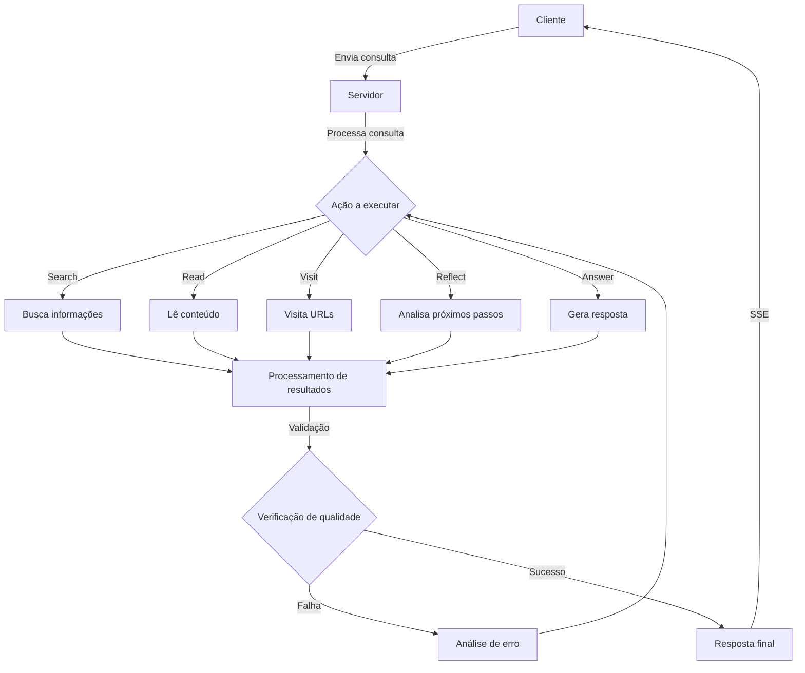
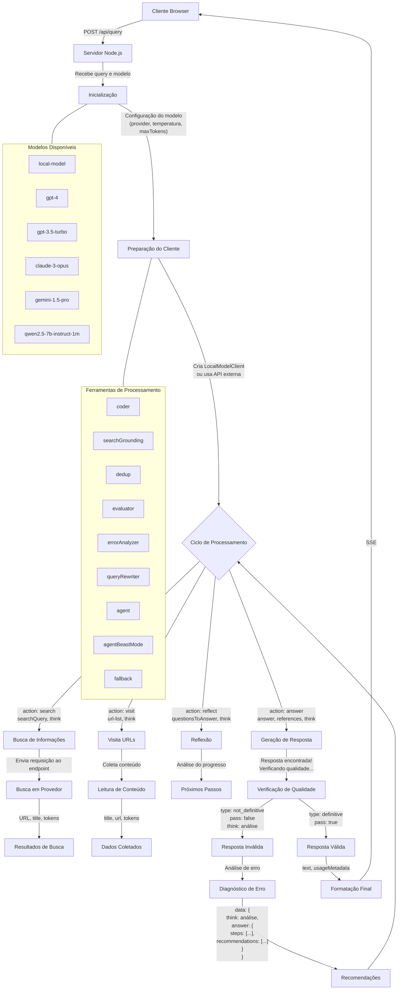
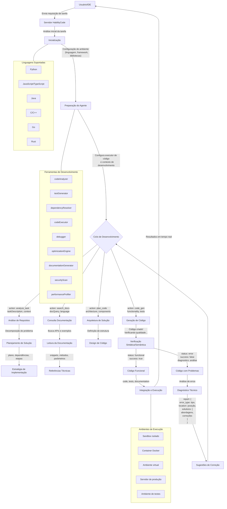
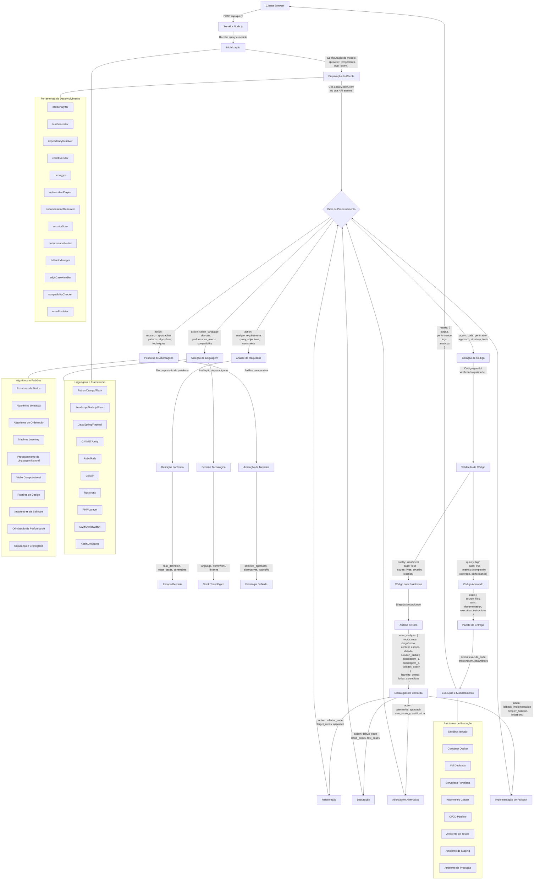
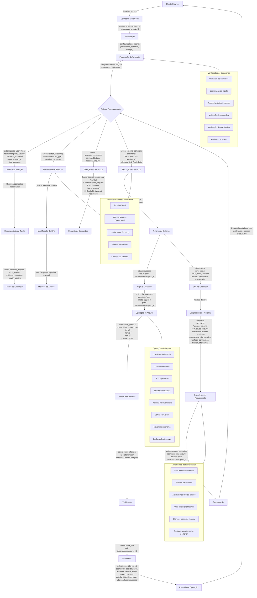

# Análise de Schemas para Sistema de Comunicação com SSE

## Índice

1. [Introdução](#introdução)
2. [Fluxo de Dados](#fluxo-de-dados)
3. [Configuração do Sistema](#configuração-do-sistema)
4. [Schemas Utilizados](#schemas-utilizados)
   - [Schema de Busca](#schema-de-busca)
   - [Schema de Resposta](#schema-de-resposta)
   - [Schema de Visita](#schema-de-visita)
   - [Schema de Reflexão](#schema-de-reflexão)
   - [Schema de Análise de Atribuição](#schema-de-análise-de-atribuição)
   - [Schema de Resposta Final do Modelo](#schema-de-resposta-final-do-modelo)
   - [Schema de Leitura](#schema-de-leitura)
   - [Schema de Resposta Alternativa](#schema-de-resposta-alternativa)
   - [Schema de Desduplicação](#schema-de-desduplicação)
   - [Schema de Avaliação de Qualidade](#schema-de-avaliação-de-qualidade)
   - [Schema de Análise de Erro](#schema-de-análise-de-erro)
   - [Schema de Resposta Definitiva](#schema-de-resposta-definitiva)
5. [Formato de Resposta do Sistema](#formato-de-resposta-do-sistema)
6. [Análise de Erros](#análise-de-erros)
7. [Modelos Suportados](#modelos-suportados)
8. [Conclusão](#conclusão)
9. [Fluxo Detalhado do Processamento](#fluxo-detalhado-do-processamento)

## Introdução

Este documento analisa a estrutura e os schemas utilizados em um sistema de comunicação que implementa Server-Sent Events (SSE) para criar um canal de comunicação em tempo real entre o backend e o frontend. O sistema parece estar construído para processar consultas, realizar buscas e fornecer respostas em um formato estruturado, com suporte para validação e análise de qualidade das respostas.

## Fluxo de Dados



## Configuração do Sistema

O sistema utiliza uma configuração modular que define os modelos e parâmetros utilizados para cada componente. A seguir está um exemplo da configuração extraída dos logs:

```json
{
  "provider": {
    "name": "gemini",
    "model": "gemini-2.0-flash"
  },
  "search": {
    "provider": "jina"
  },
  "tools": {
    "coder": {
      "model": "gemini-2.0-flash",
      "temperature": 0.7,
      "maxTokens": 8000
    },
    "searchGrounding": {
      "model": "gemini-2.0-flash",
      "temperature": 0,
      "maxTokens": 8000
    },
    "dedup": {
      "model": "gemini-2.0-flash",
      "temperature": 0.1,
      "maxTokens": 8000
    },
    "evaluator": {
      "model": "gemini-2.0-flash",
      "temperature": 0,
      "maxTokens": 8000
    },
    "errorAnalyzer": {
      "model": "gemini-2.0-flash",
      "temperature": 0,
      "maxTokens": 8000
    },
    "queryRewriter": {
      "model": "gemini-2.0-flash",
      "temperature": 0.1,
      "maxTokens": 8000
    },
    "agent": {
      "model": "gemini-2.0-flash",
      "temperature": 0.7,
      "maxTokens": 8000
    },
    "agentBeastMode": {
      "model": "gemini-2.0-flash",
      "temperature": 0.7,
      "maxTokens": 8000
    },
    "fallback": {
      "model": "gemini-2.0-flash",
      "temperature": 0,
      "maxTokens": 8000
    }
  },
  "defaults": {
    "stepSleep": 0
  }
}
```

**Parâmetros:**

- **provider**: Define o provedor e modelo principal a ser utilizado pelo sistema.
  - **name**: Nome do provedor (ex: "gemini").
  - **model**: Modelo específico a ser utilizado (ex: "gemini-2.0-flash").
- **search**: Configuração do provedor de busca.
  - **provider**: Nome do provedor de busca (ex: "jina").
- **tools**: Conjunto de ferramentas utilizadas pelo sistema, cada uma com sua própria configuração.
  - **coder**: Ferramenta para geração de código.
  - **searchGrounding**: Ferramenta para fundamentar buscas.
  - **dedup**: Ferramenta para desduplicação de consultas.
  - **evaluator**: Ferramenta para avaliação de respostas.
  - **errorAnalyzer**: Ferramenta para análise de erros.
  - **queryRewriter**: Ferramenta para reescrita de consultas.
  - **agent**: Ferramenta principal do agente.
  - **agentBeastMode**: Versão mais potente do agente.
  - **fallback**: Ferramenta de fallback para casos de falha.
- **defaults**: Configurações padrão do sistema.
  - **stepSleep**: Tempo de espera entre etapas (em milissegundos).

**Propósito:** Esta configuração define o comportamento e as capacidades do sistema, especificando quais modelos são utilizados para cada tipo de tarefa e quais são seus parâmetros (temperatura, número máximo de tokens, etc.). Isso permite uma personalização detalhada do comportamento do sistema.

## Schemas Utilizados

### Schema de Busca

```json
{
  "action": "search",
  "think": "String - Raciocínio por trás da busca",
  "searchQuery": "String - Termos de busca"
}
```

**Parâmetros:**

- **action**: Define a ação como "search". Usado para orientar o fluxo de processamento do sistema.
- **think**: Contém o raciocínio por trás da busca. Usado para documentar a lógica e para posterior análise.
- **searchQuery**: A string de busca a ser executada. Composta por termos relevantes para a consulta do usuário.

**Propósito:** Este schema é utilizado para iniciar uma busca de informações relevantes para a consulta do usuário. É o ponto de entrada para coletar dados que serão usados para gerar a resposta.

### Schema de Resposta

```json
{
  "action": "answer",
  "think": "String - Processo de pensamento",
  "answer": "String - Conteúdo da resposta",
  "references": [
    {
      "exactQuote": "String - Citação exata",
      "url": "String - URL da fonte"
    }
  ]
}
```

**Parâmetros:**

- **action**: Define a ação como "answer". Indica que esta é uma resposta final.
- **think**: Documenta o processo de pensamento por trás da resposta. Usado para transparência e análise.
- **answer**: O conteúdo da resposta a ser entregue ao usuário.
- **references**: Array contendo referências que embasam a resposta, com citações exatas e URLs das fontes.

**Propósito:** Este schema estrutura a resposta final ao usuário, garantindo que seja bem fundamentada com referências adequadas. As referências são cruciais para validar a precisão e credibilidade da resposta.

### Schema de Visita

```json
{
  "action": "visit",
  "think": "String - Justificativa para visitar URLs",
  "url-list": ["String - URLs a serem visitados"]
}
```

**Parâmetros:**

- **action**: Define a ação como "visit". Indica que o sistema deve visitar URLs específicos.
- **think**: Explica por que estas URLs são relevantes para a consulta.
- **url-list**: Array de URLs a serem visitados para coletar informações.

**Propósito:** Este schema é usado para direcionar o sistema a visitar URLs específicos para coletar informações relevantes. É uma etapa intermediária no processo de coleta de dados.

### Schema de Reflexão

```json
{
  "action": "reflect",
  "think": "String - Análise da situação atual",
  "questionsToAnswer": ["String - Perguntas a serem respondidas"]
}
```

**Parâmetros:**

- **action**: Define a ação como "reflect". Indica uma pausa para análise.
- **think**: Contém a análise da situação atual e o raciocínio do sistema.
- **questionsToAnswer**: Lista de perguntas que precisam ser respondidas para avançar.

**Propósito:** Este schema permite que o sistema pause e reflita sobre o progresso, identificando lacunas de informação ou direções a seguir. É um mecanismo de auto-correção e orientação para o fluxo de processamento.

### Schema de Análise de Atribuição

```json
{
  "attribution_analysis": {
    "sources_provided": Boolean,
    "sources_verified": Boolean,
    "quotes_accurate": Boolean
  }
}
```

**Parâmetros:**

- **sources_provided**: Indica se as fontes foram fornecidas na resposta.
- **sources_verified**: Indica se as fontes foram verificadas quanto à sua validade.
- **quotes_accurate**: Indica se as citações são precisas em relação às fontes.

**Propósito:** Este schema é usado para validar a qualidade das referências e citações na resposta. Garante que a resposta seja bem fundamentada e precisa.

### Schema de Resposta Final do Modelo

```json
{
  "text": "String - Conteúdo da resposta formatada",
  "usageMetadata": "Object - Metadados de uso e estatísticas"
}
```

**Parâmetros:**

- **text**: Contém o texto completo da resposta que será retornada ao usuário, já formatada.
- **usageMetadata**: Objeto contendo metadados sobre o processamento, como tokens utilizados, tempo de resposta, etc.

**Propósito:** Este schema é utilizado para formatar a resposta final que será enviada ao cliente. É o último estágio do processamento antes do envio via SSE.

**Contexto de Uso:** Este schema aparece no contexto de "Resposta encontrada! Verificando qualidade..." e é utilizado para acessar e validar a resposta final do modelo antes de enviá-la ao usuário.

### Schema de Leitura

```json
{
  "title": "String - Título do conteúdo lido",
  "url": "String - URL da fonte consultada",
  "tokens": Number - Quantidade de tokens processados
}
```

**Parâmetros:**

- **title**: Título do documento ou página web que foi lido.
- **url**: URL completa da fonte onde o conteúdo foi obtido.
- **tokens**: Número de tokens que o conteúdo consumiu no processamento.

**Propósito:** Este schema é usado para registrar informações sobre conteúdos que foram lidos de URLs específicas, incluindo metadados úteis para controle de tokens e referência.

**Contexto de Uso:** Aparece em registros como "Read: {...}" durante o processo de coleta de informações, geralmente após uma ação de visita a URLs.

### Schema de Resposta Alternativa

```json
{
  "action": "answer",
  "think": "String - Processo de pensamento",
  "answer": "String - Conteúdo da resposta",
  "nota_detalhada": "String - Informações adicionais e contexto",
  "references": [
    {
      "exactQuote": "String - Citação exata",
      "url": "String - URL da fonte"
    }
  ]
}
```

**Parâmetros:**

- **action**: Define a ação como "answer", indicando uma resposta final.
- **think**: Documenta o processo de pensamento por trás da resposta.
- **answer**: O conteúdo principal da resposta a ser entregue ao usuário.
- **nota_detalhada**: Campo adicional que fornece contexto e informações extras sobre o tema da resposta.
- **references**: Array contendo referências que embasam a resposta.

**Propósito:** Este schema é uma variação do schema de resposta padrão, incluindo uma "nota_detalhada" que fornece informações adicionais e contexto mais amplo sobre o tema da resposta. A diferença em relação ao Schema de Resposta Alternativa anterior é a mudança na nomenclatura do campo de "Nota Detalhada" para "nota_detalhada".

**Contexto de Uso:** Conforme observado nos logs, este formato é utilizado para responder com uma estrutura mais detalhada, frequentemente usado para separar a resposta direta de informações contextuais adicionais.

### Schema de Desduplicação

```json
{
  "unique_queries": ["String - Consultas únicas após processamento"]
}
```

**Parâmetros:**

- **unique_queries**: Array contendo consultas únicas após o processo de desduplicação.

**Propósito:** Este schema é utilizado no processo de desduplicação de consultas, garantindo que consultas semelhantes ou idênticas não sejam processadas múltiplas vezes, economizando recursos.

**Contexto de Uso:** Este schema é identificado nos erros como ausente (undefined) quando o processo de desduplicação falha, gerando erros de validação.

### Schema de Avaliação de Qualidade

```json
{
  "type": "not_definitive",
  "pass": false,
  "think": "String - Análise da qualidade da resposta"
}
```

ou

```json
{
  "type": "definitive",
  "pass": true
}
```

**Parâmetros:**

- **type**: Tipo de avaliação, podendo ser "definitive" (definitiva) ou "not_definitive" (não definitiva).
- **pass**: Booleano indicando se a resposta passou no critério de qualidade.
- **think**: Quando disponível, contém a análise do processo de avaliação e por que a resposta não é considerada adequada.

**Propósito:** Este schema é utilizado para avaliar a qualidade da resposta gerada, determinando se ela é definitiva e satisfatória ou se precisa de mais processamento. Uma resposta marcada como "definitive" e "pass: true" é considerada pronta para ser entregue ao usuário.

**Contexto de Uso:** Este schema aparece nos logs durante o processo de avaliação, após uma resposta ser gerada. Quando uma resposta não passa nos critérios de qualidade, o sistema pode tentar gerar uma nova resposta ou realizar análises adicionais.

### Schema de Análise de Erro

```json
{
  "data": {
    "think": "String - Análise do processo de erro",
    "answer": {
      "steps": ["String - Passos que causaram o erro"],
      "recommendations": ["String - Recomendações para resolver o erro"]
    }
  }
}
```

**Parâmetros:**

- **data**: Contém os dados da análise de erro.
  - **think**: Análise do processo que levou ao erro.
  - **answer**: Informações detalhadas sobre o erro e como resolvê-lo.
    - **steps**: Lista de passos que levaram ao erro, identificando onde o processo falhou.
    - **recommendations**: Lista de recomendações para resolver o erro e melhorar o processo.

**Propósito:** Este schema é utilizado quando o sistema encontra um erro e precisa analisá-lo para identificar a causa e propor soluções. Ele fornece uma estrutura para documentar o processo que levou ao erro e sugerir formas de corrigi-lo.

**Contexto de Uso:** Este schema é observado nos logs após uma falha no processamento ou quando uma resposta não passa pela validação de qualidade. Ele faz parte do mecanismo de auto-correção do sistema.

### Schema de Resposta Definitiva

```json
{
  "action": "answer",
  "think": "String - Processo de pensamento",
  "answer": "String - Conteúdo da resposta",
  "references": [
    {
      "exactQuote": "String - Citação exata",
      "url": "String - URL da fonte"
    }
  ],
  "type": "definitive",
  "pass": true
}
```

**Parâmetros:**

- **action**: Define a ação como "answer", indicando uma resposta final.
- **think**: Documenta o processo de pensamento por trás da resposta.
- **answer**: O conteúdo principal da resposta a ser entregue ao usuário.
- **references**: Array contendo referências que embasam a resposta.
- **type**: Indica que a resposta é "definitive" (definitiva).
- **pass**: Booleano indicando que a resposta passou nos critérios de qualidade.

**Propósito:** Este schema combina o schema de resposta padrão com o schema de avaliação de qualidade, indicando que a resposta é definitiva e pronta para ser entregue ao usuário. Ele é usado como o formato final antes da resposta ser enviada.

**Contexto de Uso:** Este schema é observado nos logs quando uma resposta passou por todos os processos de validação e está pronta para ser entregue ao usuário final.

## Formato de Resposta do Sistema

O sistema utiliza diferentes formatos de resposta durante o processamento. Abaixo estão os principais formatos identificados:

### Formato de Resposta JSON Bruto

```json
{
  "action": "answer",
  "think": "String - Processo de pensamento",
  "answer": "String - Conteúdo da resposta",
  "references": [
    {
      "exactQuote": "String - Citação exata",
      "url": "String - URL da fonte"
    }
  ],
  "Nota Detalhada": "String - Informações adicionais e contexto"
}
```

**Contexto:** Este formato representa a resposta bruta do modelo, antes de qualquer processamento adicional. É capturado em "Raw response text" e posteriormente processado para exibição.

### Formato de Resposta Processada

```javascript
{
  action: 'answer',
  think: 'String - Processo de pensamento',
  answer: 'String - Conteúdo da resposta',
  references: [
    {
      exactQuote: 'String - Citação exata',
      url: 'String - URL da fonte'
    }
  ],
  'Nota Detalhada': 'String - Informações adicionais e contexto'
}
```

**Contexto:** Este formato representa a resposta após processamento inicial, convertida de JSON para um objeto JavaScript. É acompanhado pela indicação "answer <- [search, read, answer, reflect]", mostrando a sequência de ações que levaram a esta resposta.

## Análise de Erros

O sistema também inclui um mecanismo de análise de erros que é acionado quando as respostas não atendem aos critérios de qualidade. Os erros comuns incluem:

### 1. Erros de Schema

Quando a resposta não segue o schema esperado.

```json
{
  "is_valid": Boolean,
  "context": Object
}
```

### 2. Erros de Token

Quando o contexto excede o limite de tokens permitido.

```
Trying to keep the first 9066 tokens when context the overflows. However, the model is loaded with context length of only 4096 tokens, which is not enough.
```

### 3. Erros de Validação Zod

Quando ocorrem falhas na validação de tipos usando a biblioteca Zod.

```
Erro na validação do schema: ZodError: [
  {
    "code": "invalid_type",
    "expected": "array",
    "received": "undefined",
    "path": [
      "unique_queries"
    ],
    "message": "Required"
  }
]
```

**Contexto:** Este erro ocorre durante o processo de desduplicação de consultas quando o campo "unique_queries" está indefinido mas é esperado como um array. É um erro de validação de tipo usando a biblioteca Zod, que pode ocorrer em vários pontos do processamento onde schemas são validados.

**Impacto:** Quando este erro ocorre, o processamento normal é interrompido e o sistema precisa realizar uma recuperação, geralmente tentando reprocessar a consulta ou prosseguir sem a desduplicação.

## Modelos Suportados

Com base nos logs analisados, o sistema suporta os seguintes modelos:

1. **local-model**: Um modelo que pode ser executado localmente.

   - **provider**: 'local'
   - **displayName**: 'Local'
   - **supportsStreaming**: true

2. **gpt-4**: Modelo da OpenAI.

   - **provider**: 'openai'
   - **displayName**: 'GPT-4'
   - **supportsStreaming**: true

3. **gpt-3.5-turbo**: Versão menos robusta do modelo da OpenAI.

   - **provider**: 'openai'
   - **displayName**: 'GPT-3.5'
   - **supportsStreaming**: true

4. **claude-3-opus-20240229**: Modelo da Anthropic.

   - **provider**: 'anthropic'
   - **displayName**: 'Claude'
   - **supportsStreaming**: true

5. **gemini-1.5-pro**: Modelo do Google.

   - **provider**: 'google'
   - **displayName**: 'Gemini Pro'
   - **supportsStreaming**: true

6. **qwen2.5-7b-instruct-1m**: Um modelo específico utilizado em algumas requisições, aparentemente implementado localmente.

Todos esses modelos suportam streaming, o que permite a transmissão de respostas em tempo real para o cliente usando Server-Sent Events (SSE).

## Conclusão

O sistema utiliza uma arquitetura baseada em Server-Sent Events (SSE) para comunicação em tempo real entre o backend e o frontend. Os schemas aqui documentados estruturam as diferentes etapas do processamento, desde a busca inicial até a entrega da resposta final, passando por validação e controle de qualidade.

Esta estruturação permite um fluxo de trabalho organizado e controlado, com capacidade de auto-correção através de mecanismos de reflexão e análise de erros. A ênfase na atribuição adequada de fontes e na precisão das citações demonstra um compromisso com a qualidade e confiabilidade das respostas.

Os diversos schemas e formatos de resposta permitem que o sistema seja flexível e adaptável a diferentes tipos de consultas e requisitos de informação, ao mesmo tempo que mantém a consistência e a qualidade das respostas. O mecanismo de tratamento de erros proporciona resiliência e capacidade de recuperação em situações adversas.

O sistema também oferece suporte a uma variedade de modelos de diferentes provedores, com flexibilidade para executar modelos localmente ou utilizar serviços externos, dependendo das necessidades e restrições de cada caso de uso.

## Fluxo Detalhado do Processamento

O diagrama abaixo apresenta um fluxo mais detalhado do processamento de uma consulta no sistema, baseado na análise dos logs:



O fluxo acima ilustra o processamento completo de uma consulta, desde o momento em que o cliente envia uma requisição até o recebimento da resposta final. Cada etapa do processamento utiliza schemas específicos e pode acionar diferentes ferramentas conforme necessário.

O ciclo de processamento principal (representado pelo nó E) pode envolver múltiplas iterações entre as ações de busca, visita, reflexão e resposta, até que uma resposta definitiva e de alta qualidade seja obtida. Quando ocorrem erros ou a resposta não atende aos critérios de qualidade, o sistema realiza uma análise detalhada e tenta corrigir o problema antes de prosseguir.

Os modelos disponíveis e as ferramentas de processamento são configuráveis e podem ser ajustados conforme as necessidades específicas de cada aplicação.

## Fluxo HabilityCode






