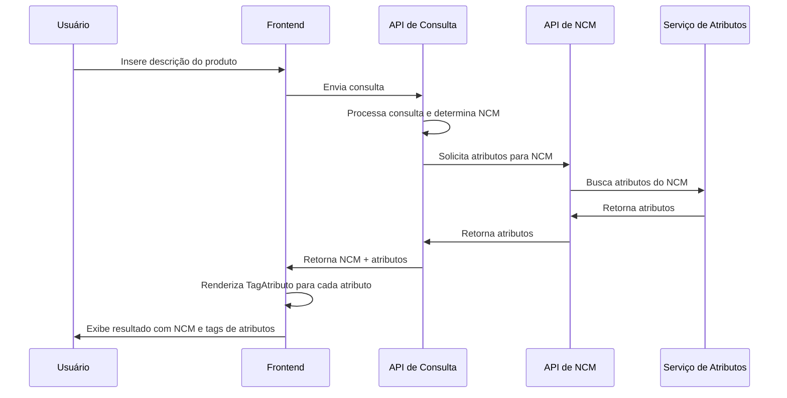
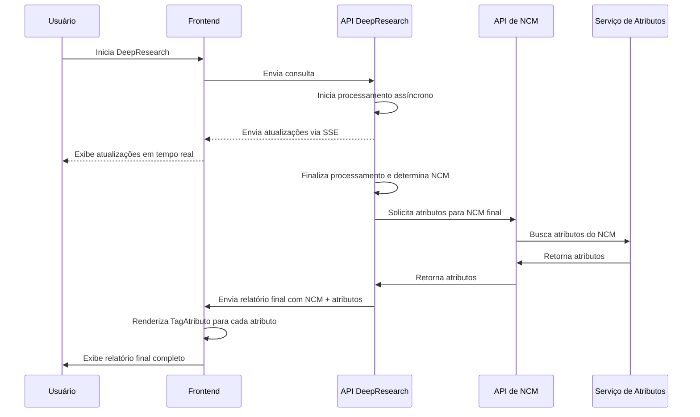
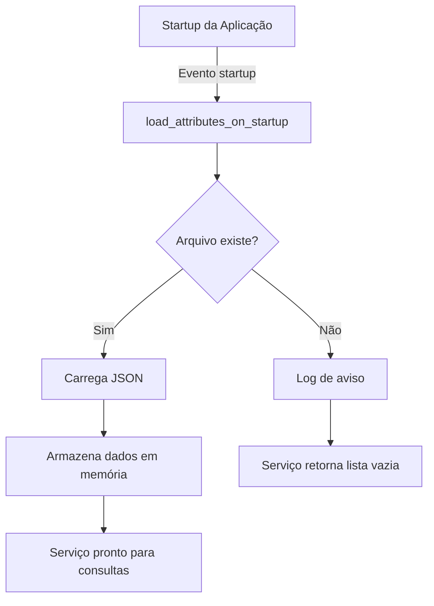

# Documentação da Integração de Atributos NCM

_Documento técnico para implementação da funcionalidade de consulta e exibição de atributos NCM no sistema_

## Sumário

1. [Arquitetura da Solução](#1-arquitetura-da-solução)
2. [Implementação Backend (FastAPI)](#2-implementação-backend-fastapi)
   - [Serviço de Atributos NCM](#21-serviço-de-atributos-ncm)
   - [Schemas Pydantic](#22-schemas-pydantic)
   - [Endpoint de Atributos](#23-endpoint-de-atributos)
   - [Integração no Fluxo Principal](#24-integração-no-fluxo-principal)
3. [Implementação Frontend (React)](#3-implementação-frontend-react)
   - [Tipos para Atributos NCM](#31-tipos-para-atributos-ncm)
   - [Componente TagAtributo](#32-componente-tagatributo)
   - [Estilos CSS](#33-estilos-css)
   - [Integração com DeepResearchSidebar](#34-integração-com-deepresearchsidebar)
4. [Esquema de Banco de Dados](#4-esquema-de-banco-de-dados)
5. [Diagramas de Fluxo](#5-diagramas-de-fluxo)

## 1. Arquitetura da Solução

A implementação seguirá uma arquitetura em camadas, onde:

1. Os dados dos atributos NCM serão carregados de um arquivo JSON.
2. Um serviço backend fornecerá acesso a esses dados através de endpoints REST.
3. O frontend consumirá esses endpoints e exibirá os atributos como tags com ícones e tooltips.

```mermaid
graph TD
    A[Arquivo JSON<br>atributos.json] --> B[Serviço de Atributos NCM]
    B --> C[Endpoint REST<br>/api/v1/ncm/{ncm_code}/attributes]
    C --> D[Frontend<br>TagAtributo Component]
    E[Consulta NCM] --> F[Determina NCM]
    F --> G[Busca Atributos da NCM]
    G --> H[Exibe Atributos como Tags]
```

## 2. Implementação Backend (FastAPI)

### 2.1 Serviço de Atributos NCM

Crie um novo módulo de serviço em `app/services/ncm_attributes_service.py`:

```python
import json
import logging
from typing import Dict, List, Optional
from fastapi import HTTPException
from pathlib import Path

logger = logging.getLogger(__name__)

class NCMAttributesService:
    """Serviço para gerenciar atributos de NCM."""

    _attributes_data: Dict = {}

    @classmethod
    async def load_attributes_data(cls) -> None:
        """Carrega os dados de atributos do arquivo JSON no startup."""
        try:
            file_path = Path(__file__).parent.parent / "schemas" / "atributos" / "atributos.json"

            if not file_path.exists():
                logger.warning(f"Arquivo de atributos não encontrado: {file_path}")
                return

            with open(file_path, 'r', encoding='utf-8') as f:
                cls._attributes_data = json.load(f)

            logger.info(f"Dados de atributos NCM carregados com sucesso: {len(cls._attributes_data)} entradas")
        except Exception as e:
            logger.error(f"Erro ao carregar dados de atributos NCM: {str(e)}")

    @classmethod
    def get_attributes_for_ncm(cls, ncm_code: str) -> List[Dict]:
        """
        Obtém os atributos para um código NCM específico.

        Args:
            ncm_code: Código NCM de 8 dígitos

        Returns:
            Lista de dicionários de atributos para o NCM
        """
        if not cls._attributes_data:
            logger.warning("Dados de atributos não foram carregados")
            return []

        # Verifica se o formato do NCM é válido
        if not (isinstance(ncm_code, str) and len(ncm_code) == 8 and ncm_code.isdigit()):
            logger.warning(f"Código NCM inválido: {ncm_code}")
            return []

        # Implementar lógica para encontrar atributos do NCM
        # Esta é uma implementação básica, pode precisar ser adaptada de acordo
        # com a estrutura real do seu arquivo JSON
        attributes = []

        if "itens" in cls._attributes_data:
            # Supondo que os atributos estão organizados por NCM no arquivo
            ncm_attributes = cls._attributes_data.get("itens", {}).get(ncm_code, [])

            if ncm_attributes:
                attributes.extend(ncm_attributes)
            else:
                logger.info(f"Nenhum atributo encontrado para NCM: {ncm_code}")

        return attributes

# Função para registrar no startup da aplicação
async def load_attributes_on_startup():
    """Função para carregar dados de atributos no startup da aplicação."""
    await NCMAttributesService.load_attributes_data()
```

### 2.2 Schemas Pydantic

Crie schemas Pydantic em `app/models/ncm_attribute_schemas.py`:

```python
from pydantic import BaseModel, Field
from typing import List, Optional, Dict, Any, Union
from datetime import date
from enum import Enum

class DominioItem(BaseModel):
    """Representa um item de domínio de um atributo."""
    codigo: str
    descricao: str

class Objetivo(BaseModel):
    """Representa um objetivo de um atributo."""
    codigo: str
    descricao: str

class FormaPreenchimentoEnum(str, Enum):
    """Enumeração das possíveis formas de preenchimento."""
    TEXTO = "TEXTO"
    NUMERO_INTEIRO = "NUMERO_INTEIRO"
    NUMERO_REAL = "NUMERO_REAL"
    BOOLEANO = "BOOLEANO"
    DATA = "DATA"
    LISTA_ESTATICA = "LISTA_ESTATICA"
    LISTA_DINAMICA = "LISTA_DINAMICA"

class ModalidadeEnum(str, Enum):
    """Enumeração das possíveis modalidades."""
    IMPORTACAO = "IMPORTACAO"
    EXPORTACAO = "EXPORTACAO"
    AMBOS = "AMBOS"

class OperadorEnum(str, Enum):
    """Enumeração dos possíveis operadores para condições."""
    IGUAL = "IGUAL"
    DIFERENTE = "DIFERENTE"
    MAIOR = "MAIOR"
    MENOR = "MENOR"
    MAIOR_IGUAL = "MAIOR_IGUAL"
    MENOR_IGUAL = "MENOR_IGUAL"
    EM = "EM"
    NAO_EM = "NAO_EM"

class ComposicaoEnum(str, Enum):
    """Enumeração de tipos de composição de condições."""
    E = "E"
    OU = "OU"

class Condicao(BaseModel):
    """Representa uma condição para um atributo condicionado."""
    operador: OperadorEnum
    valor: Any
    composicao: Optional[ComposicaoEnum] = None
    condicao: Optional['Condicao'] = None

class AtributoNCM(BaseModel):
    """Modelo base para atributos de NCM."""
    codigo: str
    nome: str
    nomeApresentacao: str
    formaPreenchimento: FormaPreenchimentoEnum
    modalidade: ModalidadeEnum
    obrigatorio: bool
    dataInicioVigencia: date
    dataFimVigencia: Optional[date] = None
    dominio: Optional[List[DominioItem]] = None
    objetivos: List[Objetivo]
    orgaos: List[str]
    atributoCondicionante: bool = False
    multivalorado: bool = False
    listaSubatributos: Optional[List['AtributoNCM']] = None

    class Config:
        use_enum_values = True

class AtributoCondicionadoDetalhe(BaseModel):
    """Detalhe de um atributo condicionado."""
    atributo: AtributoNCM

class AtributoCondicionado(BaseModel):
    """Representa um atributo condicionado."""
    obrigatorio: bool
    multivalorado: bool
    dataInicioVigencia: date
    dataFimVigencia: Optional[date] = None
    detalhe: AtributoCondicionadoDetalhe
    condicao: Condicao

# Atualização recursiva dos modelos
AtributoNCM.update_forward_refs()
Condicao.update_forward_refs()
```

### 2.3 Endpoint de Atributos

Crie um router em `app/routes/ncm_attributes.py`:

```python
from fastapi import APIRouter, HTTPException, Path, Depends
from typing import List, Dict, Any
import logging

from app.models.ncm_attribute_schemas import AtributoNCM
from app.services.ncm_attributes_service import NCMAttributesService

logger = logging.getLogger(__name__)

router = APIRouter(
    prefix="/api/v1/ncm",
    tags=["ncm-attributes"],
    responses={404: {"description": "Atributos não encontrados"}},
)

@router.get("/{ncm_code}/attributes", response_model=List[AtributoNCM])
async def get_ncm_attributes(
    ncm_code: str = Path(..., description="Código NCM de 8 dígitos")
):
    """
    Retorna os atributos para um código NCM específico.

    - **ncm_code**: Código NCM de 8 dígitos
    """
    # Validação básica do NCM
    if not (len(ncm_code) == 8 and ncm_code.isdigit()):
        raise HTTPException(
            status_code=400,
            detail=f"Código NCM inválido: {ncm_code}. Deve ter 8 dígitos numéricos."
        )

    # Obter atributos do serviço
    attributes_data = NCMAttributesService.get_attributes_for_ncm(ncm_code)

    if not attributes_data:
        logger.info(f"Nenhum atributo encontrado para NCM: {ncm_code}")
        return []

    # Validar cada atributo contra o schema
    validated_attributes = []

    for attr_dict in attributes_data:
        try:
            # Tenta validar com o schema
            attribute = AtributoNCM.parse_obj(attr_dict)
            validated_attributes.append(attribute)
        except Exception as e:
            # Log de erro e continua com o próximo
            logger.warning(f"Erro ao validar atributo para NCM {ncm_code}: {str(e)}")
            continue

    return validated_attributes
```

Adicione o router ao `app/main.py`:

```python
from app.routes import ncm_attributes
from app.services.ncm_attributes_service import load_attributes_on_startup

# ... código existente ...

app.include_router(ncm_attributes.router)

@app.on_event("startup")
async def startup_event():
    # ... código existente ...
    await load_attributes_on_startup()
```

### 2.4 Integração no Fluxo Principal

Modificação em `app/routes/queries/__init__.py`:

```python
import httpx
from fastapi import Request, Response

# ... importações existentes ...

@router.post("/query-simple")
async def query_simple(request: Request, query: QueryInput):
    # ... código existente para determinar a NCM ...

    # Supondo que a NCM é obtida em 'sugestao_ncm'
    if sugestao_ncm:
        # Obter os atributos para a NCM
        async with httpx.AsyncClient() as client:
            try:
                ncm_code = sugestao_ncm.code  # ou o campo apropriado
                attributes_response = await client.get(
                    f"{request.base_url}api/v1/ncm/{ncm_code}/attributes"
                )
                attributes_response.raise_for_status()

                # Adicionar os atributos à resposta
                sugestao_ncm.atributos_detalhados = attributes_response.json()
            except Exception as e:
                logger.warning(f"Erro ao obter atributos para NCM {ncm_code}: {str(e)}")
                sugestao_ncm.atributos_detalhados = []

    # ... resto do código existente ...

@router.post("/deep-research")
async def deep_research(request: Request, query: DeepResearchInput):
    # ... código existente ...

    # Na função handleCompletedProcess ou equivalente:
    async def handleCompletedProcess(final_report):
        # ... código existente ...

        # Obter atributos para a NCM final
        if final_report.ncm_code:
            async with httpx.AsyncClient() as client:
                try:
                    attributes_response = await client.get(
                        f"{request.base_url}api/v1/ncm/{final_report.ncm_code}/attributes"
                    )
                    attributes_response.raise_for_status()

                    # Adicionar os atributos ao relatório final
                    final_report.detailed_attributes = attributes_response.json()
                except Exception as e:
                    logger.warning(f"Erro ao obter atributos para NCM {final_report.ncm_code}: {str(e)}")
                    final_report.detailed_attributes = []

        # ... resto do código existente ...
```

## 3. Implementação Frontend (React)

### 3.1 Tipos para Atributos NCM

Crie ou atualize `src/types/atributos.ts`:

```typescript
export enum FormaPreenchimento {
  TEXTO = "TEXTO",
  NUMERO_INTEIRO = "NUMERO_INTEIRO",
  NUMERO_REAL = "NUMERO_REAL",
  BOOLEANO = "BOOLEANO",
  DATA = "DATA",
  LISTA_ESTATICA = "LISTA_ESTATICA",
  LISTA_DINAMICA = "LISTA_DINAMICA",
}

export enum Modalidade {
  IMPORTACAO = "IMPORTACAO",
  EXPORTACAO = "EXPORTACAO",
  AMBOS = "AMBOS",
}

export interface DominioItem {
  codigo: string;
  descricao: string;
}

export interface Objetivo {
  codigo: string;
  descricao: string;
}

export interface AtributoNCM {
  codigo: string;
  nome: string;
  nomeApresentacao: string;
  formaPreenchimento: FormaPreenchimento;
  modalidade: Modalidade;
  obrigatorio: boolean;
  dataInicioVigencia: string;
  dataFimVigencia?: string;
  dominio?: DominioItem[];
  objetivos: Objetivo[];
  orgaos: string[];
  atributoCondicionante: boolean;
  multivalorado: boolean;
}
```

### 3.2 Componente TagAtributo

Atualize o componente `src/components/TagAtributo/index.tsx`:

```typescript
import React from "react";
import { Tooltip } from "@/components/ui/tooltip";
import { FaFileImport, FaFileExport, FaGlobeAmericas } from "react-icons/fa";
import {
  BsListCheck,
  BsToggleOn,
  BsTextParagraph,
  BsCalendarDate,
} from "react-icons/bs";
import { TbNumbers } from "react-icons/tb";
import { RiErrorWarningFill } from "react-icons/ri";
import { AtributoNCM, FormaPreenchimento, Modalidade } from "@/types/atributos";
import styles from "./styles.module.css";

interface TagAtributoProps {
  attribute: AtributoNCM;
  onRemove?: (codigo: string) => void;
}

const TagAtributo: React.FC<TagAtributoProps> = ({ attribute, onRemove }) => {
  // Mapeamento de ícones para modalidades
  const modalidadeIcon = (modalidade: Modalidade) => {
    switch (modalidade) {
      case Modalidade.IMPORTACAO:
        return <FaFileImport className={styles.iconModalidade} />;
      case Modalidade.EXPORTACAO:
        return <FaFileExport className={styles.iconModalidade} />;
      case Modalidade.AMBOS:
        return <FaGlobeAmericas className={styles.iconModalidade} />;
      default:
        return null;
    }
  };

  // Mapeamento de ícones para formas de preenchimento
  const formaPreenchimentoIcon = (forma: FormaPreenchimento) => {
    switch (forma) {
      case FormaPreenchimento.LISTA_ESTATICA:
      case FormaPreenchimento.LISTA_DINAMICA:
        return <BsListCheck className={styles.iconForma} />;
      case FormaPreenchimento.BOOLEANO:
        return <BsToggleOn className={styles.iconForma} />;
      case FormaPreenchimento.TEXTO:
        return <BsTextParagraph className={styles.iconForma} />;
      case FormaPreenchimento.NUMERO_INTEIRO:
      case FormaPreenchimento.NUMERO_REAL:
        return <TbNumbers className={styles.iconForma} />;
      case FormaPreenchimento.DATA:
        return <BsCalendarDate className={styles.iconForma} />;
      default:
        return null;
    }
  };

  // Texto para tooltip de modalidade
  const getModalidadeText = (modalidade: Modalidade) => {
    switch (modalidade) {
      case Modalidade.IMPORTACAO:
        return "Importação";
      case Modalidade.EXPORTACAO:
        return "Exportação";
      case Modalidade.AMBOS:
        return "Importação e Exportação";
      default:
        return "Modalidade desconhecida";
    }
  };

  // Texto para tooltip de forma de preenchimento
  const getFormaPreenchimentoText = (forma: FormaPreenchimento) => {
    switch (forma) {
      case FormaPreenchimento.LISTA_ESTATICA:
        return "Lista estática - selecione uma opção";
      case FormaPreenchimento.LISTA_DINAMICA:
        return "Lista dinâmica - selecione uma opção";
      case FormaPreenchimento.BOOLEANO:
        return "Booleano - sim ou não";
      case FormaPreenchimento.TEXTO:
        return "Texto livre";
      case FormaPreenchimento.NUMERO_INTEIRO:
        return "Número inteiro";
      case FormaPreenchimento.NUMERO_REAL:
        return "Número decimal";
      case FormaPreenchimento.DATA:
        return "Data";
      default:
        return "Forma de preenchimento desconhecida";
    }
  };

  return (
    <div className={styles.tagContainer}>
      {/* Ícone de modalidade com tooltip */}
      <Tooltip
        content={getModalidadeText(attribute.modalidade)}
        className={styles.tooltipModalidade}
      >
        <span className={styles.modalidadeContainer}>
          {modalidadeIcon(attribute.modalidade)}
        </span>
      </Tooltip>

      {/* Nome de apresentação do atributo */}
      <span className={styles.tagText}>{attribute.nomeApresentacao}</span>

      {/* Ícone de forma de preenchimento com tooltip */}
      <Tooltip
        content={getFormaPreenchimentoText(attribute.formaPreenchimento)}
        className={styles.tooltipForma}
      >
        <span className={styles.formaContainer}>
          {formaPreenchimentoIcon(attribute.formaPreenchimento)}
        </span>
      </Tooltip>

      {/* Ícone de obrigatoriedade com tooltip */}
      {attribute.obrigatorio && (
        <Tooltip
          content="Atributo obrigatório"
          className={styles.tooltipObrigatorio}
        >
          <span className={styles.obrigatorioContainer}>
            <RiErrorWarningFill className={styles.iconObrigatorio} />
          </span>
        </Tooltip>
      )}

      {/* Botão de remover se a função onRemove for fornecida */}
      {onRemove && (
        <button
          className={styles.removeButton}
          onClick={() => onRemove(attribute.codigo)}
          aria-label="Remover atributo"
        >
          ×
        </button>
      )}
    </div>
  );
};

export default TagAtributo;
```

### 3.3 Estilos CSS

Crie ou atualize `src/components/TagAtributo/styles.module.css`:

```css
.tagContainer {
  display: flex;
  align-items: center;
  background-color: #f5f5f5;
  border-radius: 16px;
  padding: 4px 12px;
  margin: 4px;
  font-size: 14px;
  box-shadow: 0 1px 3px rgba(0, 0, 0, 0.1);
  transition: all 0.2s ease;
}

.tagContainer:hover {
  background-color: #e9e9e9;
}

.modalidadeContainer {
  display: flex;
  align-items: center;
  margin-right: 6px;
}

.formaContainer {
  display: flex;
  align-items: center;
  margin-left: 6px;
}

.obrigatorioContainer {
  display: flex;
  align-items: center;
  margin-left: 6px;
}

.tagText {
  margin: 0 4px;
  font-weight: 500;
}

.iconModalidade {
  font-size: 16px;
  color: #0066cc;
}

.iconForma {
  font-size: 16px;
  color: #555555;
}

.iconObrigatorio {
  font-size: 16px;
  color: #cc0000;
}

.removeButton {
  background: none;
  border: none;
  color: #888;
  cursor: pointer;
  font-size: 16px;
  line-height: 1;
  margin-left: 8px;
  padding: 0;
  display: flex;
  align-items: center;
  justify-content: center;
  width: 18px;
  height: 18px;
  border-radius: 50%;
}

.removeButton:hover {
  color: #333;
  background-color: #ddd;
}

/* Estilos para tooltips */
.tooltipModalidade {
  background-color: #000;
  color: #fff;
  font-size: 12px;
  padding: 4px 8px;
  border-radius: 4px;
  z-index: 1000;
}

.tooltipForma,
.tooltipObrigatorio {
  background-color: #fff;
  color: #333;
  font-size: 12px;
  padding: 4px 8px;
  border-radius: 4px;
  box-shadow: 0 2px 8px rgba(0, 0, 0, 0.15);
  z-index: 1000;
}
```

### 3.4 Integração com DeepResearchSidebar

Modifique o componente que exibe os resultados (assumindo `DeepResearchSidebar`):

```typescript
import { AtributoNCM } from "@/types/atributos";
import TagAtributo from "@/components/TagAtributo";

// ... código existente ...

// Supondo que FinalReport tenha um campo detailed_attributes adicionado
interface FinalReport {
  // ... campos existentes ...
  detailed_attributes?: AtributoNCM[];
}

const DeepResearchSidebar = () => {
  // ... código existente ...

  // Renderização das tags de atributos
  const renderAttributeTags = () => {
    if (!finalReport?.detailed_attributes?.length) {
      return null;
    }

    return (
      <div className="attributeTagsContainer">
        <h3 className="attributeTagsTitle">Atributos NCM</h3>
        <div className="attributeTagsList">
          {finalReport.detailed_attributes.map((attribute) => (
            <TagAtributo
              key={attribute.codigo}
              attribute={attribute}
              onRemove={handleRemoveAttribute}
            />
          ))}
        </div>
      </div>
    );
  };

  // Função para remover um atributo da lista (se necessário)
  const handleRemoveAttribute = (codigo: string) => {
    // Implementar lógica de remoção se necessário
    console.log(`Remover atributo: ${codigo}`);
  };

  return (
    <div>
      {/* ... código existente ... */}

      {/* Renderizar os atributos após a seção de NCM */}
      {finalReport && finalReport.ncm_code && renderAttributeTags()}

      {/* ... resto do código existente ... */}
    </div>
  );
};
```

## 4. Esquema de Banco de Dados

Se for necessário armazenar os atributos NCM no banco de dados (Supabase), aqui está um esquema SQL sugerido:

```sql
-- Tabela para armazenar todos os atributos NCM
CREATE TABLE ncm_attributes (
  id SERIAL PRIMARY KEY,
  codigo VARCHAR(50) NOT NULL,
  nome VARCHAR(255) NOT NULL,
  nome_apresentacao VARCHAR(255) NOT NULL,
  forma_preenchimento VARCHAR(50) NOT NULL,
  modalidade VARCHAR(50) NOT NULL,
  obrigatorio BOOLEAN NOT NULL DEFAULT FALSE,
  data_inicio_vigencia DATE NOT NULL,
  data_fim_vigencia DATE,
  atributo_condicionante BOOLEAN NOT NULL DEFAULT FALSE,
  multivalorado BOOLEAN NOT NULL DEFAULT FALSE,
  created_at TIMESTAMP WITH TIME ZONE DEFAULT NOW(),
  updated_at TIMESTAMP WITH TIME ZONE DEFAULT NOW(),
  UNIQUE(codigo)
);

-- Tabela para mapear NCMs para seus atributos
CREATE TABLE ncm_to_attributes (
  id SERIAL PRIMARY KEY,
  ncm_code VARCHAR(8) NOT NULL,
  attribute_id INTEGER NOT NULL REFERENCES ncm_attributes(id) ON DELETE CASCADE,
  created_at TIMESTAMP WITH TIME ZONE DEFAULT NOW(),
  UNIQUE(ncm_code, attribute_id)
);

-- Tabela para os itens de domínio dos atributos
CREATE TABLE attribute_domain_items (
  id SERIAL PRIMARY KEY,
  attribute_id INTEGER NOT NULL REFERENCES ncm_attributes(id) ON DELETE CASCADE,
  codigo VARCHAR(50) NOT NULL,
  descricao TEXT NOT NULL,
  created_at TIMESTAMP WITH TIME ZONE DEFAULT NOW()
);

-- Tabela para os objetivos dos atributos
CREATE TABLE attribute_objectives (
  id SERIAL PRIMARY KEY,
  attribute_id INTEGER NOT NULL REFERENCES ncm_attributes(id) ON DELETE CASCADE,
  codigo VARCHAR(50) NOT NULL,
  descricao TEXT NOT NULL,
  created_at TIMESTAMP WITH TIME ZONE DEFAULT NOW()
);

-- Tabela para os órgãos responsáveis pelos atributos
CREATE TABLE attribute_organizations (
  id SERIAL PRIMARY KEY,
  attribute_id INTEGER NOT NULL REFERENCES ncm_attributes(id) ON DELETE CASCADE,
  orgao_codigo VARCHAR(50) NOT NULL,
  created_at TIMESTAMP WITH TIME ZONE DEFAULT NOW()
);

-- Tabela para relações de atributos condicionados
CREATE TABLE attribute_conditions (
  id SERIAL PRIMARY KEY,
  attribute_id INTEGER NOT NULL REFERENCES ncm_attributes(id) ON DELETE CASCADE,
  condicao_json JSONB NOT NULL, -- Armazena toda a estrutura JSON da condição
  created_at TIMESTAMP WITH TIME ZONE DEFAULT NOW()
);

-- Índices para melhorar a performance
CREATE INDEX idx_ncm_code ON ncm_to_attributes(ncm_code);
CREATE INDEX idx_attribute_id ON ncm_to_attributes(attribute_id);
CREATE INDEX idx_domain_attribute_id ON attribute_domain_items(attribute_id);
CREATE INDEX idx_objectives_attribute_id ON attribute_objectives(attribute_id);
CREATE INDEX idx_organizations_attribute_id ON attribute_organizations(attribute_id);
```

## 5. Diagramas de Fluxo

### Fluxo de Consulta Simples



### Fluxo de DeepResearch



### Fluxo de Carregamento de Dados


