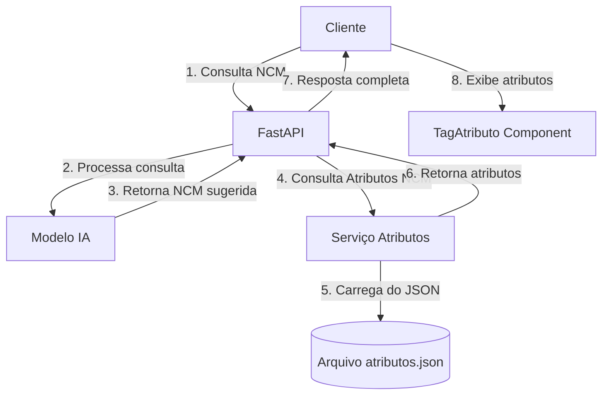
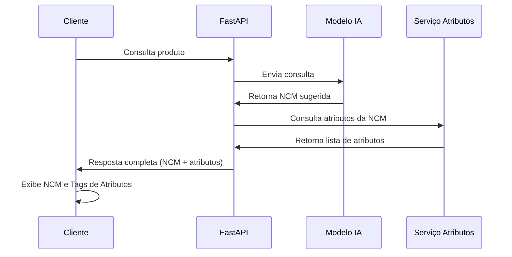
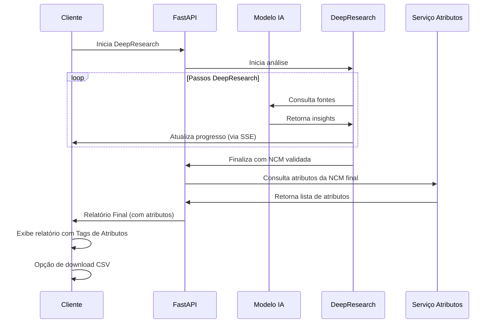
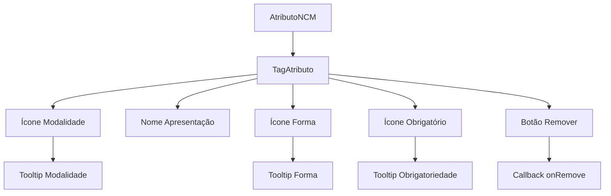

# Integração de Atributos NCM

Este documento contém a especificação técnica e prompts para implementação da funcionalidade de consulta e exibição de atributos NCM no sistema.

## Sumário

1. [Visão Geral](#visão-geral)
2. [Arquitetura](#arquitetura)
3. [Prompts de Implementação](#prompts-de-implementação)
   - [Backend (FastAPI)](#backend-fastapi)
   - [Frontend (React)](#frontend-react)
4. [Esquema de Banco de Dados](#esquema-de-banco-de-dados)
5. [Fluxos de Dados](#fluxos-de-dados)

## Visão Geral

A funcionalidade de atributos NCM permite consultar e exibir atributos específicos associados a códigos NCM. Estes atributos representam características específicas que produtos classificados sob determinada NCM devem informar para conformidade com exigências de órgãos reguladores (ANVISA, RECEITA, etc.).

A implementação envolve:

1. Carregar e consultar dados de atributos do arquivo JSON existente
2. Implementar um endpoint para buscar atributos por código NCM
3. Modificar o componente `TagAtributo` para exibir detalhes visuais dos atributos
4. Integrar esta funcionalidade ao fluxo de consulta existente

## Arquitetura



## Prompts de Implementação

### Backend (FastAPI)

#### Prompt 1: Serviço de Atributos NCM

```python
@fastapi
# Crie um serviço para gerenciar atributos NCM em app/services/ncm_attributes_service.py

import json
import os
from typing import Dict, List, Optional, Any
from pathlib import Path

class NCMAttributesService:
    """Serviço para gerenciar atributos NCM."""

    _instance = None
    _attributes_data = None

    def __new__(cls):
        """Implementa padrão Singleton."""
        if cls._instance is None:
            cls._instance = super(NCMAttributesService, cls).__new__(cls)
        return cls._instance

    def __init__(self):
        """Inicializa o serviço se ainda não foi inicializado."""
        if NCMAttributesService._attributes_data is None:
            self._load_attributes()

    def _load_attributes(self):
        """Carrega os dados de atributos do arquivo JSON."""
        try:
            # Caminho para o arquivo de atributos
            file_path = Path(__file__).parent.parent / "schemas" / "atributos" / "atributos.json"

            # Verifica se o arquivo existe
            if not file_path.exists():
                print(f"Arquivo de atributos não encontrado em: {file_path}")
                NCMAttributesService._attributes_data = {"attributes": [], "ncm_map": {}}
                return

            # Carrega o arquivo JSON
            with open(file_path, "r", encoding="utf-8") as f:
                data = json.load(f)

            # Estrutura esperada: um objeto com uma lista de atributos
            attributes = data.get("attributes", [])

            # Criar um mapa para acesso rápido: NCM -> lista de atributos
            ncm_map = {}

            # TODO: Processar o arquivo conforme sua estrutura real
            # Este é um exemplo genérico que você precisará adaptar
            # à estrutura real do arquivo atributos.json

            NCMAttributesService._attributes_data = {
                "attributes": attributes,
                "ncm_map": ncm_map
            }

            print(f"Carregados {len(attributes)} atributos NCM")

        except Exception as e:
            print(f"Erro ao carregar atributos NCM: {str(e)}")
            NCMAttributesService._attributes_data = {"attributes": [], "ncm_map": {}}

    def get_attributes_for_ncm(self, ncm_code: str) -> List[Dict[str, Any]]:
        """
        Obtém atributos para um código NCM específico.

        Args:
            ncm_code: Código NCM para buscar atributos

        Returns:
            Lista de atributos para o NCM especificado
        """
        # Remove pontos e traços do código NCM para normalização
        normalized_ncm = ncm_code.replace(".", "").replace("-", "")

        # Busca no mapa de NCM
        attributes = self._attributes_data["ncm_map"].get(normalized_ncm, [])

        # Se não encontrar, pode implementar uma lógica de fallback
        # Por exemplo, buscar pelos primeiros dígitos

        return attributes

    def get_attribute_by_code(self, attribute_code: str) -> Optional[Dict[str, Any]]:
        """
        Obtém um atributo específico pelo código.

        Args:
            attribute_code: Código do atributo para buscar

        Returns:
            Atributo encontrado ou None
        """
        # Busca na lista de atributos
        for attr in self._attributes_data["attributes"]:
            if attr.get("codigo") == attribute_code:
                return attr

        return None

# Inicialização do serviço
ncm_attributes_service = NCMAttributesService()

def get_ncm_attributes_service() -> NCMAttributesService:
    """Factory function para injeção de dependência."""
    return ncm_attributes_service
```

#### Prompt 2: Schemas Pydantic

```python
@fastapi
# Crie schemas para atributos NCM em app/models/ncm_attribute_schemas.py

from typing import List, Optional, Union, Dict, Any
from pydantic import BaseModel, Field
from datetime import date
from enum import Enum


class FormaPreenchimento(str, Enum):
    """Enumeração para as formas de preenchimento de atributos."""
    LISTA_ESTATICA = "LISTA_ESTATICA"
    BOOLEANO = "BOOLEANO"
    DATA = "DATA"
    DATA_HORA = "DATA_HORA"
    NUMERO_INTEIRO = "NUMERO_INTEIRO"
    NUMERO_REAL = "NUMERO_REAL"
    TEXTO = "TEXTO"
    DOMINIO_DINAMICO = "DOMINIO_DINAMICO"
    COMPOSTO = "COMPOSTO"
    LISTA_TABX_FILTRO = "LISTA_TABX_FILTRO"


class Modalidade(str, Enum):
    """Enumeração para as modalidades de operação."""
    IMPORTACAO = "IMPORTACAO"
    EXPORTACAO = "EXPORTACAO"


class DominioItem(BaseModel):
    """Item do domínio de um atributo."""
    codigo: str
    descricao: str


class Objetivo(BaseModel):
    """Objetivo de um atributo."""
    codigo: int
    descricao: str


class Condicao(BaseModel):
    """Condição para um atributo condicionado."""
    operador: Optional[str] = None
    valor: Optional[str] = None
    composicao: Optional[str] = None
    condicao: Optional["Condicao"] = None


class AtributoNcmBase(BaseModel):
    """Modelo base para atributos NCM."""
    codigo: str
    nome: Optional[str] = None
    nomeApresentacao: str
    orientacaoPreenchimento: Optional[str] = None
    formaPreenchimento: FormaPreenchimento
    tamanhoMaximo: Optional[int] = None
    mascara: Optional[str] = None
    casasDecimais: Optional[int] = None
    modalidade: Optional[str] = None
    obrigatorio: bool = False
    dataInicioVigencia: Union[str, date]
    dataFimVigencia: Optional[Union[str, date]] = None
    informacaoAdicional: Optional[str] = None
    dominio: List[DominioItem] = Field(default_factory=list)
    objetivos: List[Objetivo] = Field(default_factory=list)
    orgaos: List[str] = Field(default_factory=list)
    atributoCondicionante: bool = False
    multivalorado: bool = False


class AtributoNcm(AtributoNcmBase):
    """Modelo completo para atributos NCM."""
    condicionados: List["AtributoCondicionado"] = Field(default_factory=list)
    listaSubatributos: List["AtributoNcm"] = Field(default_factory=list)


class AtributoCondicionado(BaseModel):
    """Atributo condicionado por outro atributo."""
    obrigatorio: bool = False
    multivalorado: bool = False
    dataInicioVigencia: Union[str, date]
    dataFimVigencia: Optional[Union[str, date]] = None
    descricaoCondicao: Optional[str] = None
    condicao: Optional[Condicao] = None
    atributo: AtributoNcm


class NcmAttributesResponse(BaseModel):
    """Resposta para consulta de atributos NCM."""
    codigoNcm: str
    listaAtributos: List[AtributoNcm] = Field(default_factory=list)


# Resolver referências circulares
AtributoNcm.update_forward_refs()
AtributoCondicionado.update_forward_refs()
Condicao.update_forward_refs()
```

#### Prompt 3: Router NCM Attributes

```python
@fastapi
# Crie um router para atributos NCM em app/routes/ncm_attributes.py

from fastapi import APIRouter, Depends, HTTPException, Query, Path
from typing import List, Optional
import logging

from ..models.ncm_attribute_schemas import AtributoNcm, NcmAttributesResponse
from ..services.ncm_attributes_service import get_ncm_attributes_service, NCMAttributesService

# Configurar logger
logger = logging.getLogger(__name__)

# Criar router
ncm_attributes_router = APIRouter(tags=["NCM Attributes"])


@ncm_attributes_router.get("/ncm/{ncm_code}/attributes",
                          response_model=NcmAttributesResponse,
                          summary="Consulta atributos associados a um código NCM")
async def get_ncm_attributes(
    ncm_code: str = Path(..., description="Código NCM para consultar atributos"),
    modalidade: Optional[str] = Query(None, description="Modalidade (IMPORTACAO/EXPORTACAO)"),
    objetivos: Optional[List[str]] = Query(None, description="Lista de objetivos"),
    orgaos: Optional[List[str]] = Query(None, description="Lista de órgãos"),
    service: NCMAttributesService = Depends(get_ncm_attributes_service)
):
    """
    Consulta os atributos associados a um código NCM específico.

    - **ncm_code**: Código NCM no formato XX.XX.XX.XX ou XXXXXXXX
    - **modalidade**: Filtrar por modalidade (IMPORTACAO/EXPORTACAO)
    - **objetivos**: Filtrar por objetivos (ex: PRODUTO, TRATAMENTO_ADMINISTRATIVO)
    - **orgaos**: Filtrar por órgãos demandantes (ex: ANVISA, RECEITA)
    """
    try:
        # Obter atributos do serviço
        attributes = service.get_attributes_for_ncm(ncm_code)

        # Aplicar filtros se fornecidos
        if modalidade:
            attributes = [attr for attr in attributes if attr.get("modalidade") == modalidade]

        if objetivos:
            filtered_attrs = []
            for attr in attributes:
                attr_objetivos = [obj.get("descricao") for obj in attr.get("objetivos", [])]
                if any(obj in objetivos for obj in attr_objetivos):
                    filtered_attrs.append(attr)
            attributes = filtered_attrs

        if orgaos:
            attributes = [attr for attr in attributes if any(org in attr.get("orgaos", []) for org in orgaos)]

        # Construir resposta
        response = NcmAttributesResponse(
            codigoNcm=ncm_code,
            listaAtributos=attributes
        )

        return response

    except Exception as e:
        logger.error(f"Erro ao consultar atributos para NCM {ncm_code}: {str(e)}")
        raise HTTPException(
            status_code=500,
            detail=f"Erro ao consultar atributos para NCM {ncm_code}: {str(e)}"
        )


@ncm_attributes_router.get("/attribute/{attribute_code}",
                          response_model=AtributoNcm,
                          summary="Consulta detalhes de um atributo específico")
async def get_attribute_details(
    attribute_code: str = Path(..., description="Código do atributo"),
    service: NCMAttributesService = Depends(get_ncm_attributes_service)
):
    """
    Consulta os detalhes de um atributo específico pelo código.

    - **attribute_code**: Código do atributo (ex: ATT_2386)
    """
    try:
        # Obter atributo do serviço
        attribute = service.get_attribute_by_code(attribute_code)

        if not attribute:
            raise HTTPException(
                status_code=404,
                detail=f"Atributo com código {attribute_code} não encontrado"
            )

        return attribute

    except HTTPException:
        raise
    except Exception as e:
        logger.error(f"Erro ao consultar atributo {attribute_code}: {str(e)}")
        raise HTTPException(
            status_code=500,
            detail=f"Erro ao consultar atributo {attribute_code}: {str(e)}"
        )
```

#### Prompt 4: Atualização do main.py

```python
@fastapi
# Atualize app/main.py para incluir o novo router

# Adicione a importação
from .routes.ncm_attributes import ncm_attributes_router

# Na seção onde os routers são incluídos
# (provavelmente próximo a app.include_router(queries_router, prefix=SETTINGS.API_V1_STR))
app.include_router(ncm_attributes_router, prefix=SETTINGS.API_V1_STR)
```

#### Prompt 5: Integração com o Fluxo Principal

```python
@fastapi
# Modifique app/routes/queries/__init__.py para integrar os atributos NCM
# Encontre a função que retorna a resposta da consulta NCM e adicione:

# Adicione a importação
from ...services.ncm_attributes_service import get_ncm_attributes_service

# Na função que processa a consulta e retorna a resposta NCM
# (provavelmente uma função como direct_queries ou similar)
async def direct_queries(request: Request):
    # ... código existente ...

    # Após obter a sugestao_ncm

    # Adicionar atributos NCM à resposta
    if sugestao_ncm and len(sugestao_ncm) > 0:
        try:
            # Obter o serviço de atributos NCM
            ncm_attributes_service = get_ncm_attributes_service()

            # Para cada sugestão, adicionar os atributos
            for item in sugestao_ncm:
                ncm_code = item.get("ncm", "").replace(".", "").strip()
                if ncm_code:
                    # Buscar atributos para este NCM
                    attributes = ncm_attributes_service.get_attributes_for_ncm(ncm_code)

                    # Adicionar ao item de resposta
                    item["atributos_detalhados"] = attributes
                else:
                    item["atributos_detalhados"] = []
        except Exception as e:
            print(f"Erro ao buscar atributos NCM: {str(e)}")
            # Não interrompe o fluxo principal
            for item in sugestao_ncm:
                item["atributos_detalhados"] = []

    # ... resto do código ...

    return sugestao_ncm

# No DeepResearch, na função que monta o relatório final:
# (procure por handleCompletedProcess ou função similar)

# Adicione a busca de atributos ao relatório final
if data.finalNcm or ncmCode:
    ncm_to_use = data.finalNcm or ncmCode
    try:
        # Obter o serviço de atributos NCM
        ncm_attributes_service = get_ncm_attributes_service()

        # Buscar atributos para este NCM
        attributes = ncm_attributes_service.get_attributes_for_ncm(ncm_to_use)

        # Adicionar ao relatório final
        report["detailedAttributes"] = attributes
    except Exception as e:
        print(f"Erro ao buscar atributos NCM para relatório: {str(e)}")
        report["detailedAttributes"] = []
else:
    report["detailedAttributes"] = []
```

### Frontend (React)

#### Prompt 6: Tipo AtributoNCM em TypeScript

```typescript
@frontend
// Crie um arquivo de tipos em src/types/AtributoNCM.ts

export type DominioItem = {
  codigo: string;
  descricao: string;
};

export type Objetivo = {
  codigo: number;
  descricao: string;
};

export type Condicao = {
  operador?: string;
  valor?: string;
  composicao?: string;
  condicao?: Condicao;
};

export type AtributoBase = {
  codigo: string;
  nome?: string;
  nomeApresentacao: string;
  orientacaoPreenchimento?: string;
  formaPreenchimento: string;
  tamanhoMaximo?: number;
  mascara?: string;
  casasDecimais?: number;
  modalidade?: string;
  obrigatorio: boolean;
  dataInicioVigencia: string;
  dataFimVigencia?: string;
  informacaoAdicional?: string;
  dominio: DominioItem[];
  objetivos: Objetivo[];
  orgaos: string[];
  atributoCondicionante: boolean;
  multivalorado: boolean;
};

export type AtributoNCM = AtributoBase & {
  condicionados: AtributoCondicionado[];
  listaSubatributos: AtributoNCM[];
};

export type AtributoCondicionado = {
  obrigatorio: boolean;
  multivalorado: boolean;
  dataInicioVigencia: string;
  dataFimVigencia?: string;
  descricaoCondicao?: string;
  condicao?: Condicao;
  atributo: AtributoNCM;
};

export type NCMAttributesResponse = {
  codigoNcm: string;
  listaAtributos: AtributoNCM[];
};
```

#### Prompt 7: Modificação do TagAtributo

```tsx
@TagAtributo
// Modifique src/components/TagAtributo/index.tsx

import React from "react";
import {
  TbSitemap,
  TbListCheck, // Lista estática
  TbCheckbox, // Booleano
  TbCalendar, // Data
  TbClock, // Data/hora
  TbNumbers, // Número
  TbSearch, // Domínio dinâmico
  TbBuildingStore, // Composto
  TbAlertTriangle, // Obrigatório
  TbInfoCircle, // Opcional
  TbTruckImport, // Importação
  TbTruckExport, // Exportação
  TbTextRecognition, // Texto
} from "react-icons/tb";
import { IoClose } from "react-icons/io5";
import "./styles.css";
import { AtributoNCM } from "../../types/AtributoNCM";

export interface TagAtributoProps {
  attribute: AtributoNCM; // Atualizado para receber o objeto completo
  onRemove: (codigo: string) => void; // Atualizado para receber o código
}

// Mapeamento de forma de preenchimento para ícone
const formaPreenchimentoIcon = (forma: string) => {
  switch (forma) {
    case "LISTA_ESTATICA":
    case "LISTA_TABX_FILTRO":
      return <TbListCheck size={16} title="Lista de Valores" />;
    case "BOOLEANO":
      return <TbCheckbox size={16} title="Sim/Não" />;
    case "DATA":
      return <TbCalendar size={16} title="Data" />;
    case "DATA_HORA":
      return <TbClock size={16} title="Data e Hora" />;
    case "NUMERO_INTEIRO":
    case "NUMERO_REAL":
      return <TbNumbers size={16} title="Valor Numérico" />;
    case "TEXTO":
      return <TbTextRecognition size={16} title="Texto Livre" />;
    case "DOMINIO_DINAMICO":
      return <TbSearch size={16} title="Busca Dinâmica" />;
    case "COMPOSTO":
      return <TbBuildingStore size={16} title="Composto" />;
    default:
      return <TbInfoCircle size={16} title={forma} />;
  }
};

// Mapeamento de modalidade para ícone
const modalidadeIcon = (modalidade?: string) => {
  switch (modalidade?.toUpperCase()) {
    case "IMPORTACAO":
      return <TbTruckImport size={16} className="modalidade-icon" title="Importação" />;
    case "EXPORTACAO":
      return <TbTruckExport size={16} className="modalidade-icon" title="Exportação" />;
    default:
      return <TbSitemap size={16} className="modalidade-icon" title="Modalidade não especificada" />;
  }
};

// Ícone de obrigatoriedade
const obrigatorioIcon = (obrigatorio: boolean) => {
  return obrigatorio ? (
    <TbAlertTriangle size={16} className="obrigatorio-icon" title="Obrigatório" />
  ) : (
    <TbInfoCircle size={16} className="opcional-icon" title="Opcional" />
  );
};

const TagAtributo: React.FC<TagAtributoProps> = ({ attribute, onRemove }) => {
  return (
    <li className="item-atributos flex items-center gap-2 list-none w-fit px-2 py-1">
      <div className="flex items-center gap-1">
        {/* Ícone de modalidade */}
        <span className="tooltip-container">
          {modalidadeIcon(attribute.modalidade)}
          <span className="tooltip-text">{attribute.modalidade || "Modalidade não especificada"}</span>
        </span>

        {/* Nome de apresentação */}
        <span>{attribute.nomeApresentacao}</span>

        {/* Ícone de forma de preenchimento */}
        <span className="tooltip-container">
          {formaPreenchimentoIcon(attribute.formaPreenchimento)}
          <span className="tooltip-text">{attribute.formaPreenchimento}</span>
        </span>

        {/* Ícone de obrigatoriedade */}
        <span className="tooltip-container">
          {obrigatorioIcon(attribute.obrigatorio)}
          <span className="tooltip-text">{attribute.obrigatorio ? "Obrigatório" : "Opcional"}</span>
        </span>
      </div>

      {/* Botão de remover */}
      <button onClick={() => onRemove(attribute.codigo)}>
        <IoClose />
      </button>
    </li>
  );
};

export default TagAtributo;
```

#### Prompt 8: Estilos CSS para TagAtributo

```css
@tagatributo /styles.css
/* Modifique src/components/TagAtributo/styles.css */

.item-atributos {
  background-color: #f0f0f0;
  border-radius: 4px;
  margin-right: 8px;
  margin-bottom: 8px;
  transition: all 0.2s;
}

.item-atributos:hover {
  background-color: #e5e5e5;
}

.item-atributos button {
  background: none;
  border: none;
  cursor: pointer;
  display: flex;
  align-items: center;
  justify-content: center;
  padding: 0;
  color: #666;
}

.item-atributos button:hover {
  color: #ff4d4f;
}

/* Tooltip para ícones */
.tooltip-container {
  position: relative;
  display: inline-flex;
  align-items: center;
}

.tooltip-text {
  visibility: hidden;
  background-color: #000;
  color: #fff;
  text-align: center;
  border-radius: 4px;
  padding: 5px 8px;
  position: absolute;
  z-index: 1;
  bottom: 125%;
  left: 50%;
  transform: translateX(-50%);
  white-space: nowrap;
  opacity: 0;
  transition: opacity 0.3s;
  font-size: 12px;
  line-height: 1.2;
}

.tooltip-container:hover .tooltip-text {
  visibility: visible;
  opacity: 1;
}

/* Estilos para ícones específicos */
.modalidade-icon {
  color: #1890ff;
}

.obrigatorio-icon {
  color: #ff4d4f;
}

.opcional-icon {
  color: #52c41a;
}

/* Estilos para dark mode */
@media (prefers-color-scheme: dark) {
  .item-atributos {
    background-color: #262626;
    color: #fff;
  }

  .item-atributos:hover {
    background-color: #303030;
  }

  .item-atributos button {
    color: #a6a6a6;
  }

  .tooltip-text {
    background-color: #000;
    color: #fff;
  }
}
```

#### Prompt 9: Integração no Frontend (DeepResearchSidebar)

```tsx
@DeepResearchSidebar
// Modifique o componente DeepResearchSidebar para exibir os atributos NCM

import { AtributoNCM } from "../../types/AtributoNCM";
import TagAtributo from "../TagAtributo";

// ... resto do código existente

// Adicione um novo estado para os atributos selecionados
const [selectedAttributes, setSelectedAttributes] = useState<AtributoNCM[]>([]);

// ... em algum lugar após a geração do relatório final
// ou quando os dados da NCM são recebidos:

// Adicione o processamento de atributos NCM detalhados
useEffect(() => {
  if (finalReport?.detailedAttributes && finalReport.detailedAttributes.length > 0) {
    setSelectedAttributes(finalReport.detailedAttributes);
  }
}, [finalReport]);

// Adicione uma função para remover atributos da lista
const handleRemoveAttribute = (codigo: string) => {
  setSelectedAttributes(prev => prev.filter(attr => attr.codigo !== codigo));
};

// No JSX, onde você quer exibir os atributos (talvez na seção de detalhes do produto)
{selectedAttributes.length > 0 && (
  <div className="attributes-section">
    <h3>Atributos do Produto</h3>
    <div className="attributes-list">
      <ul className="flex flex-wrap">
        {selectedAttributes.map(attr => (
          <TagAtributo
            key={attr.codigo}
            attribute={attr}
            onRemove={handleRemoveAttribute}
          />
        ))}
      </ul>
    </div>
    {/* Opcional: Botão para baixar CSV com os atributos */}
    <button
      className="download-attributes-btn"
      onClick={() => handleDownloadAttributes()}
    >
      Baixar Atributos (CSV)
    </button>
  </div>
)}

// Implemente a função para download de CSV
const handleDownloadAttributes = () => {
  // Criação do conteúdo CSV
  const headers = ["Código", "Nome", "Apresentação", "Forma", "Obrigatório", "Órgãos"];

  const rows = selectedAttributes.map(attr => [
    attr.codigo,
    attr.nome || "",
    attr.nomeApresentacao,
    attr.formaPreenchimento,
    attr.obrigatorio ? "Sim" : "Não",
    attr.orgaos.join(", ")
  ]);

  const csvContent = [
    headers.join(","),
    ...rows.map(row => row.join(","))
  ].join("\n");

  // Criação do link para download
  const blob = new Blob([csvContent], { type: "text/csv;charset=utf-8;" });
  const url = URL.createObjectURL(blob);
  const link = document.createElement("a");
  link.setAttribute("href", url);
  link.setAttribute("download", `atributos_${finalReport.ncmCode.replace(/\./g, "")}.csv`);
  link.style.visibility = "hidden";
  document.body.appendChild(link);
  link.click();
  document.body.removeChild(link);
};

// ... resto do código existente
```

## Esquema de Banco de Dados

Para implementação no Supabase, sugerimos as seguintes tabelas:

```sql
-- Tabela de atributos NCM
CREATE TABLE public.ncm_attributes (
    id UUID PRIMARY KEY DEFAULT uuid_generate_v4(),
    codigo VARCHAR(25) NOT NULL UNIQUE,
    nome VARCHAR(200),
    nome_apresentacao VARCHAR(40) NOT NULL,
    orientacao_preenchimento TEXT,
    forma_preenchimento VARCHAR(20) NOT NULL,
    tamanho_maximo INTEGER,
    mascara VARCHAR(50),
    casas_decimais INTEGER,
    modalidade VARCHAR(20),
    obrigatorio BOOLEAN DEFAULT FALSE,
    data_inicio_vigencia DATE NOT NULL,
    data_fim_vigencia DATE,
    informacao_adicional TEXT,
    atributo_condicionante BOOLEAN DEFAULT FALSE,
    multivalorado BOOLEAN DEFAULT FALSE,
    created_at TIMESTAMP WITH TIME ZONE DEFAULT NOW(),
    updated_at TIMESTAMP WITH TIME ZONE DEFAULT NOW()
);

-- Tabela de relação entre NCM e atributos
CREATE TABLE public.ncm_attribute_relation (
    id UUID PRIMARY KEY DEFAULT uuid_generate_v4(),
    ncm_code VARCHAR(10) NOT NULL,
    attribute_id UUID NOT NULL REFERENCES public.ncm_attributes(id),
    obrigatorio BOOLEAN DEFAULT FALSE,
    multivalorado BOOLEAN DEFAULT FALSE,
    data_inicio_vigencia DATE NOT NULL,
    data_fim_vigencia DATE,
    created_at TIMESTAMP WITH TIME ZONE DEFAULT NOW(),
    updated_at TIMESTAMP WITH TIME ZONE DEFAULT NOW(),
    UNIQUE(ncm_code, attribute_id)
);

-- Tabela de itens de domínio
CREATE TABLE public.ncm_attribute_domain_items (
    id UUID PRIMARY KEY DEFAULT uuid_generate_v4(),
    attribute_id UUID NOT NULL REFERENCES public.ncm_attributes(id),
    codigo VARCHAR(50) NOT NULL,
    descricao VARCHAR(200) NOT NULL,
    created_at TIMESTAMP WITH TIME ZONE DEFAULT NOW(),
    updated_at TIMESTAMP WITH TIME ZONE DEFAULT NOW(),
    UNIQUE(attribute_id, codigo)
);

-- Tabela de objetivos
CREATE TABLE public.ncm_attribute_objectives (
    id UUID PRIMARY KEY DEFAULT uuid_generate_v4(),
    attribute_id UUID NOT NULL REFERENCES public.ncm_attributes(id),
    codigo INTEGER NOT NULL,
    descricao VARCHAR(100) NOT NULL,
    created_at TIMESTAMP WITH TIME ZONE DEFAULT NOW(),
    updated_at TIMESTAMP WITH TIME ZONE DEFAULT NOW(),
    UNIQUE(attribute_id, codigo)
);

-- Tabela de órgãos
CREATE TABLE public.ncm_attribute_organs (
    id UUID PRIMARY KEY DEFAULT uuid_generate_v4(),
    attribute_id UUID NOT NULL REFERENCES public.ncm_attributes(id),
    orgao VARCHAR(20) NOT NULL,
    created_at TIMESTAMP WITH TIME ZONE DEFAULT NOW(),
    updated_at TIMESTAMP WITH TIME ZONE DEFAULT NOW(),
    UNIQUE(attribute_id, orgao)
);
```

## Fluxos de Dados

### Fluxo de Consulta NCM e Atributos



### Fluxo de DeepResearch com Atributos NCM



### Fluxo de Dados do TagAtributo


