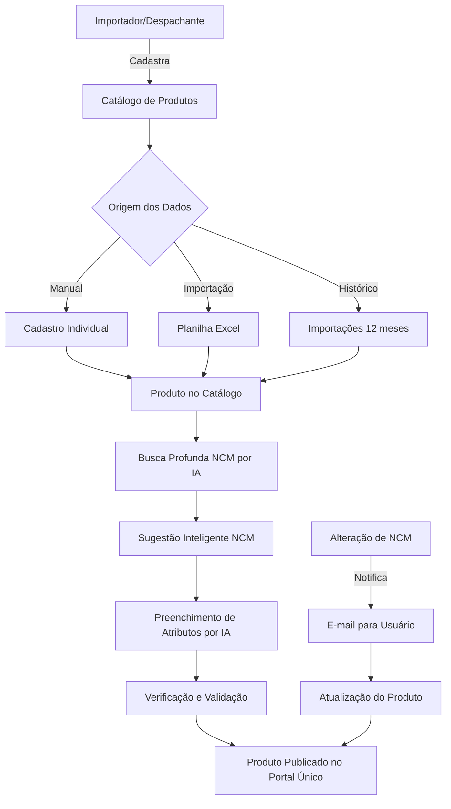
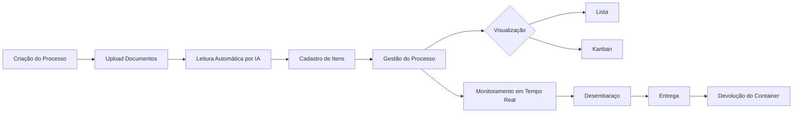
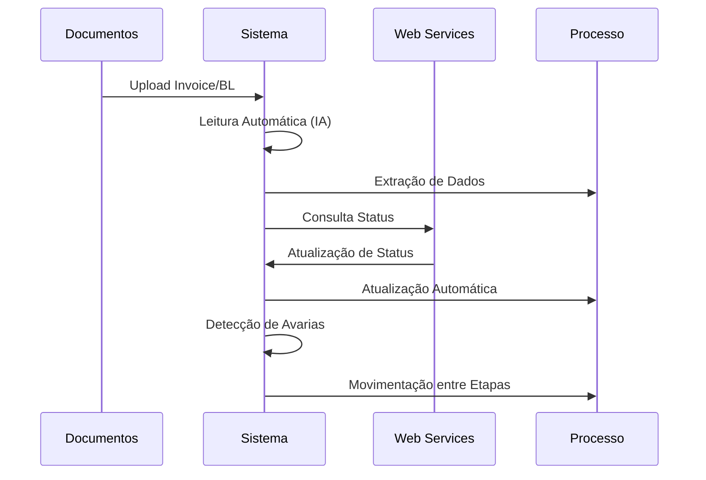
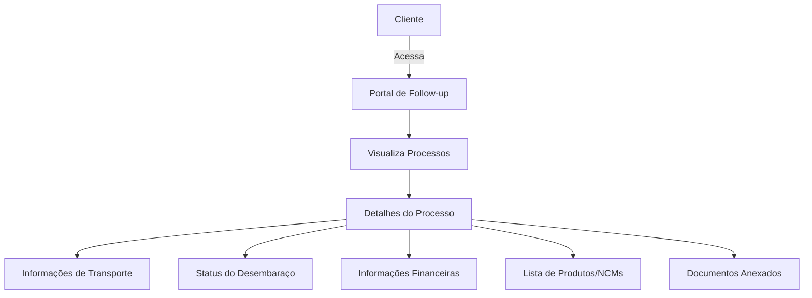
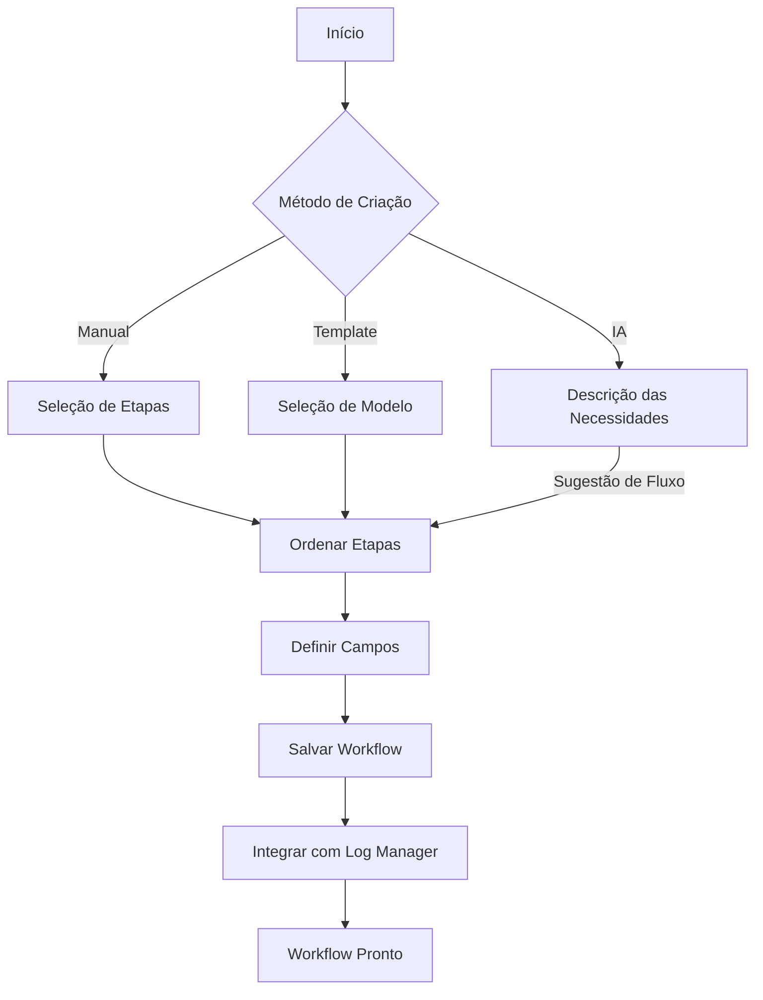
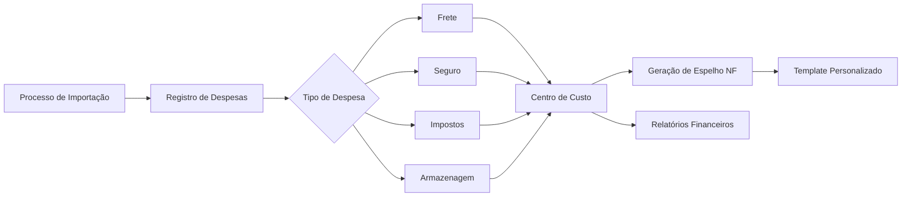
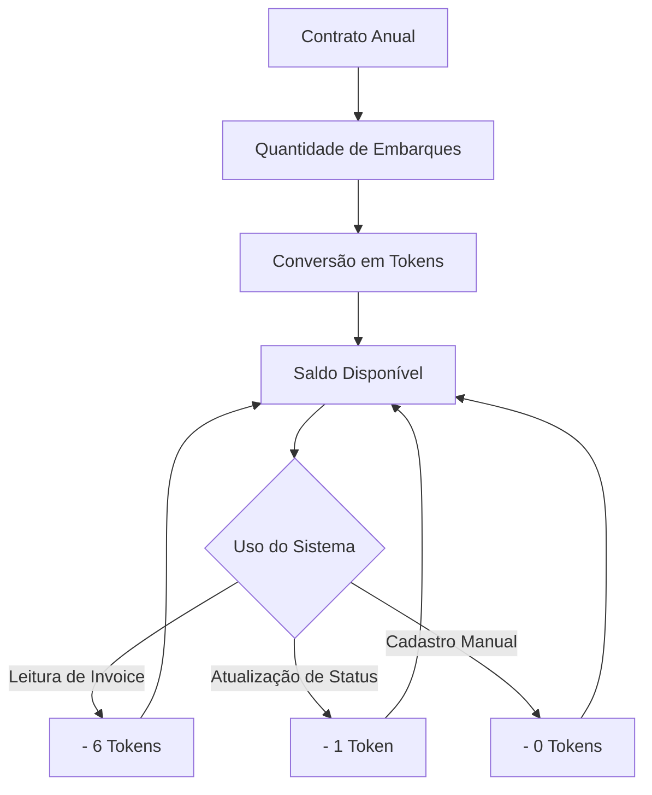
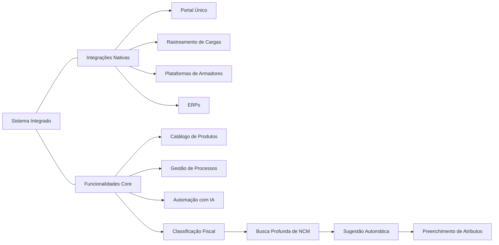
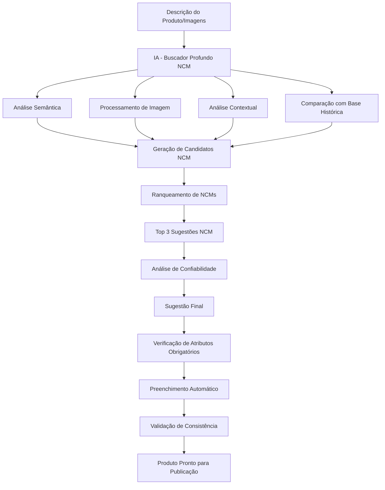

# Sistema Integrado de Gestão de Importação e Exportação

## Apresentação de Nova Implementação

### Visão Geral

O **Sistema Integrado de Gestão de Importação e Exportação** foi desenvolvido para otimizar os processos operacionais de comércio exterior, aplicando tecnologia avançada, automação e inteligência artificial para reduzir tempo, custos e erros operacionais.

Esta implementação visa transformar a maneira como gerenciamos operações de comércio internacional, fornecendo uma plataforma única e completa para todas as etapas do processo.

---

## Objetivos da Implementação

- Centralizar a gestão de operações de importação e exportação
- Automatizar processos manuais e repetitivos
- Reduzir erros operacionais e não-conformidades
- Melhorar a visibilidade e comunicação com clientes
- Otimizar a gestão financeira relacionada às operações
- Garantir conformidade com requisitos regulatórios

---

## 1. Catálogo de Produtos

### Descrição

Módulo para gerenciamento e compartilhamento de catálogos de produtos já classificados para o Portal Único, permitindo centralização e controle de todos os itens importados e exportados, com automação completa da classificação, preenchimento e verificação de produtos através de Inteligência Artificial avançada.

### Funcionalidades

- Cadastro centralizado de produtos
- Compartilhamento de catálogo com clientes
- Importação em massa via planilha
- **Busca profunda de NCM com IA** para classificação precisa
- **Análise inteligente de descrições de produtos** para sugestão automática de NCMs
- **Preenchimento automático de atributos obrigatórios** através de IA
- **Verificação e validação automática** da consistência dos dados
- Cadastro de operadores estrangeiros
- Importação de histórico (12 meses)
- Notificação automática de alterações de NCMs
- **Análise preditiva para identificar possíveis reclassificações**

### Diagrama de Funcionamento



### Interface do Usuário

```
+-----------------------------------------------+
|            CATÁLOGO DE PRODUTOS               |
+-----------------------------------------------+
| Buscar... |  + Novo Produto  |  Importar CSV  |
+-----------------------------------------------+
| ID | Nome | NCM | Operador | Status | Versão  |
|----+------+-----+----------+--------+---------|
| 01 |Caneta| 9608 | ACME Inc| Ativo  | 2.0     |
| 02 |Livro | 4901 | Books Ltd| Ativo | 1.1     |
+-----------------------------------------------+
|        Atributos do Produto Selecionado       |
+-----------------------------------------------+
| Composição: Plástico                          |
| Tipo: Esferográfica                           |
| Marca: BIC                                    |
| Referência: 35                                |
+-----------------------------------------------+
| [Buscar NCM] [Preencher Automático] [Validar] |
+-----------------------------------------------+
```

---

## 2. Sistema de Gestão de Importação e Exportação

### Descrição

Núcleo do sistema que permite controle completo dos processos de importação e exportação, da retirada à devolução do container, com acompanhamento em tempo real de todas as etapas.

### Funcionalidades

- Gestão de ponta a ponta do processo
- Criação flexível de referências
- Leitura automática de documentos (Invoice, BL)
- Cadastro automático de itens
- Visualização em lista ou Kanban
- Acompanhamento detalhado de cada etapa
- Monitoramento de status em tempo real

### Diagrama de Fluxo



### Interface Kanban

```
+--------------------------------------------------------------+
|                  GESTÃO DE IMPORTAÇÃO                        |
+--------------------------------------------------------------+
|  ABERTURA  |  DOCUMENTAL  |  TRÂNSITO  |  DESEMBARAÇO  | FIM |
|------------|--------------|------------|---------------|-----|
| Processo 1 |  Processo 4  | Processo 7 |  Processo 10  |  ✓  |
| Processo 2 |  Processo 5  | Processo 8 |  Processo 11  |  ✓  |
| Processo 3 |  Processo 6  | Processo 9 |              |     |
|            |              |            |              |     |
+--------------------------------------------------------------+
```

---

## 3. Automação de Processos

### Descrição

Motor de automação que elimina tarefas manuais repetitivas, aumentando a eficiência operacional e reduzindo erros humanos através da aplicação de inteligência artificial.

### Funcionalidades

- Leitura e interpretação automática de documentos
- Extração precisa de dados com IA
- Atualização automática de status da carga
- Consulta em tempo real a sistemas de armadores
- Identificação de avarias e ocorrências
- Movimentação automática entre etapas do processo

### Diagrama de Automação



### Representação de Leitura Automática

```
+-------------------------------------------+
|       LEITURA AUTOMÁTICA DE INVOICE       |
+-------------------------------------------+
|                                           |
|  [Imagem da Invoice]                      |
|                                           |
|  Extração automática:                     |
|  ✓ Dados do Exportador                    |
|  ✓ Dados do Importador                    |
|  ✓ 100 itens identificados                |
|  ✓ NCMs detectados                        |
|                                           |
|  Consumo: 6 tokens                        |
+-------------------------------------------+
```

---

## 4. Follow-up para Clientes

### Descrição

Portal dedicado para que clientes acompanhem seus processos em tempo real, aumentando a transparência e melhorando a comunicação entre as partes.

### Funcionalidades

- Interface personalizada com a marca da empresa
- Visão consolidada de todos os processos
- Detalhamento completo de cada operação
- Acesso às informações de transporte
- Status do desembaraço em tempo real
- Dados financeiros atualizados
- Acesso a documentos relacionados

### Diagrama de Acesso



### Interface de Follow-up

```
+--------------------------------------------------+
|            FOLLOW-UP DE PROCESSOS                |
|            [Logo da Empresa]                     |
+--------------------------------------------------+
| Referência: IMP2023000                           |
+--------------------------------------------------+
| INFORMAÇÕES       | TRANSPORTE   | DESEMBARAÇO   |
|------------------+-------------+----------------|
| Cliente: ABC Ltda | Via: Marítimo| Status: Verde  |
| Origem: China     | Navio: MSC   | Registro: Ok   |
| Destino: Brasil   | ETA: 22/05   | Entrega: 25/05 |
+--------------------------------------------------+
| PRODUTOS                 | FINANCEIRO           |
|-------------------------+----------------------|
| 1. Caneta - NCM 9608    | Frete: USD 2,000     |
| 2. Papel  - NCM 4802    | Seguro: USD 150      |
|                         | Impostos: R$ 5,000   |
+--------------------------------------------------+
| DOCUMENTOS: Invoice.pdf | BL.pdf | DI.pdf      |
+--------------------------------------------------+
```

---

## 5. Personalização de Fluxos de Trabalho

### Descrição

Ferramenta que permite criar workflows totalmente personalizados conforme as necessidades específicas da operação, com assistência de IA para otimizar processos.

### Funcionalidades

- Criação flexível de fluxos de trabalho
- Templates pré-configurados para início rápido
- Assistente de IA para sugestão de fluxos
- Definição personalizada de etapas e campos
- Integração com sistema de rastreamento
- Adaptação a diferentes tipos de operações

### Diagrama do Processo de Criação



### Interface de IA

```
+-------------------------------------------+
|       CRIAÇÃO DE WORKFLOW COM IA          |
+-------------------------------------------+
| Descreva o que precisa:                   |
| "Necessito de um fluxo para gerenciamento |
| de importação de ponta a ponta com        |
| monitoramento das cargas em tempo real"   |
+-------------------------------------------+
| Sugestão da IA:                           |
|                                           |
| 1. Abertura de Processo                   |
| 2. Conferência Documental                 |
| 3. Trânsito Internacional                 |
| 4. Monitoramento em Tempo Real            |
| 5. Desembaraço Aduaneiro                  |
| 6. Entrega                                |
|                                           |
| Nome sugerido: "Gestão de Importação      |
| com Rastreamento"                         |
+-------------------------------------------+
| [Cancelar]     [Prosseguir]               |
+-------------------------------------------+
```

---

## 6. Gestão Financeira

### Descrição

Módulo financeiro integrado que permite o controle completo das despesas e receitas relacionadas a cada processo, facilitando a gestão de custos e faturamento.

### Funcionalidades

- Registro de despesas por processo
- Categorização automática de custos
- Espelhos de notas fiscais personalizados
- Templates de documentos financeiros
- Relatórios detalhados por centro de custo
- Possibilidade de integração bancária
- Controle de faturamento por cliente

### Diagrama de Integração Financeira



### Interface Financeira

```
+-------------------------------------------+
|          GESTÃO FINANCEIRA                |
+-------------------------------------------+
| Processo: IMP2023000                      |
+-------------------------------------------+
| DESPESAS                     | VALOR (USD)|
|-----------------------------+------------|
| Frete Internacional         |     2,000  |
| Seguro                      |       150  |
| Desembaraço                 |       300  |
| Armazenagem                 |       500  |
|-----------------------------+------------|
| Total                       |     2,950  |
+-------------------------------------------+
| IMPOSTOS                    | VALOR (BRL)|
|-----------------------------+------------|
| Imposto de Importação       |    10,000  |
| IPI                         |     5,000  |
| PIS/COFINS                  |     3,000  |
|-----------------------------+------------|
| Total                       |    18,000  |
+-------------------------------------------+
| [Gerar Espelho]  [Exportar]  [Pagar]     |
+-------------------------------------------+
```

---

## 7. Sistema de Tokens

### Descrição

Modelo de licenciamento flexível baseado em consumo real, permitindo adequar o investimento ao volume de operações realizadas.

### Funcionalidades

- Contratação baseada em volume de embarques
- Conversão de embarques anuais em tokens
- Diferentes consumos por tipo de operação
- Flexibilidade para economizar em processos simples
- Transparência no consumo de recursos
- Escalabilidade conforme crescimento da operação

### Diagrama de Consumo de Tokens



### Painel de Tokens

```
+-------------------------------------------+
|            CONSUMO DE TOKENS              |
+-------------------------------------------+
| Saldo Atual: 985 tokens                   |
+-------------------------------------------+
| OPERAÇÃO                  | CUSTO (tokens)|
|---------------------------+--------------|
| Leitura de Invoice/BL     |       6      |
| Monitoramento de Status   |       1      |
| Cadastro Manual           |       0      |
| Relatório de Follow-up    |       2      |
+-------------------------------------------+
| HISTÓRICO DE CONSUMO:                     |
| 05/05 - Processo IMP001 - 6 tokens        |
| 04/05 - Atualização Auto - 1 token        |
| 03/05 - Processo IMP002 - 8 tokens        |
+-------------------------------------------+
```

---

## 8. Integração e Complementos

### Descrição

Nesta seção destacamos as integrações do sistema com outras plataformas e soluções que ampliam suas funcionalidades, especialmente a nova integração com o sistema de classificação fiscal automatizada.

### Integrações Disponíveis

```
+-------------------------------------------+
|        INTEGRAÇÕES DO SISTEMA             |
+-------------------------------------------+
|                                           |
|  ✅ Integração com:                       |
|                                           |
|  • Sistema de classificação fiscal de     |
|    mercadorias com IA                     |
|                                           |
|  • Portal Único do SISCOMEX               |
|                                           |
|  • Sistemas de rastreamento de cargas     |
|                                           |
|  • Plataformas de armadores e aeroportos  |
|                                           |
|  • ERPs corporativos                      |
|                                           |
+-------------------------------------------+
```

### Diagrama de Integrações



---

## 9. Busca Profunda de NCM com Inteligência Artificial

### Descrição

Sistema avançado de classificação fiscal automatizada que utiliza Inteligência Artificial para buscar, analisar e sugerir códigos NCM precisos com base na descrição do produto, imagens e especificações técnicas, eliminando a necessidade de classificação manual e reduzindo erros operacionais.

### Funcionalidades

- **Busca semântica avançada** em bases de dados de classificação fiscal
- **Análise contextual** da descrição do produto para sugestão de NCMs
- **Reconhecimento de imagens** para identificação automática de características do produto
- **Processamento de linguagem natural** para interpretar descrições técnicas complexas
- **Mecanismo de busca multimodal** que combina texto, imagens e especificações
- **Análise preditiva** baseada em histórico de classificações
- **Verificação automática de consistência** com regras aduaneiras
- **Sugestão de atributos obrigatórios** específicos para cada NCM
- **Preenchimento inteligente** de dados baseado em produtos similares
- **Detecção de divergências** em classificações existentes

### Diagrama do Processo de Classificação



### Interface de Busca e Sugestão de NCM

```
+-------------------------------------------+
|       BUSCA PROFUNDA DE NCM COM IA        |
+-------------------------------------------+
| Descrição do Produto:                     |
| "Caneta esferográfica de plástico, tinta  |
| azul, marca BIC, modelo cristal, ponta    |
| média de 1.0mm, corpo transparente"       |
+-------------------------------------------+
| [Upload de Imagem] [Adicionar Especific.] |
+-------------------------------------------+
| Resultados (99.8% de confiança):          |
|                                           |
| ✓ NCM Recomendado: 9608.10.00            |
|   Canetas esferográficas                  |
|                                           |
| Alternativas:                             |
| - 9608.20.00 (78% similaridade)           |
|   Canetas e marcadores com ponta de feltro|
| - 3926.10.00 (45% similaridade)           |
|   Artigos de escritório de plástico       |
+-------------------------------------------+
| Atributos Obrigatórios Sugeridos:         |
| ✓ Composição: Plástico                    |
| ✓ Tipo: Esferográfica                     |
| ✓ Marca: BIC                              |
| ✓ Modelo: Cristal                         |
| ✓ Cor da tinta: Azul                      |
+-------------------------------------------+
| Observações:                              |
| Este produto tem classificação consolidada|
| Alíquota de importação: 16%               |
| Ex-tarifário aplicável: Não               |
+-------------------------------------------+
| [Selecionar NCM] [Preencher Atributos]    |
+-------------------------------------------+
```

### Benefícios da Busca Profunda de NCM

- **Redução de 95% no tempo** de classificação fiscal
- **Eliminação de até 99% dos erros** de classificação
- **Consistência em 100% dos atributos** obrigatórios
- **Economia de recursos** com equipes especializadas
- **Conformidade regulatória** com regras aduaneiras atualizadas
- **Padronização completa** de descrições de produtos
- **Rastreabilidade total** do processo de classificação

### Integração com Catálogo de Produtos

O sistema de busca profunda de NCM está completamente integrado ao módulo de Catálogo de Produtos, permitindo:

1. **Classificação automática** durante o cadastro de novos produtos
2. **Verificação periódica** de produtos já cadastrados
3. **Sugestões proativas** de reclassificação quando necessário
4. **Preenchimento inteligente** de atributos específicos para cada NCM
5. **Validação contínua** de consistência dos dados

---

## Benefícios Esperados

- **Redução de 60% no tempo** de processamento documental
- **Eliminação de 90% dos erros** de digitação e cadastro
- **Economia de 40% nos custos operacionais** a médio prazo
- **Melhoria de 70% na satisfação do cliente** devido à transparência
- **Redução de 50% no tempo de resposta** às solicitações
- **Aumento de 30% na capacidade** de processamento da equipe
- **Visibilidade completa** de todos os processos em tempo real
- **Automação de 95% da classificação fiscal** de produtos
- **Consistência de 99% em atributos de produtos** cadastrados

---

## Plano de Implementação

1. **Fase 1 (Semanas 1-2)**: Configuração inicial e treinamento básico

   - Definição de fluxos personalizados
   - Cadastro de usuários e permissões
   - Treinamento da equipe principal

2. **Fase 2 (Semanas 3-4)**: Implementação dos módulos principais

   - Catálogo de Produtos
   - Sistema de Gestão de Importação/Exportação
   - Automação inicial

3. **Fase 3 (Semanas 5-6)**: Expansão e refinamento

   - Follow-up para Clientes
   - Gestão Financeira
   - Integração com sistemas externos

4. **Fase 4 (Semanas 7-8)**: Otimização e avaliação

   - Ajustes finais dos workflows
   - Treinamento avançado
   - Avaliação de resultados iniciais

---

## Suporte e Acompanhamento

- **Primeiros 30 dias**: Acompanhamento intensivo para ajustes
- **Treinamento contínuo**: Sessões semanais por 2 meses
- **Suporte dedicado**: Canal exclusivo para dúvidas urgentes
- **Documentação completa**: Manuais e tutoriais em vídeo
- **Revisões trimestrais**: Avaliação de uso e oportunidades

---

## Próximos Passos

1. Validação final da proposta
2. Definição de data de início
3. Planejamento detalhado das etapas
4. Configuração de ambientes
5. Início da implementação

---

## Contato

Para mais informações ou esclarecimentos adicionais, entre em contato:

**E-mail**: suporte@sistemacomex.com.br
**Telefone**: (11) 9999-8888
**Site**: www.sistemacomex.com.br
