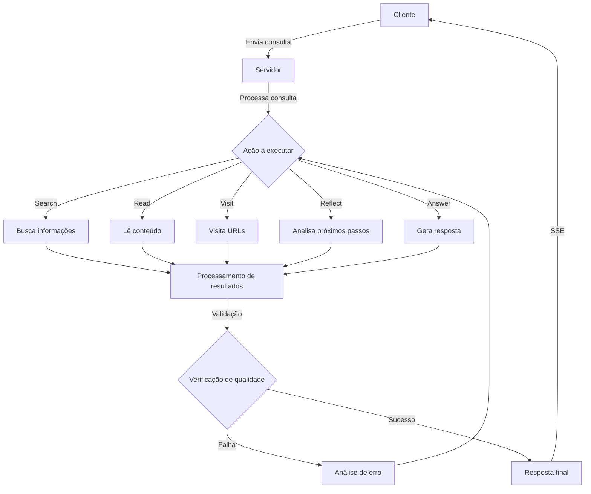

# Análise de Schemas para Sistema de Comunicação com SSE

## Índice

1. [Introdução](#introdução)
2. [Fluxo de Dados](#fluxo-de-dados)
3. [Schemas Utilizados](#schemas-utilizados)
   - [Schema de Busca](#schema-de-busca)
   - [Schema de Resposta](#schema-de-resposta)
   - [Schema de Visita](#schema-de-visita)
   - [Schema de Reflexão](#schema-de-reflexão)
   - [Schema de Análise de Atribuição](#schema-de-análise-de-atribuição)
   - [Schema de Resposta Final do Modelo](#schema-de-resposta-final-do-modelo)
   - [Schema de Leitura](#schema-de-leitura)
   - [Schema de Resposta Alternativa](#schema-de-resposta-alternativa)
   - [Schema de Desduplicação](#schema-de-desduplicação)
4. [Formato de Resposta do Sistema](#formato-de-resposta-do-sistema)
5. [Análise de Erros](#análise-de-erros)
6. [Conclusão](#conclusão)

## Introdução

Este documento analisa a estrutura e os schemas utilizados em um sistema de comunicação que implementa Server-Sent Events (SSE) para criar um canal de comunicação em tempo real entre o backend e o frontend. O sistema parece estar construído para processar consultas, realizar buscas e fornecer respostas em um formato estruturado, com suporte para validação e análise de qualidade das respostas.

## Fluxo de Dados



## Schemas Utilizados

### Schema de Busca

```json
{
  "action": "search",
  "think": "String - Raciocínio por trás da busca",
  "searchQuery": "String - Termos de busca"
}
```

**Parâmetros:**

- **action**: Define a ação como "search". Usado para orientar o fluxo de processamento do sistema.
- **think**: Contém o raciocínio por trás da busca. Usado para documentar a lógica e para posterior análise.
- **searchQuery**: A string de busca a ser executada. Composta por termos relevantes para a consulta do usuário.

**Propósito:** Este schema é utilizado para iniciar uma busca de informações relevantes para a consulta do usuário. É o ponto de entrada para coletar dados que serão usados para gerar a resposta.

### Schema de Resposta

```json
{
  "action": "answer",
  "think": "String - Processo de pensamento",
  "answer": "String - Conteúdo da resposta",
  "references": [
    {
      "exactQuote": "String - Citação exata",
      "url": "String - URL da fonte"
    }
  ]
}
```

**Parâmetros:**

- **action**: Define a ação como "answer". Indica que esta é uma resposta final.
- **think**: Documenta o processo de pensamento por trás da resposta. Usado para transparência e análise.
- **answer**: O conteúdo da resposta a ser entregue ao usuário.
- **references**: Array contendo referências que embasam a resposta, com citações exatas e URLs das fontes.

**Propósito:** Este schema estrutura a resposta final ao usuário, garantindo que seja bem fundamentada com referências adequadas. As referências são cruciais para validar a precisão e credibilidade da resposta.

### Schema de Visita

```json
{
  "action": "visit",
  "think": "String - Justificativa para visitar URLs",
  "url-list": ["String - URLs a serem visitados"]
}
```

**Parâmetros:**

- **action**: Define a ação como "visit". Indica que o sistema deve visitar URLs específicos.
- **think**: Explica por que estas URLs são relevantes para a consulta.
- **url-list**: Array de URLs a serem visitados para coletar informações.

**Propósito:** Este schema é usado para direcionar o sistema a visitar URLs específicos para coletar informações relevantes. É uma etapa intermediária no processo de coleta de dados.

### Schema de Reflexão

```json
{
  "action": "reflect",
  "think": "String - Análise da situação atual",
  "questionsToAnswer": ["String - Perguntas a serem respondidas"]
}
```

**Parâmetros:**

- **action**: Define a ação como "reflect". Indica uma pausa para análise.
- **think**: Contém a análise da situação atual e o raciocínio do sistema.
- **questionsToAnswer**: Lista de perguntas que precisam ser respondidas para avançar.

**Propósito:** Este schema permite que o sistema pause e reflita sobre o progresso, identificando lacunas de informação ou direções a seguir. É um mecanismo de auto-correção e orientação para o fluxo de processamento.

### Schema de Análise de Atribuição

```json
{
  "attribution_analysis": {
    "sources_provided": Boolean,
    "sources_verified": Boolean,
    "quotes_accurate": Boolean
  }
}
```

**Parâmetros:**

- **sources_provided**: Indica se as fontes foram fornecidas na resposta.
- **sources_verified**: Indica se as fontes foram verificadas quanto à sua validade.
- **quotes_accurate**: Indica se as citações são precisas em relação às fontes.

**Propósito:** Este schema é usado para validar a qualidade das referências e citações na resposta. Garante que a resposta seja bem fundamentada e precisa.

### Schema de Resposta Final do Modelo

```json
{
  "text": "String - Conteúdo da resposta formatada",
  "usageMetadata": "Object - Metadados de uso e estatísticas"
}
```

**Parâmetros:**

- **text**: Contém o texto completo da resposta que será retornada ao usuário, já formatada.
- **usageMetadata**: Objeto contendo metadados sobre o processamento, como tokens utilizados, tempo de resposta, etc.

**Propósito:** Este schema é utilizado para formatar a resposta final que será enviada ao cliente. É o último estágio do processamento antes do envio via SSE.

**Contexto de Uso:** Este schema aparece no contexto de "Resposta encontrada! Verificando qualidade..." e é utilizado para acessar e validar a resposta final do modelo antes de enviá-la ao usuário.

### Schema de Leitura

```json
{
  "title": "String - Título do conteúdo lido",
  "url": "String - URL da fonte consultada",
  "tokens": Number - Quantidade de tokens processados
}
```

**Parâmetros:**

- **title**: Título do documento ou página web que foi lido.
- **url**: URL completa da fonte onde o conteúdo foi obtido.
- **tokens**: Número de tokens que o conteúdo consumiu no processamento.

**Propósito:** Este schema é usado para registrar informações sobre conteúdos que foram lidos de URLs específicas, incluindo metadados úteis para controle de tokens e referência.

**Contexto de Uso:** Aparece em registros como "Read: {...}" durante o processo de coleta de informações, geralmente após uma ação de visita a URLs.

### Schema de Resposta Alternativa

```json
{
  "action": "action-answer",
  "think": "String - Processo de pensamento",
  "answer": "String - Conteúdo da resposta",
  "references": [
    {
      "exactQuote": "String - Citação exata",
      "url": "String - URL da fonte"
    }
  ],
  "Nota Detalhada": "String - Informações adicionais e contexto"
}
```

**Parâmetros:**

- **action**: Define a ação como "action-answer", indicando uma resposta com ação específica.
- **think**: Documenta o processo de pensamento por trás da resposta.
- **answer**: O conteúdo da resposta a ser entregue ao usuário.
- **references**: Array contendo referências que embasam a resposta.
- **Nota Detalhada**: Campo adicional que fornece contexto e informações extras sobre a resposta.

**Propósito:** Este schema é uma variação do schema de resposta padrão, incluindo uma "Nota Detalhada" que fornece informações adicionais e contexto mais amplo sobre o tema da resposta.

**Contexto de Uso:** Aparece como uma resposta completa do modelo, geralmente em um formato mais detalhado e informativo, fornecendo explicações adicionais além da resposta direta.

### Schema de Desduplicação

```json
{
  "unique_queries": ["String - Consultas únicas após processamento"]
}
```

**Parâmetros:**

- **unique_queries**: Array contendo consultas únicas após o processo de desduplicação.

**Propósito:** Este schema é utilizado no processo de desduplicação de consultas, garantindo que consultas semelhantes ou idênticas não sejam processadas múltiplas vezes, economizando recursos.

**Contexto de Uso:** Este schema é identificado nos erros como ausente (undefined) quando o processo de desduplicação falha, gerando erros de validação.

## Formato de Resposta do Sistema

O sistema utiliza diferentes formatos de resposta durante o processamento. Abaixo estão os principais formatos identificados:

### Formato de Resposta JSON Bruto

```json
{
  "action": "answer",
  "think": "String - Processo de pensamento",
  "answer": "String - Conteúdo da resposta",
  "references": [
    {
      "exactQuote": "String - Citação exata",
      "url": "String - URL da fonte"
    }
  ],
  "Nota Detalhada": "String - Informações adicionais e contexto"
}
```

**Contexto:** Este formato representa a resposta bruta do modelo, antes de qualquer processamento adicional. É capturado em "Raw response text" e posteriormente processado para exibição.

### Formato de Resposta Processada

```javascript
{
  action: 'answer',
  think: 'String - Processo de pensamento',
  answer: 'String - Conteúdo da resposta',
  references: [
    {
      exactQuote: 'String - Citação exata',
      url: 'String - URL da fonte'
    }
  ],
  'Nota Detalhada': 'String - Informações adicionais e contexto'
}
```

**Contexto:** Este formato representa a resposta após processamento inicial, convertida de JSON para um objeto JavaScript. É acompanhado pela indicação "answer <- [search, read, answer, reflect]", mostrando a sequência de ações que levaram a esta resposta.

## Análise de Erros

O sistema também inclui um mecanismo de análise de erros que é acionado quando as respostas não atendem aos critérios de qualidade. Os erros comuns incluem:

### 1. Erros de Schema

Quando a resposta não segue o schema esperado.

```json
{
  "is_valid": Boolean,
  "context": Object
}
```

### 2. Erros de Token

Quando o contexto excede o limite de tokens permitido.

```
Trying to keep the first 9066 tokens when context the overflows. However, the model is loaded with context length of only 4096 tokens, which is not enough.
```

### 3. Erros de Validação Zod

Quando ocorrem falhas na validação de tipos usando a biblioteca Zod.

```
Erro na validação do schema: ZodError: [
  {
    "code": "invalid_type",
    "expected": "array",
    "received": "undefined",
    "path": [
      "unique_queries"
    ],
    "message": "Required"
  }
]
```

**Contexto:** Este erro ocorre durante o processo de desduplicação de consultas quando o campo "unique_queries" está indefinido mas é esperado como um array. É um erro de validação de tipo usando a biblioteca Zod, que pode ocorrer em vários pontos do processamento onde schemas são validados.

**Impacto:** Quando este erro ocorre, o processamento normal é interrompido e o sistema precisa realizar uma recuperação, geralmente tentando reprocessar a consulta ou prosseguir sem a desduplicação.

## Conclusão

O sistema utiliza uma arquitetura baseada em Server-Sent Events (SSE) para comunicação em tempo real entre o backend e o frontend. Os schemas aqui documentados estruturam as diferentes etapas do processamento, desde a busca inicial até a entrega da resposta final, passando por validação e controle de qualidade.

Esta estruturação permite um fluxo de trabalho organizado e controlado, com capacidade de auto-correção através de mecanismos de reflexão e análise de erros. A ênfase na atribuição adequada de fontes e na precisão das citações demonstra um compromisso com a qualidade e confiabilidade das respostas.

Os diversos schemas e formatos de resposta permitem que o sistema seja flexível e adaptável a diferentes tipos de consultas e requisitos de informação, ao mesmo tempo que mantém a consistência e a qualidade das respostas. O mecanismo de tratamento de erros proporciona resiliência e capacidade de recuperação em situações adversas.
